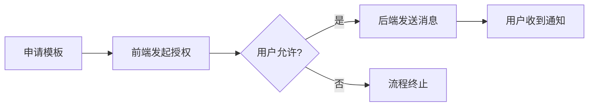
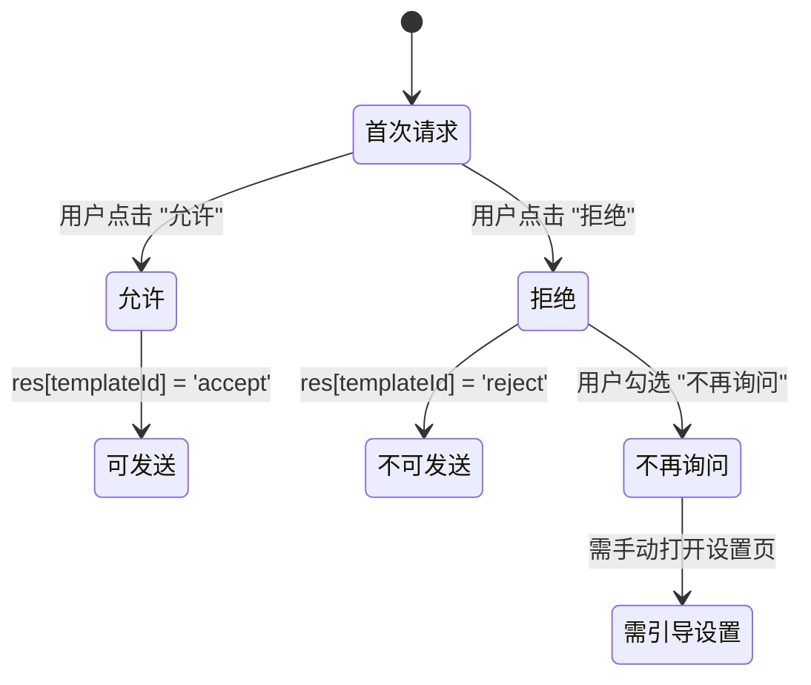
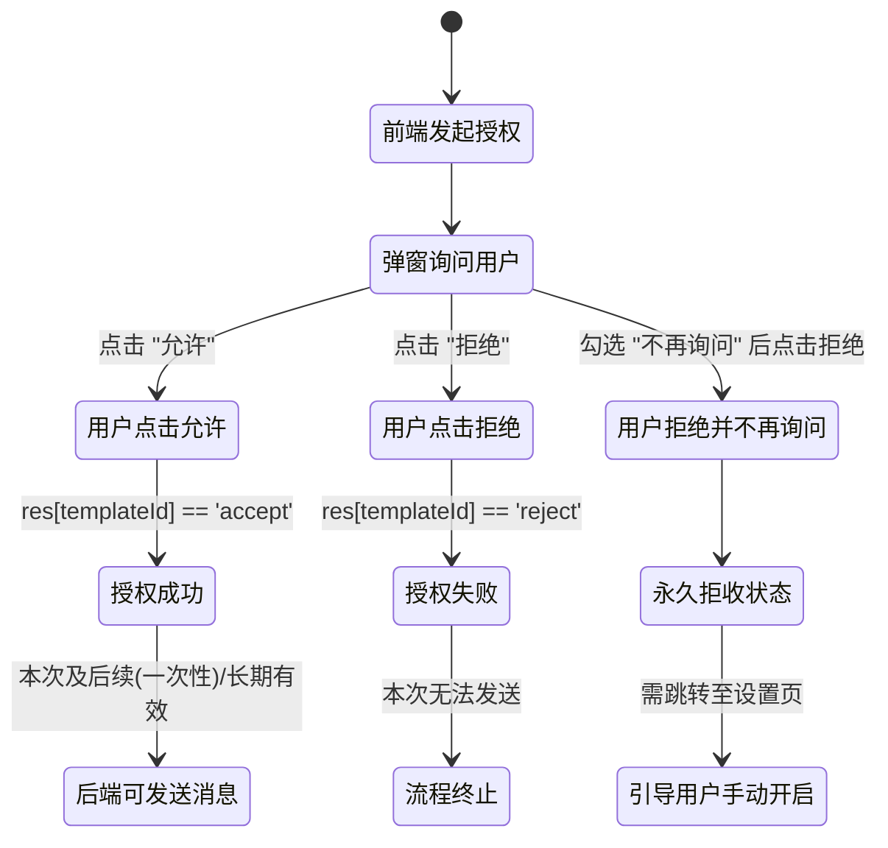
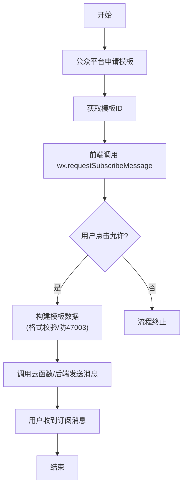

## 前言 ##

在医疗预约、订单通知、物流提醒等场景中，消息通知是提升用户体验的重要手段。微信小程序提供了订阅消息能力，允许开发者向用户发送订阅消息。本文将结合医疗预约场景，详细介绍订阅消息的完整使用流程。

## 一、订阅消息基础概念 ##

### 什么是订阅消息 ###

订阅消息是微信小程序提供的消息推送能力，分为两种类型：

| 类型 | 说明 | 适用场景 |
| :--- | :--- | :--- |
| **一次性订阅** | 用户授权一次，可发送一条消息 | 订单通知、预约提醒等 |
| **长期订阅** | 用户授权一次，可发送多条消息 | 仅限特定类目（如政务、医疗等） |

> ⚠️ 大部分类目只能申请一次性订阅消息，每次发送前都需要用户主动授权。

### 订阅消息的基本流程 ###



## 二、申请和配置消息模板 ##

### 在微信公众平台申请模板 ###

- 登录 微信公众平台
- 进入 功能 → 订阅消息
- 点击 选用（或从模板库选择）
- 选择合适的模板，填写关键词
- 提交审核，审核通过后获得 模板ID

### 模板字段说明 ###

每个模板由多个关键词组成，每个关键词有固定的类型和格式要求：

| 字段类型 | 说明 | 格式要求 |
| :--- | :--- | :--- |
| `name` | 姓名 | 最多10个字符，仅支持文字 |
| `time` | 时间 | 格式：`YYYY-MM-DD HH:MM` |
| `thing` | 事项 | 最多20个字符 |
| `character_string` | 字符值 | 用于编号、单号等 |

> 📌 关键点：字段类型决定了值的格式，错误的格式会导致发送失败（错误码 47003）。

## 三、前端实现：发起订阅授权 ##

### 调用 `wx.requestSubscribeMessage` ###

在需要发送通知的场景下（如用户点击"预约"按钮），先发起订阅授权：

```javascript
// pages/message/message.js

/**
 * 发送通知前的订阅授权
 */
onSendNotification() {
    const templateId = 'your-template-id-here'; // 替换为实际模板ID
    
    wx.requestSubscribeMessage({
        tmplIds: [templateId],
        success: (res) => {
            // res[templateId] 的值：
            // 'accept' - 用户允许
            // 'reject' - 用户拒绝
            // 'ban'    - 已被后台封禁
            if (res[templateId] === 'accept') {
                // 用户允许，执行发送逻辑
                this._doSendNotification();
            } else if (res[templateId] === 'reject') {
                wx.showToast({
                    title: '已拒绝接收通知',
                    icon: 'none'
                });
            } else if (res[templateId] === 'ban') {
                wx.showToast({
                    title: '通知功能已被封禁',
                    icon: 'none'
                });
            }
        },
        fail: (err) => {
            console.error('订阅授权失败：', err);
            wx.showToast({
                title: '授权失败，请重试',
                icon: 'none'
            });
        }
    });
}
```

### 授权结果处理 ###







### 引导用户开启权限 ###

```javascript
// 当用户拒绝授权时，引导至设置页
wx.showModal({
    title: '开启通知',
    content: '需要开启通知权限才能接收预约提醒',
    success: (res) => {
        if (res.confirm) {
            wx.openSetting(); // 打开设置页
        }
    }
});
```

## 四、构建模板数据：参数赋值规则 ##

### 模板数据结构 ###

订阅消息的数据是一个对象，键名为 `&#123;&#123;name1.DATA&#125;&#125;` 中的 `name1` 部分：

```javascript
const templateData = {
    name1: { value: '张三' },
    time2: { value: '2026-05-04 14:00' },
    thing3: { value: '北京协和医院' }
};
```

### 实际案例：医疗预约模板 ###

假设你的模板字段如下：

```json
就诊人：{{name1.DATA}}
就诊时间：{{time2.DATA}}
就诊医院：{{thing3.DATA}}
就诊科室：{{thing4.DATA}}
就诊医生：{{name5.DATA}}
```

对应的数据构建函数：

```javascript
// pages/message/message.js

/**
 * 构建订阅消息模板数据
 * @param {Object} form - 预约表单数据
 * @returns {Object} 模板数据
 */
_buildTemplateData(form) {
    // 姓名类型：最多10字，仅支持中英文字符
    const sanitizeName = (val, maxLen = 10) => {
        if (!val) return '未填写';
        return val.replace(/[^\u4e00-\u9fa5a-zA-Z0-9·]/g, '').slice(0, maxLen) || '未填写';
    };
    
    // 事项类型：最多20字
    const sanitizeThing = (val, maxLen = 20) => {
        if (!val) return '未填写';
        return val.trim().slice(0, maxLen) || '未填写';
    };
    
    // 时间类型：格式 YYYY-MM-DD HH:MM
    const formatTime = (date, timeSlot) => {
        const startTime = timeSlot ? timeSlot.split('-')[0] : '00:00';
        return `${date} ${startTime}`;
    };
    
    return {
        name1: { value: sanitizeName(form.patientName) },
        time2: { value: formatTime(form.appointmentDate, form.timeSlot) },
        thing3: { value: sanitizeThing(form.hospital) },
        thing4: { value: sanitizeThing(form.department) },
        name5: { value: sanitizeName(form.doctorName) }
    };
}
```

### 字段值清洗的重要性 ###

| 问题 | 原因 | 解决方案 |
| :--- | :--- | :--- |
| **47003 错误** | 字段值包含特殊字符 | 使用正则过滤非法字符 |
| **47003 错误** | 字段值为空 | 设置默认值（如"未填写"） |
| **47003 错误** | 字段值超长 | 截断到规定长度 |

## 五、云端实现：发送订阅消息 ##

### 云函数调用 `subscribeMessage.send` ###

```javascript
// cloudfunctions/appointment/handlers/sendNotification.js

const cloud = require('wx-server-sdk');
cloud.init({ env: cloud.DYNAMIC_CURRENT_ENV });

exports.main = async (event, context) => {
    const { touser, templateId, page, data } = event;
    
    try {
        const result = await cloud.openapi.subscribeMessage.send({
            touser: touser,           // 接收人的 openid
            templateId: templateId,    // 模板ID
            page: page || 'pages/index/index', // 点击通知跳转的页面
            data: data                 // 模板数据
        });
        
        return {
            success: true,
            msgid: result.msgid
        };
    } catch (err) {
        console.error('发送订阅消息失败：', err);
        return {
            success: false,
            error: err.message,
            errorCode: err.errCode
        };
    }
};
```

### 前端调用云函数 ###

```javascript
// pages/message/message.js

/**
 * 执行发送通知
 */
async _doSendNotification() {
    const form = this.data.form;
    const templateData = this._buildTemplateData(form);
    
    wx.showLoading({ title: '发送中...' });
    
    try {
        const res = await wx.cloud.callFunction({
            name: 'appointment',
            data: {
                action: 'sendNotification',
                touser: this.data.openid,
                templateId: 'your-template-id-here',
                page: 'pages/message/message?formId=' + form._id,
                data: templateData
            }
        });
        
        wx.hideLoading();
        
        if (res.result.success) {
            wx.showToast({ title: '通知发送成功', icon: 'success' });
        } else {
            wx.showToast({ title: '发送失败', icon: 'none' });
        }
    } catch (err) {
        wx.hideLoading();
        console.error('调用云函数失败：', err);
        wx.showToast({ title: '发送失败', icon: 'none' });
    }
}
```

## 六、常见错误码及解决方案 ##

### 错误码 43101 ###

```json
errCode: 43101
errMsg: user refuse to accept the msg
```

*含义*：用户未授权订阅消息。

*解决方案*：

- 确保在发送前调用 `wx.requestSubscribeMessage` 获取用户授权
- 一次性订阅消息，每次发送都需要重新授权
- 检查模板ID是否正确

### 错误码 47003 ###

```makefile
errCode: 47003
errMsg: argument invalid
```

*含义*：模板参数值格式非法。

*解决方案*：

```javascript
// 排查步骤：
// 1. 检查字段类型是否匹配
// 2. 检查字段值是否为空
// 3. 检查字段值是否超长
// 4. 检查 time 类型是否为正确格式

// 通用校验函数
function validateTemplateData(data) {
    const errors = [];
    
    for (const key in data) {
        const value = data[key].value;
        
        if (!value || value.trim() === '') {
            errors.push(`字段 ${key} 值为空`);
        }
        
        // name 类型：仅支持中英文字符
        if (key.startsWith('name')) {
            if (/[^\u4e00-\u9fa5a-zA-Z0-9·]/.test(value)) {
                errors.push(`字段 ${key} 包含非法字符`);
            }
            if (value.length > 10) {
                errors.push(`字段 ${key} 超过10个字符`);
            }
        }
        
        // time 类型：检查格式
        if (key.startsWith('time')) {
            if (!/^\d{4}-\d{2}-\d{2} \d{2}:\d{2}$/.test(value)) {
                errors.push(`字段 ${key} 时间格式错误，应为 YYYY-MM-DD HH:MM`);
            }
        }
    }
    
    return errors;
}
```

### 其他常见错误 ###

| 错误码 | 说明 | 解决方案 |
| :--- | :--- | :--- |
| **40003** | touser 不合法 | 检查 openid 是否正确 |
| **40037** | 模板ID不正确 | 检查模板ID是否填写正确 |
| **43100** | 请在小程序中体验订阅消息 | 需在真机上测试 |

## 七、完整流程图 ##



## 八、最佳实践建议 ##

### 用户体验优化 ###

- 在合适的时机发起授权：不要一进页面就弹授权，应在用户完成操作后（如提交预约）再发起

- 提供授权说明：告知用户为什么需要通知权限，以及会收到什么内容

- 优雅处理拒绝：用户拒绝后，提供手动开启的入口

### 代码健壮性 ###

```javascript
// 建议：封装订阅消息工具类
class SubscribeMessageHelper {
    /**
     * 发起订阅授权
     */
    static requestSubscribe(templateId) {
        return new Promise((resolve, reject) => {
            wx.requestSubscribeMessage({
                tmplIds: [templateId],
                success: (res) => resolve(res[templateId]),
                fail: (err) => reject(err)
            });
        });
    }
    
    /**
     * 校验模板数据
     */
    static validateData(data) {
        // 实现校验逻辑
    }
    
    /**
     * 发送订阅消息
     */
    static async send(params) {
        // 先校验数据
        const errors = this.validateData(params.data);
        if (errors.length > 0) {
            throw new Error(errors.join('; '));
        }
        
        // 调用云函数
        return await wx.cloud.callFunction({
            name: 'appointment',
            data: { action: 'sendNotification', ...params }
        });
    }
}
```

### 注意事项 ###

- 📌 订阅消息只能在真机上测试，开发者工具不支持
- 📌 一次性订阅消息，授权后只能发送一次
- 📌 模板字段类型由微信固定，无法自定义
- 📌 发送频率有限制，避免频繁发送

## 九、总结 ##

订阅消息是微信小程序重要的用户触达手段，正确使用需要注意：

- 模板申请：在公众平台申请并获取模板ID
- 前端授权：使用 `wx.requestSubscribeMessage` 获取用户授权
- 数据构建：严格按照字段类型要求构建数据，做好格式校验
- 云端发送：通过云函数调用 `subscribeMessage.send` 发送消息
- 错误处理：妥善处理 43101、47003 等常见错误
