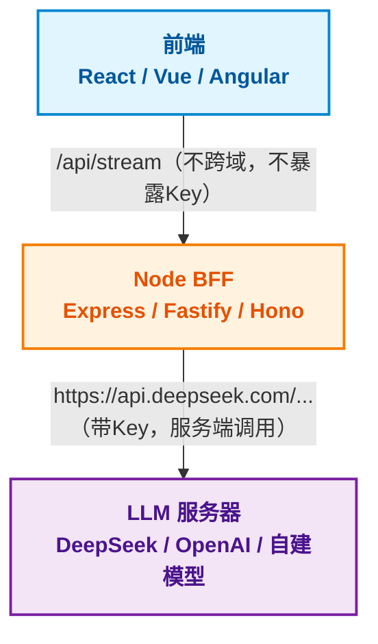
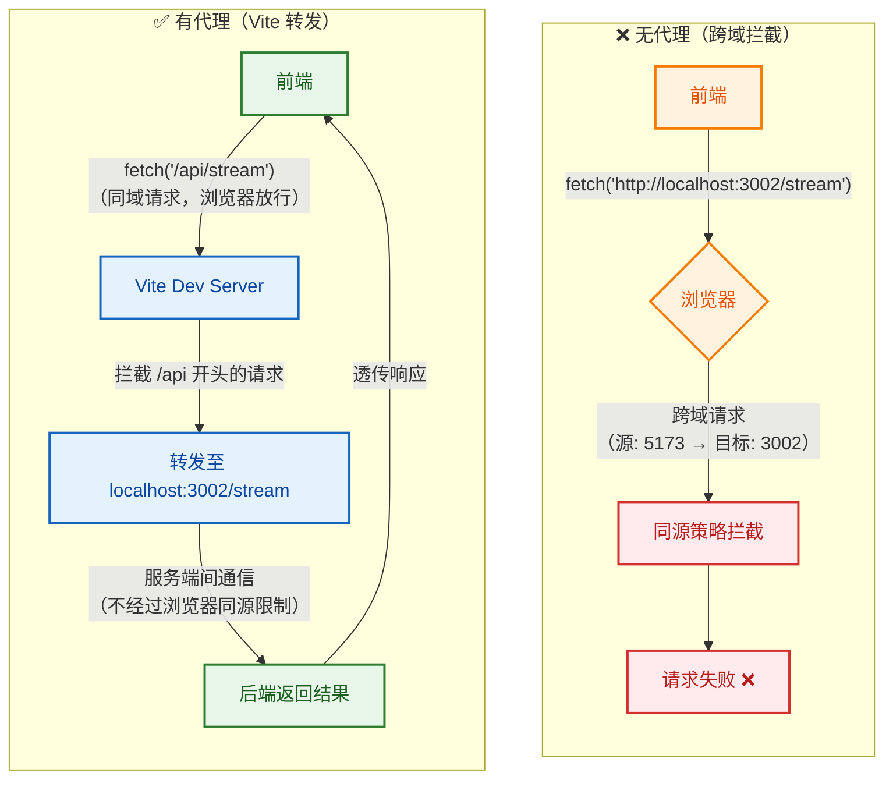
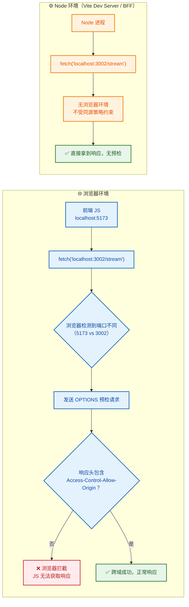
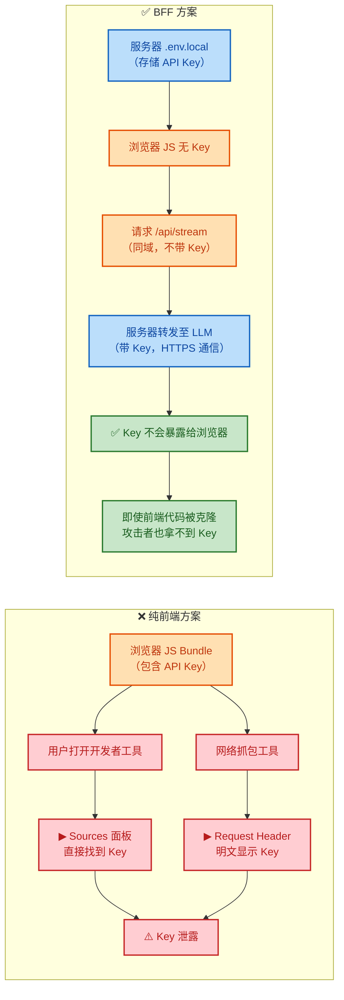
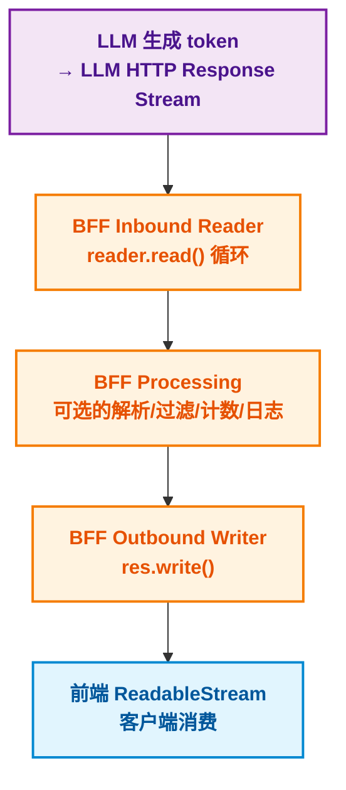
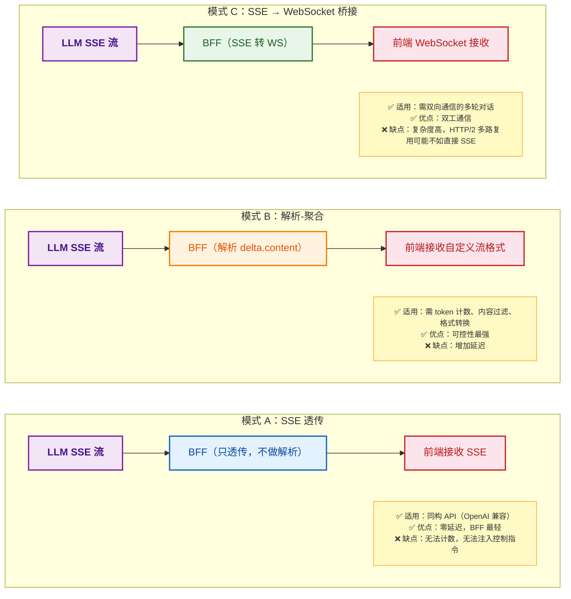
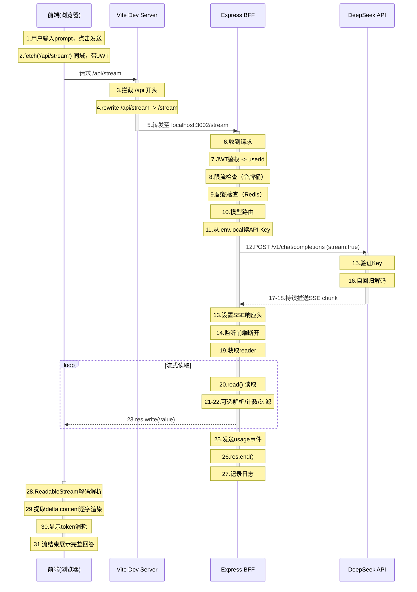

## 三层架构：为什么前端不能直连 LLM

### 看起来能跑，但其实是三个炸弹

之前我们写了一个前端直接调 DeepSeek API 的页面。它能跑，控制台能看到流式返回的文字。但这只是 Demo。

生产环境中，前端直连 LLM API 有三个无法绕开的问题：

```text
问题 1：API Key 暴露
  前端代码里的 API Key 对任何打开浏览器 DevTools 的人都是明文。
  Network 面板 → Request Headers → Authorization: Bearer sk-xxx
  一行复制粘贴，你的 Key 就被人薅光了额度。

问题 2：跨域（CORS）
  LLM API 服务器和你的前端部署在不同的域名下。
  DeepSeek 的 API 允许 CORS 是因为他们做了配置。
  但如果你自建模型服务（如 vLLM），不一定会开 CORS。
  即使开了，每个新模型服务都要配一遍。

问题 3：前端代码膨胀
  v039 的流式消费代码有多少？buffer 管理、JSON 容错解析、
  AbortController、重连逻辑、错误分类……这些逻辑混在 Vue 组件里，
  和 UI 渲染纠缠在一起，改一处可能坏三处。
```

API Key 泄露是最致命的问题。一个生产应用可能有几万行前端代码，API Key 存在 `.env` 文件里——但在 Vite 或 Webpack 构建时，`VITE_` 或 `REACT_APP_` 前缀的环境变量会被直接内联到浏览器端的 JS bundle 中。任何人打开 Sources 面板搜 `sk-` 就能找到。

```javascript
// 这段代码最终会被打包到浏览器端的 JS 里
fetch('https://api.deepseek.com/v1/chat/completions', {
  headers: {
    Authorization: `Bearer ${import.meta.env.VITE_DEEPSEEK_API_KEY}` // ← 浏览器可见！
  }
})
```

这个安全问题非常直白：

> 纯前端容易通过 DevTools 网络面板等泄露 Key 等敏感信息。fetch → BFF（存 API Key）→ LLM 服务器。

### 三层架构的自然推演

大前端工程师在面对这些痛点时，会自然想到：在后端再起一个 Node 服务，把对 LLM 的请求代理过去。



所谓 BFF 的核心价值，可以浓缩为一句话：_把不属于前端的复杂度从前端拿走，放到一个专门为前端服务的后端里_。

## BFF 层的最小定义与第一天职

### 什么是 BFF

BFF（Backend For Frontend）= 为前端服务的后端。

不要把它和"纯后端"搞混：

| 维度       | 纯后端（Backend）              | BFF (Backend For Frontend)   |
| :--------- | :----------------------------- | :--------------------------- |
| 服务对象   | 所有客户端（Web/App/第三方）   | 特定前端应用                 |
| 开发人员   | 后端工程师（Java/Go/Python）   | 大前端工程师（Node.js）      |
| 设计原则   | 通用、稳定、高并发、安全       | 贴合前端需求、灵活、快速迭代 |
| 接口风格   | RESTful标准CRUD                | 面向前端页面的聚合接口       |
| 典型技术栈 | JavaSpring/GoGin/PythonFastAPI | Node.jsExpress/Fastify/Hono  |
| 变更频率   | 低，需评审                     | 高，随前端需求调整           |

很接地气的概括：

> JS 前端，后端有很多需求，接口改一下。大前端工程师直接写一下常见的 Node 服务，来达成自身的需求。

这就是 BFF 的"出身"：它不是架构委员会设计出来的，是前端工程师被后端接口逼出来的自愈手段。

### BFF 在 AI 流式场景中的第一天职

在传统 Web 应用中，BFF 主要做接口聚合（把三个后端接口的数据拼成一个前端页面需要的数据结构）。

在 AI 流式场景中，BFF 的职责更重，因为多了一个"流"的维度：

_BFF 在 AI 流式场景的职责清单_：

1. 安全代理：保管 API Key，对外不暴露
2. 跨域解决：前端请求同域 BFF，BFF 服务端请求 LLM
3. 流式透传：把 LLM 的 SSE 流原样或加工后传给前端
4. 请求校验：prompt 长度、敏感词过滤、用户权限
5. 错误归一：把各种 LLM API 的错误转成前端可消费的统一格式
6. 协议适配：SSE ↔ 聚合 JSON、SSE ↔ WebSocket
7. 成本管控：token 计数、用户配额、成本预警
8. 日志与观测：记录每次调用的延迟、token 数、错误率

前三个是"能让系统跑起来"的底线需求。后五个是"让系统能上线"的生产需求。

## 第一级：Vite Proxy——最薄的 BFF

第一种 BFF 实现只有 21 行 —— `vite.config.js` 里的 proxy 配置：

```javascript
// vite.config.js
import { defineConfig } from 'vite'
import vue from '@vitejs/plugin-vue'

export default defineConfig({
  plugins: [vue()],
  server: {
    proxy: {
      '/api': {
        target: 'http://localhost:3002',
        secure: false,
        rewrite: (path) => path.replace(/^\/api/, '')
      }
    }
  }
})
```

### 它解决了什么

这个配置把一个"跨域的远程请求"变成了"同域的本地请求"：



### 跨域的本质：同源策略的安检逻辑

> 只要域名、端口、协议（http/https）不同，fetch 等请求的时候跨域。同源策略是浏览器的安全机制。

关键认知：_跨域是浏览器的限制，不是 HTTP 协议的限制_。



Vite proxy 就是利用了这一点：让 Node 进程（Vite Dev Server）代替浏览器去发跨域请求。浏览器只和同源的 Vite Dev Server 通信，跨域问题在服务端就被消化了。

### Vite Proxy 的局限：它只是管道，不是大脑

Vite proxy 很轻量，但它只是一个透传管道：

Vite Proxy 能做到的：

- ✅ 解决开发环境跨域
- ✅ rewrite 路径
- ✅ 基本的 target 转发

Vite Proxy 做不到的：

- ❌ 动态注入 API Key（Key 还是得从某处来）
- ❌ 流量控制与限流
- ❌ 请求日志与监控
- ❌ 错误处理与重试
- ❌ 多模型路由
- ❌ 用户鉴权
- ❌ 协议转换

而且 Vite proxy 只在开发环境生效。`vite build` 之后，前端部署到 CDN 或 Nginx，`proxy` 配置就没了。所以 Vite proxy 是 BFF 的第一个台阶——帮你在开发阶段跑通流程，但上不了生产。

## 第二级：Express BFF——有脑子的中间层

项目的核心文件是 `server.mjs`——一个独立的 Express 服务，它才是真正能上生产的 BFF。

```javascript
// server.mjs（简化核心结构）
import * as dotenv from 'dotenv'
import express from 'express'

dotenv.config({ path: ['.env.local', '.env'] })

const app = express()
const port = 3002

app.get('/stream', async (req, res) => {
  const prompt = req.query.prompt
  const endpoint = 'https://api.deepseek.com/v1/chat/completions'

  const response = await fetch(endpoint, {
    method: 'POST',
    headers: {
      Authorization: `Bearer ${process.env.VITE_DEEPSEEK_API_KEY}`,
      'Content-Type': 'application/json'
    },
    body: JSON.stringify({
      model: 'deepseek-v4-flash',
      stream: true,
      messages: [{ role: 'user', content: prompt }]
    })
  })

  // response.body 是 ReadableStream——流式管道的关键节点
  console.log(response.body)
})

app.listen(port, () => {
  console.log(`BFF 服务器在 ${port} 端口启动`)
})
```

### API Key 安全：从浏览器到服务器的关键一跳

这是 BFF 最大的安全价值：



dotenv 的加载顺序也很讲究：

```javascript
dotenv.config({ path: ['.env.local', '.env'] })
```

`.env.local` 在前，`.env` 在后。如果两个文件都有同名变量，`.env.local` 的值优先。这样可以把个人 Key 放在 `.env.local`（已在 `.gitignore` 中排除），团队共享的默认值放在 `.env`。

### 完整的流式透传管道

`console.log(response.body)` 只是看一眼就停了。真正的 BFF 要做的是把 LLM 的响应流透传给前端。补全这一步：

```javascript
app.get('/stream', async (req, res) => {
  const prompt = req.query.prompt

  // 1. 设置 SSE 响应头
  res.setHeader('Content-Type', 'text/event-stream')
  res.setHeader('Cache-Control', 'no-cache')
  res.setHeader('Connection', 'keep-alive')
  res.setHeader('X-Accel-Buffering', 'no')

  try {
    // 2. 向 LLM 发起流式请求
    const llmResponse = await fetch('https://api.deepseek.com/v1/chat/completions', {
      method: 'POST',
      headers: {
        Authorization: `Bearer ${process.env.VITE_DEEPSEEK_API_KEY}`,
        'Content-Type': 'application/json'
      },
      body: JSON.stringify({
        model: 'deepseek-v4-flash',
        stream: true,
        messages: [{ role: 'user', content: prompt }]
      })
    })

    if (!llmResponse.ok) {
      const err = await llmResponse.text()
      res.write(`data: ${JSON.stringify({ error: err })}\n\n`)
      res.end()
      return
    }

    // 3. 管道：LLM 响应流 → BFF → 前端响应流
    const reader = llmResponse.body.getReader()
    const decoder = new TextDecoder()

    while (true) {
      const { done, value } = await reader.read()
      if (done) break
      res.write(value) // 直接透传二进制，不做解析
    }

    res.end()
  } catch (err) {
    res.write(`data: ${JSON.stringify({ error: err.message })}\n\n`)
    res.end()
  }
})
```

这里有一个重要的工程决策：_BFF 是透传二进制，还是解析后再发送_？

两个选项各有适用场景：

| 选项       | 做法                                               | 优点                                  | 缺点                                |
| :--------- | :------------------------------------------------- | :------------------------------------ | :---------------------------------- |
| 透传       | `reader.read()` → `res.write(value)`               | 延迟最低（零解析开销）、BFF 最轻      | 无法做 token 计数、无法注入控制指令 |
| 解析再封装 | 解析 SSE → 提取 `delta.content` → BFF 自己封装 SSE | 可以做 token 计数、内容过滤、格式转换 | 增加延迟、内存开销                  |

透传——适合展示最纯粹的数据流。生产环境更常见的是解析再封装——因为你需要知道"发了多少 token"来做配额管理。

### 前端对比：有 BFF 和没有 BFF 的前端代码差异

有 BFF 之后，前端的代码立刻变得简单：

```javascript
// 没有 BFF：前端直接调 LLM
fetch('https://api.deepseek.com/v1/chat/completions', {
  method: 'POST',
  headers: {
    'Authorization': `Bearer ${apiKey}`,  // Key 暴露
    'Content-Type': 'application/json'
  },
  body: JSON.stringify({ model: '...', stream: true, messages: [...] })
})
// 然后还要手动处理 ReadableStream、buffer、JSON 容错……

// 有 BFF：前端只关心 /api/stream
fetch('/api/stream?prompt=' + encodeURIComponent(question))
  .then(res => res.json())  // 或者消费 BFF 返回的 SSE 流
  .then(data => console.log(data))
```

> 这点很自豪：前端简洁、降低难度。

这不是"偷懒"，这是*关注点分离*（Separation of Concerns）：前端负责 UI 渲染和用户交互，BFF 负责流式数据管道的工程复杂度。每一层只做自己最擅长的事。

## BFF 中的流式管道：ReadableStream 在 Node 端的消费与透传

### Node 端的 fetch 和浏览器的 fetch 是同源的

Node 18+ 内置了 `fetch` API，和浏览器端 API 几乎一致。BFF 里的 `fetch` 返回的 `response.body` 也是 ReadableStream。这对大前端工程师是巨大的利好：

```text
浏览器端写流式消费 → 用 ReadableStream + TextDecoder + buffer 管理
Node BFF 端写流式管道 → 用同样的 API 把 reader 读到的内容 pipe 到 res
```

同一套 API，同一套心智模型，不需要学新的流处理库。

### 流式管道的关键节点

整个 BFF 流式管道有五个关键节点：



每一步都可能成为瓶颈或故障点。生产级 BFF 要对每个节点做可观测性埋点。

### 谁关闭连接、何时关闭

一个常见的问题是：如果前端用户关闭了浏览器 tab，BFF 到 LLM 的流式连接怎么办？

```javascript
// 监听前端连接断开
req.on('close', () => {
  console.log('前端已断开，取消 LLM 请求')
  abortController.abort() // 中断到 LLM 的流式请求
})

app.get('/stream', async (req, res) => {
  const abortController = new AbortController()

  req.on('close', () => {
    abortController.abort()
  })

  const llmResponse = await fetch(endpoint, {
    signal: abortController.signal // 绑定取消信号
    // ...
  })

  // ... 流式管道
})
```

这很重要——如果不做这个处理，用户关掉页面后 BFF 还在继续向 LLM 发送请求、消耗 token 和费用，而最终结果没有任何人能看到。笔记里把这个链路概括为：

> Node BFF 处于伺服状态（Web Server），前端发送请求到 BFF 层，享受服务。

"伺服"这个词很精准——BFF 是服务者，但它也需要感知客户端的状态，不能盲目伺候一个已经不存在的客户端。

## 第三级：生产级流式 BFF 网关

上面两级——Vite Proxy 和 Express BFF——能让 Demo 跑通。但生产环境有三个字无法绕开：稳、省、观（稳定性、成本、可观测性）。

### 鉴权层：用户是谁、有没有额度

BFF 面向的是前端用户，而不是 LLM API。它需要自己的鉴权体系：

```javascript
// 生产 BFF：JWT 鉴权中间件
import jwt from 'jsonwebtoken'

function authMiddleware(req, res, next) {
  const token = req.headers.authorization?.replace('Bearer ', '')
  if (!token) {
    return res.status(401).json({ error: '未登录' })
  }
  try {
    const user = jwt.verify(token, process.env.JWT_SECRET)
    req.user = user // 注入用户信息，后续流式处理可用
    next()
  } catch {
    return res.status(401).json({ error: 'token 过期' })
  }
}

app.get('/stream', authMiddleware, streamHandler)
```

这里用户看到的 `Authorization: Bearer xxx` 是 BFF 的 JWT token，不是 LLM 的 API Key。LLM API Key 永远只存在于服务端环境变量中，从不出现在前端网络请求里。

### 限流层：不能让一个用户打爆后端

```javascript
// 基于用户 ID 的令牌桶限流
import { RateLimiter } from 'limiter'

const limiters = new Map()

function rateLimitMiddleware(req, res, next) {
  const userId = req.user.id
  if (!limiters.has(userId)) {
    // 每个用户每分钟最多 20 次流式请求
    limiters.set(
      userId,
      new RateLimiter({
        tokensPerInterval: 20,
        interval: 'minute'
      })
    )
  }

  const limiter = limiters.get(userId)
  if (limiter.tryRemoveTokens(1)) {
    next()
  } else {
    res.status(429).json({ error: '请求过于频繁，请稍后再试' })
  }
}
```

更完整的限流应该在多个维度同时生效：

- 用户级：每用户每分钟 N 次
- IP 级：每 IP 每秒 M 次（防脚本刷量）
- 全局级：整个 BFF 实例的并发 LLM 连接数上限
- 模型级：便宜模型不限制，贵模型单独限流

### 多模型路由：BFF 是模型选择的总线

生产环境通常不会只接一个模型。BFF 可以作为模型路由的总线：

```javascript
// 模型路由配置
const MODEL_ROUTES = {
  'deepseek-v4': {
    endpoint: 'https://api.deepseek.com/v1/chat/completions',
    apiKeyEnv: 'DEEPSEEK_API_KEY',
    maxTokens: 8192,
    costPer1KInput: 0.00014,
    costPer1KOutput: 0.00028
  },
  'qwen3-235b': {
    endpoint: 'https://dashscope.aliyuncs.com/compatible-mode/v1/chat/completions',
    apiKeyEnv: 'QWEN_API_KEY',
    maxTokens: 131072,
    costPer1KInput: 0.0005,
    costPer1KOutput: 0.002
  },
  'claude-sonnet-5': {
    endpoint: 'https://api.anthropic.com/v1/messages',
    apiKeyEnv: 'ANTHROPIC_API_KEY',
    maxTokens: 8192,
    costPer1KInput: 0.003,
    costPer1KOutput: 0.015,
    protocol: 'anthropic' // 非 OpenAI 协议，需要适配器
  }
}

app.get('/stream', authMiddleware, rateLimitMiddleware, async (req, res) => {
  const { prompt, model = 'deepseek-v4' } = req.query
  const route = MODEL_ROUTES[model]

  if (!route) {
    return res.status(400).json({ error: `不支持的模型: ${model}` })
  }

  // 根据模型配置动态构建请求
  const body =
    route.protocol === 'anthropic'
      ? buildAnthropicBody(prompt) // Anthropic Messages API 格式
      : buildOpenAIBody(prompt, route.maxTokens) // OpenAI 兼容格式

  const response = await fetch(route.endpoint, {
    headers: {
      Authorization: `Bearer ${process.env[route.apiKeyEnv]}`,
      'Content-Type': 'application/json'
    },
    body: JSON.stringify(body)
  })

  // ... 流式管道，但需要根据 route.protocol 做不同的 SSE 解析
})
```

这时 BFF 的价值不只是"代理"，而是协议适配与模型抽象。前端只需要传一个 `model` 参数，BFF 负责把请求翻译成不同 LLM 提供商的 API 格式。

### 熔断降级：当上游挂了怎么办

LLM API 也会挂——限流、欠费、服务宕机、网络抖动。BFF 需要护住自己的稳定性：

```javascript
// 简单的熔断器
class CircuitBreaker {
  constructor(threshold = 5, cooldownMs = 30000) {
    this.failures = 0
    this.threshold = threshold
    this.cooldownMs = cooldownMs
    this.lastFailure = 0
  }

  async call(fn) {
    if (this.failures >= this.threshold) {
      if (Date.now() - this.lastFailure < this.cooldownMs) {
        throw new Error('熔断中，请稍后再试')
      }
      this.failures = 0 // 冷却期过，半开状态，允许一次尝试
    }

    try {
      const result = await fn()
      this.failures = 0 // 成功则重置
      return result
    } catch (err) {
      this.failures++
      this.lastFailure = Date.now()
      throw err
    }
  }
}

// 模型级熔断
const breakers = new Map()
function getBreaker(model) {
  if (!breakers.has(model)) breakers.set(model, new CircuitBreaker())
  return breakers.get(model)
}

app.get('/stream', async (req, res) => {
  const { model = 'deepseek-v4' } = req.query
  const breaker = getBreaker(model)

  try {
    await breaker.call(async () => {
      const llmResponse = await fetch(/* ... */)
      // ... 流式管道
    })
  } catch (err) {
    if (err.message.includes('熔断')) {
      // 降级策略 1：切换备选模型
      // 降级策略 2：返回缓存的热门回答
      // 降级策略 3：返回友好错误提示
      res.write(
        `data: ${JSON.stringify({
          error: '服务暂时不可用，请稍后再试',
          fallback: true
        })}\n\n`
      )
      res.end()
    }
  }
})
```

### 流式日志与可观测性

非流式 API 的日志很简单：记录请求开始时间、结束时间、状态码、响应体大小。但流式 API 需要记录更多维度：

```javascript
function createStreamLogger(userId, model, prompt) {
  const metrics = {
    userId,
    model,
    promptLength: prompt.length,
    startTime: Date.now(),
    firstTokenTime: null, // TTFT
    totalChunks: 0,
    totalTokens: 0,
    endTime: null,
    error: null
  }

  return {
    onFirstToken(token) {
      if (!metrics.firstTokenTime) {
        metrics.firstTokenTime = Date.now()
      }
      metrics.totalChunks++
      // 累计 token（粗略估算：中文约 2 字符/token，英文约 4 字符/token）
    },
    onEnd() {
      metrics.endTime = Date.now()
      // 写入日志系统
      console.log('[STREAM]', JSON.stringify(metrics))
    },
    onError(err) {
      metrics.error = err.message
      metrics.endTime = Date.now()
      console.error('[STREAM_ERROR]', JSON.stringify(metrics))
    }
  }
}
```

关键监控指标：

| 指标                  | 含义           | 告警阈值参考       |
| :-------------------- | :------------- | :----------------- |
| TTFT (ms)             | 首 token 延迟  | > 3000ms 告警      |
| Total Duration (s)    | 完整流时长     | > 60s 告警         |
| Error Rate            | 流式请求错误率 | > 5% 告警          |
| Token per Second      | 生成速率       | < 10 tokens/s 排查 |
| Circuit Open Rate     | 熔断触发率     | > 0 时立即通知     |
| User Quota Exhaustion | 用户配额耗尽   | 接近时提前通知     |

## BFF 作为协议适配层

BFF 的第二大价值（第一大是安全）是协议适配。不同 LLM 提供商的流式格式不完全相同，BFF 统一收口，让前端只面对一种格式。

### 三种流式处理模式



### 透传模式的工程细节

透传看起来最简单，但有细节：

```javascript
// 透传模式：只改元数据，不改数据
async function ssePassthrough(llmResponse, clientRes) {
  clientRes.setHeader('Content-Type', 'text/event-stream')
  clientRes.setHeader('Cache-Control', 'no-cache')
  clientRes.setHeader('X-Accel-Buffering', 'no')

  const reader = llmResponse.body.getReader()

  try {
    while (true) {
      const { done, value } = await reader.read()
      if (done) break
      clientRes.write(value)
    }
  } finally {
    reader.releaseLock()
    clientRes.end()
  }
}
```

最典型的生产改造：在 SSE 流末尾注入一条 `[USAGE]` 事件，告诉前端本次消耗了多少 token：

```javascript
// 在透传结束后，注入 token 用量信息
clientRes.write(
  `event: usage\ndata: ${JSON.stringify({
    prompt_tokens: 150,
    completion_tokens: 420,
    total_tokens: 570,
    estimated_cost_usd: 0.00042
  })}\n\n`
)
clientRes.end()
```

### 聚合模式的 buffering 策略

聚合模式下，BFF 解析每个 SSE chunk，提取 `delta.content`。但有些场景需要缓冲一定量的文本再发给前端：

```javascript
// 聚合模式：缓冲到自然句子边界再发送
let sentenceBuffer = ''

while (true) {
  const { done, value } = await reader.read()
  if (done) break

  const text = decoder.decode(value, { stream: true })
  // 解析 SSE 行，提取 delta.content
  const tokens = parseSSEChunks(text)

  for (const token of tokens) {
    sentenceBuffer += token

    // 遇到自然断句标点，发送整个句子
    if (/[。！？\n]/.test(token)) {
      clientRes.write(
        `data: ${JSON.stringify({
          type: 'sentence',
          content: sentenceBuffer
        })}\n\n`
      )
      sentenceBuffer = ''
    }
  }
}

// 发送剩余内容
if (sentenceBuffer) {
  clientRes.write(
    `data: ${JSON.stringify({
      type: 'sentence',
      content: sentenceBuffer
    })}\n\n`
  )
}
```

这种"句子级缓冲"让前端可以做更自然的排版渲染（Markdown 段落、代码块检测），而不是逐字渲染导致 Markdown 解析器频繁抖动。

## 流式输出中的 Token 经济——BFF 层的成本管控

### 流式场景下的 token 计数难题

非流式 API 的返回体中会明确给出 `usage.prompt_tokens` 和 `usage.completion_tokens`。但流式 API 的每个 chunk 通常不带 usage 信息（DeepSeek 只在最后一个带 `finish_reason: 'stop'` 的 `chunk` 中可能包含 usage）。

BFF 作为中间层，需要在流式过程中自己估算 token 数：

```javascript
// 流式 token 估算
class StreamTokenCounter {
  constructor() {
    this.contentLength = 0
    this.estimatedTokens = 0
  }

  feed(deltaText) {
    this.contentLength += deltaText.length
    // 粗略估算：中文 ~1.5 字符/token，英文 ~4 字符/token
    // 生产环境应用 tiktoken 做精确计数
    this.estimatedTokens = Math.ceil(this.contentLength / 2.5)
  }

  getEstimate() {
    return {
      completionChars: this.contentLength,
      estimatedCompletionTokens: this.estimatedTokens
    }
  }
}
```

精确方案：用 `tiktoken`（Python）或 `js-tiktoken`（Node）在 BFF 层对 `delta.content` 做实时 token 计数。

### 用户配额管理

BFF 层是实现用户配额的最佳位置：

```javascript
async function checkQuota(userId, estimatedTokens) {
  const today = new Date().toISOString().slice(0, 10)
  const key = `quota:${userId}:${today}`

  // 从 Redis 读取今日已用 token
  const used = (await redis.get(key)) || 0
  const dailyLimit = await getUserDailyLimit(userId) // 不同用户不同配额

  if (used + estimatedTokens > dailyLimit) {
    throw new QuotaExceededError(`今日额度已用尽（${used}/${dailyLimit} tokens）`)
  }

  return { used, limit: dailyLimit, remaining: dailyLimit - used }
}
```

配额耗尽后的处理策略：

- 策略 1：硬拒绝 → 返回 429 + "今日额度已用尽"
- 策略 2：降级模型 → 自动切换到更便宜的模型继续服务
- 策略 3：友好提示 → "您今日已使用 80% 额度，建议使用更快/更经济的模型"

### 成本追踪看板

BFF 是唯一能看到完整调用链路的节点，所以它天然适合做成本归因：

```javascript
// 每次流式调用的成本记录
const costRecord = {
  timestamp: new Date().toISOString(),
  userId: req.user.id,
  model: 'deepseek-v4-flash',
  promptTokens: 150,
  completionTokens: 420,
  cost: 0.00042, // 美元
  duration: 8.5, // 秒
  ttft: 0.8, // 首 token 延迟
  promptPreview: prompt.slice(0, 100) // 便于审计
}
```

按用户、按模型、按时间维度的成本汇总，是向上汇报的最佳素材。

## BFF 的变体与延伸

### API Gateway vs BFF

BFF 和 API Gateway 经常被混为一谈。它们的区别：

| 维度     | API Gateway                      | BFF                                    |
| :------- | :------------------------------- | :------------------------------------- |
| 服务对象 | 所有客户端、所有服务             | 特定前端应用                           |
| 功能范围 | 路由、限流、鉴权、日志、协议转换 | 面向前端的数据聚合、格式转换、业务逻辑 |
| 所有者   | 平台/基础设施团队                | 前端/大前端团队                        |
| 数量     | 通常 1 个                        | 多个（每个前端应用可能有自己的 BFF）   |
| 粒度     | 通用网关规则                     | 面向前端页面的定制逻辑                 |

在实际架构中，两层经常共存：

```text
前端 → BFF → API Gateway → 后端微服务
```

API Gateway 做基础设施级的横切关注点（TLS 终止、全局限流、路由），BFF 做前端专属的业务适配。

### Edge Function BFF（Vercel Edge / Cloudflare Workers）

大前端还有一种轻量 BFF 方案——Edge Function：

```javascript
// Cloudflare Workers 做 BFF
export default {
  async fetch(request) {
    const url = new URL(request.url)

    if (url.pathname === '/api/stream') {
      const prompt = url.searchParams.get('prompt')

      // 直接用 Workers 的 fetch 透传到 LLM
      const llmResponse = await fetch('https://api.deepseek.com/v1/chat/completions', {
        method: 'POST',
        headers: {
          Authorization: `Bearer ${env.DEEPSEEK_API_KEY}`,
          'Content-Type': 'application/json'
        },
        body: JSON.stringify({
          model: 'deepseek-v4-flash',
          stream: true,
          messages: [{ role: 'user', content: prompt }]
        })
      })

      // 返回流式响应
      return new Response(llmResponse.body, {
        headers: {
          'Content-Type': 'text/event-stream',
          'Cache-Control': 'no-cache'
        }
      })
    }

    // 其他请求走静态资源
    return fetch(request)
  }
}
```

对比：

| 维度       | Express BFF            | Edge Function BFF              |
| :--------- | :--------------------- | :----------------------------- |
| 部署       | 需要服务器/容器        | 部署到边缘网络，全球就近响应   |
| 冷启动     | 无（常驻进程）         | 有（但很低，毫秒级）           |
| 并发       | 受限于 Node 单线程     | 天然高并发（每个请求独立隔离） |
| 流式支持   | 完整                   | 支持 Web Streams API           |
| 中间件生态 | 成熟（Express 中间件） | 各自的 middleware 体系         |
| 适用场景   | 复杂逻辑、多中间件     | 轻量透传、全球部署             |

对 AI 流式场景，Edge Function 做轻量透传 BFF 非常合适——延迟低、零运维、天然高并发。

### 多端 BFF

不同客户端对同一 LLM 服务的需求不同：

```txt
Web 端 BFF      → 需要 SSE 流、完整的 Markdown 渲染支持
移动端 BFF      → 可能需要压缩传输、灰度发布新模型
CLI 端 BFF      → 可能需要纯文本流、无 HTML 渲染
第三方 API BFF  → 需要 API Key 管理、更强限流、合同级 SLA
```

每个端可能有自己的 BFF，但底层接的是同一套 LLM 服务。这就是 BFF 模式的核心哲学：前端差异由 BFF 吸收，后端服务保持通用稳定。

## 完整数据流：一次"用户提问→流式回答"在三级 BFF 架构中的全旅程

现在把整条链路串起来。一个用户在前端输入"讲一个关于奶龙的故事"并点击发送，到底发生了什么：



```txt
═══════════════════════════════════════════════════════════════
客户端（浏览器 localhost:5173）
═══════════════════════════════════════════════════════════════
[1] 用户输入 prompt，点击发送
[2] Vue 组件：fetch('/api/stream?prompt=讲一个关于奶龙的故事')
    注意：同域！不跨域！没有 API Key！
    请求头自动带 JWT token（如果有）

═══════════════════════════════════════════════════════════════
Vite Dev Server（中间人，仅开发环境）
═══════════════════════════════════════════════════════════════
[3] Vite 拦截 /api 开头的请求
[4] rewrite('/api/stream') → '/stream'
[5] proxy 转发到 → http://localhost:3002/stream
    注意：这一步在 Node 进程内完成，不经过浏览器

═══════════════════════════════════════════════════════════════
Express BFF（localhost:3002）
═══════════════════════════════════════════════════════════════
[6] 收到 GET /stream?prompt=...
[7] JWT 鉴权 → 提取 userId
[8] 限流检查 → 令牌桶扣减
[9] 配额检查 → Redis 查询今日已用 token
[10] 模型路由 → 根据用户等级/模型参数选择 LLM 提供商
[11] 从 .env.local 读取 API Key（浏览器不可见）
[12] 构建请求体：POST https://api.deepseek.com/v1/chat/completions
     Headers: { Authorization: Bearer sk-xxx, Content-Type: application/json }
     Body: { model: 'deepseek-v4-flash', stream: true, messages: [...] }
[13] 设置 SSE 响应头给前端：
     Content-Type: text/event-stream
     X-Accel-Buffering: no
     Cache-Control: no-cache
[14] req.on('close') 监听前端断开

═══════════════════════════════════════════════════════════════
LLM 服务端（api.deepseek.com）
═══════════════════════════════════════════════════════════════
[15] 收到 POST，验证 API Key
[16] 自回归解码开始：t0 → t1 → t2 → ... → tN
[17] 每个/每几个 token 封装为 SSE chunk：
     data: {"choices":[{"delta":{"content":"在"},"index":0}]}

     data: {"choices":[{"delta":{"content":"一个"},"index":0}]}

     data: {"choices":[{"delta":{"content":"遥远"},"index":0}]}
     ...
[18] LLM 通过 chunked transfer encoding 持续推送

═══════════════════════════════════════════════════════════════
回到 BFF（流式管道核心）
═══════════════════════════════════════════════════════════════
[19] reader = llmResponse.body.getReader()
[20] while (reader) {
       const { done, value } = await reader.read()
       if (done) break
[21]   // 可选：解析 SSE → 提取 delta.content → 实时 token 计数
[22]   // 可选：内容安全过滤（敏感词检测）
[23]   res.write(value)  // 透传给前端
[24] }
[25] res.write(`event: usage\ndata: { "tokens": 570, "cost": 0.00042 }\n\n`)
[26] res.end()
[27] 记录日志：userId、模型、token 数、耗时、TTFT、成本

═══════════════════════════════════════════════════════════════
回到前端
═══════════════════════════════════════════════════════════════
[28] ReadableStream → TextDecoder → buffer 管理 → SSE 解析
[29] 提取 delta.content → 逐字渲染到 DOM
[30] 收到 usage 事件 → 显示"本次消耗 570 tokens"
[31] 流结束 → 完整回答展示完毕
```

这条链路里有十几个关键节点。对面试官来说，你能不能把这条链路讲清楚，直接反映了你对 AI 应用架构的理解深度。

## 面试题库与答题框架

### 基础概念

#### 什么是 BFF？为什么 AI 流式场景需要 BFF？

BFF（Backend For Frontend）是为特定前端应用服务的后端层。

在 AI 流式场景中，BFF 解决三个核心问题：

第一，API Key 安全——Key 存在服务端而非浏览器端；

第二，跨域——BFF 与前端同域或通过代理解决，BFF 到 LLM 是服务端通信无跨域限制；

第三，前端瘦身——流式二进制解析、buffer 管理、错误重试等复杂逻辑从前端剥离到 BFF，前端只需消费 BFF 返回的标准流。

#### 纯前端直连 LLM API 有什么安全风险？

最主要的是 API Key 泄露。Vite/Webpack 在构建时会把 VITE_ / REACT_APP_ 前缀的环境变量内联到浏览器端 JS bundle 中。任何人打开 DevTools → Sources → 搜索 sk-，就能找到完整的 API Key。拿到 Key 后可以无限制调用 LLM API，产生巨额费用。此外，用户可以在 Network 面板直接看到请求体中的完整 messages，包括系统提示词和业务逻辑。

#### Vite proxy 解决跨域的原理是什么？

跨域是浏览器的同源策略限制，不是 HTTP 协议的限制。Vite Dev Server 是一个 Node 进程，它不在浏览器中运行，自然不受同源策略限制。Vite proxy 让浏览器只和同源的 Vite Dev Server 通信（`/api/stream`），再由 Vite Dev Server 以 Node 进程的身份去请求跨域目标（`localhost:3002/stream`），结果原路返回。本质上是用"服务端代理"绕过了"浏览器安检"。

### 架构设计

#### 描述前端 → BFF → LLM 三层架构中，BFF 层的完整职责

BFF 在流式场景中有八项职责：

- 安全代理：API Key 服务端保管，前端不接触
- 用户鉴权：JWT 验证用户身份，关联配额
- 限流控制：令牌桶/滑动窗口防滥用
- 模型路由：根据用户等级/场景选择不同 LLM
- 流式管道：LLM SSE → BFF reader → BFF writer → 前端 reader
- 协议适配：不同 LLM 供应商 API 转统一格式
- 成本管控：实时 token 计数、用户配额、成本追踪
- 可观测性：TTFT、token 速率、错误率、熔断状态

#### BFF 透传流和解析流分别适合什么场景？

透传适合 LLM API 格式已是前端可直接消费的标准格式（如 OpenAI 兼容 SSE），对延迟要求极高，且不需要 token 计数的场景。解析再封装适合需要对流内容做处理的生产场景——内容过滤、token 计数、格式转换、注入自定义事件等。多数生产 BFF 选择解析再封装，因为"不知道发了多少 token"在生产中是不可接受的。

#### BFF 挂了怎么办？如何设计高可用的 BFF？

多层容错：

- 1）BFF 本身做多实例部署（PM2 cluster / K8s 多副本），前置负载均衡；
- 2）读时降级——BFF 不可用时前端可以直接调 LLM API 作为终极 fallback（但需配合短期 token 机制）；
- 3）熔断降级——某个模型挂了自动切备用模型；
- 4）配合 Edge Function 做边缘层的轻量透传，作为 BFF 的前置缓冲。

#### BFF 和 API Gateway 的区别是什么？什么时候用哪个？

API Gateway 是基础设施层，服务于所有客户端和所有后端服务，做全局限流、路由、TLS。BFF 是应用层，服务于特定前端，做业务数据聚合和面向前端的定制逻辑。AI 流式场景中：API Gateway 做"每个 IP 每秒不超过 N 个连接"，BFF 做"这个用户的 JWT 有效、配额还剩多少、应该路由到哪个模型"。两者互补，不互斥。

### 流式工程细节

#### BFF 层如何做流式透传而不阻塞？

Node 端的 fetch 返回的 `response.body` 是 Web Streams API 的 ReadableStream。通过 `reader.read()` 循环读取 LLM 的流式数据，每读到一个 `chunk` 就用` res.write(value)` 立即写入前端响应流。`res.write()` 是异步的但数据会被 Node 的 HTTP 模块缓冲并自动刷新。关键是不要调用 `res.end()` 直到 LLM 流结束，且要监昕 `req.on('close')` 事件来处理前端提前断开的场景。

#### BFF 中如何处理 LLM 返回的错误 chunk？

SSE 流中可能出现格式错误的 chunk（JSON parse 失败）、或者 LLM API 返回的错误事件。

BFF 有两层处理：

- 1）容错解析——用 try/catch 包裹 JSON.parse，失败时跳过该 chunk 继续读取下一个，不中断整个流；
- 2）错误分流——区分"可恢复错误"（单 chunk 解析失败）和"致命错误"（HTTP 状态码异常、连接断开）。致命错误停止流并向前端发送 error 事件。

#### 如何在前端断开后避免 BFF 继续消耗 LLM token？

利用 AbortController 和 `req.on('close')`。BFF 在发起 LLM 请求时绑定一个 AbortController，同时监听前端请求的 close 事件。一旦前端断开（用户关 tab、网络中断），close 事件触发 → `abortController.abort()` → 中断到 LLM 的流式请求 → reader 取消。这避免了"无人消费的 token 消耗"。

### 生产场景

#### BFF 层如何实现多模型灰度发布？

在 BFF 的路由层维护模型版本映射。通过用户 ID hash、请求头标记、或 A/B 实验平台的分流结果，动态选择模型。例如 10% 用户路由到新版模型，90% 走旧版。BFF 在流式日志中记录模型版本和用户反馈（点赞/踩），后续分析对比。切换对前端透明——前端只传 `model: 'default'`，BFF 决定 default 实际指向哪个版本。

#### 某用户反馈流式回答"卡住不动了"，你如何从 BFF 层排查？

- 查 BFF 日志——该请求的 TTFT 是否异常大（说明 LLM 响应慢）还是 TTFT 正常但总时长为超时（说明流在中途卡住）；2.
- 查 reader.read() 循环是否有异常退出；
- 查 LLM API 是否有 rate limit 返回（429）；
- 查前端 close 事件是否提前触发（用户网络抖动）；
- 查 BFF 到 LLM 的网络链路（DNS、TLS 握手耗时）；
- 查该时段的并发量和系统资源（CPU、内存、事件循环延迟）。

定位链路取决于 BFF 流式日志的粒度——TTFT、chunk 间隔、总 token 数三项就能定位 80% 的流式卡顿问题。

## 架构反模式与 Checklist

### BFF 层常见反模式

| 反模式      | 表现                                    | 后果                                  | 修复                                      |
| :---------- | :-------------------------------------- | :------------------------------------ | :---------------------------------------- |
| 胖BFF       | BFF里写满业务逻辑、数据库操作、状态管理 | BFF变成新的后端单体，前端团队维护困难 | BFF只做适配与聚合，业务逻辑下沉到领域服务 |
| 跳过BFF直连 | 生产环境前端直接调LLM API               | API Key泄露、无审计、无配额           | 强制所有LLM调用走BFF                      |
| 同步BFF     | 前端等待时间=完整生成时间，流式全白做   | await整个LLM响应再返回                | BFF必须用流式管道，边读边写               |
| 无鉴权BFF   | BFF接口无用户验证，任何人可调           | 被脚本刷量、额度被滥用                | JWT鉴权+限流                              |
| 无关闭监听  | 前端断开后BFF继续请求LLM                | 无人消费的token消耗，纯浪费钱         | req.on('close')+abortController           |
| 单点BFF     | 所有模型、所有端的请求都走同一个BFF     | 一个BFF故障影响所有AI功能             | 按端拆分BFF或做多实例                     |

### BFF 流式上线 Checklist

#### 安全

- API Key 存在于服务端环境变量，不出现在前端 bundle 中
- BFF 接口有用户鉴权（JWT / Session）
- 敏感环境变量文件（`.env.local`）在 `.gitignore` 中
- LLM 请求体中的 system prompt 不被用户控制

#### 流式管道

- BFF 响应头设置 `Content-Type: text/event-stream`
- `X-Accel-Buffering: no`（如果前面有 nginx）
- `req.on('close')` 监听前端断开，联动 AbortController
- LLM 流式 `reader` 的 `releaseLock` 在 finally 中执行
- 错误 chunk 有 try/catch 容错，不中断整个流

#### 生产运营

- 限流策略生效（用户级 + IP 级 + 全局）
- 模型级熔断配置
- 流式日志记录（TTFT、token 数、耗时、错误）
- 用户配额检查与告警
- 降级策略（备用模型 / 友好错误提示）
- BFF 多实例部署（避免单点故障）

## 结语

代码只做了两件事：Vite proxy 解决跨域，Express BFF 代理流式请求。但它补上了 AI 应用架构中最容易被忽略的一块：

- 提出 Agent 六要素（LLM + Memory + Tool + RAG + MCP + Skills）
- 解决工具调用（MCP/Tool）
- 解决知识获取（RAG）
- 解决流式呈现（SSE / ReadableStream / buffer 管理）
- 解决能力封装（Skills）
- 解决流式架构（BFF 层）

BFF 这一层，看起来像是"多了一层代理，增加了延迟和复杂度"。但工程上，它是从 Demo 到产品的第一道分水岭：

```text

没有 BFF：前端代码里散落着 API Key、buffer 管理、SSE 解析、错误重试
          → 安全裸奔、代码腐化、每次改模型供应商都是噩梦

有 BFF：  前端只关注 UI 渲染和用户交互
          BFF 把安全、跨域、协议、限流、成本全部收口
          → 前端可以独立迭代，后端模型可以独立切换
```

BFF 理念可以浓缩成三句话：

- 把不属于前端的复杂度从前端拿走。
- 让服务端的 Key 永远不出现在客户端的网络中。
- BFF 不是一个文件，而是一个逐渐生长的流式网关——从 Vite proxy 开始，到 Express 透传，到生产级多模型路由与熔断。

下次面试官问"你怎么做 LLM 流式输出的架构"，不要只说"前端调 stream API"。你要说：

> 我们用的是三层架构。前端通过同域请求访问 BFF 层，BFF 层负责安全代理（API Key 服务端保管）、用户鉴权与配额管理、多模型路由、流式管道透传、以及成本追踪。BFF 本身的流式管道用 Node 的 ReadableStream 做 reader→writer 透传，同时监听前端 close 事件避免 token 空耗。生产上配合多实例部署和模型级熔断保证高可用。

这就不是"我会调 API"，而是 **"我设计过 AI 应用的流式架构"**。
