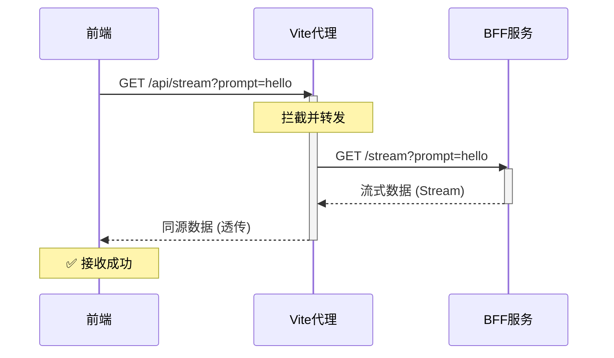

> 适合读者：前端开发者，写过 Vue/React 项目，对 Node.js 有基本了解。
>
> 你将收获：理解 BFF 是什么、为什么需要它、以及如何在一个 Vue 项目中从零搭建 BFF 层。

## 从一个能跑的项目开始

我写了一个 AI 流式对话的前端页面——用户在输入框里打字，点击提交，页面上逐字显示 DeepSeek 的回复。核心代码长这样：

```js
// App.vue —— 前端直接调用 DeepSeek API
const endpoint = 'https://api.deepseek.com/chat/completions'

const response = await fetch(endpoint, {
  headers: {
    'Content-Type': 'application/json',
    Authorization: `Bearer ${import.meta.env.VITE_DEEPSEEK_API_KEY}`
  },
  body: JSON.stringify({
    model: 'deepseek-v4-flash',
    stream: true,
    messages: [{ role: 'user', content: question.value }]
  })
})

// 拿到流，解析 SSE 格式，逐字显示……
const reader = response.body?.getReader()
const decoder = new TextDecoder()
// ……省略几十行流式解析代码
```

功能跑通了，效果不错。但多看两眼就会发现几个问题：

- API Key 在浏览器 Network 面板里裸奔 —— 按 F12 就能看到 `Authorization: Bearer sk-xxx`
- 前端扛了太多跟页面无关的活 —— 解析 SSE 协议、处理不完整数据块、切分 `data:` 前缀、判断 `[DONE]`……这些跟"显示文字"有什么关系？
- DeepSeek 哪天改了返回格式，前端要跟着改 —— 没有缓冲层

于是我加了一层中间服务，架构变成了这样：

```txt
之前：浏览器 ──────────────────→ DeepSeek API

之后：浏览器 ──→ BFF (Express) ──→ DeepSeek API
```

这篇文章就聊聊这个"中间层"——BFF（Backend For Frontend）。

## BFF 是什么

BFF 全称 Backend For Frontend，直译就是"为前端服务的后端"。

它和前端的区别是：前端跑在浏览器里，BFF 跑在服务器上。它和后端（Java/Go）的区别是：后端负责业务逻辑和数据库，BFF 只服务前端的需求。

> 本质上是前端和后端之间的"转换器"——转换协议、清洗数据、聚合接口，让前端只需要关心"拿什么数据显示"。

## 为什么需要 BFF

### 第一个原因：前端太重了

没有 BFF 的时候，前端需要懂的东西：

- SSE 协议的数据格式（`data: xxx\n\n`）
- DeepSeek 返回的 JSON 结构（`choices[0].delta.content`）
- ReadableStream 怎么读、TextDecoder 怎么用
- 网络分包导致 JSON 被截断怎么拼接

但这些知识跟"做一个聊天界面"有一毛钱关系吗？没有。

理想的状况是：前端只做一件事——拿到干净文本，显示在页面上：

```js
// 前端理想的状态
const response = await fetch('/api/stream?prompt=你好')
// 直接拿到: "从前有座山，山里有座庙……"
```

所有脏活——SSE 解析、数据清洗、格式转换——全部扔给 BFF 层。前端回归它本该做的事：管理 UI 状态、渲染页面。

### 第二个原因：安全

即使你用 Vite 的 `import.meta.env`，API Key 在构建时也会被直接替换成明文写进 JS 文件。任何人打开浏览器 DevTools → Sources 就能看到。

BFF 从 `process.env` 读 Key——这个值永远留在服务器内存里，绝对不会离开服务器。

```js
// server.mjs —— 跑在服务器上，Key 永远不到浏览器
dotenv.config({ path: ['.env', '.env.local'] })

const response = await fetch('https://api.deepseek.com/...', {
  headers: {
    Authorization: `Bearer ${process.env.VITE_DEEPSEEK_API_KEY}` // ← 服务器端读取
  }
})
```

### 第三个原因：前后端解耦

假设 DeepSeek 把返回字段从 `choices[0].delta.content` 改成了 `selections[0].delta.text`。没有 BFF，你要改前端代码、重新构建、重新部署。有 BFF，你只改 BFF 那一行映射逻辑，前端一行代码不动。

其他原因还包括：一个页面需要调多个后端时 BFF 可以聚合请求、可以做限流和日志、可以做鉴权。但这些不是本文重点。

## 动手实现

### 项目结构

```txt
stream-bff/
├── server.mjs          ← BFF 层（本文主角）
├── vite.config.js      ← Vite 配置（含跨域代理）
├── src/
│   ├── App.vue         ← 前端页面
│   └── main.js         ← 前端入口
└── package.json        ← vue + vite + express + dotenv
```

一个仓库，两个进程：

```bash
# 终端1：启动 BFF
node server.mjs          # Express 监听 :3000

# 终端2：启动前端
pnpm run dev             # Vite 监听 :5173
```

### BFF 核心代码

```js
// server.mjs
import express from 'express'
import * as dotenv from 'dotenv'

dotenv.config({ path: ['.env', '.env.local'] })

const app = express()
const port = 3000

app.get('/stream', async (req, res) => {
  const { prompt } = req.query

  const response = await fetch('https://api.deepseek.com/v1/chat/completions', {
    method: 'POST',
    headers: {
      Authorization: `Bearer ${process.env.VITE_DEEPSEEK_API_KEY}`,
      'Content-Type': 'application/json'
    },
    body: JSON.stringify({
      model: 'deepseek-v4-flash',
      stream: true,
      messages: [{ role: 'user', content: prompt }]
    })
  })

  // response.body 是 ReadableStream
  // 这里逐块读取 SSE 数据，清洗后 res.write() 给前端
  const reader = response.body.getReader()
  const decoder = new TextDecoder()
  let buffer = ''

  res.setHeader('Content-Type', 'text/event-stream')

  while (true) {
    const { done, value } = await reader.read()
    if (done) break

    const chunk = buffer + decoder.decode(value)
    buffer = ''
    // 解析 SSE、提取 delta.content、res.write(cleanText)
    // ……具体逻辑省略，文末有完整代码链接
  }

  res.end()
})

app.listen(port, () => {
  console.log(`BFF 已启动: http://localhost:${port}`)
})
```

### 前端变得多薄

```js
// App.vue —— 前端只需要这样
fetch('/api/stream?prompt=你好').then((res) => {
  // 拿到的就是干净的文本流，不需要解析 SSE
  const reader = res.body.getReader()
  // ……简单读取、逐字追加到 content.value
})
```

### 跨域问题怎么解决

浏览器页面在 `localhost:5173`（Vite），BFF 在 `localhost:3000`（Express）。端口不同，触发跨域。

这里用 Vite Proxy——让浏览器请求同源的 `/api/xxx`，Vite 开发服务器在背后转发给 BFF：

```js
// vite.config.js
export default defineConfig({
  plugins: [vue()],
  server: {
    proxy: {
      '/api': {
        target: 'http://localhost:3000',
        rewrite: (path) => path.replace(/^\/api/, '') // /api/stream → /stream
      }
    }
  }
})
```

浏览器发 `fetch('/api/stream')` → Vite(`:5173`) 转发 → BFF(`:3000`)。浏览器从头到尾只跟 `:5173` 通信，不触发跨域。

## BFF 代码放在哪

三种实践，核心问题是"谁来写、谁维护"：

| 方式                         | 谁维护   | 适用场景                   |
| :--------------------------- | :------- | :------------------------- |
| 放在前端项目里（本文的做法） | 前端团队 | 小团队、前端主导、快速迭代 |
| 独立 BFF 仓库                | 前端团队 | 多前端共享、BFF 逻辑复杂   |
| 放在后端项目里               | 后端团队 | 大公司、后端主导架构       |

学习和独立开发时，_放在前端项目里最实用_——一个仓库搞定整条链路。

## BFF 不是银弹

如果你的场景是：只有一个简单的后端 API、它允许跨域、返回格式已经很友好、不涉及敏感 Key——那直接在前端调用就行，不需要加 BFF。

加层的原则永远是：_两端不匹配时才需要中间层做转换_。没有不匹配，层就是多余的。 BFF 解决的是实际问题，不是无脑套的"最佳实践"。

## 总结

- BFF 是前端的后端 —— 帮前端扛脏活，让前端回归 UI 和状态管理
- 核心价值：前端变薄 > 安全 > 解耦 > 聚合 > 跨域
- 实现方式：一个 Express 服务（可以跟前端项目放在同一个仓库），跑在独立端口
- 判断标准：两端不匹配的时候才加，不匹配不存在的时候别加

> 从BFF到SSE：我在Vue项目里藏了个“AI翻译官”
>
> 当大模型流式输出遇上BFF架构，前端终于可以“躺平”了

## 前言：一个前端开发的“非分之想”

“咱们要加一个AI聊天功能，而且要流式输出，就像ChatGPT那样打字机效果。”产品经理轻描淡写地扔过来一句话，我却盯着屏幕上DeepSeek的API文档陷入了沉思。

直接在前端调接口？API Key赤裸裸地暴露在浏览器里，等于把保险柜密码贴在门上。  用fetch硬接流式数据？那意味着我要在前端手动处理`ReadableStream`、解码二进制、解析`data:`前缀、拼接碎片化文本……光是想想这些，血压就上来了。

更麻烦的是，产品经理要求的不只是一个“能跑的Demo”，而是一个可维护、可扩展的企业级功能。如果将来要换模型、要加鉴权、要做日志监控，难道每次都要改前端代码、重新打包发布吗？

这不合理。

我理想中的方案是：前端只用关心UI和用户交互，所有跟“流”相关的脏活累活，全部交给一个中间层去搞定。  这个中间层能藏住密钥、能转发流式数据、还能随时扩展新能力——说白了，就是给前端配一个“御用翻译官”。

于是，BFF（Backend For Frontend）走进了我的视野。当BFF碰上SSE（Server-Sent Events），所有问题都迎刃而解。

> 核心思路：BFF负责“翻译”LLM的流式方言，前端只需听懂“标准普通话”。

## BFF：大前端的“御用翻译官”

### 什么是BFF？

BFF全称 Backend For Frontend，翻译过来就是“为前端服务的后端”。

常规架构里，前端直接调后端的Java/Go接口，但有时候后端接口设计是为通用业务服务的，不太“体贴”前端的特定场景。比如：

- 后端返回的数据结构字段太多，前端用不上
- 需要聚合多个接口的数据
- 需要处理一些特殊协议（比如WebSocket、SSE）

这时候BFF层就登场了：

```txt
前端(Vue/React) → Node(BFF) → 后端(Java/Go/LLM)
```

BFF层由前端团队维护，_前端需要什么数据格式，BFF就给什么格式_。这就像前端在Java大后端面前配了个“自己人”，好说话。

### 为什么BFF适合做流式输出中转？

流式输出（SSE/Streaming）对前端来说有几个痛点：

- 二进制流对象需要解码
- 数据格式需要解析（比如SSE的 `data:` 前缀）
- 错误处理需要兼容多种异常情况
- 连接状态需要管理

把这些复杂逻辑塞到前端，既增加了打包体积，又让代码难以维护。

把脏活累活交给BFF，前端只需要一个`fetch`，拿到处理好的数据就行。这就是BFF的“翻译官”价值。

> BFF不是多此一举，而是把复杂性留在服务端，把简单留给前端。

## 实战：从0搭一个BFF流式服务

我们先用Vite创建一个Vue项目，然后在项目根目录下建一个 `server.mjs`，这就是我们的BFF服务器。

### 初始化BFF服务

```javascript:server.mjs
import * as dotenv from 'dotenv';
import express from 'express';

// 加载环境变量（API Key放这里）
dotenv.config({
path: ['.env.local', '.env']
});

const app = express();
const port = 3000;

// 健康检查路由
app.get('/', (req, res) => {
res.send('BFF Server is running 🚀');
});

app.listen(port, () => {
console.log(`BFF 服务已启动: http://localhost:${port}`);
});
```

这段代码在做什么？

- `dotenv.config()`：加载`.env`或`.env.local`中的环境变量，我们会在里面存放`VITE_DEEPSEEK_API_KEY`，这样API Key就只存在于服务端，前端无法窥探。
- `express`：最轻量的Node框架，用来快速搭建HTTP服务。
- `app.get('/')`：定义一个健康检查路由，方便验证服务是否正常。
- `app.listen(3000)`：BFF独立监听3000端口，与前端Vite服务（默认5173）完全隔离。

注意：`server.mjs` 和前端项目在同一个代码仓库，但运行时是两个独立进程。前端工程化工具（Vite）负责编译和热更新，BFF负责业务逻辑转发。两者各司其职，互不干扰。

启动方式：

```bash
# 终端1：启动BFF
node server.mjs

# 终端2：启动前端

npm run dev
```

### 核心：流式转发路由

接下来是重头戏——`/stream`路由。它要做三件事：

- 接收前端的`prompt`参数
- 带着API Key去请求DeepSeek的流式接口
- 把流式数据实时透传给前端

我们按照用户给定的代码来搭建：

```javascript
// server.mjs 继续添加
app.get('/stream', async (req, res) => {
  // prompt req 解析
  // fetch deepseek  stream: true
  // llm
  // console.log(req.query.prompt);
  // res.json({
  //     prompt: req.query.prompt,
  // })
  const { prompt } = req.query
  const endpoint = 'https://api.deepseek.com/v1/chat/completions'
  try {
    const response = await fetch(endpoint, {
      method: 'POST',
      headers: {
        Authorization: `Bearer ${process.env.VITE_DEEPSEEK_API_KEY}`,
        'Content-Type': 'application/json'
      },
      body: JSON.stringify({
        model: 'deepseek-v4-flash',
        messages: [
          {
            role: 'user',
            content: prompt
          }
        ],
        stream: true
      })
    })
    console.log(response.body) // ReadableStream
  } catch (err) {
    console.error('fetch 失败:', err.message)
  }
})
```

_逐段解析_：

- 接收参数

`const { prompt } = req.query` 从URL查询字符串中获取用户输入。前端请求`/stream?prompt=你好`，这里就能拿到`prompt='你好'`。

- 构造请求DeepSeek

- `endpoint`：DeepSeek的聊天补全API地址。
- `headers`：通过`Authorization`传递API Key，从环境变量读取，前端永远拿不到这个Key，保证了安全性。
- `body`：设置model为`deepseek-v4-flash`，messages为用户消息，最关键的是`stream: true`——这告诉DeepSeek以流式方式返回数据。

- 发起fetch请求

`await fetch(endpoint, {...})`会向DeepSeek发送HTTP请求。由于`stream: true`，服务器不会一次性返回完整JSON，而是分块发送SSE格式的数据流。

- 拿到响应流

`response.body`是一个ReadableStream对象，它代表了从DeepSeek接收到的原始字节流。这里我们只是用`console.log`打印了它，实际上我们还需要读取这个流、解析SSE格式、并将数据逐块写回给前端。目前这段代码只是“打通了”BFF到LLM的连接，但还没有把数据转发给前端。

- 错误捕获

如果网络超时、API Key无效或DeepSeek服务异常，fetch会抛出错误，我们捕获后打印日志。但这里也没有把错误信息返回给前端，前端会一直等待。

> 流式输出的本质是“边生产边消费”，BFF就是那个传送带上的分拣员。

## 跨域？Vite代理一把梭

### 跨域是怎么产生的？

浏览器有一个同源策略：协议、域名、端口三个完全相同才算“同源”，否则任何fetch或XMLHttpRequest请求都会触发跨域限制。

我们的场景：

- 前端服务：`http://localhost:5173`（Vite默认）
- BFF服务：`http://localhost:3000`（Express）

端口不同（5173 vs 3000），所以前端直接请求`http://localhost:3000/`stream会被浏览器拦截，报CORS错误。

_为什么浏览器要这么“多管闲事”？_ 为了防止恶意网站窃取用户数据。如果任意网站都能随意请求其他域名的接口，那你的银行账户可能就危险了。

### 解决跨域的常见方式

#### 方式一：CORS（跨域资源共享）

在BFF服务端设置响应头：

```ts
res.setHeader('Access-Control-Allow-Origin', '*')
```

简单粗暴，但生产环境如果BFF暴露在外网，允许所有来源存在风险。如果允许携带凭证（Cookie），还需要设置`Access-Control-Allow-Credentials: true`，且不能使用`*`，必须指定具体域名，同时浏览器会发送预检请求（OPTIONS），增加复杂度。

#### 方式二：JSONP

只支持GET请求，且存在安全风险，现在基本弃用。

#### 方式三：反向代理

在开发环境用Vite代理，生产环境用Nginx。这是最推荐的方式，因为它对前端完全透明，且不需要后端额外配置CORS。

### Vite代理的原理

Vite开发服务器内置了一个HTTP代理功能，它的工作方式类似于Nginx的反向代理：

- 前端请求一个同源的地址，比如`/api/stream`（相对路径，默认同源5173）。
- Vite开发服务器接收到这个请求后，发现`/api`前缀匹配了代理规则。
- Vite作为“中间人”，代替前端向真正的目标服务器（`http://localhost:3000`）发起请求。
- 拿到响应后，Vite再原样返回给前端。

对浏览器来说，它始终在和`localhost:5173`通信，不存在跨域。跨域被“消化”在了服务器之间，而服务器之间的请求不受同源策略限制。

### 代理配置详解

```javascript:vite.config.js
// vite.config.js
import { defineConfig } from 'vite';
import vue from '@vitejs/plugin-vue';

export default defineConfig({
    plugins: [vue()],
    server: {
        proxy: {
            '/api': {
                target: 'http://localhost:3000',  // BFF服务地址
                changeOrigin: true,
                rewrite: (path) => path.replace(/^/api/, ''), // 去掉/api前缀
            }
        }
    }
});
```

每个配置项的含义：

- `'/api'` ：匹配所有以`/api`开头的请求路径，例如`/api/stream`、`/api/chat`。
- `target`：代理转发的目标地址，这里指向BFF的3000端口。
- `changeOrigin: true`：修改请求头中的Origin字段为目标地址的Origin。有些后端服务会校验Origin，开启这个选项可以避免被拒绝。如果不开启，Origin仍然是`localhost:5173`，BFF可能因为不信任该来源而拒绝。
- `rewrite`：路径重写函数。我们想把`/api/stream`转发到BFF的`/stream`（因为BFF没有`/api`前缀），所以用正则去掉`/api`。

工作流程示例：



### 为什么不直接在BFF配置CORS？

你可能会想：我在BFF里加一行 `res.setHeader('Access-Control-Allow-Origin', '*')` 不就解决了？

当然可以，但有以下弊端：

- 生产环境风险：生产环境中，BFF可能部署在独立域名下，如果直接允许所有来源（`*`），存在安全隐患，容易遭受CSRF攻击。
- 需要额外配置：如果BFF要支持携带Cookie等凭证，CORS配置会更复杂（需要指定具体域名、处理预检请求等），代码臃肿。
- 多环境不一致：开发环境加CORS，生产环境可能又需要去掉，容易出错。

相比之下，Vite代理只在开发环境生效，生产环境我们通常会使用Nginx或云服务商的网关来做反向代理，策略统一。开发环境用Vite代理，生产环境用Nginx，两种环境保持一致的转发逻辑，减少心智负担。

> 金句：Vite代理就像给前端配了个“通关文牒”，跨域？不存在的。

### 生产环境怎么办？

生产环境部署时，你的前端静态文件（打包后的dist）通常由Nginx托管，BFF服务可能运行在另一个端口或另一个容器。

此时在Nginx中配置反向代理：

```nginx
location /api/ {
    proxy_pass http://localhost:3000/;  # 注意末尾的/会去掉前缀
    proxy_set_header Host $host;
    proxy_set_header X-Real-IP $remote_addr;
    # 针对SSE流式，需要禁用缓冲
    proxy_buffering off;
    proxy_cache off;
}
```

关键点：

- `proxy_pass`末尾的`/`会去掉匹配的前缀`/api/`，所以`/api/stream`会被转发到`/stream`。
- `proxy_buffering off`非常重要：对于流式输出，Nginx默认会缓冲响应，等到完整接收后再发给客户端，这会破坏SSE的实时性。关闭缓冲后，数据会立即透传给前端。

这样，开发和生产环境的请求路径都是`/api/stream`，前端代码无需任何修改。

## 最后：BFF不是银弹，但它是把好刀

BFF不是万能的，它增加了部署成本和维护复杂度。但在以下场景，它物超所值：

- ✅ 需要对接多个第三方API
- ✅ 需要处理特殊协议（SSE/WebSocket）
- ✅ 需要隐藏敏感信息（API Key）
- ✅ 前端需要定制化数据格式

如果你的项目符合以上任意一条，BFF值得拥有。

回到开头的故事：用了BFF之后，前端代码从200行精简到30行，产品经理满意，后端同事也不用为了我的小需求改接口。
