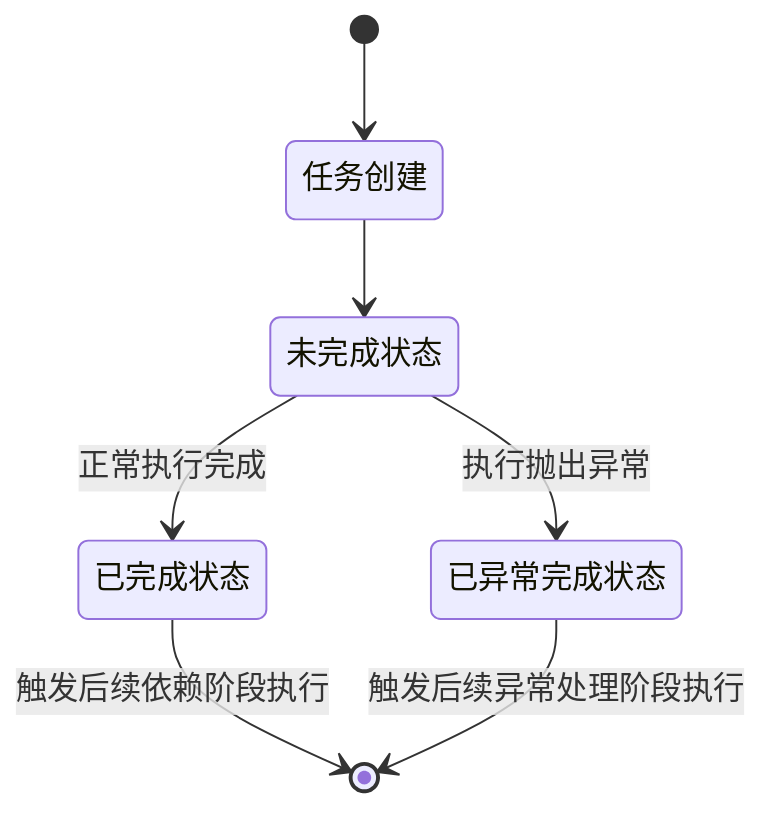

## 引言

在Java后端开发中，异步编程是提升系统并发能力、缩短接口响应时间的核心手段。从早期的Thread、Runnable，到JDK5引入的Future，再到JDK8正式发布的CompletableFuture，Java异步编程体系完成了从阻塞式到非阻塞式、从单一任务到复杂编排的完整演进。

传统Future存在无法回避的痛点：阻塞式获取结果、多任务编排能力薄弱、异常处理机制缺失、无回调触发能力，无法满足复杂业务场景下的异步开发需求。而CompletableFuture同时实现了Future与CompletionStage接口，通过CompletionStage定义的异步阶段契约，提供了40+方法支持链式调用、任务组合、结果转换、异常处理等能力，彻底解决了Future的核心痛点，成为Java异步编程的标准工具。

## CompletableFuture 核心底层原理

### 核心接口实现

CompletableFuture的核心能力来自两个接口的实现：

- Future接口：兼容传统异步任务的核心能力，支持结果获取、任务取消、状态判断等基础操作
- CompletionStage接口：异步阶段编程的核心契约，定义了异步任务的流式处理规则，每个方法都会返回新的CompletionStage实例，支持无阻塞的链式调用，实现任务的串行、并行、组合、异常处理等复杂逻辑

### 线程模型核心逻辑

CompletableFuture的线程模型决定了任务的执行载体，也是生产环境性能调优与避坑的核心：

- 无Async后缀方法：使用前一个任务的执行线程运行当前阶段逻辑；若前一个任务已完成，则使用当前调用线程执行
- 带Async后缀方法：默认使用 `ForkJoinPool.commonPool()` 全局线程池，也可传入自定义线程池，重新分配线程执行当前阶段逻辑
- `ForkJoinPool.commonPool()`默认配置：核心线程数为 `Math.max(1, Runtime.getRuntime().availableProcessors() - 1)`，线程为守护线程，仅适合CPU密集型任务，IO密集型任务必须使用自定义线程池

### 状态流转机制

CompletableFuture 的所有链式调用都基于状态流转驱动，核心分为三个状态：

- 未完成状态：任务正在执行，尚未返回结果或抛出异常
- 已完成状态：任务正常执行结束，已设置返回结果
- 已异常完成状态：任务执行抛出异常，已设置异常信息

当一个阶段的状态变为已完成（正常/异常）时，会自动触发所有依赖该阶段的后续任务执行，无需手动轮询或阻塞等待。



## CompletableFuture 核心功能与API详解

### 异步任务的创建

创建异步任务是CompletableFuture的基础能力，核心分为无返回值与有返回值两类，均支持自定义线程池传入。

#### 核心方法

| 方法                                              | 核心特征                      | 适用场景                                   |
| :------------------------------------------------ | :---------------------------- | :----------------------------------------- |
| runAsync(Runnable runnable)                       | 无返回值，默认使用 commonPool | 无结果返回的异步任务，如日志归档、消息通知 |
| runAsync(Runnable runnable, Executor executor)    | 无返回值，使用自定义线程池    | 生产环境IO密集型无返回任务                 |
| supplyAsync(Supplier supplier)                    | 有返回值，默认使用 commonPool | 有结果返回的异步任务，如数据查询、接口调用 |
| supplyAsync(Supplier supplier, Executor executor) | 有返回值，使用自定义线程池    | 生产环境IO密集型有返回任务                 |

#### 代码示例

```java
package com.jam.demo.basic;

import lombok.extern.slf4j.Slf4j;
import org.springframework.util.ObjectUtils;

import java.util.concurrent.CompletableFuture;
import java.util.concurrent.LinkedBlockingQueue;
import java.util.concurrent.ThreadPoolExecutor;
import java.util.concurrent.TimeUnit;
import java.util.concurrent.atomic.AtomicInteger;

/**
 * 异步任务创建示例
 *
 * @author ken
 */
@Slf4j
public class AsyncTaskCreateDemo {

    private static final int CPU_CORE_SIZE = Runtime.getRuntime().availableProcessors();
    private static final ThreadPoolExecutor IO_INTENSIVE_EXECUTOR;

    static {
        IO_INTENSIVE_EXECUTOR = new ThreadPoolExecutor(
                CPU_CORE_SIZE * 2,
                CPU_CORE_SIZE * 10,
                60L,
                TimeUnit.SECONDS,
                new LinkedBlockingQueue<>(200),
                new CustomThreadFactory("io-async-demo-"),
                new ThreadPoolExecutor.CallerRunsPolicy()
        );
    }

    public static void main(String[] args) {
        // 有返回值异步任务
        CompletableFuture<String> supplyFuture = CompletableFuture.supplyAsync(() -> {
            log.info("执行有返回值的异步任务");
            return "任务执行结果";
        }, IO_INTENSIVE_EXECUTOR);

        // 无返回值异步任务
        CompletableFuture<Void> runFuture = CompletableFuture.runAsync(() -> {
            log.info("执行无返回值的异步任务");
        }, IO_INTENSIVE_EXECUTOR);

        // 阻塞等待所有任务完成
        CompletableFuture.allOf(supplyFuture, runFuture).join();
        IO_INTENSIVE_EXECUTOR.shutdown();
    }

    /**
     * 自定义线程工厂
     */
    private static class CustomThreadFactory implements ThreadFactory {
        private final String threadNamePrefix;
        private final AtomicInteger threadNumber = new AtomicInteger(1);

        public CustomThreadFactory(String threadNamePrefix) {
            this.threadNamePrefix = threadNamePrefix;
        }

        @Override
        public Thread newThread(Runnable r) {
            Thread thread = new Thread(r, threadNamePrefix + threadNumber.getAndIncrement());
            thread.setDaemon(false);
            thread.setPriority(Thread.NORM_PRIORITY);
            thread.setUncaughtExceptionHandler((t, e) -> {
                if (!ObjectUtils.isEmpty(e)) {
                    log.error("线程{}执行发生未捕获异常", t.getName(), e);
                }
            });
            return thread;
        }
    }
}
```

### 任务结果的串行转换与消费

任务完成后，可通过链式方法对结果进行转换、消费，核心分为三类方法，严格区分入参与返回值的差异。

#### 核心方法对比

| 方法       | 入参           | 返回值         | 核心特征                     | 适用场景                                 |
| :--------- | :------------- | :------------- | :--------------------------- | :--------------------------------------- |
| thenApply  | 上一阶段的结果 | 新的处理结果   | 有入参、有返回值，结果转换   | 任务完成后对结果进行加工转换，生成新结果 |
| thenAccept | 上一阶段的结果 | 无返回值(Void) | 有入参、无返回值，结果消费   | 任务完成后消费结果，无需返回新值         |
| thenRun    | 无入参         | 无返回值(Void) | 无入参、无返回值，完成后触发 | 任务完成后执行后续动作，不关心任务结果   |

#### 易混淆点区分：带Async与不带Async的方法差异

- 不带Async的方法：复用前一个任务的执行线程，仅适合执行轻量级、非耗时的逻辑，若执行耗时操作会阻塞前一个任务的线程，影响线程复用
- 带Async的方法：重新从线程池分配线程执行，适合执行耗时操作，不会阻塞前序任务的线程

#### 代码示例

```java
package com.jam.demo.basic;

import lombok.extern.slf4j.Slf4j;

import java.util.concurrent.CompletableFuture;
import java.util.concurrent.ThreadPoolExecutor;

/**
 * 串行结果处理示例
 *
 * @author ken
 */
@Slf4j
public class SerialProcessDemo {

    private static final ThreadPoolExecutor IO_EXECUTOR = AsyncTaskCreateDemo.IO_INTENSIVE_EXECUTOR;

    public static void main(String[] args) {
        // thenApply 结果转换示例
        CompletableFuture<String> applyFuture = CompletableFuture.supplyAsync(() -> 100, IO_EXECUTOR)
                .thenApply(num -> num * 2)
                .thenApply(num -> "计算结果：" + num);
        log.info("thenApply结果：{}", applyFuture.join());

        // thenAccept 结果消费示例
        CompletableFuture<Void> acceptFuture = CompletableFuture.supplyAsync(() -> "用户基础数据", IO_EXECUTOR)
                .thenAccept(data -> log.info("消费用户数据：{}", data));
        acceptFuture.join();

        // thenRun 完成后触发示例
        CompletableFuture<Void> runFuture = CompletableFuture.runAsync(() -> log.info("执行数据归档任务"), IO_EXECUTOR)
                .thenRun(() -> log.info("归档任务完成，发送通知消息"));
        runFuture.join();

        IO_EXECUTOR.shutdown();
    }
}
```

### 任务依赖与扁平化处理：thenCompose

#### 核心痛点与解决方案

当处理逻辑需要返回一个新的异步任务时，使用thenApply会产生嵌套的CompletableFuture（`CompletableFuture<CompletableFuture<T>>`），导致回调地狱，无法继续链式处理。

thenCompose的核心作用是接收上一阶段的结果，返回一个新的CompletionStage，自动将嵌套的CompletableFuture扁平化，返回`CompletableFuture<T>`，实现任务的串行依赖编排。

#### 代码对比示例

```java
package com.jam.demo.basic;

import lombok.extern.slf4j.Slf4j;

import java.util.concurrent.CompletableFuture;
import java.util.concurrent.ThreadPoolExecutor;

/**
 * thenCompose 扁平化处理示例
 *
 * @author ken
 */
@Slf4j
public class ThenComposeDemo {

    private static final ThreadPoolExecutor IO_EXECUTOR = AsyncTaskCreateDemo.IO_INTENSIVE_EXECUTOR;

    public static void main(String[] args) {
        // thenApply 导致嵌套CompletableFuture
        CompletableFuture<CompletableFuture<String>> nestedFuture = CompletableFuture.supplyAsync(() -> 1L, IO_EXECUTOR)
                .thenApply(userId -> getUserInfoById(userId));

        // thenCompose 扁平化处理，无嵌套
        CompletableFuture<String> flatFuture = CompletableFuture.supplyAsync(() -> 1L, IO_EXECUTOR)
                .thenCompose(ThenComposeDemo::getUserInfoById);

        log.info("扁平化处理结果：{}", flatFuture.join());
        IO_EXECUTOR.shutdown();
    }

    /**
     * 根据用户ID查询用户信息，返回异步任务
     *
     * @param userId 用户ID
     * @return 用户信息异步任务
     */
    private static CompletableFuture<String> getUserInfoById(Long userId) {
        return CompletableFuture.supplyAsync(() -> {
            log.info("异步查询用户{}信息", userId);
            return "用户" + userId + "的基础信息";
        }, IO_EXECUTOR);
    }
}
```

### 双任务组合编排

针对两个异步任务的组合场景，CompletableFuture提供了两类编排能力：等待双任务全部完成、等待任意一个任务完成。

#### 双任务全部完成后执行

| 方法           | 核心特征                                   | 适用场景                                     |
| :------------- | :----------------------------------------- | :------------------------------------------- |
| thenCombine    | 接收两个任务的结果，有返回值，结果合并转换 | 两个并行任务结果需要合并加工，生成新结果     |
| thenAcceptBoth | 接收两个任务的结果，无返回值，结果消费     | 两个并行任务完成后，消费双结果，无返回值     |
| runAfterBoth   | 无入参，无返回值，双任务完成后触发         | 两个并行任务完成后，执行后续动作，不关心结果 |

#### 任意一个任务完成后执行

| 方法           | 核心特征                                 | 适用场景                             |
| :------------- | :--------------------------------------- | :----------------------------------- |
| applyToEither  | 接收先完成的任务结果，有返回值，结果转换 | 多渠道冗余查询，取最快返回的结果加工 |
| acceptEither   | 接收先完成的任务结果，无返回值，结果消费 | 多渠道冗余查询，消费最快返回的结果   |
| runAfterEither | 无入参，无返回值，任意任务完成后触发     | 任意一个任务完成后，执行后续动作     |

#### 代码示例

```java
package com.jam.demo.basic;

import lombok.extern.slf4j.Slf4j;

import java.util.concurrent.CompletableFuture;
import java.util.concurrent.ThreadPoolExecutor;
import java.util.concurrent.TimeUnit;

/**
 * 双任务组合编排示例
 *
 * @author ken
 */
@Slf4j
public class DualTaskCombineDemo {

    private static final ThreadPoolExecutor IO_EXECUTOR = AsyncTaskCreateDemo.IO_INTENSIVE_EXECUTOR;

    public static void main(String[] args) {
        // thenCombine 双任务结果合并示例
        CompletableFuture<String> productFuture = CompletableFuture.supplyAsync(() -> {
            log.info("查询商品基础信息");
            return "商品：iPhone 16 Pro";
        }, IO_EXECUTOR);
        CompletableFuture<Integer> stockFuture = CompletableFuture.supplyAsync(() -> {
            log.info("查询商品库存信息");
            return 200;
        }, IO_EXECUTOR);
        CompletableFuture<String> combineResult = productFuture.thenCombine(stockFuture, (product, stock) ->
                product + "，当前库存：" + stock
        );
        log.info("双任务合并结果：{}", combineResult.join());

        // applyToEither 取最快返回结果示例
        CompletableFuture<String> query1 = CompletableFuture.supplyAsync(() -> {
            try {
                TimeUnit.MILLISECONDS.sleep(100);
            } catch (InterruptedException e) {
                Thread.currentThread().interrupt();
            }
            return "渠道1查询结果";
        }, IO_EXECUTOR);
        CompletableFuture<String> query2 = CompletableFuture.supplyAsync(() -> {
            try {
                TimeUnit.MILLISECONDS.sleep(50);
            } catch (InterruptedException e) {
                Thread.currentThread().interrupt();
            }
            return "渠道2查询结果";
        }, IO_EXECUTOR);
        CompletableFuture<String> fastResult = query1.applyToEither(query2, result -> "最快返回：" + result);
        log.info("多渠道最快结果：{}", fastResult.join());

        IO_EXECUTOR.shutdown();
    }
}
```

### 多任务批量编排

针对超过2个的批量异步任务，CompletableFuture提供了allOf与anyOf两个核心方法，实现批量任务的统一管理。

#### 核心方法对比

| 方法                                  | 返回值                      | 核心特征                                           | 适用场景                                       |
| :------------------------------------ | :-------------------------- | :------------------------------------------------- | :--------------------------------------------- |
| `allOf(CompletableFuture<?> ... cfs)` | `CompletableFuture<Void>`   | 等待所有任务全部完成，任意任务异常会导致整体异常   | 批量并行任务，需所有任务完成后再进行后续处理   |
| `anyOf(CompletableFuture<?> ... cfs)` | `CompletableFuture<Object>` | 等待任意一个任务完成，先完成的任务结果作为整体结果 | 多渠道冗余查询，取最快返回的结果，提升响应速度 |

#### 代码示例

```java
package com.jam.demo.basic;

import com.google.common.collect.Lists;
import lombok.extern.slf4j.Slf4j;
import org.springframework.util.ObjectUtils;

import java.util.List;
import java.util.concurrent.CompletableFuture;
import java.util.concurrent.ThreadPoolExecutor;
import java.util.concurrent.TimeUnit;

/**
 * 多任务批量编排示例
 *
 * @author ken
 */
@Slf4j
public class BatchTaskDemo {

    private static final ThreadPoolExecutor IO_EXECUTOR = AsyncTaskCreateDemo.IO_INTENSIVE_EXECUTOR;

    public static void main(String[] args) {
        List<Long> userIdList = Lists.newArrayList(1L, 2L, 3L, 4L, 5L);

        // 批量创建异步任务，单个任务添加异常兜底
        List<CompletableFuture<String>> futureList = userIdList.stream()
                .map(userId -> CompletableFuture.supplyAsync(() -> queryUserById(userId), IO_EXECUTOR)
                        .completeOnTimeout("查询超时", 1, TimeUnit.SECONDS)
                        .exceptionally(ex -> {
                            log.error("查询用户{}信息失败", userId, ex);
                            return "查询失败";
                        }))
                .toList();

        // allOf 等待所有任务完成
        CompletableFuture<Void> allFuture = CompletableFuture.allOf(futureList.toArray(new CompletableFuture[0]));

        // 收集所有任务的结果
        CompletableFuture<List<String>> resultFuture = allFuture.thenApply(v ->
                futureList.stream()
                        .map(CompletableFuture::join)
                        .toList()
        );

        log.info("批量查询结果：{}", resultFuture.join());
        IO_EXECUTOR.shutdown();
    }

    /**
     * 模拟根据用户ID查询用户信息
     *
     * @param userId 用户ID
     * @return 用户信息
     */
    private static String queryUserById(Long userId) {
        log.info("查询用户{}信息", userId);
        return "用户" + userId + "的信息";
    }
}
```

易混淆点区分：`join()` 与 `get()` 的差异

- `join()`：抛出未检查异常 `CompletionException`，无需强制捕获，适合流式编程场景
- `get()`：抛出检查异常 `InterruptedException` 与 `ExecutionException`，必须强制捕获或向上抛出
- 两者均为阻塞式获取结果，必须配合超时控制使用

## 生产环境核心解决方案

### 异常处理完整方案

#### 异常传播核心机制

异步任务中抛出的异常会被封装到CompletableFuture实例中，仅当调用 `get()`/`join()` 获取结果时才会抛出；若未处理异常且未获取结果，异常会静默丢失，永远不会被捕获，这是生产环境最常见的问题。

#### 核心异常处理方法对比

| 方法            | 触发时机                | 入参           | 返回值                   | 异常处理效果                   | 适用场景                             |
| :-------------- | :---------------------- | :------------- | :----------------------- | :----------------------------- | :----------------------------------- |
| `exceptionally` | 仅任务异常时触发        | 异常对象       | 与正常结果同类型的默认值 | 捕获异常，终止异常向下传播     | 单个任务异常完成，返回默认值         |
| `whenComplete`  | 任务正常/异常完成时触发 | 结果、异常对象 | 无返回值，不改变任务结果 | 不捕获异常，异常会继续向下传播 | 日志记录、资源释放、上下文清理       |
| `handle`        | 任务正常/异常完成时触发 | 结果、异常对象 | 新的处理结果             | 可捕获异常，覆盖原任务结果     | 全场景结果与异常统一处理，返回新结果 |

#### 链式调用异常处理最佳实践

- 单个任务级异常兜底：每个可能抛出异常的异步任务，都添加 `exceptionally` 处理，避免单个任务失败影响整个链路
- 链路级全局兜底：在整个链式调用的末尾，添加 `handle` 或 `exceptionally` 做全局兜底，确保所有异常都被捕获
- 异常日志必须打印完整堆栈，禁止仅打印异常消息
- 异常类型区分处理，业务异常与系统异常分开处理

#### 代码示例

```java
package com.jam.demo.production;

import lombok.extern.slf4j.Slf4j;
import org.springframework.util.ObjectUtils;

import java.util.concurrent.CompletableFuture;
import java.util.concurrent.ThreadPoolExecutor;
import java.util.concurrent.TimeUnit;

/**
 * 异步任务异常处理完整示例
 *
 * @author ken
 */
@Slf4j
public class ExceptionHandleDemo {

    private static final ThreadPoolExecutor IO_EXECUTOR = AsyncTaskCreateDemo.IO_INTENSIVE_EXECUTOR;

    public static void main(String[] args) {
        CompletableFuture<String> fullChainFuture = CompletableFuture.supplyAsync(() -> {
            log.info("第一步：查询用户ID");
            return 1L;
        }, IO_EXECUTOR).exceptionally(ex -> {
            log.error("查询用户ID失败", ex);
            return 0L;
        }).thenCompose(userId -> {
            log.info("第二步：根据用户ID查询用户信息");
            return CompletableFuture.supplyAsync(() -> {
                if (userId == 0L) {
                    throw new RuntimeException("用户ID无效");
                }
                return "用户基础信息";
            }, IO_EXECUTOR);
        }).exceptionally(ex -> {
            log.error("查询用户信息失败", ex);
            return "默认用户信息";
        }).thenApply(userInfo -> {
            log.info("第三步：处理用户信息");
            return "处理后的" + userInfo;
        }).handle((result, ex) -> {
            if (!ObjectUtils.isEmpty(ex)) {
                log.error("整个链路执行异常", ex);
                return "全局兜底结果";
            }
            return result;
        });

        log.info("链路执行最终结果：{}", fullChainFuture.join());
        IO_EXECUTOR.shutdown();
    }
}
```

### 超时控制完整方案

超时控制是生产环境的强制要求，避免异步任务无限等待导致线程阻塞、资源泄漏、接口超时。JDK9及以上版本提供了原生超时控制方法，JDK17完全支持。

#### 原生超时控制方法对比

| 方法                                                      | 超时后行为                      | 正常完成行为 | 适用场景                               |
| :-------------------------------------------------------- | :------------------------------ | :----------- | :------------------------------------- |
| `orTimeout(long timeout, TimeUnit unit)`                  | 异常完成，抛出 TimeoutException | 返回正常结果 | 超时后需中断流程，抛出异常的场景       |
| `completeOnTimeout(T value, long timeout, TimeUnit unit)` | 正常完成，返回指定默认值        | 返回正常结果 | 超时后需返回默认值，继续后续流程的场景 |

#### 进阶超时控制方案

- 单个任务超时控制：所有远程调用、数据库查询的异步任务，必须设置单独的超时时间
- 全链路总超时控制：整个异步编排任务设置总超时时间，确保整个链路在指定时间内完成
- 批量任务超时控制：单个任务超时+批量总超时双重保障，避免慢任务影响整体性能

#### 代码示例

```java
package com.jam.demo.production;

import com.google.common.collect.Lists;
import lombok.extern.slf4j.Slf4j;

import java.util.List;
import java.util.concurrent.CompletableFuture;
import java.util.concurrent.ThreadPoolExecutor;
import java.util.concurrent.TimeUnit;

/**
 * 超时控制完整示例
 *
 * @author ken
 */
@Slf4j
public class TimeoutControlDemo {

    private static final ThreadPoolExecutor IO_EXECUTOR = AsyncTaskCreateDemo.IO_INTENSIVE_EXECUTOR;

    public static void main(String[] args) {
        // 1. 单个任务超时控制示例
        CompletableFuture<String> singleTaskFuture = CompletableFuture.supplyAsync(() -> {
            try {
                TimeUnit.SECONDS.sleep(2);
            } catch (InterruptedException e) {
                Thread.currentThread().interrupt();
                throw new RuntimeException("任务被中断", e);
            }
            return "正常执行结果";
        }, IO_EXECUTOR).completeOnTimeout("超时默认结果", 1, TimeUnit.SECONDS);
        log.info("单个任务执行结果：{}", singleTaskFuture.join());

        // 2. 全链路总超时控制示例
        CompletableFuture<String> businessChainFuture = CompletableFuture.supplyAsync(() -> {
            log.info("执行链路步骤1");
            return "步骤1结果";
        }, IO_EXECUTOR).thenCompose(result -> {
            log.info("执行链路步骤2");
            return CompletableFuture.supplyAsync(() -> {
                try {
                    TimeUnit.SECONDS.sleep(2);
                } catch (InterruptedException e) {
                    Thread.currentThread().interrupt();
                }
                return "步骤2结果";
            }, IO_EXECUTOR);
        });
        CompletableFuture<String> chainResultFuture = businessChainFuture
                .completeOnTimeout("链路总超时兜底结果", 3, TimeUnit.SECONDS);
        log.info("链路执行结果：{}", chainResultFuture.join());

        // 3. 批量任务超时控制示例
        List<Long> userIdList = Lists.newArrayList(1L, 2L, 3L);
        List<CompletableFuture<String>> futureList = userIdList.stream()
                .map(userId -> CompletableFuture.supplyAsync(() -> {
                    try {
                        TimeUnit.MILLISECONDS.sleep(500);
                    } catch (InterruptedException e) {
                        Thread.currentThread().interrupt();
                    }
                    return "用户" + userId + "信息";
                }, IO_EXECUTOR).completeOnTimeout("单个任务超时", 1, TimeUnit.SECONDS)
                        .exceptionally(ex -> "查询失败"))
                .toList();
        CompletableFuture<Void> batchFuture = CompletableFuture.allOf(futureList.toArray(new CompletableFuture[0]))
                .orTimeout(2, TimeUnit.SECONDS)
                .exceptionally(ex -> {
                    log.error("批量任务总超时", ex);
                    return null;
                });
        List<String> batchResult = batchFuture.thenApply(v ->
                futureList.stream().map(CompletableFuture::join).toList()
        ).join();
        log.info("批量任务执行结果：{}", batchResult);

        IO_EXECUTOR.shutdown();
    }
}
```

### 异步任务编排完整业务方案

以下为电商订单确认页的完整业务实现，涵盖并行任务编排、单任务超时、全链路总超时、异常兜底、线程池隔离等生产环境核心能力。

#### Maven核心依赖

```xml
<dependencies>
    <dependency>
        <groupId>org.springframework.boot</groupId>
        <artifactId>spring-boot-starter-web</artifactId>
        <version>3.2.5</version>
    </dependency>
    <dependency>
        <groupId>com.baomidou</groupId>
        <artifactId>mybatis-plus-boot-starter</artifactId>
        <version>3.5.7</version>
    </dependency>
    <dependency>
        <groupId>com.mysql</groupId>
        <artifactId>mysql-connector-j</artifactId>
        <version>8.4.0</version>
        <scope>runtime</scope>
    </dependency>
    <dependency>
        <groupId>org.projectlombok</groupId>
        <artifactId>lombok</artifactId>
        <version>1.18.32</version>
        <scope>provided</scope>
    </dependency>
    <dependency>
        <groupId>org.springdoc</groupId>
        <artifactId>springdoc-openapi-starter-webmvc-ui</artifactId>
        <version>2.5.0</version>
    </dependency>
    <dependency>
        <groupId>com.alibaba.fastjson2</groupId>
        <artifactId>fastjson2</artifactId>
        <version>2.0.52</version>
    </dependency>
    <dependency>
        <groupId>com.google.guava</groupId>
        <artifactId>guava</artifactId>
        <version>33.2.0-jre</version>
    </dependency>
</dependencies>
```

#### 线程池配置类

```java
package com.jam.demo.config;

import lombok.extern.slf4j.Slf4j;
import org.springframework.context.annotation.Bean;
import org.springframework.context.annotation.Configuration;

import java.util.concurrent.LinkedBlockingQueue;
import java.util.concurrent.ThreadFactory;
import java.util.concurrent.ThreadPoolExecutor;
import java.util.concurrent.TimeUnit;
import java.util.concurrent.atomic.AtomicInteger;

/**
 * 异步任务线程池配置
 *
 * @author ken
 */
@Slf4j
@Configuration
public class AsyncThreadPoolConfig {

    private static final int CPU_CORE_SIZE = Runtime.getRuntime().availableProcessors();
    private static final String IO_THREAD_PREFIX = "io-async-thread-";
    private static final String CPU_THREAD_PREFIX = "cpu-async-thread-";

    /**
     * IO密集型任务线程池
     */
    @Bean("ioIntensiveExecutor")
    public ThreadPoolExecutor ioIntensiveExecutor() {
        return new ThreadPoolExecutor(
                CPU_CORE_SIZE * 2,
                CPU_CORE_SIZE * 10,
                60L,
                TimeUnit.SECONDS,
                new LinkedBlockingQueue<>(200),
                new CustomThreadFactory(IO_THREAD_PREFIX),
                new ThreadPoolExecutor.CallerRunsPolicy()
        );
    }

    /**
     * CPU密集型任务线程池
     */
    @Bean("cpuIntensiveExecutor")
    public ThreadPoolExecutor cpuIntensiveExecutor() {
        return new ThreadPoolExecutor(
                CPU_CORE_SIZE,
                CPU_CORE_SIZE,
                0L,
                TimeUnit.MILLISECONDS,
                new LinkedBlockingQueue<>(100),
                new CustomThreadFactory(CPU_THREAD_PREFIX),
                new ThreadPoolExecutor.CallerRunsPolicy()
        );
    }

    /**
     * 自定义线程工厂
     */
    private static class CustomThreadFactory implements ThreadFactory {
        private final String threadNamePrefix;
        private final AtomicInteger threadNumber = new AtomicInteger(1);

        public CustomThreadFactory(String threadNamePrefix) {
            this.threadNamePrefix = threadNamePrefix;
        }

        @Override
        public Thread newThread(Runnable r) {
            Thread thread = new Thread(r, threadNamePrefix + threadNumber.getAndIncrement());
            thread.setDaemon(false);
            thread.setPriority(Thread.NORM_PRIORITY);
            thread.setUncaughtExceptionHandler((t, e) -> {
                log.error("线程{}执行未捕获异常", t.getName(), e);
            });
            return thread;
        }
    }
}
```

#### 核心业务实现

```java
package com.jam.demo.service;

import com.jam.demo.mapper.AddressMapper;
import com.jam.demo.mapper.CouponMapper;
import com.jam.demo.mapper.ProductMapper;
import com.jam.demo.mapper.UserMapper;
import com.jam.demo.vo.*;
import lombok.RequiredArgsConstructor;
import lombok.extern.slf4j.Slf4j;
import org.springframework.stereotype.Service;
import org.springframework.util.ObjectUtils;

import java.math.BigDecimal;
import java.util.List;
import java.util.concurrent.CompletableFuture;
import java.util.concurrent.ThreadPoolExecutor;
import java.util.concurrent.TimeUnit;

/**
 * 订单确认页服务
 *
 * @author ken
 */
@Slf4j
@Service
@RequiredArgsConstructor
public class OrderConfirmService {

    private final UserMapper userMapper;
    private final ProductMapper productMapper;
    private final AddressMapper addressMapper;
    private final CouponMapper couponMapper;
    private final ThreadPoolExecutor ioIntensiveExecutor;

    /**
     * 获取订单确认页完整数据
     *
     * @param userId     用户ID
     * @param productIds 商品ID列表
     * @return 订单确认页数据
     */
    public OrderConfirmVO getOrderConfirmData(Long userId, List<Long> productIds) {
        // 并行异步任务创建，单任务超时+异常兜底
        CompletableFuture<UserVO> userFuture = CompletableFuture.supplyAsync(() ->
                        userMapper.selectUserById(userId), ioIntensiveExecutor)
                .completeOnTimeout(null, 1, TimeUnit.SECONDS)
                .exceptionally(ex -> {
                    log.error("查询用户{}信息失败", userId, ex);
                    return null;
                });

        CompletableFuture<List<ProductVO>> productFuture = CompletableFuture.supplyAsync(() ->
                        productMapper.selectProductByIds(productIds), ioIntensiveExecutor)
                .completeOnTimeout(List.of(), 1, TimeUnit.SECONDS)
                .exceptionally(ex -> {
                    log.error("查询商品{}信息失败", productIds, ex);
                    return List.of();
                });

        CompletableFuture<List<AddressVO>> addressFuture = CompletableFuture.supplyAsync(() ->
                        addressMapper.selectByUserId(userId), ioIntensiveExecutor)
                .completeOnTimeout(List.of(), 1, TimeUnit.SECONDS)
                .exceptionally(ex -> {
                    log.error("查询用户{}地址失败", userId, ex);
                    return List.of();
                });

        CompletableFuture<List<CouponVO>> couponFuture = CompletableFuture.supplyAsync(() ->
                        couponMapper.selectAvailableByUserId(userId), ioIntensiveExecutor)
                .completeOnTimeout(List.of(), 1, TimeUnit.SECONDS)
                .exceptionally(ex -> {
                    log.error("查询用户{}优惠券失败", userId, ex);
                    return List.of();
                });

        // 全链路总超时控制
        CompletableFuture<Void> allTaskFuture = CompletableFuture.allOf(
                userFuture, productFuture, addressFuture, couponFuture
        ).orTimeout(2, TimeUnit.SECONDS).exceptionally(ex -> {
            log.error("订单确认页查询总超时，userId={}", userId, ex);
            return null;
        });

        // 结果组合与全局异常兜底
        return allTaskFuture.thenApply(v -> {
            OrderConfirmVO result = new OrderConfirmVO();
            result.setUserInfo(userFuture.join());
            result.setProductList(productFuture.join());
            result.setAddressList(addressFuture.join());
            result.setCouponList(couponFuture.join());

            BigDecimal totalAmount = result.getProductList().stream()
                    .map(ProductVO::getPrice)
                    .reduce(BigDecimal.ZERO, BigDecimal::add);
            result.setTotalAmount(totalAmount);
            return result;
        }).handle((result, ex) -> {
            if (!ObjectUtils.isEmpty(ex)) {
                log.error("订单确认页数据处理异常，userId={}", userId, ex);
                return new OrderConfirmVO();
            }
            return result;
        }).join();
    }
}
```

#### 接口层实现

```java
package com.jam.demo.controller;

import com.jam.demo.service.OrderConfirmService;
import com.jam.demo.vo.OrderConfirmVO;
import io.swagger.v3.oas.annotations.Operation;
import io.swagger.v3.oas.annotations.Parameter;
import io.swagger.v3.oas.annotations.tags.Tag;
import lombok.RequiredArgsConstructor;
import org.springframework.web.bind.annotation.*;

import java.util.List;

/**
 * 订单确认页接口
 *
 * @author ken
 */
@RestController
@RequestMapping("/order/confirm")
@RequiredArgsConstructor
@Tag(name = "订单确认页接口", description = "订单确认页数据查询接口")
public class OrderConfirmController {

    private final OrderConfirmService orderConfirmService;

    @GetMapping("/data")
    @Operation(summary = "获取订单确认页数据", description = "并行查询用户、商品、地址、优惠券信息，返回完整订单确认数据")
    public OrderConfirmVO getOrderConfirmData(
            @Parameter(description = "用户ID", required = true) @RequestParam Long userId,
            @Parameter(description = "商品ID列表", required = true) @RequestParam List<Long> productIds
    ) {
        return orderConfirmService.getOrderConfirmData(userId, productIds);
    }
}
```

## 异步编程最佳实践

### 线程池隔离与合理配置

- 严格区分CPU密集型与IO密集型任务，使用独立线程池，避免任务互相影响
- 不同业务场景使用独立线程池，核心业务与非核心业务隔离，避免非核心业务影响核心链路
- 线程池必须通过ThreadPoolExecutor手动创建，禁止使用Executors创建，避免资源耗尽风险
- 线程池必须设置合理的拒绝策略，推荐使用CallerRunsPolicy，在队列满时由调用线程执行任务，既避免任务丢失，又起到流量控制作用
- 必须设置自定义线程工厂，指定线程名称前缀，方便问题排查；同时设置未捕获异常处理器，避免异常静默丢失

### 异常处理强制规范

- 所有异步任务必须添加异常处理逻辑，禁止出现无异常处理的异步任务
- 单个任务级别的异常兜底，避免单个任务失败导致整个链路失败
- 整个链式调用末尾必须添加全局异常兜底，确保所有异常都能被捕获
- 异常日志必须打印完整堆栈信息，禁止仅打印异常消息
- 禁止在whenComplete中抛出异常，该方法不会改变任务的异常状态，抛出的异常会被静默丢失

### 超时控制强制规范

- 所有涉及远程调用、数据库查询、网络IO的异步任务，必须设置超时时间，禁止无限等待
- 采用单任务超时+全链路总超时的双重保障机制，避免慢任务影响整体性能
- 超时时间基于压测结果合理设置，避免误超时
- 超时后需处理任务中断逻辑，在任务中判断线程中断状态，避免任务继续执行浪费系统资源

### 任务编排最佳实践

- 无依赖的任务优先并行编排，最大程度缩短接口响应时间
- 有依赖的任务使用thenCompose进行串行编排，避免嵌套CompletableFuture，杜绝回调地狱
- 批量任务优先使用allOf统一管理，避免循环创建任务后逐个`get()`，减少线程阻塞时间
- 多渠道冗余查询使用anyOf，取最快返回的结果，提升接口响应速度
- 禁止在循环中无限制创建异步任务，必须控制并发数，采用分片处理，避免任务队列积压导致OOM

### 线程模型最佳实践

- 不带Async后缀的方法仅执行轻量级、非耗时的逻辑，禁止执行耗时操作，避免阻塞前序任务的线程
- 耗时操作必须使用带Async后缀的方法，使用独立线程池执行
- 禁止滥用`ForkJoinPool.commonPool()`，IO密集型任务必须使用自定义线程池
- 避免在异步任务中使用ThreadLocal，会导致线程上下文丢失，需使用TransmittableThreadLocal传递上下文

## 常见避坑指南

### 默认线程池滥用导致系统阻塞

现象：IO密集型任务使用默认的commonPool，导致接口响应时间飙升，系统并发能力下降

根因：commonPool核心线程数为CPU核心数-1，IO密集型任务会导致线程被阻塞，无多余线程处理其他任务，影响整个JVM的异步任务执行

解决方案：IO密集型任务必须使用自定义IO线程池，commonPool仅用于CPU密集型任务

### 异步任务异常静默丢失

现象：异步任务执行失败，但日志无任何异常信息，问题无法排查

根因：CompletableFuture的异常仅在获取结果时才会抛出，若未处理异常且未调用`get()`/`join()`，异常会被永久封装在实例中，不会被打印

解决方案：所有异步任务必须添加异常处理逻辑，至少在链路末尾添加exceptionally或handle，打印完整异常堆栈

### 无Async方法执行耗时操作

现象：异步任务响应时间变长，线程池线程利用率低

根因：不带Async后缀的方法复用前序任务的线程，执行耗时操作会阻塞该线程，导致线程无法释放复用

解决方案：耗时操作必须使用带Async后缀的方法，使用独立线程池执行，无Async方法仅执行轻量级结果转换

### 线程上下文丢失

现象：异步任务中获取不到主线程的用户信息、链路traceId，导致链路追踪中断、权限校验失败

根因：ThreadLocal基于线程绑定，异步任务使用线程池中的线程，与主线程不是同一个线程，无法获取ThreadLocal中的值

解决方案：使用TransmittableThreadLocal替换ThreadLocal，或在创建异步任务时手动传递上下文信息

### 批量任务单异常导致整体失败

现象：批量查询任务中单个任务执行失败，导致整个批量任务结果无法获取

根因：allOf会等待所有任务完成，只要有一个任务异常完成，allOf返回的实例就会异常完成，获取结果时会抛出异常

解决方案：每个单个任务都添加exceptionally异常兜底，处理异常并返回默认值，避免异常扩散

### 无超时`get()`导致线程永久阻塞

现象：服务出现大量阻塞线程，最终导致服务雪崩

根因：使用无参`get()`方法会一直阻塞调用线程，直到异步任务完成，若任务一直不完成，线程会被永久阻塞

解决方案：必须使用带超时时间的`get()`方法，或使用原生的completeOnTimeout/orTimeout方法设置超时时间

## 总结

CompletableFuture是Java异步编程的核心工具，通过CompletionStage接口提供了强大的链式编排能力，彻底解决了传统Future的核心痛点。在实际开发中，只有掌握其底层线程模型、状态流转机制、核心API的适用场景，同时严格遵循异常处理、超时控制、线程池隔离的最佳实践，避开常见的开发陷阱，才能充分发挥异步编程的优势，提升系统的并发能力与响应速度，保证服务的稳定性。
