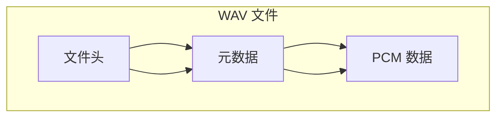

二进制数组是 JavaScript 操作二进制数据的接口，分别有 `ArrayBuffer` 对象、`TypedArray` 视图和 `DataView` 视图，它们都以数组的语法处理二进制数据。

> 注意，二进制数组并不是真正的数组，而是类似数组的对象。

## ArrayBuffer 对象

`ArrayBuffer` 对象代表内存之中的一段二进制数据，可以通过“视图”进行操作。“视图”部署了数组接口，可以用数组的方法操作内存。

它本身只是一个内存区域，不能直接读写内存数据，需要配合 `TypedArray` 视图或 `DataView` 视图使用。

## 视图

`ArrayBuffer` 对象作为内存区域，可以存放多种类型的数据。同一段内存，不同数据有不同的解读方式，这就叫做“视图”（view）。ArrayBuffer 有两种视图，一种是 `TypedArray` 视图，另一种是 `DataView` 视图。

### TypedArray 视图

TypedArray 视图是以固定数据类型（如 Int8、Uint16、Float32 等）读写 ArrayBuffer 二进制数据的数组视图。

在目前标准中共有 12 种类型，其中前端开发最常用的是 Uint8Array、Int16Array 和 Float32Array。

| 类型              | 每个元素大小 | 说明                   | 范围                     |
| :---------------- | :----------- | :--------------------- | :----------------------- |
| Int8Array         | 1 字节       | 8 位有符号整数         | -128 ~ 127               |
| Uint8Array        | 1 字节       | 8 位无符号整数         | 0 ~ 255                  |
| Uint8ClampedArray | 1 字节       | 8 位无符号整数（钳位） | 0 ~ 255                  |
| Int16Array        | 2 字节       | 16 位有符号整数        | -32768 ~ 32767           |
| Uint16Array       | 2 字节       | 16 位无符号整数        | 0 ~ 65535                |
| Int32Array        | 4 字节       | 32 位有符号整数        | -2147483648 ~ 2147483647 |
| Uint32Array       | 4 字节       | 32 位无符号整数        | 0 ~ 4294967295           |
| Float16Array      | 2 字节       | 16 位浮点数            | -65504 ~ 65504           |
| Float32Array      | 4 字节       | 32 位浮点数            | IEEE 754                 |
| Float64Array      | 8 字节       | 64 位浮点数            | IEEE 754                 |
| BigInt64Array     | 8 字节       | 64 位有符号整数        | -2^63 ~ 2^63-1           |
| BigUint64Array    | 8 字节       | 64 位无符号整数        | 0 ~ 2^64-1               |

`Float16Array` 、`Float32Array` 、 `Float64Array` 都是有符号的，没有对应的无符号类型。

### 创建 TypedArray

TypedArray 可以通过指定长度、普通数组、ArrayBuffer 或另一个 TypedArray 创建，其中基于 ArrayBuffer 创建是前端处理二进制数据最常见、最高效的方式。

_指定长度创建 TypedArray 语法为_：

```js
new TypedArray(length)
```

例如：

```js
const arr = new Uint8Array(5)

console.log(arr)
```

输出：

```txt
Uint8Array(5)[(0, 0, 0, 0, 0)];
```

_使用普通数组创建 TypedArray 语法为_：

```js
new TypedArray(array)
```

例如：

```js
const arr = new Uint8Array([10, 20, 30])

console.log(arr)
```

输出：

```js
Uint8Array(3)[(10, 20, 30)]
```

_基于 ArrayBuffer 创建TypedArray 语法为_：

```js
new TypedArray(buffer, byteOffset, length)
```

例如：

```js
const buffer = new ArrayBuffer(8)

const arr = new Uint8Array(buffer)

console.log(arr.length) // 8
console.log(arr.byteLength) // 8
```

如果需要从指定位置开始读取：

```js
const buffer = new ArrayBuffer(16)

// 从第4个字节开始，读取4个元素
const arr = new Uint8Array(buffer, 4, 4)
```

其中：

- buffer：底层内存

- 4：起始偏移（单位：字节）

- 4：元素个数（不是字节数）

这是解析二进制文件（如 WAV、PNG）时最常见的创建方式。

_使用另一个 TypedArray 创建 TypedArray 语法为_：

```js
new TypedArray(typedArray)
```

例如：

```js
const arr1 = new Uint8Array([1, 2, 3])

const arr2 = new Uint8Array(arr1)

console.log(arr2)
```

输出：

```txt
Uint8Array(3)[(1, 2, 3)];
```

注意：_这里会复制数据，arr1 和 arr2 不共享内存_。

以上 4 种创建 TypedArray 的方式对比：

| 创建方式    | 示例                    | 是否创建新的 ArrayBuffer |
| :---------- | :---------------------- | :----------------------- |
| 指定长度    | new Uint8Array(8)       | 是                       |
| 普通数组    | new Uint8Array([1,2,3]) | 是                       |
| ArrayBuffer | new Uint8Array(buffer)  | 否，共享已有内存         |
| TypedArray  | new Uint8Array(other)   | 是（复制数据）           |

### TypedArray 常用 API

TypedArray 的 API 和普通 Array 很像，但它是专门为操作二进制数据设计的。

TypedArray 提供了创建、读取、修改、遍历、复制和查找二进制数据的一系列 API。

#### 属性

| 属性              | 作用                             |
| :---------------- | :------------------------------- |
| buffer            | 对应的 ArrayBuffer               |
| byteLength        | 当前视图占用的字节数             |
| byteOffset        | 当前视图起始偏移量（字节）       |
| length            | 元素个数                         |
| BYTES_PER_ELEMENT | 每个元素占用的字节数（静态属性） |

示例：

```js
const arr = new Uint16Array(10) // 有 10 个元素，所以 length 为 10

console.log(arr.length) // 10
console.log(arr.byteLength) // 20
console.log(arr.byteOffset) // 0
console.log(arr.buffer) // ArrayBuffer
console.log(Uint16Array.BYTES_PER_ELEMENT) // 2
```

上面代码中， Uint16Array 为 16 位无符号整数，1 个元素占 2 个字节（1 个字节 = 8 位）。

因此 BYTES_PER_ELEMENT 为 2 。

因为有 10 个元素，所以 byteLength 为 10 乘以 2 ，为 20 个字节 。

#### 读写元素

和普通数组一样，可以通过下标访问。

```js
const arr = new Int16Array(3)

arr[0] = 100
arr[1] = -50

console.log(arr[0]) // 100
```

#### 创建和复制

`set()` 复制另一组数据，也就是将一段内容完全复制到另一段内存。

```js
const arr = new Uint8Array(5)

arr.set([1, 2, 3])

console.log(arr)
```

输出：

```txt
Uint8Array(5)[(1, 2, 3, 0, 0)];
```

也可以指定开始位置：

```js
arr.set([8, 9], 3)
```

结果：

```txt
[1, 2, 3, 8, 9];
```

`subarray()` 创建共享同一块内存的新视图。

```js
const arr = new Uint8Array([1, 2, 3, 4])

const sub = arr.subarray(1, 3)

console.log(sub)
```

输出：

```txt
Uint8Array[(2, 3)];
```

`subarray()` 不会复制数据。

`slice()` 复制数据，返回新的 TypedArray。

```js
const copy = arr.slice(1, 3)
```

得到：

```txt
Uint8Array[(2, 3)];
```

与 `subarray()` 不同的是：

- `slice()`：复制数据
- `subarray()`：共享内存

#### 遍历

`for...of` 遍历

```js
for (const value of arr) {
  console.log(value)
}
```

`forEach()` 遍历

```js
arr.forEach((value, index) => {
  console.log(index, value)
})
```

`entries()`

```js
for (const [i, v] of arr.entries()) {
  console.log(i, v)
}
```

`keys()`

```js
for (const key of arr.keys()) {
  console.log(key)
}
```

`values()`

```js
for (const value of arr.values()) {
  console.log(value)
}
```

#### 查找

普通数组中的查找方法都可以运用在 TypedArray 中。

```js
arr.includes(10)
arr.indexOf(10)
arr.lastIndexOf(10)
arr.find((v) => v > 100)
arr.findIndex((v) => v > 100)
```

#### 转换

普通数组中的转换方法对 TypedArray 也适用

```js
arr.join(',')
arr.toString()

Array.from(arr)
;[...arr]
```

例如：

```js
const arr = new Uint8Array([1, 2, 3])

console.log(Array.from(arr))
```

输出：

```txt
[1, 2, 3];
```

#### 迭代方法

普通数组中的迭代方法对 TypedArray 也适用

```js
arr.map(...)
arr.filter(...)
arr.reduce(...)
arr.reduceRight(...)
arr.some(...)
arr.every(...)
```

例如：

```js
const arr = new Uint8Array([1, 2, 3])

const result = arr.map((x) => x * 2)

console.log(result)
```

输出：

```txt
Uint8Array[(2, 4, 6)];
```

#### 排序

TypedArray 的排序方法与普通数组的排序方法一样。

```js
arr.sort()
arr.reverse()
```

例如：

```js
const arr = new Uint8Array([3, 1, 2])

arr.sort()

console.log(arr)
```

输出：

```txt
Uint8Array[(1, 2, 3)];
```

#### 填充

普通数组的填充方法对 TypedArray 也适用。

```js
arr.fill(100)
```

输出：

```txt
[100, 100, 100];
```

#### 判断

普通数组中的判断方法对 TypedArray 也适用。

```js
arr.includes(10)
```

返回：

```txt
true;
false;
```

#### 与普通 Array 相比的区别

TypedArray 支持很多与 Array 相同的方法，但也有一些限制：

- 元素类型固定，例如 Uint8Array 只能存储 0 ～ 255 的整数。
- 长度固定，创建后不能使用 `push()`、`pop()`、`shift()`、`unshift()`、`splice()` 等会改变长度的方法。

例如：

```js
const arr = new Uint8Array([1, 2, 3])

arr.push(4) // ❌ TypeError
```

这是因为 TypedArray 的底层 ArrayBuffer 大小是固定的，不能像普通数组那样动态扩容。

## 复合视图

在介绍 DataView 视图前，先介绍复合视图。

复合视图就是多个不同的视图（TypedArray 或 DataView）同时查看、操作同一个 ArrayBuffer。

### 先看普通视图

假设有一块 8 字节内存：

```js
const buffer = new ArrayBuffer(8)

const view = new Uint8Array(buffer)
```

此时 buffer 内存中，只有 1 个 Uint8Array 视图。

### 再看复合视图

同一块内存：

```js
const buffer = new ArrayBuffer(8)

const uint8 = new Uint8Array(buffer)
const uint16 = new Uint16Array(buffer)
const dataView = new DataView(buffer)
```

此时 buffer 内存中，有 3 个视图，分别为 Uint8Array、Uint16Array 和 DataView。这就是复合视图。

多个视图共享同一块内存。

### 最直观的例子

```js
const buffer = new ArrayBuffer(4)

const uint8 = new Uint8Array(buffer)
const uint16 = new Uint16Array(buffer)

uint8[0] = 1
uint8[1] = 0

console.log(uint16[0])
```

输出：

```txt
1;
```

因为 uint8 和 uint16 共享同一块内存，所以 uint8 中的修改，也会影响 uint16 中的数据。

### 类比：同一本书

把 ArrayBuffer 想象成一本书。

按字阅读：

```txt
今
天
天
气
不
错
```

相当于：

```js
Uint8Array
```

按词阅读：

```txt
今天
天气
不错
```

相当于：

```js
Uint16Array
```

任意位置阅读：

```txt
从第3个字开始读
```

相当于：

```js
DataView
```

这三个人读的是：

```txt
同一本书
```

只是阅读方式不同。

这就是复合视图的本质。

### 为什么需要复合视图？

解析二进制文件时非常常见。

例如 WAV 文件由文件头、元数据和 PCM 数据组成。



```js
function readString(view, offset, length) {
  let str = ''
  for (let i = 0; i < length; i++) {
    str += String.fromCharCode(view.getUint8(offset + i))
  }
  return str
}

async function main() {
  const response = await fetch('/5s_16k_mono_16bit_440hz.wav')
  const buffer = await response.arrayBuffer()

  const view = new DataView(buffer)
  const chunkID = readString(view, 0, 4) // "RIFF"
  const pcm = new Int16Array(buffer, 44) // PCM 数据
}

main()
```

在上面代码中，使用 DataView 读取文件头，使用 Int16Array 读取 PCM 数据，它们共享同一个 ArrayBuffer。

这是复合视图在实际开发中的典型用法。

## DataView 视图

DataView 是一种可以按照任意数据类型和任意字节偏移量灵活读写 ArrayBuffer 的视图。

```js
const buffer = new ArrayBuffer(4)
const view = new DataView(buffer)

view.setInt16(0, 1000)
console.log(view.getInt16(0)) // 1000
```

与 TypedArray 的区别为：

```txt
TypedArray  = 整块内存按同一种类型查看
DataView    = 内存中的任意位置按任意类型查看
```

可以说 DataView 是一个"万能二进制读取器"，可以从 ArrayBuffer 的任意位置，以任意数据类型读取或写入数据，非常适合解析 WAV、PNG、网络协议等二进制格式。

### 创建 DataView

DataView 必须基于 ArrayBuffer 创建，语法为：

```js
new DataView(buffer, byteOffset?, byteLength?)
```

- buffer：要操作的 ArrayBuffer
- byteOffset：起始偏移（字节），默认 0
- byteLength：视图长度（字节），默认到 buffer 末尾

```js
const buffer = new ArrayBuffer(8)
const view = new DataView(buffer)
const view2 = new DataView(buffer, 2, 4) // 从第2字节开始，读4字节
```

### DataView 常用 API

DataView 的 API 很有规律：`getXxx()` 用于读取数据，`setXxx()` 用于写入数据，`Xxx` 表示数据类型（如 Uint16、Float32），再配合 buffer、byteOffset、byteLength 三个属性，就可以灵活地操作任意二进制数据。

#### 属性

| 属性       | 作用                       |
| :--------- | :------------------------- |
| buffer     | 对应的 ArrayBuffer         |
| byteLength | 视图占用的字节数           |
| byteOffset | 视图在 buffer 中的起始偏移 |

#### 读取方法

从指定偏移量以指定类型读取数据，语法为 `view.get<Type>(byteOffset, littleEndian?)`：

| 方法             | 作用                           | 字节数 |
| :--------------- | :----------------------------- | :----- |
| `getInt8()`      | 读取 8 位有符号整数            | 1      |
| `getUint8()`     | 读取 8 位无符号整数            | 1      |
| `getInt16()`     | 读取 16 位有符号整数           | 2      |
| `getUint16()`    | 读取 16 位无符号整数           | 2      |
| `getInt32()`     | 读取 32 位有符号整数           | 4      |
| `getUint32()`    | 读取 32 位无符号整数           | 4      |
| `getFloat16()`   | 读取 16 位浮点数               | 2      |
| `getFloat32()`   | 读取 32 位浮点数               | 4      |
| `getFloat64()`   | 读取 64 位浮点数               | 8      |
| `getBigInt64()`  | 读取 64 位整数（BigInt）       | 8      |
| `getBigUint64()` | 读取 64 位无符号整数（BigInt） | 8      |

littleEndian 默认为 false（大端序），设 true 为小端序。

#### 写入方法

在指定偏移量以指定类型写入数据，语法为 `view.set<Type>(byteOffset, value, littleEndian?)`：

| 方法             | 作用                          | 字节数 |
| :--------------- | :---------------------------- | :----- |
| `setInt8()`      | 写入 8 位有符号整数           | 1      |
| `setUint8()`     | 写入 8 位无符号整数           | 1      |
| `setInt16()`     | 写入 16 位有符号整数          | 2      |
| `setUint16()`    | 写入 16 位无符号整数          | 2      |
| `setInt32()`     | 写入 32 位有符号整数          | 4      |
| `setUint32()`    | 写入 32 位无符号整数          | 4      |
| `setFloat16()`   | 写入 16 位浮点数              | 2      |
| `setFloat32()`   | 写入 32 位浮点数              | 4      |
| `setFloat64()`   | 写入 64 位浮点数              | 8      |
| `setBigInt64()`  | 写入 64 位整数 (BigInt)       | 8      |
| `setBigUint64()` | 写入 64 位无符号整数 (BigInt) | 8      |

示例：

```js
const buffer = new ArrayBuffer(8)
const view = new DataView(buffer)

// 写入
view.setUint8(0, 82) // 第0字节写入 'R' (ASCII 82)
view.setUint16(2, 44100, true) // 第2字节写入 44100（小端序）

// 读取
console.log(view.getUint8(0)) // 82
console.log(view.getUint16(2, true)) // 44100
```

## 关于 littleEndian

除了 `getInt8()`、`getUint8()`、`setInt8()`、`setUint8()`（它们只有 1 个字节，不涉及字节顺序），其他多字节方法都有一个可选参数：

```js
view.getUint32(offset, true)
```

其中：

`true`

表示：

`按小端字节序（Little Endian）读取或写入`。

字节序（Endianness）指多字节数据在内存中的存放顺序。以占据 4 个字节的 16 进制数 0x12345678 为例：

```ini
大端序（Big Endian）：高位字节在前
地址:  [0]   [1]   [2]   [3]
数据:  0x12  0x34  0x56  0x78  → 符合人类阅读习惯

小端序（Little Endian）：低位字节在前
地址:  [0]   [1]   [2]   [3]
数据:  0x78  0x56  0x34  0x12  → CPU 运算更高效
```

- 大端序：高字节存低地址，像"从左到右"读数字，网络协议常用
- 小端序：低字节存低地址，x86/ARM 等主流 CPU 默认的字节序。

下面的函数可以用来判断，当前视图是小端字节序，还是大端字节序。

```js
const BIG_ENDIAN = Symbol('BIG_ENDIAN')
const LITTLE_ENDIAN = Symbol('LITTLE_ENDIAN')

function getPlatformEndianness() {
  let arr32 = Uint32Array.of(0x12345678)
  let arr8 = new Uint8Array(arr32.buffer)
  switch (arr8[0] * 0x1000000 + arr8[1] * 0x10000 + arr8[2] * 0x100 + arr8[3]) {
    case 0x12345678:
      return BIG_ENDIAN
    case 0x78563412:
      return LITTLE_ENDIAN
    default:
      throw new Error('Unknown endianness')
  }
}
```

## 总结

- `ArrayBuffer` — 原始二进制内存，不能直接读写，需通过视图操作。
- `TypedArray` — 固定类型的数组视图，4 种创建方式（基于 ArrayBuffer 最高效），支持丰富的数组 API，但长度和类型均固定。
- 复合视图 — 多个视图共享同一块 ArrayBuffer，是解析二进制文件的核心技巧。类比"同一本书，按字、按词、任意位置三种读法"。
- `DataView` — 万能二进制读取器，可在任意偏移量以任意类型读写，`getXxx()`/`setXxx()` 方法覆盖所有数据类型。
  字节序 — 大端序（高位在前，网络协议常用）vs 小端序（低位在前，主流 CPU 默认小端序）。DataView 的多字节方法通过 `littleEndian` 参数控制；用 `Uint32Array` + `Uint8Array` 的复合视图可探测平台字节序。
- `getPlatformEndianness()` — 将 4 字节按大端序权重（`×256³`、`×256²`、`×256`、`×1`）重组，比对结果判断平台字节序。

> 核心思想：一块内存，多种解读 — 这正是二进制数组的精髓。
