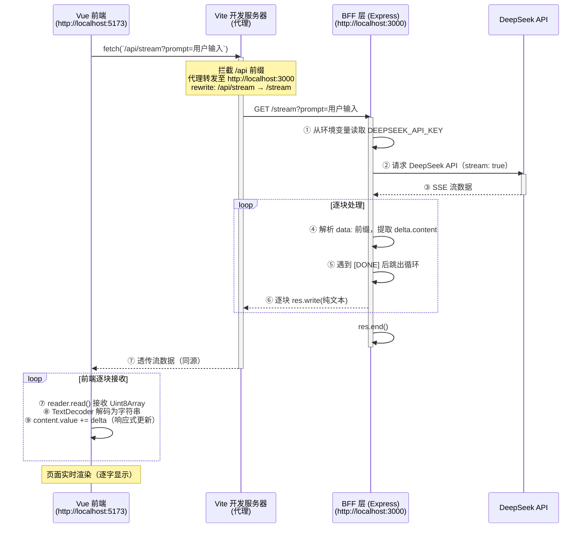

> 摘要：从 Vue3 + Vite 项目出发，拆解 BFF 层如何将 LLM 流式输出的复杂协议解析和安全隔离从前端移出，让前端代码保持极简与稳定。

## 从一个“藏着的”server.mjs 说起

打开一个 Vite 创建的 Vue3 项目，在根目录下有一个 `server.mjs` 文件。这个文件在项目的 `package.json` 中没有被显式引用，也没有被挂载到前端代码中。它就像是在前端项目中“藏着”的一个后端程序。

```javascript
console.log('我是一个在前端项目中藏着的bff程序')
```

这行输出揭示了一个事实：Vite 项目本质上是运行在 Node 环境中的工程化工具，因此它天然具备编写后端代码的能力。利用这一点，可以在同一个代码仓库中直接搭建 BFF（Backend for Frontend）层，而无需单独拆分一个后端服务项目。

BFF 即为前端服务的后端，它的核心职责是作为前端与后端微服务之间的中间层，对数据进行聚合、裁剪和转换，为前端提供更简洁的接口。

## BFF 层的两大核心价值：安全与降级

在流式对话场景下，BFF 层的价值尤为突出，主要体现在两个方面。

### 价值一：安全性隔离

调用 DeepSeek 等 LLM 服务需要在请求头中携带 API Key。如果在前端直接发起请求，API Key 会暴露在浏览器的网络请求中，任何人都可以通过 F12 开发者工具查看并窃取，从而导致账号被盗刷的风险。

在 BFF 架构中，API Key 只存在于后端环境变量中，前端代码完全不可见。`server.mjs` 中通过 `dotenv` 读取 `.env.local` 中的配置：

```javascript
dotenv.config({
  path: ['.env.local', '.env']
})
```

前端发起请求时无需携带任何敏感信息，由 BFF 层在服务端代为携带 API Key 调用 LLM 接口。

### 价值二：协议降级

LLM 服务通常使用 SSE（Server-Sent Events）协议进行流式输出，返回的数据格式如下：

```text
data: {"choices":[{"delta":{"content":"你"}}]}
data: {"choices":[{"delta":{"content":"好"}}]}
data: [DONE]
```

这种格式包含 `data:` 前缀、JSON 结构、结束标记 `[DONE]` 等多层协议要素。前端直接处理时，需要逐一剥离前缀、解析 JSON、判断结束标记。

BFF 层将这些复杂逻辑全部接管，将 SSE 协议转换为纯粹的文本流：

| 维度     | 上游协议 (LLM → BFF)                                | 下游协议 (BFF → 前端)             |
| :------- | :-------------------------------------------------- | :-------------------------------- |
| 格式     | SSE (含 `data:` 前缀、JSON、`[DONE]`)               | 纯文本流                          |
| 示例     | `data: {"choices": [{"delta": {"content": "你"}}]}` | "你"                              |
| 前端处理 | 需解析 `data: JSON.parse`、判断 `[DONE]`            | 仅需 `reader.read()` + 字符串拼接 |

协议变动只需修改 BFF，前端完全无感知。这种“协议适配层”的设计，使前端代码保持极简且稳定。

## Vite 开发服务器中的 BFF 实践

在 `server.mjs` 中，使用 Express 框架启动了一个独立的 HTTP 服务器，监听 3000 端口：

```javascript
import express from 'express'
const app = express()
const port = 3000

app.listen(3000, () => {
  console.log(`服务器在${port}端口启动了`)
})
```

这里需要区分两个端口的职责：

| 端口 | 服务             | 职责                           |
| :--- | :--------------- | :----------------------------- |
| 5173 | Vite 开发服务器  | 服务前端页面，提供 HMR 热更新  |
| 3000 | Express BFF 服务 | 接受前端请求，代理调用 LLM API |

两个服务进程需要同时运行：`npm run dev` 启动 Vite 服务，`node server.mjs` 启动 BFF 服务。

`server.mjs` 中定义了两个路由：

```javascript
app.get('/', (req, res) => {
  res.send('Hello World!')
})

app.get('/stream', async (req, res) => {
  // 流式输出逻辑
})
```

`/` 路由用于测试服务是否正常运行，`/stream` 路由是核心的流式接口。前端通过 `/stream` 路由传入 prompt 参数，BFF 层代为请求 LLM 服务。

## 流式输出的关键实现：从 SSE 到纯文本流

`/stream` 路由是 BFF 层最核心的部分，它接收前端传入的 prompt 参数，向 DeepSeek API 发起流式请求，并将响应以纯文本流的形式逐块推送给前端。

### 向 LLM 发起流式请求

向 DeepSeek API 发起请求时，在请求体中设置 `stream: true`：

```javascript
const { prompt, stream } = req.query
const isStream = stream === 'true'
const endpoint = 'https://api.deepseek.com/v1/chat/completions'

const response = await fetch(endpoint, {
  method: 'POST',
  headers: {
    'Content-Type': 'application/json',
    Authorization: `Bearer ${process.env.DEEPSEEK_API_KEY}`
  },
  body: JSON.stringify({
    model: process.env.DEEPSEEK_MODEL_FLASH,
    stream: isStream,
    messages: [{ role: 'user', content: prompt }]
  })
})
```

API Key 和模型名称从环境变量中读取，前端代码中完全不包含这些敏感信息。

### SSE 协议的解析过程

获取响应流后，通过 `response.body.getReader()` 逐块读取数据：

```javascript
const reader = response.body?.getReader()
const decode = new TextDecoder()
let buffer = ''
let done = false

while (!done) {
  const { value, done: doneReading } = await reader?.read()
  done = doneReading
  const chunk = buffer + decode.decode(value)
  buffer = ''
  const lines = chunk.split('\n').filter((line) => line.startsWith('data: '))
  // ...
}
```

每次读取到的 `value` 是 `Uint8Array` 类型，需要通过 `TextDecoder` 解码为字符串。解码后的文本按行拆分，只处理以 data: 开头的行，并剥离前缀：

```javascript
for (const line of lines) {
  const incoming = line.slice(6)
  if (incoming === '[DONE]') {
    done = true
    break
  }
  try {
    const data = JSON.parse(incoming)
    const delta = data.choices[0].delta.content
    if (data && delta) {
      res.write(delta)
    }
  } catch (e) {
    buffer = `data: ${incoming}`
  }
}
```

代码中有几个值得关注的细节：

- `line.slice(6)` ：`data:` 长度为 6，从第 6 个字符开始截取，得到纯 JSON 字符串
  \-`buffer` 变量：用于缓存不完整的行，因为流式读取是按块进行的，一个 `data:` 行可能被拆分到两个不同的 chunk 中，需要拼接处理后再解析
- `if (data && delta)` ：部分 chunk 可能不包含 content 字段（如只包含 role 或元数据），只有存在有效内容时才调用 `res.write()`

### `res.write` 与 `res.send` 的本质差异

在 Express 中，`res.send()` 和 `res.write()` 的行为有本质区别：

| 方法              | 行为                                 | 是否关闭连接              |
| :---------------- | :----------------------------------- | :------------------------ |
| `res.send(data)`  | 自动设置响应头、序列化数据、发送响应 | ✅ 自动调用 `res.end()`   |
| `res.write(data)` | 仅发送数据块，不关闭连接             | ❌ 需手动调用 `res.end()` |

两者之间的关系可以简化为：

```text
res.send(data) = res.write(data) + res.end()
```

流式响应需要完成三个步骤：

- 设置响应头：声明 `Content-Type: text/plain; charset=utf-8`（虽然代码中未显式设置，但 Express 默认行为与流式写入配合良好）
- 逐块推送数据：多次调用 `res.write(chunk)`
- 关闭连接：最后调用 `res.end()`

在 `server.mjs` 的实现中，每解析出一个 delta 就调用一次 `res.write(delta)`，循环结束后调用 `res.end()` 关闭连接。如果只写 `res.write()` 而忘记 `res.end()`，前端会一直等待连接关闭，导致页面持续加载。

### 业务结束与传输层关闭的分离

流结束的判断涉及两个层面的信号：

| 信号来源     | 表现形式       | 触发时机                                   | 由谁处理                                     |
| :----------- | :------------- | :----------------------------------------- | :------------------------------------------- |
| 业务结束标记 | `data: [DONE]` | LLM 服务端发送，表示内容已生成完毕         | BFF 后端捕获并跳出循环，不转发给前端         |
| 传输层关闭   | `done: true`   | BFF 执行 `res.end()` 后，底层 TCP 连接关闭 | 前端通过 `reader.read()` 接收 done，退出循环 |

在 BFF 的实现中，当解析到 `[DONE]` 标记时，只是将 done 变量置为 true 并跳出循环，`[DONE]` 本身不会被转发给前端。真正的连接关闭由 `res.end()` 触发。

这种设计遵循了一个重要原则：前端只需依赖原生的传输层 done 标志，无需理解 `[DONE]` 的业务含义。  这样做降低了业务逻辑与传输协议的耦合，LLM 服务如果更换结束标记的格式，只需要修改 BFF 层，前端代码完全不受影响。

## 两端解码职责的对称性

在 `server.mjs` 和 `App.vue` 中，都使用了 `TextDecoder` 将 `Uint8Array` 解码为字符串，但两者的用途截然不同：

| 层级     | 解码对象                     | 解码目的                   | 额外处理                               |
| :------- | :--------------------------- | :------------------------- | :------------------------------------- |
| BFF 后端 | DeepSeek 返回的 `Uint8Array` | 还原为文本，解析 SSE 协议  | 需 `JSON.parse()` 提取 `delta.content` |
| Vue 前端 | BFF 返回的 `Uint8Array`      | 还原为文本，直接拼接到页面 | 不需要任何 JSON 解析或协议处理         |

后端解码是为了解析复杂的协议结构，前端解码只是为了展示内容。下游的复杂度减少，是由上游（BFF）承担了更多职责换来的——这正是分层架构的本质特征。

## 跨域问题的 Vite 代理解决方案

在开发环境中，前端运行在 `http://localhost:5173`，BFF 服务运行在 `http://localhost:3000`，两者端口不同，构成跨域。如果前端直接请求 `http://localhost:3000/stream`，浏览器会触发同源策略限制。

Vite 的代理配置可以优雅地解决这个问题。在 vite.config.js 中：

```javascript
export default defineConfig({
  server: {
    proxy: {
      '/api': {
        target: 'http://localhost:3000',
        rewrite: path => path.replace(/^/api/, '')
      }
    }
  }
});
```

代理的工作流程：

- 前端将请求地址写为 `/api/stream`，请求的是同源（`http://localhost:5173`）下的资源，不触发跨域限制
- Vite 开发服务器拦截到以 `/api` 开头的请求，根据代理配置转发到 `http://localhost:3000`
- rewrite 将 `/api/stream` 重写为 `/stream`，去掉 `/api` 前缀
- BFF 服务接收到 `/stream` 路由的请求并处理

如果去掉 `rewrite` 配置，Vite 会将 `/api/stream` 原样转发到 `http://localhost:3000/api/stream`，而 BFF 服务并没有定义 `/api/stream` 路由，因此会返回 502 错误。

## 前端如何消费流式响应

`App.vue` 中的 `update` 函数展示了前端消费流式响应的完整逻辑：

```javascript
const update = async () => {
  const response = await fetch(`/api/stream?prompt=${question.value}&stream=${stream.value}`)
  const reader = response.body?.getReader()
  const decode = new TextDecoder()
  let done = false
  content.value = '思考中...'
  while (!done) {
    const { value, done: doneReading } = await reader.read()
    done = doneReading
    if (value) content.value += decode.decode(value)
  }
}
```

前端处理流程：

- 使用 `fetch` 发起请求，获取 `Response` 对象
- 通过 `response.body.getReader()` 获取 `ReadableStream` 的读取器
- 循环调用 `reader.read()`，每次返回 `{ value, done }`
- 每次读取到的 `value` 是 `Uint8Array`，通过 `TextDecoder` 解码为字符串
- 将解码后的文本拼接到 `content.value` 中，Vue 的响应式系统自动更新视图
- 当 `done` 为 `true` 时退出循环

`stream` 这个 checkbox 控制着是否启用流式输出。当 `stream.value` 为 `false` 时，DeepSeek API 会一次性返回完整结果而非流式，BFF 层仍然会以流式方式转发，但数据块会少很多。

对比前端直调 LLM 与经过 BFF 适配的处理方式：

| 维度               | 前端直调 LLM                                | 经过 BFF 适配                     |
| :----------------- | :------------------------------------------ | :-------------------------------- |
| 需处理的语法       | `data:` 前缀、`[DONE]`、JSON 解析、错误重试 | 只需 `reader.read()` + 字符串拼接 |
| API Key 暴露风险   | 高（暴露在浏览器端）                        | 低（仅在后端环境变量）            |
| 上游协议变更的影响 | 需同步修改前端代码                          | 仅需修改 BFF 层                   |
| 服务商切换成本     | 高（需重写前端逻辑）                        | 低（只需替换 BFF 中的 API 调用）  |

## 全链路数据流回顾

将整个数据流的走向串联起来：



## 互动讨论

### 💬 为什么不用 `res.json()` 接收流式响应？

`res.json()` 会等待完整响应体并尝试解析为合法 JSON。流式响应是分块纯文本，不是完整的 JSON，因此会抛出异常。流式场景必须使用 response.body.getReader() 逐块读取。

### 💬 `done` 是网络报文中的字段吗？

不是。`done` 是 `ReadableStream` 协议层的标志，表示“流已关闭”。它不是网络报文中的字段，也不是业务结束标记。业务结束标记（如 `[DONE]`）应在 BFF 后端处理，前端只依赖 done 退出循环。

### 💬 如果 DeepSeek API 返回的数据中 `delta.content` 为空怎么办？

在 DeepSeek 的流式响应中，部分 `chunk` 可能不包含 `content` 字段（例如只包含 `role` 或其他元数据）。解析逻辑中通过 `if (data && delta)` 进行判断，只有存在有效内容时才调用 `res.write()`，避免了向客户端写入空数据。

### 💬 生产环境中 Vite 代理还能用吗？

Vite 的代理仅在开发环境生效。生产环境通常会将前端静态文件和 BFF 服务部署在同一个域名下（通过 Nginx 反向代理），或者将 BFF 服务独立部署并通过网关统一路由。BFF 层的代码（如 `server.mjs`）在生产环境中会被部署为独立的 Node 服务。

### 💬 这种 BFF 方案适合所有流式场景吗？

这种 BFF 方案适用于需要对上游协议进行适配的场景。如果上游本身就是标准的纯文本流，BFF 可以简化为一层透传。核心收益在于将协议解析和安全隔离从前端移出，对于 LLM 类服务尤其有价值。
