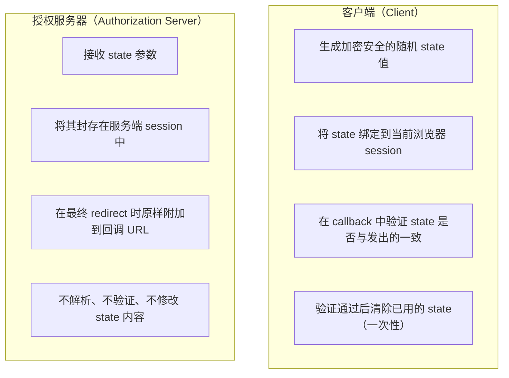
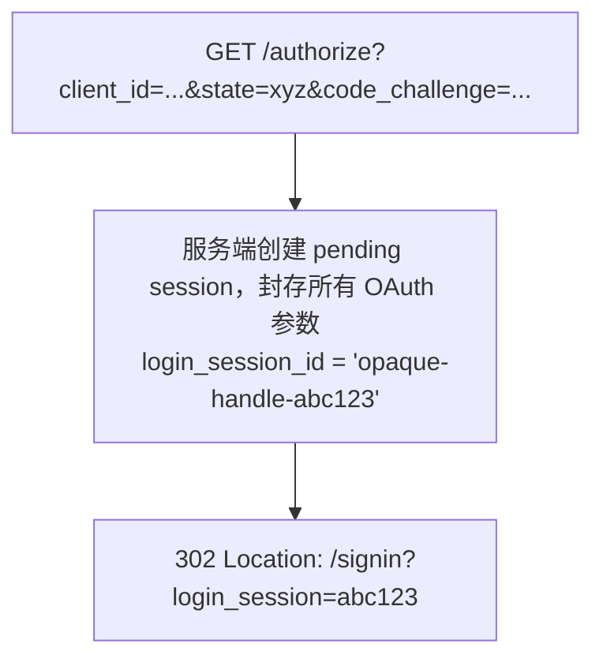
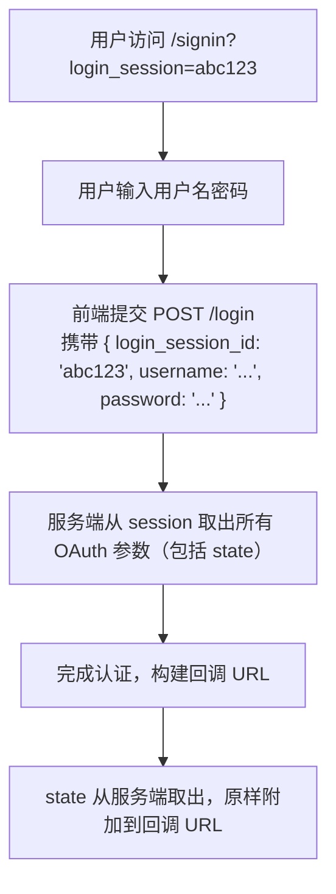
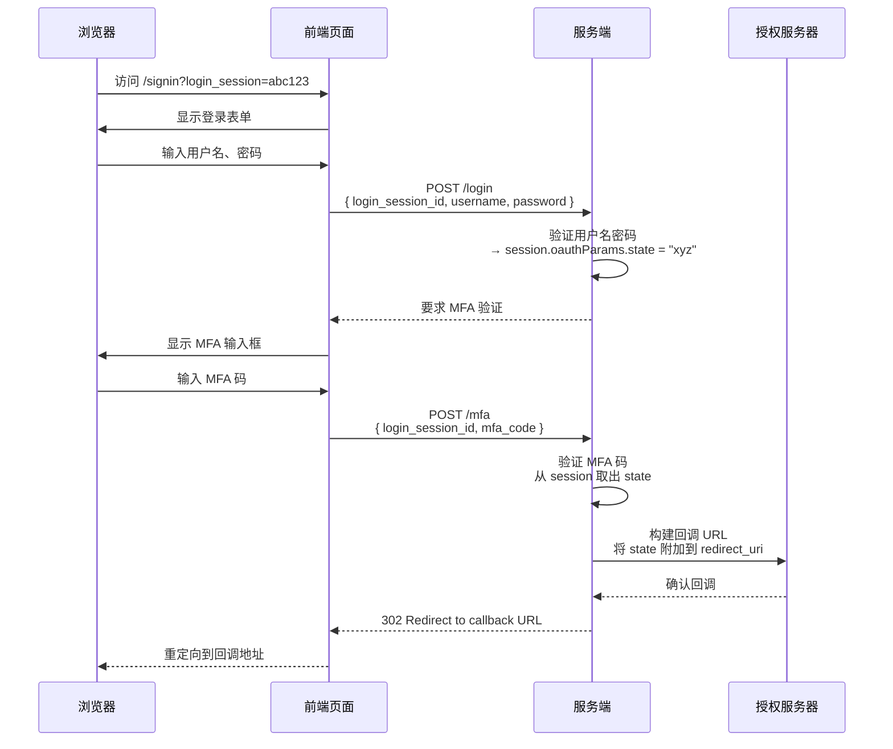

## state 存在的根本原因

理解 `state` 参数，必须先从它要解决的攻击场景出发。

### OAuth 场景下的 CSRF

OAuth 2.0 授权码流程的最后一步，是授权服务器将浏览器重定向到客户端的 callback 端点：

```bash
GET https://client.example.com/callback?code=SplxlOBeZ
```

攻击者可以构造如下攻击：

1. 攻击者用自己的账号发起 OAuth 授权，拿到一个 `code`
2. 攻击者中断流程，不让自己的浏览器完成 `callback`
3. 攻击者构造链接 `https://client.example.com/callback?code=<攻击者的code>`，诱骗受害者点击
4. 受害者的浏览器执行了这个 `callback`，客户端应用用该 `code` 换取 `token`
5. 结果：_受害者的账号被绑定到攻击者的身份_

这是 OAuth 场景下 CSRF 的经典形态。攻击者无需伪造请求，只需让受害者的浏览器执行一个"真实但错误归属"的回调。

`state` 的本质：将客户端发起的授权请求与最终收到的回调进行加密绑定，使攻击者注入的 `callback` 无法通过验证。

## RFC 6749 的规范原文与解读

### 核心定义（Section 4.1.1）

```txt
state
      RECOMMENDED.  An opaque value used by the client to maintain
      state between the request and callback.  The authorization
      server includes this value when redirecting the user-agent back
      to the client.  The parameter SHOULD be used for preventing
      cross-site request forgery as described in Section 10.12.
```

逐词解析：

- RECOMMENDED：语义上是"强烈建议"而非"强制"。但在任何面向公网的 OAuth 实现中，安全最佳实践要求将其视为强制
- opaque value：对授权服务器完全不透明。服务端不应解析其内容，不应修改，只负责原样回传
- used by the client：这是客户端的工具，不是授权服务器的工具。授权服务器只是搬运者

### 安全要求（Section 10.12）

```txt
The binding value MUST contain a non-guessable value, and the
user-agent's authenticated state (e.g., session cookie, HTML5
local storage) MUST be validated.
```

两个强制条件：

- `state` 值必须不可猜测（cryptographically random）
- 客户端必须在回调时验证 `state` 值

### 授权服务器的回传义务（Section 4.1.2）

```txt
state
      REQUIRED if the "state" parameter was present in the client
      authorization request.  The exact value received from the client.
```

一旦授权请求中携带了 `state`，响应中必须原样回传，且值不可改变。

## 职责划分：谁负责什么

`state` 的 安全性 由客户端与授权服务器共同承担，但职责边界清晰、互不越权：



这一边界的重要推论：_授权服务器永远不验证 state 的内容；客户端永远不依赖授权服务器来保证 state 的语义。_

## 完整流程中各环节的正确做法

### 阶段 1：客户端生成 state

```ts
// 生成加密安全的随机值（推荐 128 位以上的熵）
const stateValue = crypto.randomUUID()
// 或使用 base64url 编码的随机字节
const array = new Uint8Array(32)
crypto.getRandomValues(array)
const stateValue = btoa(String.fromCharCode(...array))
  .replace(/\+/g, '-')
  .replace(/\//g, '_')
  .replace(/=/g, '')

// 绑定到当前浏览器 session
sessionStorage.setItem('oauth_state', stateValue)

// 发起授权请求
const authUrl = new URL('https://auth.example.com/authorize')
authUrl.searchParams.set('response_type', 'code')
authUrl.searchParams.set('client_id', 'myapp')
authUrl.searchParams.set('redirect_uri', 'https://client.example.com/callback')
authUrl.searchParams.set('state', stateValue)
authUrl.searchParams.set('code_challenge', pkceChallenge)
authUrl.searchParams.set('code_challenge_method', 'S256')
window.location.href = authUrl.toString()
```

#### 为什么使用 sessionStorage 而非 localStorage？

`sessionStorage` 是标签页级别的隔离存储：关闭标签页即自动清除，且不同标签页之间相互隔离。localStorage 跨标签页共享，如果用户同时发起多个授权流程，`state` 会互相覆盖。更安全的做法是将 `state` 存入服务端 session（如果客户端有后端），彻底避免 前端 存储风险。

#### state 能携带应用状态吗？

可以，但必须满足安全约束。常见模式：

```ts
// 将随机 nonce 与应用状态组合
const state = JSON.stringify({
  nonce: crypto.randomUUID(), // 提供不可预测性，用于 CSRF 验证
  returnUrl: window.location.pathname // 登录后恢复的目标页面
})
sessionStorage.setItem('oauth_state', state)
```

约束条件：

- `state` 整体必须以随机 `nonce` 为核心保证其不可猜测性；
- 不得在 `state` 中携带敏感 信息 （state 会出现在 URL 和服务器日志中）；
- `state` 长度应有合理上限。

### 阶段 2：授权服务器接收并封存

`GET /authorize` 端点收到请求后，应立即将所有 OAuth 参数（包括 state）存入服务端 session，生成一个不透明的 `login_session_id`，后续登录流程通过这个 `handle` 传递，而非继续在 URL 中携带原始 OAuth 参数。



这样，state 从进入授权服务器的第一时刻起，就不再出现在任何 URL 或请求 body 中，直到最终构建回调 URL 时从服务端取出附加。

_这正是 Keycloak、Auth0、Okta 等主流 IdP 的标准做法_：Keycloak 将该 session handle 称为 `AUTH_SESSION_ID，Auth0` 将 OAuth 参数哈希后存入服务端 session。

### 阶段 3：登录页到登录接口

使用 session handle 方案后，登录页只持有一个不透明的标识符：



对比直接传递 state 的方案：

| 维度                        | state 通过 URL/body 传递 | login_session handle |
| :-------------------------- | :----------------------- | :------------------- |
| state 暴露在服务器日志中    | X 有风险                 | ✓ 无风险             |
| 依赖前端正确转发            | X 是                     | ✓ 否                 |
| 前端 bug 导致静默失效       | X 可能                   | ✓ 不可能             |
| 中间重定向时的健壮性        | X 脆弱                   | ✓ 健壮               |
| 多步骤流程（MFA等）的一致性 | X 需要特殊处理           | ✓ 天然一致           |

“静默失效"是最隐蔽的风险：如果前端代码遗漏了 state 的传递，后端构建的回调 URL 中不含 state，客户端收到没有 state 的回调时，若其验证逻辑是"有 state 才验证，没有就跳过”，CSRF 防护就被完全绕过——且整个过程中没有任何报错，行为看起来完全正常。

### 阶段 4：多步骤流程中的 state 保持

当认证流程需要多个步骤（如 MFA、外部 IdP 跳转、风险评估等）时，state 必须在服务端 session 中持久保存，贯穿整个流程：



每个中间步骤只交换服务端的 session handle，从不将 OAuth 参数（包括 state）重新暴露给前端。

## 阶段 5：最终回调——客户端验证 state

```ts
async function handleOAuthCallback() {
  const params = new URLSearchParams(window.location.search)
  const code = params.get('code')
  const returnedState = params.get('state')
  const error = params.get('error')

  // 先处理错误情况
  if (error) {
    handleOAuthError(error, params.get('error_description'))
    return
  }

  // 取出存储的 state
  const savedState = sessionStorage.getItem('oauth_state')

  // 严格验证：returnedState 必须存在且与 savedState 完全匹配
  if (!returnedState || !savedState || returnedState !== savedState) {
    sessionStorage.removeItem('oauth_state')
    // 记录安全事件，跳转到错误页
    reportSecurityEvent('state_mismatch')
    window.location.href = '/error?reason=state_mismatch'
    return
  }

  // 验证通过后立即清除——state 是一次性的
  sessionStorage.removeItem('oauth_state')

  // 继续用 code 换取 token
  await exchangeCodeForToken(code)
}
```

验证逻辑的常见错误：

```ts
// ❌ 错误 1：没有 state 时放行
if (returnedState && returnedState !== savedState) { throw ... }
// 攻击者只需构造不含 state 的 callback URL 即可完全绕过

// ❌ 错误 2：state 比较不严格
if (returnedState.includes(savedNonce)) { ... }
// 部分匹配可以被精心构造的值绕过

// ❌ 错误 3：使用 == 而非 ===（JavaScript 场景）
if (returnedState == savedState) { ... }
// 类型强制转换可能引入非预期行为

// ❌ 错误 4：state 使用后不清除
// 允许重放攻击：攻击者截获曾经用过的合法 callback，在新的 CSRF 攻击中重用
```

## state 与 PKCE 的关系与定位

PKCE（Proof Key for Code Exchange，RFC 7636）也是 OAuth 安全机制，但防护的是截然不同的攻击：

| 维度         | state                           | PKCE                               |
| :----------- | :------------------------------ | :--------------------------------- |
| **防护目标** | CSRF：攻击者注入伪造的 callback | 授权码拦截：攻击者截获 code 后使用 |
| **攻击入口** | 客户端的 callback 端点          | 授权服务器的 token 端点            |
| **验证方法** | 客户端验证（服务端不参与）      | 授权服务器验证（客户端发起）       |
| **存储位置** | 客户端的 sessionStorage/session | 授权服务器的 code store            |
| **绑定对象** | 将 callback 请求绑定到发起者    | 将 code 绑定到原始请求者           |

_两者不可互相替代，应当同时使用。_ 即使在已强制要求 PKCE 的场景下，RFC 9700（OAuth 2.0 Security Best Current Practice，2025 年发布）仍然明确推荐同时使用 `state` 进行 CSRF 防护，因为两者的防护维度是正交的。

一个直观的类比：PKCE 是在验证"这把钥匙是当初配的那把"，`state` 是在验证"开门的人就是当初配钥匙的人"。

## state 的合法扩展用途

### 恢复授权前的应用状态（最常见）

```ts
// 用户在访问受保护页面时触发 OAuth 授权
const state = JSON.stringify({
  nonce: crypto.randomUUID(),
  returnUrl: window.location.href // 认证成功后跳回原页面
})
sessionStorage.setItem('oauth_state', state)
```

```ts
// callback 中恢复
const { nonce, returnUrl } = JSON.parse(returnedState)
// 验证 nonce（CSRF 防护）
// 然后跳转到 returnUrl（体验优化）
```

### 多租户场景下的上下文传递

```ts
const state = JSON.stringify({
  nonce: crypto.randomUUID(),
  tenantHint: currentTenantDomain // 辅助授权服务器选择正确的认证域
})
```

### 防止重复授权

```ts
// 如果 state 已存在，说明授权流程正在进行中
if (sessionStorage.getItem('oauth_state')) {
  console.warn('Authorization already in progress')
  return
}
```

核心约束：无论 `state` 承载何种附加信息，其中的随机 `nonce` 部分必须保证足够的不可预测性（建议 128 位以上的熵）。state 不应包含敏感数据，因为它会出现在 URL、Referer Header 和服务器日志中。

## 常见实现缺陷与后果

### 缺陷 1：使用可预测的 state 值

```ts
// ❌ 用户 ID、时间戳、序列号——攻击者可预测
const state = userId
const state = Date.now().toString()
const state = 'oauth_' + Math.random() // Math.random() 不是加密安全的
```

后果：攻击者可以预测或枚举合法的 `state` 值，伪造有效的 `callback` 请求。

### 缺陷 2：state 泄露

```ts
// state 出现在 Referer Header 中
// 如果回调页面有任何外部资源（图片、脚本），state 可能通过 Referer 泄露
https://client.example.com/callback?state=xyz&code=...
  → 页面加载 https://cdn.external.com/analytics.js
  → Referer: https://client.example.com/callback?state=xyz&code=...
```

缓解：对 callback 页面使用 `Referrer-Policy: no-referrer` 或 `origin`；避免在 `callback` 页面加载第三方资源；使用 `state` 仅包含不透明随机值（而非有意义的数据）。

### 缺陷 3：state 绑定到错误的存储

```ts
// ❌ 绑定到 localStorage：跨标签页共享，并发流程互相干扰
localStorage.setItem('oauth_state', state)

// ❌ 绑定到内存变量：页面刷新后丢失
let oauthState = state

// ✓ 绑定到 sessionStorage：标签页隔离，刷新后保留
sessionStorage.setItem('oauth_state', state)

// ✓ 最安全：绑定到服务端 session（客户端有后端时）
await fetch('/api/session/save-oauth-state', { method: 'POST', body: JSON.stringify({ state }) })
```

### 缺陷 4：state 未做一次性处理

成功完成一次 OAuth 流程后，该 state 值应立即失效。如果允许相同的 state 再次通过验证，攻击者可以保存曾经截获的合法 callback URL，在未来发动重放攻击。

## 总结

state 参数是 OAuth 2.0 流程中一个看似简单却至关重要的安全机制。它的安全性不依赖于授权服务器的任何特殊处理，而是依赖于一个简洁的密码学原语：只有发起请求的那个浏览器 session 才能通过 state 验证。

这个机制要发挥作用，整条链路上每个环节都必须严格执行各自的职责：

- 客户端：用加密安全的随机值、绑定到正确的存储、严格验证、一次性清除
- 授权服务器：第一时间封存到服务端 session、贯穿整个认证流程、原样回传

任何一个环节的疏漏都可能导致整个 CSRF 防护机制失效——而这种失效往往是静默的：系统不会报错，用户不会察觉，安全日志上看起来是一次完全正常的认证。

这正是 state 参数最需要被严肃对待的原因。
