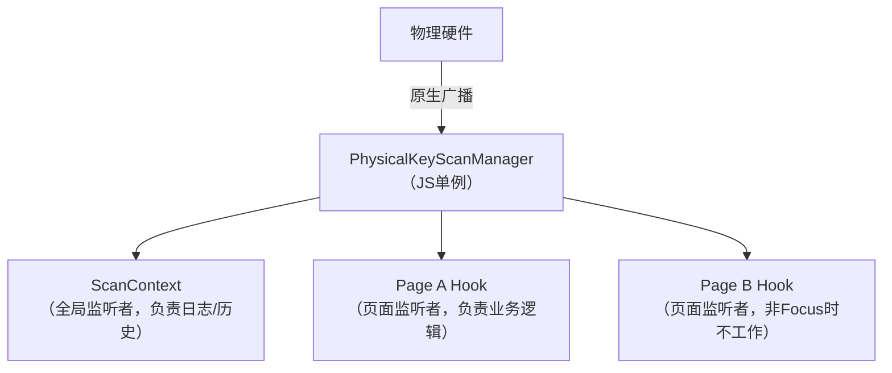

> 写给所有被 PDA 扫码折磨的开发者，以及未来的自己。
>
> 如果你正在开发 PDA（手持终端）应用，并且遇到了“全局监听和页面监听打架”、“扫码结果在这个页面能收到，在那个页面就收不到”的问题，或者对于“如何实现点击输入框直接扫码填入”感到困惑，那么这篇文章就是为你准备的。

## 核心痛点与问题重现

在开发仓库管理系统（WMS）或类似 PDA 应用时，物理扫码键是最常用的交互方式。我们通常面临以下挑战：

### 监听冲突（单播 vs 多播）

- 现象：一旦在业务页面注册了扫码监听，全局的日志记录就失效了；或者全局监听器把事件拦截了，业务页面收不到。

- 原因：原生的 `DeviceEventEmitter` 或简单的封装通常是“单播”模式，即“后来的覆盖先来的”。

### 上下文缺失

- 现象：在一个列表中，用户点击了第3行的“扫描”按钮，扫码后，代码却不知道这个码应该填入第3行还是第1行。

- 原因：扫码事件是全局的、异步的，回调触发时往往丢失了触发时的上下文信息。

### 资源管理焦虑

- 现象：担心在每个页面都初始化监听器会消耗大量资源，或者忘记移除监听导致内存泄漏。

- 原因：对底层硬件服务初始化和上层 JS 回调注册的区别认识不清。

## 解决方案：多播架构 (Multicast Architecture)

我们要实现的是一个 **“一处发声，八方响应”** 的广播系统。

### 架构图解



### 核心机制

- 底层单例：`PhysicalKeyScanManager` 负责维护一个 `Set<Function>` 集合，存储所有活跃的监听回调。
- 多播分发：收到原生扫码事件后，Manager 遍历集合，依次调用所有回调函数。
- 智能生命周期：利用 React Navigation 的 `useFocusEffect`，页面获得焦点时自动加入集合，失去焦点时自动退出集合。

## 关键知识点与实现细节

### 监听者管理（Listener Management）

- 全局监听者：在 `App.js` 启动时注册，生命周期伴随整个 App，永不销毁（除非杀进程）。
- 页面监听者：在进入页面时注册，离开页面时销毁。
- 数量关系：通常情况下，系统中有 _2个_ 活跃监听者（1个全局 + 1个当前页面）。这非常轻量，完全不用担心性能。

### 资源消耗真相

- 重资源：`ScanModule.initScan()`（硬件连接）。全局只做一次。
- 轻资源：`manager.startListening()`（JS回调注册）。页面级操作，仅仅是数组操作，零消耗。
- 结论：不要害怕在每个页面都使用 Hook，这正是设计初衷。

### 闭包陷阱与局部锁定

在 React Hooks 中，为了防止 `useEffect` 清理函数引用错误导致“僵尸监听器”（即组件卸载了但监听器还在，导致报错或重复执行），我们使用了*局部变量锁定*技巧：

```javascript
// ❌ 错误做法：依赖 ref.current，可能在清理时已变
return () => { if (unsubscribeRef.current) unsubscribeRef.current(); };

// ✅ 正确做法：利用闭包特性锁定当前周期的函数
let unsubscribe = manager.startListening(...);
return () => { if (unsubscribe) unsubscribe(); };
```

## 场景化使用指南 (Best Practices)

### 场景一：基础业务扫码（无感监听）

需求：用户进入页面，直接按 PDA 侧键扫码，页面做出响应（如弹窗、查询）。

```javascript
import usePhysicalKeyScan from '@/hooks/usePhysicalKeyScan'

const QueryPage = () => {
  usePhysicalKeyScan({
    onScan: (result) => {
      console.log('扫码内容:', result.code)
      doQuery(result.code)
    }
  })
  // ...
}
```

### 场景二：列表项/指定目标扫码（带上下文）

需求：点击列表某一项，然后扫码，将条码填入该项。

```javascript
import useContextualPhysicalKeyScan from '@/hooks/useContextualPhysicalKeyScan'

const ListPage = () => {
  const { setContext } = useContextualPhysicalKeyScan({
    onScan: (result, context) => {
      if (context) {
        updateItem(context.id, result.code)
      }
    }
  })

  return items.map((item) => (
    <TouchableOpacity onPress={() => setContext(item)}>
      <Text>{item.name}</Text>
    </TouchableOpacity>
  ))
}
```

### 场景三：输入框无感扫码 (Focus to Scan)

需求：用户点击哪个输入框，扫码结果就填入哪个输入框，无需额外点击按钮。

技巧：利用 `TextInput` 的 `onFocus` 事件设置上下文。

```javascript
;<TextInput
  placeholder="点我扫码"
  onFocus={() => setContext({ id: 'input_1', type: 'input' })}
/>

// 在回调中：
onScan: (result, context) => {
  if (context?.type === 'input') {
    setValue(context.id, result.code)
  }
}
```

### 场景四：纯观察模式 (Dashboard)

需求：我只想在页面上显示“最新一次扫码结果”，不需要处理业务逻辑。

```javascript
import { useScan } from '@/context/ScanContext'

const Dashboard = () => {
  // 直接从 Context 取值，不注册新监听器
  const { lastScanResult } = useScan()
  return <Text>最新: {lastScanResult?.code}</Text>
}
```

## 总结

| 模式       | 适用 Hook                      | 是否增加监听 | 适用场景               |
| :--------- | :----------------------------- | :----------- | :--------------------- |
| 业务响应   | `usePhysicalKeyScan`           | 是 (临时)    | 查询、入库、表单提交   |
| 上下文操作 | `useContextualPhysicalKeyScan` | 是 (临时)    | 列表操作、多输入框赋值 |
| 状态展示   | `useScan` (Context)            | 否           | 仪表盘、全局日志       |

这套方案完美平衡了灵活性（页面级控制）和稳定性（全局记录），是 PDA 应用开发的最佳实践。
