## 引言：Controller 是如何变成“屎山”的？

很多 Java 开发者在工作几年后，都会慢慢进入一种奇怪的状态：项目能跑，需求能做，Bug 也能修，但系统却越来越“重”。尤其是 Controller 层，一开始它只是纯洁地负责接收参数、调用 Service、返回结果，但随着业务不断复杂，越来越多原本不属于业务逻辑的代码开始疯狂侵入。

例如，一个最初非常简单的接口：

```Java
@PostMapping("/order")
public Result create(@RequestBody OrderDTO dto) {
    return orderService.create(dto);
}
```

后来，由于安全和审计需求，开始增加登录校验、权限控制、接口日志、参数解密、数据脱敏、统一异常处理、响应加密等逻辑。慢慢地，代码就会演变成这样：

```Java
@PostMapping("/pay")
public Result pay(@RequestBody String body) {
    // 1. 解密
    String json = AES.decrypt(body);
    // 2. 反序列化
    OrderDTO dto = JSON.parseObject(json);

    // 3. 权限校验
    checkPermission();

    long start = System.currentTimeMillis();
    try {
        // 4. 核心业务逻辑
        orderService.pay(dto);
        // 5. 业务日志
        log.info("pay success, user: {}", dto.getUserId());

        // 6. 响应加密
        return encrypt(Result.success());
    } catch (Exception e) {
        log.error("pay error", e);
        return Result.fail();
    }
}
```

最后，一个原本应该只关注“横向业务分发”的 Controller，却硬生生把自己逼成了同时承担安全、日志、异常、权限、协议转换等大量职责的“万能胶水”。很多人觉得这是代码规范问题，但实际上，真正的原因是开发者没有深刻理解 Spring 的分层设计思想。

理解 Spring 的关键，从来不是死记硬背多少个注解和 API，而是理解一次 HTTP 请求到底经历了什么，并在正确的阶段利用 Spring 提供的扩展点解决对应的问题。

## 核心大图：一次 HTTP 请求的完整生命周期

如果脑子里没有请求链路的全局观，你就会在开发时产生各种困惑：_为什么 Filter 拿不到 Controller 的方法注解？为什么 AOP 拿不到原始的密文 RequestBody？为什么 ResponseBodyAdvice 特别适合响应加密？_

仔细死磕下面这张请求链路全景图，很多迷茫都会瞬间通透：

```mermaid
flowchart TD
    A[客户端密文请求] --> B[Tomcat / Servlet 容器]
    B --> C[Filter 过滤器&#x3C;br>操作原始流/解密/Wrapper包装]
    C --> D[DispatcherServlet]

    subgraph SpringMVC 核心处理链路
        D --> E[Interceptor.preHandle&#x3C;br>权限校验/登录检查]
        E --> F[Validator&#x3C;br>JSR-303数据校验/参数合法性阻断]
        F --> G[HandlerMethodArgumentResolver&#x3C;br>定制参数解析/用户信息注入]
        G --> H[HttpMessageConverter&#x3C;br>读取包装后的明文流并反序列化]
    end

    subgraph SpringIOC / AOP 容器
        H --> I[AOP 前置通知&#x3C;br>SpEL动态权限/分布式锁]
        I --> J[Controller 业务方法]
        J --> K[AOP 后置/环绕通知]
    end

    K --> L[RestControllerAdvice&#x3C;br>触发 ResponseBodyAdvice 挂载]
    L --> M[ResponseBodyAdvice&#x3C;br>响应对象最后修改/加密包装]
    M --> N[HttpMessageConverter&#x3C;br>对象序列化为 JSON 并写入响应流]
    N --> O[Interceptor.afterCompletion&#x3C;br>请求销毁/资源释放/耗时统计]
    O --> P[客户端明文/密文响应]

    J -.->|抛出异常| X[RestControllerAdvice&#x3C;br>触发 ExceptionHandler]
    X --> Y[ExceptionResolver 异常解析]
    Y --> N
```



Spring 真正厉害的地方，是它在整个 HTTP 请求生命周期中，设计出了大量的纵深扩展点。下面我们以“接口全局自动加解密”为核心切入点，看看各层组件是如何各司其职的。

## Filter：Servlet 规范层，靠近底层 HTTP 流的守门员

Filter 属于 Servlet 规范层。这意味着它工作时，请求甚至还没有进入 SpringMVC，DispatcherServlet 还没开始打卡，Spring 根本不知道这个请求要访问哪个 Controller，参数更没有开始解析。

### 越靠近底层 HTTP 流，越适合做基础设施能力

因为 Filter 能够直接操作最原始的 HttpServletRequest 和 HttpServletResponse，所以它天然适合承担与具体业务无关的平台级能力：如 Token 核心校验、TraceId 注入、网关转发、XSS 过滤、限流、黑名单、以及 CORS 跨域。这也是为什么 SpringSecurity、Gateway、Shiro 等框架底层大量依赖 Filter 的原因。

### 为什么解密必须在 Filter 阶段做？

这是很多初学者做接口加密最容易踩的坑：发现 `request.getInputStream()` 读取一次之后，后续的 `@RequestBody` 就会报错提示“流已被关闭（Stream closed）”。

这是因为底层的 ServletInputStream 是单向不可逆的字节流，读取后无法回退。既然协议密文流只允许读取一次，那么“谁最先拿到 Body，谁就最适合处理解密”。答案只能是 Filter。

```Java
// 1. 实现一个流可重复读取的 Wrapper 包装类
import jakarta.servlet.ReadListener;
import jakarta.servlet.ServletInputStream;
import jakarta.servlet.http.HttpServletRequest;
import jakarta.servlet.http.HttpServletRequestWrapper;
import java.io.ByteArrayInputStream;
import java.io.IOException;

public class DecryptRequestWrapper extends HttpServletRequestWrapper {
    private final byte[] body; // 用于缓存解密后的明文数据

    public DecryptRequestWrapper(HttpServletRequest request, String decryptedBody) {
        super(request);
        this.body = decryptedBody.getBytes();
    }

    @Override
    public ServletInputStream getInputStream() throws IOException {
        final ByteArrayInputStream bais = new ByteArrayInputStream(body);
        return new ServletInputStream() {
            @Override
            public int read() throws IOException { return bais.read(); }
            @Override
            public boolean isFinished() { return bais.available() == 0; }
            @Override
            public boolean isReady() { return true; }
            @Override
            public void setReadListener(ReadListener readListener) {}
        };
    }
}
```

```Java
// 2. 在 Filter 中解密并替换 Request
import jakarta.servlet.*;
import jakarta.servlet.http.HttpServletRequest;
import org.springframework.util.StreamUtils;
import java.io.IOException;
import java.nio.charset.StandardCharsets;

public class ApiDecryptFilter implements Filter {
    @Override
    public void doFilter(ServletRequest request, ServletResponse response, FilterChain chain)
            throws IOException, ServletException {
        HttpServletRequest httpRequest = (HttpServletRequest) request;

        // 读取原始加密的 InputStream
        byte[] cipherBytes = StreamUtils.copyToByteArray(httpRequest.getInputStream());
        String cipherText = new String(cipherBytes, StandardCharsets.UTF_8);

        // 模拟 AES 解密逻辑（实际项目替换为你的工具类）
        String plainText = cipherText.replace("cipher_", "");

        // 用包装类锁住明文流，传递给后面的组件，后续组件（如 Jackson）将无感知读取明文
        DecryptRequestWrapper wrapper = new DecryptRequestWrapper(httpRequest, plainText);
        chain.doFilter(wrapper, response);
    }
}
```

> 💡 资深开发落地方案： 在 Filter 中读取到原始密文字节流后，通过 AES 解密出明文。随后，利用 Servlet 规范自带的 HttpServletRequestWrapper 重新包装 Request，重写 `getInputStream()` 方法将明文字节放回。这样，后续进入 SpringMVC 的所有组件（如 HttpMessageConverter）就能完美、无感知地读取到明文 JSON 了。

## Interceptor：SpringMVC 层，更懂业务的“接口控制器”

当请求越过 Filter 顺利进入 SpringMVC 之后，Interceptor（拦截器）正式接管。此时，HandlerMapping 已经匹配完成，Spring 明确知道当前请求要访问哪一个 Controller、哪一个 HandlerMethod。

```java
@Override
public boolean preHandle(HttpServletRequest request, HttpServletResponse response, Object handler) {
    // 此时可以直接强转为 HandlerMethod，获取方法上的注解和签名
    HandlerMethod method = (HandlerMethod) handler;
    LoginRequired anno = method.getMethodAnnotation(LoginRequired.class);
    return true;
}
```

### Interceptor 最适合做什么？

因为 Interceptor 已经可以读取到接口方法和自定义注解，所以它比 Filter 更“懂业务”，特别适合做：登录鉴权、接口 URL 级权限控制、接口幂等性校验、防刷限流、以及接口耗时统计。

### ⚠️ 为什么 Interceptor 绝对不适合做解密？

正如前文生命周期图所示，Interceptor 执行时，其实已经非常接近参数解析阶段了。如果你在 Interceptor.preHandle 里面贸然去读取 `request.getInputStream()` 尝试解密，由于没有像 Filter 那样进行全局 Wrapper 包装，直接就会导致后续进入 HttpMessageConverter 时 `@RequestBody` 反序列化失败。

- Filter 负责的是“HTTP 流的处理”
- Interceptor 负责的是“MVC 接口级别的控制”

```Java
import jakarta.servlet.http.HttpServletRequest;
import jakarta.servlet.http.HttpServletResponse;
import org.springframework.web.method.HandlerMethod;
import org.springframework.web.servlet.HandlerInterceptor;

public class LoginInterceptor implements HandlerInterceptor {
    @Override
    public boolean preHandle(HttpServletRequest request, HttpServletResponse response, Object handler) throws Exception {
        if (!(handler instanceof HandlerMethod)) { return true; }

        HandlerMethod handlerMethod = (HandlerMethod) handler;
        LoginRequired loginRequired = handlerMethod.getMethodAnnotation(LoginRequired.class);

        if (loginRequired != null) {
            String token = request.getHeader("Authorization");
            if (token == null || token.isEmpty()) {
                throw new RuntimeException("未登录，无权访问！"); // 抛出异常，直接由全局异常拦截
            }
            // 拦截器解析 Token 后，将核心用户 ID 暂存入 Request 域中
            request.setAttribute("current_user_id", "123456");
        }
        return true;
    }
}
```

## Validator：数据校验器，业务层前的“强力阻断盾”

数据进入业务层之前，必须确保其合法性（如手机号格式、邮箱、非空等）。虽然 AOP 也能做参数校验，但 Spring 内置的 JSR-303 / JSR-380 校验机制（Validator） 才是正统。

它在参数绑定阶段对注解（如 `@Validated`, `@NotNull`）进行拦截。如果不合法，会直接抛出 MethodArgumentNotValidException 阻断请求。它与全局异常处理配合，构成了 Java 经典的“数据校验-异常阻断”闭环。

```Java
public class OrderDTO {
    @NotNull(message = "商品ID不能为空")
    private Long productId;

    @Min(value = 1, message = "购买数量至少为1件")
    private Integer quantity;

    // getters/setters
}
```

## ArgumentResolver：参数解析器，实现 Controller 入参动态注入

很多开发习惯在 Interceptor 鉴权后，在 Controller 里手动通过 `request.getAttribute()` 获取用户信息。更优雅、更符合 Spring 范式的做法是：通过自定义注解和参数解析器 HandlerMethodArgumentResolver，让用户信息自动注入到 Controller 形参中。

### 声明自定义注解与上下文

```Java
@Target(ElementType.PARAMETER)
@Retention(RetentionPolicy.RUNTIME)
public @interface CurrentUser {}

public class UserContext {
    private final String userId;
    public UserContext(String userId) { this.userId = userId; }
    public String getUserId() { return userId; }
}
```

### 实现参数解析器

```Java
import org.springframework.core.MethodParameter;
import org.springframework.web.bind.support.WebDataBinderFactory;
import org.springframework.web.context.request.NativeWebRequest;
import org.springframework.web.method.support.HandlerMethodArgumentResolver;
import org.springframework.web.method.support.ModelAndViewContainer;

public class CurrentUserArgumentResolver implements HandlerMethodArgumentResolver {
    @Override
    public boolean supportsParameter(MethodParameter parameter) {
        // 检查参数是否带有 @CurrentUser 注解
        return parameter.hasParameterAnnotation(CurrentUser.class);
    }

    @Override
    public Object resolveArgument(MethodParameter parameter, ModelAndViewContainer mavContainer,
                                  NativeWebRequest webRequest, WebDataBinderFactory binderFactory) throws Exception {
        // 从 Request 域中无缝捞出刚才 Interceptor 存入的登录人信息
        String userId = (String) webRequest.getAttribute("current_user_id", NativeWebRequest.SCOPE_REQUEST);
        return new UserContext(userId); // 自动注入到 Controller 方法参数中
    }
}
```

## HttpMessageConverter：协议转换的核心枢纽

天天在写 `@RequestBody UserDTO dto` 的你，是否想过这个 DTO 是怎么凭空产生的？这背后其实是 SpringMVC 的协议转换层在默默奉献。

HttpMessageConverter（消息转换器）负责完成从 JSON 字符串 -> Java 对象（反序列化）以及 Java 对象 -> JSON 字符串（序列化）的蜕变。SpringMVC 会根据请求的 Content-Type 自动选择合适的 Converter（如针对 JSON 的 MappingJackson2HttpMessageConverter）。

## AOP + SpEL：动态表达式切面，方法级别的横切神器

必须明确一点：AOP 增强的是“Spring 容器中的 Bean 方法”，而不是“HTTP 请求”。

当 AOP 切面执行时，SpringMVC 早就把 HTTP 协议、入参字节流等处理完了，数据已经变成了 Controller 方法里的 Java 对象。

普通 AOP 只能做静态拦截，但如果结合 Spring 表达式语言（SpEL） ，你就可以在切面中动态解析方法入参的某个属性，从而实现大厂里非常经典的“动态数据级权限控制”或“租户隔离拦截”。

```Java
// 1. 自定义权限注解，支持 SpEL 表达式
@Target(ElementType.METHOD)
@Retention(RetentionPolicy.RUNTIME)
public @interface PreAuth {
    String value(); // 传入诸如 "#dto.tenantId" 的 SpEL 表达式
}
```

```Java
// 2. 结合 SpEL 动态解析的 AOP 切面
import org.aspectj.lang.ProceedingJoinPoint;
import org.aspectj.lang.annotation.*;
import org.aspectj.lang.reflect.MethodSignature;
import org.springframework.expression.ExpressionParser;
import org.springframework.expression.StandardEvaluationContext;
import org.springframework.expression.spel.standard.SpelExpressionParser;
import org.springframework.stereotype.Component;
import java.lang.reflect.Method;

@Aspect
@Component
public class AuthAspect {
    private final ExpressionParser parser = new SpelExpressionParser();

    @Around("@annotation(preAuth)")
    public Object doAround(ProceedingJoinPoint joinPoint, PreAuth preAuth) throws Throwable {
        // 使用 SpEL 解析方法入参
        Object[] args = joinPoint.getArgs();
        MethodSignature signature = (MethodSignature) joinPoint.getSignature();
        Method method = signature.getMethod();
        String[] parameterNames = signature.getParameterNames();

        // 将方法的形参名和入参值绑定到 SpEL 上下文中
        StandardEvaluationContext context = new StandardEvaluationContext();
        for (int i = 0; i < parameterNames.length; i++) {
            context.setVariable(parameterNames[i], args[i]);
        }

        // 解析出注解中写死的表达式（例如：从入参 dto 中动态拿到 tenantId）
        String tenantId = parser.parseExpression(preAuth.value()).getValue(context, String.class);

        // 模拟鉴权校验
        if (!"8888".equals(tenantId)) {
            throw new RuntimeException("非法操作：您无权操作该租户的数据！");
        }

        return joinPoint.proceed();
    }
}
```

## RestControllerAdvice 家族：掌控全局异常与响应体后置增强

当 Controller 执行完毕准备返回，或者遭遇不幸抛出异常时，就轮到全局增强家族 RestControllerAdvice 上场了。这里包含两个绝对的利器：

### 全局异常出口：@ExceptionHandler

在 Controller 里疯狂写 try-catch 是典型的屎山代码。将异常通通抛出，利用 `@RestControllerAdvice` 声明一个全局异常处理器统一捕获。让业务代码只关注业务，实现真正的职责分离。

```Java
@RestControllerAdvice
public class GlobalExceptionHandler {

    // 捕获 JSR-303 参数校验失败异常
    @ExceptionHandler(MethodArgumentNotValidException.class)
    public Result<?> handleValidException(MethodArgumentNotValidException e) {
        String msg = e.getBindingResult().getFieldError().getDefaultMessage();
        return Result.fail(400, msg);
    }

    // 捕获其余所有全局业务/系统异常
    @ExceptionHandler(Exception.class)
    public Result<?> handleException(Exception e) {
        return Result.fail(500, e.getMessage());
    }
}
```

### 响应体后置加工：ResponseBodyAdvice

很多开发者以为响应加密是在 Controller 返回对象后、由 AOP 拦截加密的。错！真正的响应加密利器是 ResponseBodyAdvice。

需要特别明确的是：ResponseBodyAdvice 并不是独立生效的，它必须配合 `@RestControllerAdvice` 注解挂载到 Spring 容器中。它工作在 Controller 执行完毕之后、但在 HttpMessageConverter 将对象正式序列化为 JSON 写回客户端之前。

```Java
@RestControllerAdvice
public class EncryptResponseAdvice implements ResponseBodyAdvice<Object> {

    @Override
    public boolean supports(MethodParameter returnType, Class converterType) {
        // 只有方法上带有自定义 @Encrypt 注解的接口才触发响应加密
        return returnType.hasMethodAnnotation(Encrypt.class);
    }

    @Override
    public Object beforeBodyWrite(Object body, MethodParameter returnType, ...) {
        // 此时拿到的 body 是 Controller 刚返回的明文 Result 对象
        if (body instanceof Result) {
            Result<?> result = (Result<?>) body;
            // 序列化后进行 AES 加密
            String jsonStr = JSON.toJSONString(result.getData());
            String encryptedData = AES.encrypt(jsonStr);

            // 返回加密后的新结构体，交由 Jackson 序列化输出给前端
            return Result.success(encryptedData);
        }
        return body;
    }
}
```

## 终极蜕变：被彻底解放的 Controller 层

经过上面一番优雅的分层解耦，不同职责的代码都在最适合它的请求生命周期阶段被处理完了。此时，回到我们的 Controller，原本臃肿的代码，蜕变成了最干净、最纯粹的艺术品：

```Java
@RestController
@RequestMapping("/order")
public class OrderController {

    @PostMapping("/pay")
    @LoginRequired                       // 1. 触发 Interceptor：登录鉴权
    @PreAuth("#dto.tenantId")            // 2. 触发 AOP+SpEL：动态跨租户数据鉴权
    @Encrypt                             // 3. 触发 ResponseBodyAdvice：全局响应自动加密
    public Result<OrderVO> pay(
            @Validated @RequestBody OrderDTO dto, // 4. 触发 Filter 自动解密，且通过 Validator 验证数据合法性
            @CurrentUser UserContext user         // 5. 触发 ArgumentResolver：自动注入当前登录人上下文
    ) {
        // 核心 Controller 极其干净，只关注一件事情：横向业务分发与调用
        OrderVO vo = orderService.pay(dto, user.getUserId());
        return Result.success(vo);                // 6. 如果中途发生任何异常，全局 ExceptionHandler 自动兜底
    }
}
```

## 总结：资深开发者的选型黄金法则

Filter、Interceptor、Converter、Advice、AOP，这些组件从来不是“谁替代谁”的关系。Spring 之所以设计这么多看起来很像的拦截/增强点，本质上就是在践行优秀架构的终极奥义：在正确的层，做正确的事情。

最后，为你总结一份大厂落地规约式的选型黄金法则，彻底告别架构混乱：

| 功能组件           | 作用域层级    | 能否拿到底层流       | 能否拿到方法签名 | 典型应用场景                                         |
| :----------------- | :------------ | :------------------- | :--------------- | :--------------------------------------------------- |
| Filter             | Servlet规范层 | 能                   | 不能             | 原生流操作、接口整体解密、CORS跨域、Traceld注入      |
| Interceptor        | SpringMVC层   | 不能（易导致流关闭） | 能               | 登录检查、URL级权限控制、接口耗时统计、防刷阻断      |
| Validator          | SpringMVC层   | 不能                 | 不能             | 入参数据合法性校验（非空、长度、数字范围等）         |
| ArgumentResolver   | SpringMVC层   | 不能                 | 能               | 控制层参数定制化注入（如自动将Token转为User对象）    |
| AOP + SpEL         | SpringIOC层   | 不能                 | 能（极详细）     | 声明式事务、分布式锁、基于业务入参字段的动态权限控制 |
| ResponseBodyAdvice | SpringMVC层   | 间接能               | 能               | 响应体最后加工、数据统一脱敏、全局返回对象自动加密   |
| ExceptionHandler   | SpringMVC层   | 不能                 | 能               | 全局异常出口兜底、统一错误码封装、消灭try-catch      |

架构的优雅，源于对生命周期的敬畏。理解了 Spring 的分层设计，你的代码才能真正做到“轻量、解耦、长久可维护”。
