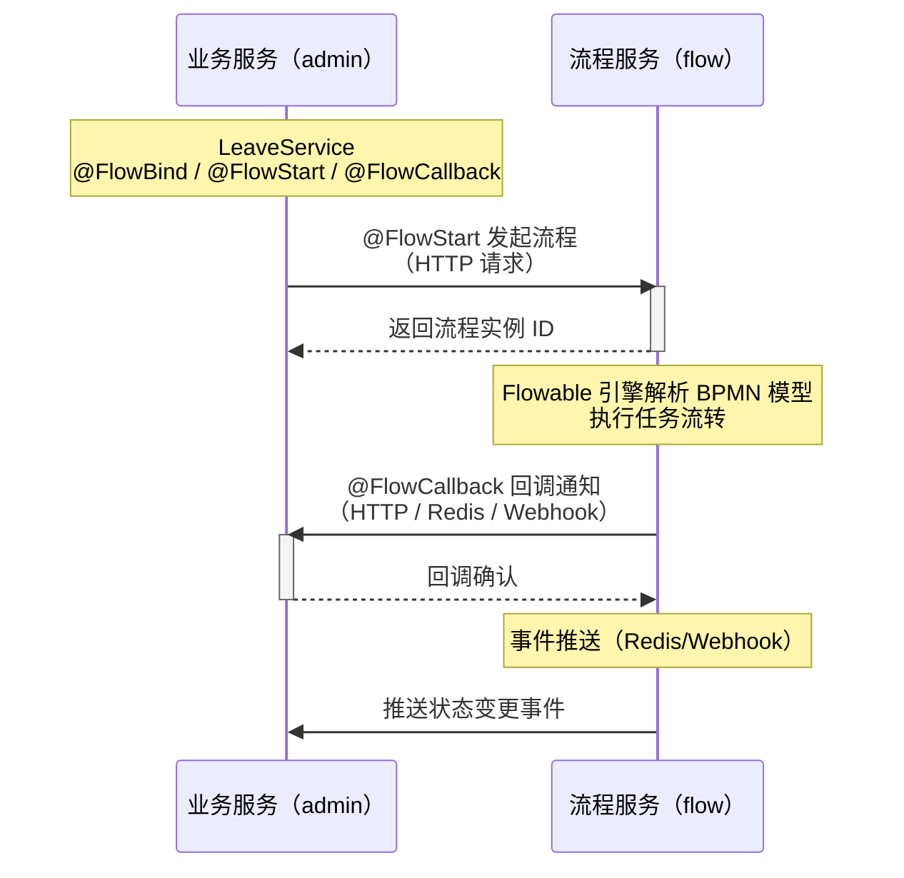

> 很多项目接 Flowable，最后写成了"Flowable 教程翻译"。这篇不翻译 Flowable 文档，只讲一件事：怎么在 Spring Boot 业务代码里，用最少的侵入接一个能跑的审批流程。

工作流引擎里 Flowable 用得最多，但很多团队接完后都有一个感受：_流程引擎和业务代码搅在一起，越写越乱_。

典型的乱象长这样：

```java
// 业务 Service 里手动调 Flowable RuntimeService
@Service
public class LeaveService {
    @Autowired
    private RuntimeService runtimeService;
    @Autowired
    private TaskService taskService;
    @Autowired
    private HistoryService historyService;

    public void submit(LeaveApply leave) {
        // 1. 存业务表
        leaveMapper.insert(leave);
        // 2. 手动发起流程
        Map<String, Object> vars = new HashMap<>();
        vars.put("days", leave.getDays());
        vars.put("applicant", leave.getUserId());
        ProcessInstance pi = runtimeService.startProcessInstanceByKey(
            "leave_process", "leave:" + leave.getId(), vars);
        // 3. 把 instanceId 存回业务表
        leave.setProcessInstanceId(pi.getId());
        leaveMapper.updateById(leave);
    }
}
```

问题在哪？

- 业务代码侵入流程引擎 API：`RuntimeService`、`TaskService` 散落在业务 Service 里
- 流程引擎和业务库耦合：如果流程引擎拆成独立服务，这些代码全要改
- 流程回调难写：流程结束后要更新业务状态，得写监听器、发事件、再处理
- 每个业务流程都要重复这一套：请假、报销、采购，每个 Service 都注入一遍 Flowable API

更好的做法是：_把流程引擎拆成独立服务，业务侧只用 3 个注解 + SpEL 就能接流程_。这篇就讲怎么用这套机制搭一个完整的请假审批流程。

## 整体架构：业务和流程引擎解耦

先看清楚流程架构，再看代码就不会懵：



关键点：

- 流程引擎是独立服务（mono-flow），不和业务服务混部署
- 业务侧不直接调 Flowable API，通过 FlowClient 发 HTTP 调流程服务
- 3 个注解搞定发起、绑定、回调，业务代码几乎无侵入
- SpEL 表达式传参，不用手动拼 Map

## 三个注解：流程接入的全部 API

整套机制的核心就三个注解，先记住它们的职责：

| 注解            | 位置   | 作用                               |
| :-------------- | :----- | :--------------------------------- |
| `@FlowBind`     | 类上   | 声明这个 Service 绑定哪个流程模型  |
| `@FlowStart`    | 方法上 | 方法执行成功后自动发起流程         |
| `@FlowCallback` | 方法上 | 流程事件回调（通过、驳回、取消等） |

就这三个。没有 RuntimeService，没有 TaskService，没有手动 startProcessInstanceByKey。

## 第一步：定义业务实体

先建一个请假申请实体，这就是普通业务表，和流程引擎无关：

```java
@Data
@TableName("biz_leave_apply")
public class LeaveApply {
    private Long id;
    private String applicantId;      // 申请人ID
    private String applicantName;    // 申请人姓名
    private Integer days;            // 请假天数
    private String reason;           // 请假原因
    private String status;           // 业务状态：PENDING/APPROVED/REJECTED
    private String processInstanceId;// 流程实例ID（可选，用于关联）
}
```

注意：业务表不需要包含任何 Flowable 的字段（`act_*` 那些表由流程引擎自己管）。业务表只存业务数据，流程数据在流程服务那边。

## 第二步：用 @FlowBind + @FlowStart 接入发起流程

这是最关键的一步。看完整代码：

```java
@FlowBind(modelKey = "leave_process", businessType = "leave")
@Service
public class LeaveService {

    @FlowStart(
        businessKeySpEl = "'leave:' + #leave.id",
        titleSpEl       = "#leave.applicantName + ' 的请假申请'",
        userIdSpEl      = "#leave.applicantId",
        userNameSpEl    = "#leave.applicantName",
        variablesSpEl   = "{'days': #leave.days, 'reason': #leave.reason}"
    )
    public LeaveApply submit(LeaveApply leave) {
        // 1. 存业务表 —— 这是你唯一的业务逻辑
        leaveMapper.insert(leave);
        leave.setStatus("PENDING");
        leaveMapper.updateById(leave);
        return leave;
        // 2. 流程发起由 @FlowStart 切面自动完成，不用写
    }
}
```

这段代码做了什么？

- `@FlowBind(modelKey = "leave_process")`：声明这个 Service 绑定 leave_process 流程模型
- `@FlowStart`：`submit()` 方法执行成功后，切面自动发起流程
- `businessKeySpEl = "'leave:' + #leave.id"`：业务唯一标识，用 SpEL 从参数取值
- `titleSpEl`：流程标题（审批人看到的标题）
- `userIdSpEl `/ `userNameSpEl`：发起人信息
- `variablesSpEl`：流程变量（天数、原因），审批节点可以用这些变量做条件判断

注意：`submit()` 方法里没有任何 Flowable API。  它只做业务的事——存数据。流程发起是切面在方法返回后自动做的。

### SpEL 上下文能取什么

`@FlowStart` 的所有 SpEL 表达式都能访问：

| 变量         | 含义                             |
| :----------- | :------------------------------- |
| `#参数名`    | 方法参数（按名称，如 `#leave` ） |
| `#p0`、`#p1` | 方法参数（按位置）               |
| `#result`    | 方法返回值                       |

这意味着你可以从业务对象里取任何字段，拼成流程标题、业务键、流程变量。不用手动 build Map。

## 第三步：用 @FlowCallback 接收流程结果

流程审批结束后，要更新业务状态（比如审批通过 → 改成 APPROVED）。用 `@FlowCallback`：

```java
@FlowBind(modelKey = "leave_process", businessType = "leave")
@Service
public class LeaveService {

    // ... 上面的 submit 方法

    @FlowCallback(on = {FlowCallback.ON_COMPLETED, FlowCallback.ON_REJECTED})
    public void onFlowResult(FlowEventContext ctx) {
        // 从流程事件上下文取业务键
        String businessKey = ctx.getBusinessKey();  // "leave:123"
        Long leaveId = Long.parseLong(businessKey.split(":")[1]);

        // 根据事件类型更新业务状态
        if (FlowCallback.ON_COMPLETED.equals(ctx.getEventType())) {
            leaveMapper.updateStatus(leaveId, "APPROVED");
        } else if (FlowCallback.ON_REJECTED.equals(ctx.getEventType())) {
            leaveMapper.updateStatus(leaveId, "REJECTED");
        }
    }
}
```

`@FlowCallback` 支持的事件类型：

| 常量              | 含义                       |
| :---------------- | :------------------------- |
| ON_COMPLETED      | 流程通过（全部审批完成）   |
| ON_REJECTED       | 流程驳回                   |
| ON_CANCELED       | 流程撤回/取消              |
| ON_TASK_CREATED   | 新待办产生（某节点待审批） |
| ON_TASK_COMPLETED | 某个审批节点处理完         |
| ON_TASK_ASSIGNED  | 任务分配/签收              |

### 回调怎么触发的？

流程服务通过 Redis Pub/Sub 或 Webhook 推事件，业务侧的 `FlowEventSubscriber` 自动路由到标了 `@FlowCallback` 的方法。不依赖流程引擎直连。

## 底层原理：FlowStartAspect 做了什么

如果你好奇"切面到底干了什么"，看一下 FlowStartAspect 的核心逻辑（源码精简版）：

```java
@Around("@annotation(flowStart)")
public Object around(ProceedingJoinPoint pjp, FlowStart flowStart) throws Throwable {
    // 1. 先执行业务方法
    Object result = pjp.proceed();

    // 2. 解析 modelKey（先取 @FlowStart，没有就取 @FlowBind）
    String modelKey = flowStart.modelKey();
    if (!StringUtils.hasText(modelKey)) {
        modelKey = resolveFlowBind(pjp).modelKey();
    }

    // 3. 构建 SpEL 上下文（方法参数 + 返回值）
    EvaluationContext ctx = buildSpelContext(pjp, result);

    // 4. 解析所有 SpEL 表达式
    String businessKey = eval(flowStart.businessKeySpEl(), ctx, String.class);
    String title       = eval(flowStart.titleSpEl(),       ctx, String.class);
    String userId      = eval(flowStart.userIdSpEl(),      ctx, String.class);
    Map<String, Object> variables = eval(flowStart.variablesSpEl(), ctx, Map.class);

    // 5. 通过 FlowClient 发 HTTP 调流程服务
    flowClient.startProcess(modelKey, businessKey, businessType,
                            title, variables, userId, userName, deptId, deptName);

    return result;
}
```

就 5 步：

- 业务方法先正常执行
- 解析流程模型 Key
- 用方法参数和返回值构建 SpEL 上下文
- 解析所有 SpEL 表达式，取出业务键、标题、变量
- 通过 FlowClient 发 HTTP 请求到流程服务，发起流程

业务方法完全不知道流程引擎的存在。它只管存数据，流程发起是切面在背后做的。

## 和传统 Flowable 接入对比

| 对比项       | 传统接入                            | Forge 注解接入                |
| :----------- | :---------------------------------- | :---------------------------- |
| 业务代码侵入 | 直接注入 RuntimeService             | 零侵入，只加注解              |
| 发起流程     | 手动 startProcessInstanceByKey      | `@FlowStart` 自动发起         |
| 传流程变量   | 手动 build Map                      | SpEL 表达式                   |
| 流程回调     | 写 ExecutionListener / TaskListener | `@FlowCallback` 注解          |
| 引擎耦合     | 业务和引擎同库                      | 引擎独立服务，HTTP 通信       |
| 换引擎       | 大面积改代码                        | 改 FlowClient 实现            |
| 新增流程     | 复制粘贴一套 Flowable API           | 加 `@FlowBind` + `@FlowStart` |

最大的区别是：_传统接入是"业务调流程引擎"，Forge 是"流程引擎服务化，业务通过注解声明流程意图"_。

## 流程模型在哪里配？

代码侧只管"发起和回调"，流程怎么流转（几级审批、谁来批、按什么条件走）是在后台可视化配的：

- 在"流程模型管理"里创建模型，Key `填 leave_process`
- 用 BPMN 设计器或钉钉风格审批流设计器画流程
- 配审批节点：部门主管 → 财务 → 老板（超 3 天才到老板）
- 配条件分支：`days > 3` 走老板审批，否则到主管就结束
- 发布模型

业务代码不用改。流程怎么走，全在模型配置里。今天改三级审批，明天改两级，后台拖一下就行。

## 几个实操要点

### businessKey 一定要唯一

`businessKeySpEl` 是流程实例和业务数据的关联纽带。建议用 _"业务类型:" + 业务ID_ 的格式，比如 _"leave:123"_。回调时靠它反查业务数据。

### 流程变量要提前想好

`variablesSpEl` 里传的变量，流程模型里的条件分支会用到。比如 `days` 这个变量，流程里会判断 `days > 3` 决定走哪条线。变量名要和模型里一致。

### 回调要做幂等

@FlowCallback 可能因为网络重试被调多次。更新业务状态时要做幂等：

```java
@FlowCallback(on = FlowCallback.ON_COMPLETED)
public void onCompleted(FlowEventContext ctx) {
    LeaveApply leave = leaveMapper.selectById(extractId(ctx));
    if ("APPROVED".equals(leave.getStatus())) {
        return; // 已经处理过，跳过
    }
    leaveMapper.updateStatus(leave.getId(), "APPROVED");
}
```

### skipOnError 默认 true

`@FlowStart` 有个 `skipOnError` 属性，默认 true：业务方法抛异常时不发起流程。这很合理——数据都没存成功，不该发起流程。如果你希望即使业务异常也发起（少见），设成 false。

### 流程服务和业务服务要能互通

`forge-flow-client` 通过 HTTP 调流程服务，配置好地址：

```yml
forge:
  flow:
    client:
      url: http://localhost:8581 # 流程服务地址
```

事件回调走 Redis Pub/Sub 或 Webhook，确保两边能通信。

## 总结：3 个注解替代一堆 Flowable API

| 你想做的事   | 传统写法                                        | Forge 写法                               |
| :----------- | :---------------------------------------------- | :--------------------------------------- |
| 绑定流程模型 | 硬编码 modelKey                                 | `@FlowBind(modelKey="leave_process")`    |
| 发起流程     | `runtimeService.startProcessInstanceByKey(...)` | `@FlowStart(businessKeySpEl=...)`        |
| 传流程变量   | 手动 build Map                                  | `variablesSpEl = {"days": #leave.days}"` |
| 接收审批结果 | 写 Listener                                     | `@FlowCallback(on=ON_COMPLETED)`         |
| 接收驳回     | 写 Listener                                     | `@FlowCallback(on=ON_REJECTED)`          |

不是说 Flowable 的 API 没用，而是业务代码不该直接碰流程引擎 API。把流程引擎服务化、把接入注解化，业务代码才能干净、可维护、可移植。
请假、报销、采购、合同——每个业务流程接进来，都是加 `@FlowBind` + `@FlowStart` + `@FlowCallback` 这三行注解的事。这才是工作流该有的接入方式。
