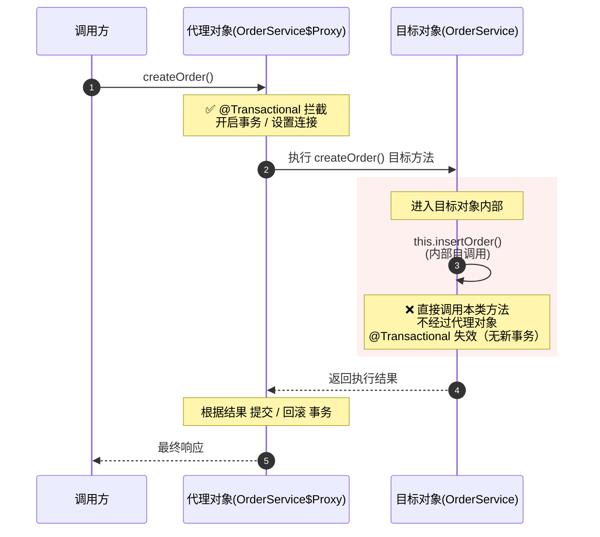

> Spring 事务失效是我项目中踩过最多的坑之一。这篇把所有失效场景和解决方案一次性讲透，建议收藏。

## 前言

Spring 声明式事务用起来很简单——一个 `@Transactional` 注解搞定。但真到了生产环境，你会发现它在某些场景下"悄无声息"地失效了，数据不一致的 bug 极其难排查。

Spring 事务失效的根本原因只有一句话：_Spring 事务基于 AOP 代理实现，只要代理没生效，事务就会失效_。

理解了这句话，下面 6 大场景都能推导出来。

## 自调用问题（最常见，踩坑率 90%）

### 场景复现

```java
@Service
public class OrderService {

    public void createOrder() {
        // 直接通过 this 调用，绕过了代理对象
        this.insertOrder();
    }

    @Transactional(rollbackFor = Exception.class)
    public void insertOrder() {
        orderMapper.insert(order);
        inventoryMapper.deduct(order.getProductId());
        // 如果这里抛异常，insertOrder 的事务不会回滚！
    }
}
```

### 失效原因

Spring AOP 通过代理对象拦截方法调用来管理事务。当 `createOrder()` 调用 `this.insertOrder()` 时，this 是目标对象本身，不是代理对象，所以 `@Transactional` 注解不会被拦截。

用一张图理解：



### 解决方案

#### 方案 1：拆分到另一个 Service（推荐）

```java
@Service
public class OrderService {

    @Autowired
    private OrderTxService orderTxService;

    public void createOrder() {
        orderTxService.insertOrder(); // 通过代理调用 ✅
    }
}

@Service
public class OrderTxService {
    @Transactional(rollbackFor = Exception.class)
    public void insertOrder() {
        orderMapper.insert(order);
        inventoryMapper.deduct(order.getProductId());
    }
}
```

#### 方案 2：通过 AopContext 获取代理对象

```java
@Service
public class OrderService {

    public void createOrder() {
        // 通过代理对象调用 ✅
        ((OrderService) AopContext.currentProxy()).insertOrder();
    }

    @Transactional(rollbackFor = Exception.class)
    public void insertOrder() {
        // ...
    }
}
```

注意：方案 2 需要在启动类上加 `@EnableAspectJAutoProxy(exposeProxy = true)`。

## 方法访问权限非 public

### 场景复现

```java
@Service
public class OrderService {

    @Transactional(rollbackFor = Exception.class)
    void insertOrder() {  // 包级私有，事务失效
        // ...
    }
}
```

### 失效原因

- JDK 动态代理：基于接口实现，只能代理接口中定义的方法（public）。
- CGLIB 代理：基于继承生成子类，`private`、`final`、`static` 方法无法被重写。

Spring 在 `AbstractFallbackTransactionAttributeSource#computeTransactionAttribute` 中明确判断：

```java
if (allowPublicMethodsOnly() &&
    !Modifier.isPublic(method.getModifiers())) {
    return null; // 非 public 方法，直接返回 null，不应用事务
}
```

### 解决方案

将 `@Transactional` 方法改为 `public`。如果不想暴露，可以拆到内部 Service 中。

## 异常被吞或异常类型不匹配

这是最隐蔽的坑，因为代码不会报错，但事务就是不回滚。

### 异常被 catch 吞掉

```java
@Transactional(rollbackFor = Exception.class)
public void insertOrder() {
    try {
        orderMapper.insert(order);
        inventoryMapper.deduct(order.getProductId()); // 这里抛异常
    } catch (Exception e) {
        log.error("下单失败", e);
        // 异常被吞了！事务管理器感知不到异常，不会回滚
    }
}
```

解决：`catch` 之后要重新抛出，或者手动标记回滚。

```java
@Transactional(rollbackFor = Exception.class)
public void insertOrder() {
    try {
        orderMapper.insert(order);
        inventoryMapper.deduct(order.getProductId());
    } catch (Exception e) {
        log.error("下单失败", e);
        throw e; // 重新抛出 ✅
        // 或者：TransactionAspectSupport.currentTransactionStatus().setRollbackOnly();
    }
}
```

### 抛出 checked 异常但未指定 rollbackFor

```java
@Transactional // 默认只回滚 RuntimeException 和 Error
public void insertOrder() throws Exception {
    orderMapper.insert(order);
    if (stockNotEnough) {
        throw new Exception("库存不足"); // checked 异常，默认不回滚！
    }
}
```

原因：Spring 默认只对 `RuntimeException` 和 `Error` 回滚。Exception 是 `checked` 异常，不在默认回滚范围。

解决：

```java
@Transactional(rollbackFor = Exception.class) // 指定回滚异常 ✅
public void insertOrder() throws Exception {
    // ...
}
```

最佳实践：永远加上 `rollbackFor = Exception.class`，不要依赖默认行为。

## 数据库存储引擎不支持事务

### 场景复现

```sql
CREATE TABLE orders (
    id BIGINT PRIMARY KEY,
    order_no VARCHAR(32),
    amount DECIMAL(10, 2)
) ENGINE=MyISAM;  -- MyISAM 不支持事务
```

### 失效原因

`@Transactional` 底层依赖数据库的事务机制。MySQL 的 MyISAM 引擎不支持事务，即使 Spring 正确开启了事务，数据库层面也无法回滚。

### 解决方案

使用 InnoDB 引擎（MySQL 5.5+ 默认已是 InnoDB）：

```ini
ALTER TABLE orders ENGINE=InnoDB;
```

在一些老项目中，或者 DBA 建表时习惯用 MyISAM，需要特别注意。

## 类未被 Spring 管理

### 场景复现

```java
// 没有 @Service / @Component
public class OrderService {

    @Transactional(rollbackFor = Exception.class)
    public void insertOrder() {
        // 事务失效，因为 OrderService 不是 Spring Bean
    }
}
```

### 失效原因

`@Transactional` 是 Spring 的注解，只有被 Spring 容器管理的 Bean 才会被 AOP 代理拦截。如果一个类没有被 Spring 管理，它就不会被代理，注解自然无效。

### 解决方案

```java
@Service  // 或 @Component
public class OrderService {
    @Transactional(rollbackFor = Exception.class)
    public void insertOrder() {
        // ...
    }
}
```

这类问题常出现在：手动 `new` 对象、使用 `@Bean` 但方法返回的不是代理类等场景。

## 多线程场景

### 场景复现

```java
@Transactional(rollbackFor = Exception.class)
public void createOrder() {
    orderMapper.insert(order);

    new Thread(() -> {
        // 新线程中的数据库操作不在事务中！
        inventoryMapper.deduct(order.getProductId());
    }).start();

    // 如果主线程回滚，子线程的操作不会回滚
}
```

### 失效原因

Spring 事务管理器通过 `ThreadLocal` 将事务信息（Connection、事务状态等）绑定到当前线程。新起的线程无法访问父线程的 ThreadLocal，所以无法加入同一事务。

### 解决方案

多线程事务是一个复杂问题，常见方案：

- 拆分事务：子线程内独立管理事务（`@Transactional` + 独立的 Service 方法）
- 编程式事务：使用 `TransactionTemplate` 手动控制
- 分布式事务：如果必须保证一致性，考虑 `Seata` 等分布式事务方案

```java
// 方案 1：子线程独立事务
@Transactional(rollbackFor = Exception.class)
public void createOrder() {
    orderMapper.insert(order);
    // 子线程内通过独立 Service 方法开启自己的事务
    executorService.submit(() -> inventoryTxService.deduct(order.getProductId()));
}

```

## 传播行为导致事务"失效"

严格来说这不是 bug，而是配置不当导致行为与预期不符：

| 传播行为        | 行为                           | 可能导致的问题               |
| :-------------- | :----------------------------- | :--------------------------- |
| `NOT_SUPPORTED` | 以非事务方式执行               | 如果当前有事务，挂起当前事务 |
| `NEVER`         | 如果存在事务则抛异常           | 直接报错                     |
| `SUPPORTS`      | 有事务就加入，没有就非事务执行 | 无事务时不回滚               |

```java
@Transactional(propagation = Propagation.NOT_SUPPORTED)
public void queryOrder() {
    // 以非事务方式执行，不参与外层事务
}
```

查询方法用 `NOT_SUPPORTED` 是合理的，但如果误用到写操作上就会出问题。

## 总结

| #   | 失效场景              | 根本原因                   | 解决方案                                      |
| :-- | :-------------------- | :------------------------- | :-------------------------------------------- |
| 1   | 自调用                | this 调用绕过代理          | 拆分 Service 或用 `AopContext.currentProxy()` |
| 2   | 方法非 public         | 代理无法拦截非 public 方法 | 改为 public                                   |
| 3   | 异常被吞 / 类型不匹配 | 事务管理器感知不到异常     | 重新抛出 + `rollbackFor = Exception.class`    |
| 4   | 存储引擎不支持        | MyISAM 无事务能力          | 使用 InnoDB                                   |
| 5   | 未被 Spring 管理      | 不是 Bean，不会被代理      | 加 `@Service` / `@Component`                  |
| 6   | 多线程                | ThreadLocal 无法跨线程     | 子线程独立事务或分布式事务                    |

记住一句话就够了：Spring 事务基于 AOP 代理，代理没生效，事务就失效。
