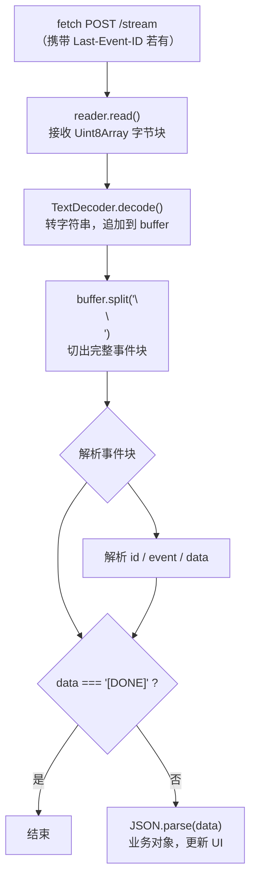
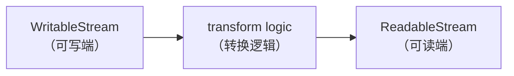

大模型时代，前端要面对的一个绕不开的问题是：怎么把后端"逐字吐出来"的内容，实时地、不卡顿地呈现给用户。这篇文章按时间线梳理三套方案——`EventSource`、`fetch + ReadableStream`、`TransformStream`——它们不是互相替代的关系，而是一个解决上一个的痛点、同时引入新问题的演进过程。

## 流式响应要解决什么

`SSE`（Server-Sent Events）的核心思路很朴素：服务端在建立连接后不立刻关闭，而是像水管一样持续地往外写数据，直到主动关闭。落到实现上，无非三步：

- 服务端：声明这是一个流（特殊响应头）→ 分批写数据（`res.write()`）→ 结束传输（`res.end()`）

- 客户端：建立连接 → 持续接收 → 处理结束信号

三套方案的差异，本质上都是"客户端怎么接收、怎么解析"这一层的差异。

## 第一站：EventSource——最省心的方案

SSE 协议本身很简单，规定数据必须以 `字段: 值\n` 的形式发送，每条消息以两个换行符 `\n\n` 结尾：

```typescript
const writeSSE = (res: ServerResponse, data: unknown, id?: number, event?: string): void => {
  if (id !== undefined) res.write(`id: ${id}\n`)
  if (event) res.write(`event: ${event}\n`)
  for (const line of String(data).split('\n')) {
    res.write(`data: ${line}\n`)
  }
  res.write('\n')
}
```

服务端还要设置特殊响应头，告诉浏览器"这不是一个普通网页，是持续的数据流"：

```javascript
function setSSEHeaders(res: ServerResponse): void {
  res.writeHead(200, {
    "Content-Type": "text/event-stream; charset=utf-8",
    "Cache-Control": "no-cache, no-transform",
    Connection: "keep-alive",
    "X-Accel-Buffering": "no", // 给 nginx 用的
  });
  res.flushHeaders?.();
}
```

客户端这边，浏览器原生的 EventSource 把协议解析、连接管理全包了，业务代码只需要监听几个事件：

```ts
const eventSource = new EventSource('/stream')

eventSource.onmessage = (event) => {
  contentDiv.textContent += event.data
}

eventSource.addEventListener('done', (event) => {
  eventSource.close() // 主动关闭，防止它再次重连
})

eventSource.onerror = (error) => {
  console.log('连接发生错误或断开，浏览器会自动尝试重连...', error)
}
```

EventSource 最值钱的一个特性是断线自动重连 + 断点续传，而且全部内置，业务代码什么都不用做：

- 服务端每条消息带一个 `id:`（比如 `id: 15`）
- 网络断开，浏览器触发 `onerror`，但底层会自动重新发起请求
- 重连请求会自动带上 `Last-Event-ID: 15` 这个头
- 服务端读到这个 ID，算出 offset，从第 16 个字接着发
- 用户完全无感知，文字继续往后蹦

另外，SSE 规定 `:` 开头的行是注释，专门留给心跳用——EventSource 在协议层直接跳过这类行，不会触发 `onmessage`，Network 面板的 EventStream 视图里也看不到它们：

```ts
const heartbeat = setInterval(() => {
  if (!close) res.write(': heartbeat\n\n')
}, 1500)
```

但 EventSource 有一个硬限制：只支持 GET。 不能带自定义 body，请求头也很受限。一旦你的接口需要 POST（比如把一大段 prompt 当 body 传给后端），EventSource 就用不上了。这就是下一站的起点。

## 第二站：fetch + ReadableStream——用 POST 重新实现 SSE

既然 EventSource 干不了 POST，那就只能自己用 `fetch` 把它的能力重新造一遍。这一步要补的东西不少，原来浏览器帮你做的，现在全要手写。

### 重连循环

EventSource 的自动重连，得用一个 `while` 死循环模拟：

```javascript
while (!stopped) {
  try {
    const res = await fetch(url, { ... });
    // ... 读取数据 ...
    return; // 服务端正常结束，直接退出
  } catch (err) {
    if (retryCount >= MAX_RETRY) return;
    retryCount++;
    await new Promise((r) => setTimeout(r, 3000)); // 等 3 秒后重试
  }
}
```

只要 try 块里因为网络中断抛出异常，就进 catch，等一会儿再发起下一轮 fetch。

### 断点续传

`Last-Event-ID` 的逻辑也要手动接管：解析数据时记下最后一条消息的 `id`，下次重连时塞进请求头。

```ts
let lastEventId: string | null = null;
// fetch 的 headers 里：
headers: lastEventId ? { "Last-Event-ID": lastEventId } : {},
```

### 流式读取与解码

fetch 默认会等所有数据下载完才返回，要拿到流式效果，得用 `res.body!.getReader()`：

```ts
const reader = res.body!.getReader()
const decoder = new TextDecoder()
let buffer = ''

while (true) {
  const { done, value } = await reader.read() // 每次只读到网络层刚到的一小块二进制
  if (done) break
  buffer += decoder.decode(value, { stream: true }) // 转文本，追加到缓冲区
}
```

这里 TextDecoder 必须传 `{ stream: true }`：一个汉字在 UTF-8 里占 3 字节，网络分片时很可能被切在中间，`stream: true` 会让解码器记住上次没解完的字节，等下一块来了再拼。

### 缓冲区切片解析

网络传输的边界是不确定的，后端发两次 `data: A\n\n`，前端收到的可能是粘在一起的 `data: A\n\ndata: A\n\n`。所以要用 buffer 暂存、按 `\n\n` 切：

```ts
const parts = buffer.split('\n\n')
buffer = parts.pop()! // 最后一段可能是半条消息，留到下次拼完整
```

为什么要 `pop()`？因为最后一段可能只是 `data:` 正在输，还没遇到 `\n\n`，强行当成完整消息处理就会出错。

切出完整的 `parts` 之后，再按行拆 `event:` / `data:` / `id:`：

```ts
for (const line of part.split('\n')) {
  if (line.startsWith('event:')) eventName = line.slice(6).trim()
  else if (line.startsWith('data:')) data += line.slice(5).trim()
  else if (line.startsWith('id:')) id = line.slice(3).trim()
}
```

整条链路画出来是这样：



这套代码能跑，但有个明显的坏味道：解码、分帧、解析、业务消费这四件事全堆在同一个 `for await`/`while` 循环里，逻辑一旦复杂起来就会迅速膨胀，也没法单独测试某一步。这是促成第三站的直接原因。

### 一个绕不开的小麻烦：ReadableStream 不能 `for await`

手写 `reader.read()` 的 `while` 循环写起来很啰嗦：

```ts
const reader = stream.getReader()
try {
  while (true) {
    const { done, value } = await reader.read()
    if (done) break
    // 处理 value
  }
} finally {
  reader.releaseLock()
}
```

很自然地会想用 `for await (const x of stream)` 替代，但浏览器里的 `ReadableStream` 没有实现 `Symbol.asyncIterator`，原生不支持这种写法。解决办法是包一层 `polyfill`，把 `ReadableStream` 转成标准的 `AsyncIterable`：

```typescript
if (!ReadableStream.prototype[Symbol.asyncIterator]) {
  ;(ReadableStream.prototype as any)[Symbol.asyncIterator] = async function* () {
    const reader = this.getReader()
    try {
      while (true) {
        const { value, done } = await reader.read()
        if (done) break
        yield value
      }
    } finally {
      reader.releaseLock()
    }
  }
}
```

打上这层之后，`for await (const value of stream)` 就能用了，代码干净很多。

这里有个细节值得记住：`getReader()` 会给流加锁，同一时间只能有一个 `reader` 在读。读完了（`done` 为 `true`）或者中途异常退出，都必须调用 `releaseLock()`，否则这个流会永远锁死，没人能再读它（比如想 `cancel()` 或者重新拿一个 `reader`）。`finally` 块保证了无论是正常结束还是异常退出，锁都一定会被释放。

## 第三站：TransformStream——把管道拆成流水线

第二站留下的问题是：解码、分帧、解析、消费四件事粘在一起。TransformStream 的思路就是把这四件事拆成四个独立的阶段，每个阶段只做一件事，再用 `pipeThrough` 串起来。

### 基本概念

Web Streams API 提供三种基础对象：`ReadableStream`、`WritableStream`，以及连接两者的 `TransformStream`。它同时拥有一个可写端（`writable`）和一个可读端（`readable`），数据写进去、经过转换、从另一端读出来：



构造时传入一个 Transformer，关键方法只有两个：

```javascript
new TransformStream<Input, Output>({
  transform(chunk: Input, controller) {
    controller.enqueue(someOutput); // 转换后推出去，也可以不推（过滤），或推多个（拆分）
  },
  flush(controller) {
    // 上游关闭时调用，处理末尾残留
  },
});
```

最重要的特性是可以链接成管道：

```ts
source.pipeThrough(new TextDecoderStream()).pipeThrough(new SSEFrameStream()).pipeThrough(new SSEEventParser())
```

`pipeThrough` 返回的还是 `ReadableStream`，可以一直链下去，链的末端用 `pipeTo(writableStream)` 收尾，整条管道跑完会 `resolve` 一个 `Promise<void>`。

### 服务端管道：四段流水线

服务端的职责是把业务数据转成合规的 `SSE` 帧，写进 `http.ServerResponse`。拆成四段：

```ts
await createSSEMessageStream({ req, res, requestId, shouldFail, offset })
  .pipeThrough(createSSEMessageTransformer()) // SourceChunk → SSEMessage
  .pipeThrough(createSSEEncoder()) // SSEMessage → string（SSE 帧文本）
  .pipeThrough(new TextEncoderStream()) // string → Uint8Array
  .pipeTo(createNodeResponseSink(res)) // 写入 ServerResponse
```

起点是 `createSSEMessageStream`，纯业务数据源，用 `new ReadableStream({ start(controller) {...} })` 构造，在 `start` 里异步推数据，类型上区分心跳注释、业务 payload、终止信号：

```ts
type SourceChunk =
  { kind: 'comment'; comment: string } | { kind: 'event'; payload: SSEPayload | '[DONE]'; id?: number; event?: string }
```

这一步完全不掺 SSE 格式细节，只管业务语义。值得留意的是它的 `cancel` 钩子：

```ts
cancel() {
  closed = true;
  if (heartbeat) clearInterval(heartbeat);
}
```

下游被取消（比如客户端断开）时，`cancel` 会自动被调用，心跳定时器随之清理——这是管道机制自动传播取消信号的体现，比旧版本手动监听 `req.on("close")` 干净得多。

第二段 `createSSEMessageTransformer` 把 `SourceChunk` 统一成 `SSEMessage`；第三段 `createSSEEncoder` 把 `SSEMessage` 拼成符合规范的文本帧，要注意多行 `data` 的处理——SSE 协议要求每行单独加 `data:` 前缀：

```ts
for (const line of message.data.split('\n')) {
  frame += `data: ${line}\n`
}
```

第四段先用内置的 `TextEncoderStream` 把字符串转成 `Uint8Array`，再用 `createNodeResponseSink` 写进 `http.ServerResponse`：

```javascript
function createNodeResponseSink(res: http.ServerResponse): WritableStream<Uint8Array> {
  return new WritableStream({
    async write(chunk) {
      if (res.destroyed) return;
      if (res.write(chunk)) return; // 返回 true：缓冲区未满，继续
      await new Promise<void>((resolve, reject) => {
        res.once("drain", resolve); // 缓冲区满了，等 drain
        res.once("error", reject);
        res.once("close", resolve);
      });
    },
    close() {
      if (!res.writableEnded && !res.destroyed) res.end();
    },
    abort() {
      if (!res.destroyed) res.destroy();
    },
  });
}
```

这里的 `drain` 处理正是背压机制的关键：`Node.js` 的 `res.write()` 返回 `false` 时，说明内核 TCP 缓冲区满了，`await drain` 让管道暂停写入，等缓冲区腾出空间再继续——write 返回 `Promise` 时，上游会自动暂停推数据，不需要手动协调生产速度和写入速度。

### 客户端管道：方向相反的镜像

客户端的职责正好相反，把字节流还原成业务对象：

```ts
const eventStream: ReadableStream<ParsedSSEMessage> = res
  .body!.pipeThrough(new TextDecoderStream()) // Uint8Array → string
  .pipeThrough(makeSSEFrameTransformer()) // string → SSE 帧字符串
  .pipeThrough(makeSSEEventParser()) // SSE 帧 → SSEEvent 对象
  .pipeThrough(makeSSEPayloadParser()) // SSEEvent → ParsedSSEMessage

for await (const { eventName, id, payload } of eventStream) {
  // 只剩业务逻辑
}
```

`makeSSEFrameTransformer` 按 `\n\n` 切帧，逻辑和第二站里手写的 `buffer` 切片一样，但单独封装成了一个可复用、可单测的阶段：

```typescript
function makeSSEFrameTransformer(): TransformStream<string, string> {
  let buffer = ''
  return new TransformStream({
    transform(chunk, controller) {
      buffer += chunk.replace(/\r\n/g, '\n') // 兼容 CRLF
      const parts = buffer.split('\n\n')
      buffer = parts.pop() ?? ''
      for (const part of parts) {
        if (part !== '') controller.enqueue(part)
      }
    },
    flush(controller) {
      if (buffer !== '') controller.enqueue(buffer) // 流结束时补发残留
    }
  })
}
```

`flush` 是很容易漏掉的一个细节：如果服务端最后一帧没以 `\n\n` 结尾就关闭了连接，`buffer` 里剩下的内容会在 `flush` 里被补发出去,而不是无声丢弃。

`makeSSEEventParser` 解析 `event:` / `data:` / `id:` 字段，多行 `data` 用数组收集再 `join("\n")`，和服务端 `split("\n")` 形成对称；`makeSSEPayloadParser` 做最后的 `JSON.parse`，和服务端的 `JSON.stringify` 对称。两端代码读起来几乎是镜子关系：


## 拆成管道之后多赚到的三件事

- 背压自动传播：服务端 `write` 返回 `Promise` 时，整条管道自动暂停，上游 `await sleep()` 不会继续推数据，不需要手动协调生产/消费速度。
- 取消信号自动传播：客户端断开连接时，`sink` 的 `abort` 被调用，信号沿管道向上传播，最终触发数据源的 `cancel`，心跳定时器自动清理；`pipeTo` 返回的 `Promise` 也会随之 `reject`，被外层 `catch` 接住。
- 每段独立可测：`createSSEEncoder` 可以单独喂一个 `SSEMessage` 验证输出格式；`makeSSEFrameTransformer` 可以单独喂跨块的碎片数据验证 `buffer` 拼接和 `flush` 逻辑。不需要起一个完整服务才能验证某一段。

## 三站对比，怎么选

| 特性          | EventSource                     | fetch+ReadableStream                     | +TransformStream                                     |
| :------------ | :------------------------------ | :--------------------------------------- | :--------------------------------------------------- |
| 请求方法      | 仅 GET                          | 任意（含 POST）                          | 任意                                                 |
| 自动重连/续传 | 浏览器原生内置                  | 手写 `while` 循环 + `Last-Event-ID`      | 同左，但解析逻辑被拆分                               |
| 解析逻辑      | 浏览器内部，不可见              | 手写，全堆在一个循环里                   | 拆成多个可组合、可单测的阶段                         |
| 背压          | 不需要关心                      | 不需要关心（消费端读多快算多）           | 服务端写入侧需要，writableStream 自动处理            |
| 适用场景      | 简单只读推送、不需要自定义 body | 需要 POST、需要自定义 header，逻辑不复杂 | 同需要 POST，但解析/编码逻辑会持续演进、需要长期维护 |

简单说：能用 EventSource 就优先用它,代码量最小；一旦要 POST,只能上 fetch + ReadableStream;如果手写的解析逻辑开始变得难以维护、想要每一步都能单独测试，再用 TransformStream 把它拆成流水线。三者不是谁淘汰谁,而是随着需求复杂度递增逐步引入的工具。

> 补一句题外话：以上所有例子里 `SSEPayload` 的 JSON 结构（`delta` / `start` / `stop` 这种 type 字段区分）都只是一种约定，SSE 协议本身只规定了 `data:` 这一层的文本格式，`data:` 里面装什么 JSON 形状完全由你自己定义：

```ts
type DeltaPayload = { type: 'delta'; index: number; content: string }
type StartPayload = { type: 'start'; id: string }
type StopPayload = { type: 'stop'; reason: string; totalTokens: number }
```

只要客户端的 `makeSSEPayloadParser`（或者手写解析逻辑）和服务端的编码逻辑约定一致，这套 `type` 字段怎么设计、要不要加字段，都是业务自由。
