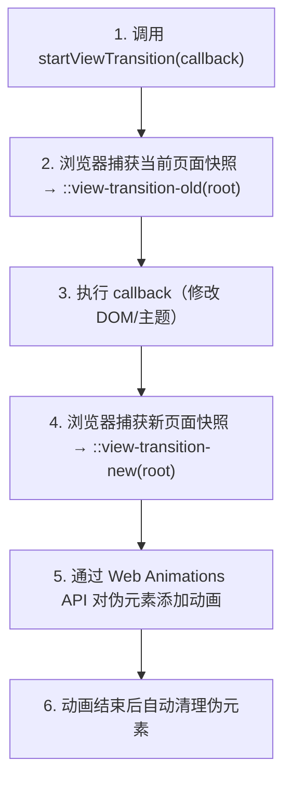
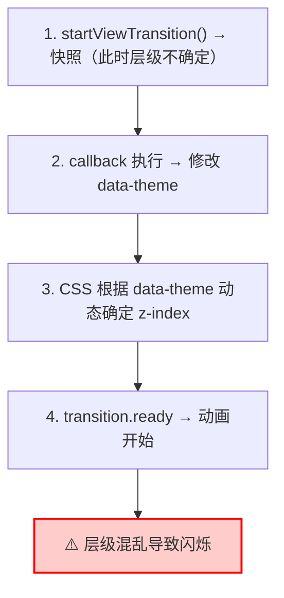
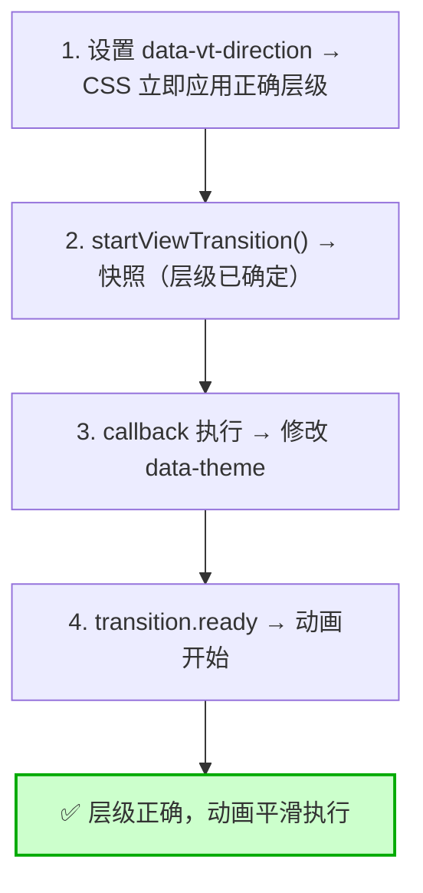
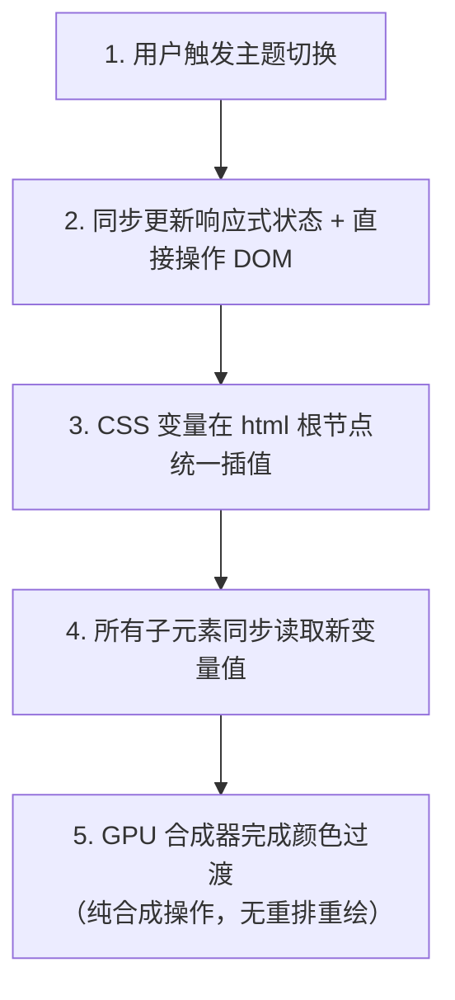
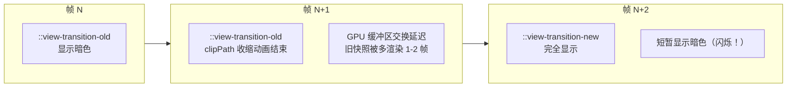
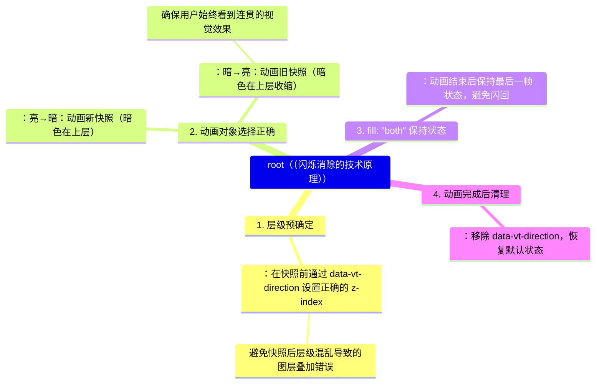

## 核心实现方案概览

代码实现了两种主题切换模式，适用于不同场景需求：

| 模式     | 核心技术                       | 视觉效果          | 闪烁风险  | 适用场景           |
| :------- | :----------------------------- | :---------------- | :-------- | :----------------- |
| 动画模式 | View Transition API + 时序优化 | 圆形扩散/收缩动画 | ✅ 已解决 | 演示项目、个人网站 |
| 瞬切模式 | 根节点统一过渡                 | 平滑颜色渐变      | ✅ 零闪烁 | 生产环境、企业应用 |

## 方案一：View Transition API 圆形扩散动画

### 核心思路

View Transition API 的工作原理：



### 核心代码实现

```javascript
const setThemeAnimated = (newTheme: Theme, event: MouseEvent) => {
  if (!document.startViewTransition) {
    setTheme(newTheme);
    return;
  }

  const x = event.clientX;
  const y = event.clientY;
  const endRadius = Math.hypot(
    Math.max(x, window.innerWidth - x),
    Math.max(y, window.innerHeight - y),
  );

  const isToDark = newTheme === "dark";
  const direction = isToDark ? "to-dark" : "to-light";

  // ★★★ 关键优化：在快照前设置方向标志 ★★★
  // 确保浏览器捕获快照时 z-index 层级已经正确配置
  document.documentElement.setAttribute("data-vt-direction", direction);

  const transition = document.startViewTransition(() => {
    setTheme(newTheme);
  });

  transition.ready.then(() => {
    const clipPath = [
      `circle(0px at ${x}px ${y}px)`,
      `circle(${endRadius}px at ${x}px ${y}px)`,
    ];

    const animation = document.documentElement.animate(
      {
        // 亮→暗：扩散（新快照从点击位置展开）
        // 暗→亮：收缩（旧快照向点击位置收缩）
        clipPath: isToDark ? clipPath : [...clipPath].reverse(),
      },
      {
        duration: 400,
        easing: "ease-in",
        fill: "both",
        pseudoElement: isToDark
          ? "::view-transition-new(root)"  // 亮→暗：动画新快照
          : "::view-transition-old(root)", // 暗→亮：动画旧快照
      },
    );

    // 动画完成后清理方向标志
    animation.finished.then(() => {
      document.documentElement.removeAttribute("data-vt-direction");
    });

    return animation.finished;
  });
};
```

### 闪烁问题根源与解决方案

#### 🔍 问题根源

传统实现的时序问题：



当 `::view-transition-old` 的 `clipPath` 收缩动画结束时，浏览器合成器需要将旧快照从 GPU 纹理中移除。由于 VSync 信号对齐或 GPU 缓冲区交换延迟，旧快照可能被多渲染 1-2 帧，导致短暂的闪烁。

#### ✅ 解决方案：时序优化

优化后时序：



核心思想：通过独立的 `data-vt-direction` 属性，在快照前就确定好图层关系，避免因 `data-theme` 延迟更新导致的层级混乱。

### CSS 动态层级控制

```css
// 默认状态
::view-transition-old(root),
::view-transition-new(root) {
  animation: none;
  mix-blend-mode: normal;
}

::view-transition-old(root) {
  z-index: 1;
}
::view-transition-new(root) {
  z-index: 9999;
}

// 亮→暗：新快照（暗色）在上层扩散
html[data-vt-direction="to-dark"]::view-transition-old(root) {
  z-index: 1;
}
html[data-vt-direction='to-dark']::view-transition-new(root) {
  z-index: 9999;
}

// 暗→亮：旧快照（暗色）在上层收缩
html[data-vt-direction="to-light"]::view-transition-old(root) {
  z-index: 9999;
}
html[data-vt-direction='to-light']::view-transition-new(root) {
  z-index: 1;
}
```

| 切换方向 | 动画对象                      | z-index | 效果                   |
| :------- | :---------------------------- | :------ | :--------------------- |
| 亮→暗    | `::view-transition-new(root)` | 9999    | 暗色从点击位置向外扩散 |
| 暗→亮    | `::view-transition-old(root)` | 9999    | 暗色向点击位置收缩消失 |

## 方案二：瞬切模式（零闪烁）

### 核心思路

参考 VitePress/VueUse 的实现，直接操作 DOM，避免响应式状态延迟：



### 为什么不会闪烁？

三大核心保障：

| 保障             | 原理                                       | 效果                     |
| :--------------- | :----------------------------------------- | :----------------------- |
| 无快照机制       | 浏览器不需要截取旧页面纹理                 | 从根本消灭交接失败可能性 |
| 纯合成器线程执行 | background-color/color 过渡在 GPU 层面插值 | 不占用主线程，动画丝滑   |
| 无重排重绘       | CSS 变量变化不触发 Layout/Paint            | 性能开销几乎为零         |

### 关键代码实现

TypeScript 部分（同步更新）：

```ts
const setThemeInstant = (newTheme: Theme) => {
  if (!document.startViewTransition) {
    setTheme(newTheme)
    return
  }

  // 使用 View Transition 但不添加自定义动画
  const transition = document.startViewTransition(() => {
    setTheme(newTheme)
  })

  transition.finished.then(() => {
    // 清理工作
  })
}

// 设置主题的核心方法
export const setTheme = (newTheme: Theme) => {
  theme.value = newTheme
  document.documentElement.setAttribute('data-theme', newTheme)
  localStorage.setItem('theme-preference', newTheme)
}
```

CSS 部分（根节点统一过渡）：

```css
// 根节点：唯一执行颜色过渡的地方
html {
  transition:
    background-color 0.15s ease,
    color 0.15s ease;
}

// 强制所有子元素禁止独立过渡，直接继承根节点的计算结果
*, 
*::before, 
*::after {
  transition: none !important;
}
```

同步原理：当子元素没有 `transition` 时，它们会在每一帧直接读取 CSS 变量的当前插值结果。由于变量是在 `html` 上统一计算的，所有子元素拿到的是同一个中间值，从而实现了像素级的同步。

## 两种方案对比

| 维度       | View Transition 动画模式   | 根节点统一过渡（瞬切） |
| :--------- | :------------------------- | :--------------------- |
| 视觉效果   | 炫酷圆形扩散/收缩动画      | 0.15s 平滑渐变过渡     |
| 闪烁风险   | ✅ 已解决                  | ✅ 零闪烁              |
| 性能开销   | 较高（快照+伪元素+动画）   | 极低（纯合成器操作）   |
| 浏览器兼容 | Chrome/Edge 111+           | 全浏览器支持           |
| 无障碍友好 | ❌ 可能引起前庭不适        | ✅ 友好                |
| 代码复杂度 | 较高（需处理方向/z-index） | 较低                   |
| 适用场景   | 演示项目、个人网站         | 生产环境、企业应用     |

## 闪烁问题深度剖析

### 闪烁现象的技术本质

暗色→亮色切换时的问题时序（传统方案）：



### 尝试过的修复方案（均无法 100% 解决）

| 方案                   | 原理             | 效果           | 原因                     |
| :--------------------- | :--------------- | :------------- | :----------------------- |
| 给新伪元素添加占位动画 | 保持新快照可见   | 部分缓解       | 无法解决 GPU 缓冲区延迟  |
| 使用 `fill: forwards`  | 强制新层保持状态 | 无效           | `z-index` 层级仍可能混乱 |
| 添加 DOM 遮罩层        | 手动控制过渡     | 复杂且影响性能 | 增加额外 DOM 操作        |
| 调整 `z-index` 层级    | 改变层叠顺序     | 无效           | 层级在快照后才确定       |

### 我们的解决方案为何有效

## 避坑指南

### 常见错误及解决方案



### 验证方法

打开 DevTools 的 Rendering 面板，勾选 Paint flashing：

- ✅ 成功标志：全部高亮在同一帧出现
- ❌ 失败标志：分批出现高亮闪烁

## 总结

### 核心要点

- 动画模式：通过 `data-vt-direction` 在快照前确定图层关系，解决了 View Transition API 的闪烁问题
- 瞬切模式：根节点统一过渡 + 子元素禁过渡，实现零闪烁的平滑切换
- 同步更新：响应式状态和 DOM 操作必须同步执行
- 只过渡颜色属性：避免 `transition: all` 触发重排重绘

### 方案选择建议

| 场景               | 推荐方案 | 原因                         |
| :----------------- | :------- | :--------------------------- |
| 演示项目、个人网站 | 动画模式 | 视觉效果炫酷，用户体验好     |
| 生产环境、企业应用 | 瞬时模式 | 零闪烁、高性能、全兼容       |
| 对无障碍要求高     | 瞬时模式 | 不会引起前庭功能障碍用户不适 |
