## 一、WebAssembly 是什么

WebAssembly，简称 Wasm，是一种面向 Web 的低级二进制指令格式。它不是一门专门给人手写的业务语言，而是一种编译目标。开发者可以把 C、C++、Rust、Go、AssemblyScript 等语言编译成 .wasm 文件，再在浏览器或其他运行时中执行。

WebAssembly 的目标不是取代 JavaScript，而是补充 JavaScript。JavaScript 适合操作 DOM、处理业务逻辑、调用 Web API；WebAssembly 更适合执行计算密集、性能敏感、已有原生代码迁移等任务。

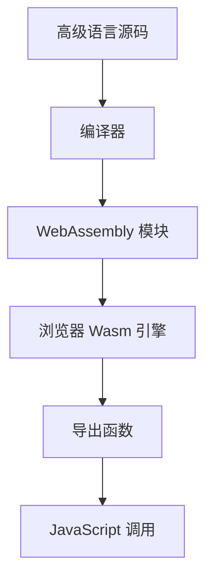

一句话概括：WebAssembly 是浏览器中的高性能二进制执行能力，让前端可以运行接近原生性能的代码模块。

## 二、为什么需要 WebAssembly

JavaScript 已经足够强大，但它并不适合所有场景。对于音视频处理、图像处理、加密压缩、游戏引擎、CAD、科学计算等高强度任务，纯 JavaScript 可能存在性能瓶颈，也难以复用已有 C、C++、Rust 生态。

WebAssembly 主要解决以下问题：

- 提供更稳定的高性能执行能力。
- 复用已有原生代码和算法库。
- 支持多语言编译到 Web 平台。
- 降低大型计算任务对 JavaScript 的压力。
- 让浏览器承载更复杂的桌面级应用。

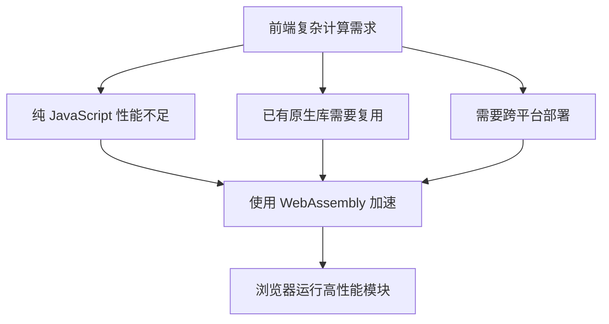

## 三、WebAssembly 与 JavaScript 的关系

WebAssembly 和 JavaScript 是协作关系。Wasm 模块通常不直接操作页面，而是由 JavaScript 负责加载、实例化、传参、读取结果和更新 UI。

| 对比项   | JavaScript                   | WebAssembly                      |
| :------- | :--------------------------- | :------------------------------- |
| 主要定位 | 业务逻辑、DOM、Web API、交互 | 高性能计算、底层算法、原生库迁移 |
| 代码形式 | 文本脚本                     | 二进制模块                       |
| 可读性   | 适合直接编写和调试           | 通常由其他语言编译生成           |
| DOM 操作 | 原生支持                     | 通常通过 JS 间接操作             |
| 性能特点 | JIT 优化、灵活动态           | 类型明确、启动和执行更稳定       |
| 生态优势 | Web 原生生态                 | C、C++、Rust 等原生生态复用      |

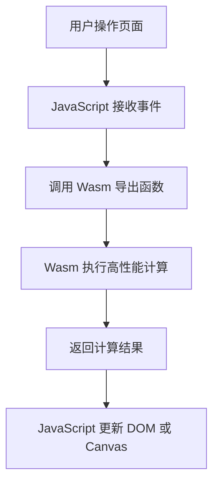

## 四、WebAssembly 的核心特点

### 二进制格式

`.wasm` 是紧凑的二进制格式，比等价文本代码更适合网络传输和快速解码。

### 接近原生性能

Wasm 使用静态类型和接近机器模型的指令，浏览器可以快速验证、编译和优化。

### 安全沙箱执行

Wasm 在浏览器沙箱中执行，不能随意访问系统资源。它只能访问被宿主环境显式提供的能力。

### 跨语言

多种语言可以编译到 Wasm，例如 Rust、C、C++、Go、Zig、AssemblyScript。

### 跨平台

同一个 Wasm 模块可以在不同浏览器、Node.js、边缘计算平台、服务端运行时中执行。

### 与 JavaScript 互操作

Wasm 可以导出函数给 JS 调用，也可以导入 JS 函数供 Wasm 内部调用。

## 五、Wasm 文件、WAT 与模块结构

WebAssembly 常见两种表示形式：

- `.wasm`：二进制格式，浏览器实际加载执行。
- `.wat`：WebAssembly Text Format，文本格式，便于阅读和调试。

一个简单的 WAT 示例：

```ts
(module
  (func $add (param $a i32) (param $b i32) (result i32)
    local.get $a
    local.get $b
    i32.add)
  (export "add" (func $add)))
```

它表示导出一个 `add` 函数，接收两个 `i32` 参数并返回一个 `i32`。

Wasm 模块通常包含：

| 组成      | 说明                         |
| :-------- | :--------------------------- |
| types     | 函数签名类型                 |
| imports   | 从宿主导入的函数、内存、表等 |
| functions | 模块内部函数                 |
| memory    | 线性内存                     |
| globals   | 全局变量                     |
| exports   | 暴露给外部的能力             |
| data      | 初始化内存的数据段           |


## 六、浏览器如何加载 WebAssembly

浏览器提供 WebAssembly 全局对象，用于编译和实例化 Wasm。

### 使用 instantiateStreaming

```js
const result = await WebAssembly.instantiateStreaming(fetch('/add.wasm'), {
  env: {}
})

const { add } = result.instance.exports
console.log(add(1, 2))
```

`instantiateStreaming` 可以边下载边编译，通常是浏览器中最推荐的加载方式。

### 使用 ArrayBuffer 加载

如果服务器没有正确返回 `application/wasm` MIME 类型，可以先转成 ArrayBuffer。

```js
const response = await fetch('/add.wasm')
const bytes = await response.arrayBuffer()
const result = await WebAssembly.instantiate(bytes, {})

console.log(result.instance.exports.add(1, 2))
```

### 加载流程

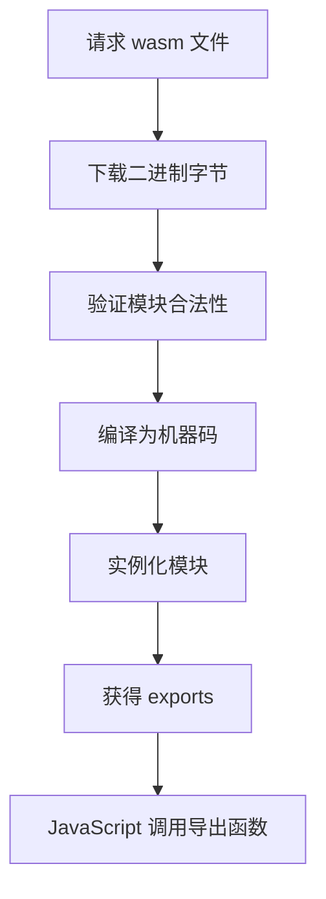

## 七、WebAssembly 的类型系统

Wasm 的基础数值类型比 JavaScript 更底层。

| 类型        | 说明                |
| :---------- | :------------------ |
| `i32`       | 32 位整数           |
| `i64`       | 64 位整数           |
| `f32`       | 32 位浮点数         |
| `f64`       | 64 位浮点数         |
| `v128`      | SIMD 128 位向量类型 |
| `funcref`   | 函数引用            |
| `externref` | 外部宿主引用        |

需要注意：

- JavaScript 的 `number` 是双精度浮点数，对应 Wasm 中的 `f64` 或可转换为 `i32`。
- Wasm 的 `i64` 在 JS 中通常通过 `BigInt` 交互。
- 字符串、对象、数组这类高级结构不能像普通 JS 一样直接传入，需要通过内存和绑定层处理。

## 八、线性内存模型

WebAssembly 使用线性内存模型。简单理解，Wasm 拥有一块连续的内存区域，JavaScript 可以通过 `ArrayBuffer` 视图读写这块内存。

```js
const memory = new WebAssembly.Memory({ initial: 1 })
const view = new Uint8Array(memory.buffer)
view[0] = 42
```

`initial: 1` 表示初始内存为 1 页，每页大小是 64KB。

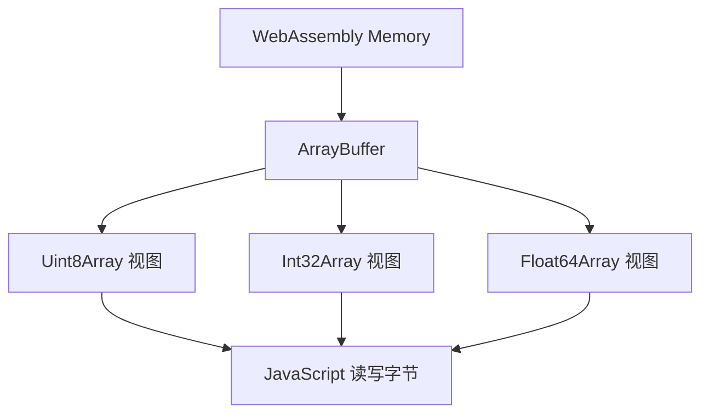

线性内存带来的特点：

- Wasm 无法直接访问 JS 对象内部结构。
- JS 和 Wasm 需要约定数据在内存中的布局。
- 字符串需要编码为 UTF-8 字节写入内存。
- 大数组、图片像素、音频采样数据适合通过内存共享。

## 九、JavaScript 与 Wasm 如何传递字符串

数值传递很简单，但字符串不能直接作为 Wasm 基础类型传递。通常流程是：

- JS 把字符串编码为 UTF-8 字节。
- JS 在 Wasm 内存中申请一段空间。
- JS 把字节写入 Wasm 内存。
- JS 把指针和长度传给 Wasm 函数。
- Wasm 根据指针和长度读取字符串。

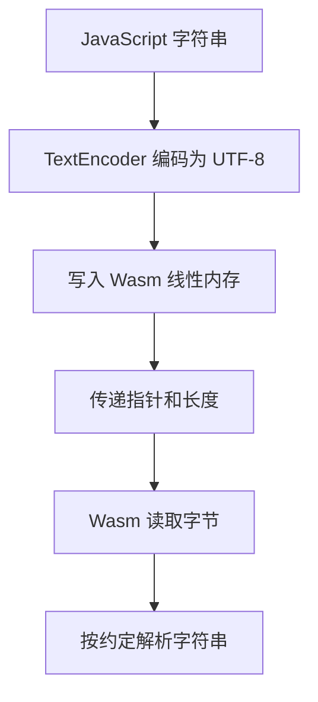

示意代码：

```js
const encoder = new TextEncoder()
const bytes = encoder.encode('你好 Wasm')
const pointer = wasmExports.alloc(bytes.length)
const memory = new Uint8Array(wasmExports.memory.buffer)
memory.set(bytes, pointer)
wasmExports.process(pointer, bytes.length)
```

实际项目中通常由 `wasm-bindgen`、Emscripten 或框架生成胶水代码，不需要手写所有细节。

## 十、Rust 编译到 WebAssembly

Rust 是前端 Wasm 生态中非常常用的语言。它性能高、内存安全，配合 `wasm-bindgen` 可以生成较友好的 JS 绑定。

### Rust 示例

```rust
use wasm_bindgen::prelude::*;

#[wasm_bindgen]
pub fn add(a: i32, b: i32) -> i32 {
    a + b
}
```

### 构建方式

常见工具是 `wasm-pack`：

```bash
wasm-pack build --target web
```

### 前端使用

```js
import init, { add } from './pkg/my_wasm.js'

await init()
console.log(add(1, 2))
```

Rust + Wasm 适合：

- 高性能算法。
- 图像、音频、视频处理。
- 加密、压缩、解析器。
- 需要内存安全的复杂模块。
- 复用 Rust 跨端逻辑。

## 十一、C 和 C++ 编译到 WebAssembly

C/C++ 生态中最常用的工具是 Emscripten。它可以把 C/C++ 项目编译为 Wasm，并生成 JS 胶水代码。

### C 示例

```c
#include <emscripten.h>

EMSCRIPTEN_KEEPALIVE
int add(int a, int b) {
  return a + b;
}
```

### 编译命令

```bash
emcc add.c -O3 -s WASM=1 -o add.js
```

### 应用场景

- 迁移已有 C/C++ 算法库。
- 复用图像处理库。
- 复用音视频编解码能力。
- 复用游戏引擎或物理引擎。
- 在浏览器中运行 SQLite、FFmpeg、OpenCV 等库。

## 十二、AssemblyScript 简介

AssemblyScript 是一种接近 TypeScript 语法的语言，可以编译到 WebAssembly。

示例：

```ts
export function add(a: i32, b: i32): i32 {
  return a + b
}
```

它的优点是前端开发者上手成本较低，但它不是普通 TypeScript 的完整替代。AssemblyScript 有自己的类型系统和运行时限制，不能直接把任意 TS 业务代码编译成 Wasm。

适合场景：

- 前端团队想低成本尝试 Wasm。
- 计算逻辑比较独立。
- 不依赖复杂 JS 对象和 DOM。

## 十三、WebAssembly 的性能优势与误区

### 优势来自哪里

Wasm 的性能优势通常来自：

- 静态类型更容易优化。
- 二进制格式解析更快。
- 更接近底层的内存模型。
- 适合循环、数值计算、字节处理。
- 可以复用成熟原生优化库。

### 不一定比 JavaScript 快

WebAssembly 并不是所有场景都比 JavaScript 快。以下场景可能没有收益：

- 主要是 DOM 操作。
- 主要是网络请求。
- 主要是简单业务判断。
- JS 与 Wasm 高频来回调用。
- 数据在 JS 和 Wasm 之间频繁复制。

### 调用边界有成本

JS 调 Wasm、Wasm 调 JS 都有边界成本。最佳实践是把大块计算放进 Wasm，一次传入数据，一次返回结果，而不是在循环中频繁跨边界调用。

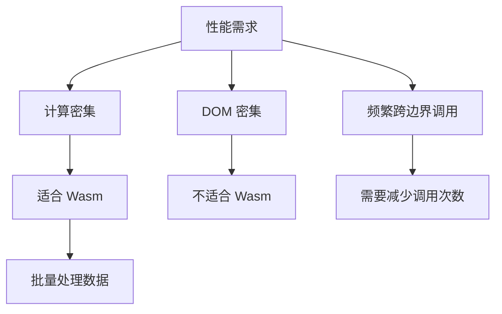

## 十四、WebAssembly 与 Web Worker 组合

Wasm 能提升计算性能，但如果计算任务很重，仍可能阻塞主线程。因此常见做法是把 Wasm 放到 Web Worker 中执行。

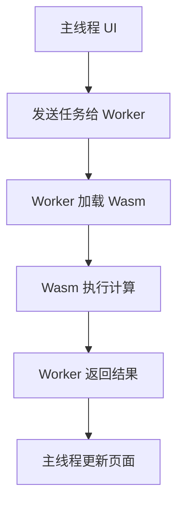

这种组合适合：

- 图片压缩和滤镜。
- 音视频转码。
- 大文件解析。
- 加密、压缩、哈希计算。
- CAD、地图、科学计算。

Worker 示例：

```js
import init, { heavy_compute } from './pkg/module.js'

let ready

self.onmessage = async (event) => {
  ready ||= init()
  await ready

  const result = heavy_compute(event.data)
  self.postMessage(result)
}
```

## 十五、WebAssembly 与前端框架

WebAssembly 不依赖具体前端框架。React、Vue、Angular、Svelte 都可以使用 Wasm。常见模式是：

- 组件层接收用户输入。
- 调用 Wasm 或 Worker 中的 Wasm。
- 获取结果后更新组件状态。
- 框架负责渲染 UI。

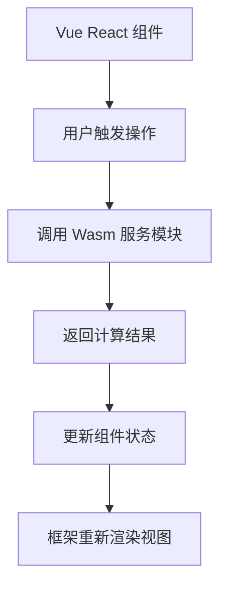

在工程中建议把 Wasm 封装成独立服务模块，而不是散落在组件代码里。

## 十六、WebAssembly 的典型应用场景

### 图像处理

包括图片压缩、滤镜、裁剪、旋转、格式转换、人像分割、二维码识别等。

常见库：OpenCV、libjpeg、libpng、MozJPEG、WebP 编码器。

### 音视频处理

包括音频降噪、音频分析、视频转码、封装格式解析、字幕处理等。

常见方向：FFmpeg Wasm、音频 DSP、波形分析。

### 加密和压缩

包括哈希、签名、AES、RSA、gzip、brotli、zstd 等。Wasm 可以复用成熟 C/C++/Rust 实现。

### 游戏和图形引擎

游戏引擎、物理引擎、粒子系统、路径规划、碰撞检测等适合用 Wasm 承载核心计算。

### 数据库和查询引擎

SQLite、DuckDB 等可以运行在浏览器中，用于本地数据分析、离线应用、数据看板。

### 文档和设计工具

PDF 解析、Office 文档处理、字体排版、矢量图形、CAD 内核等都可以借助 Wasm 迁移到浏览器。

### AI 推理

部分机器学习模型可以通过 Wasm 在浏览器中运行，适合隐私敏感、离线或低延迟场景。高性能场景也可能结合 WebGPU。

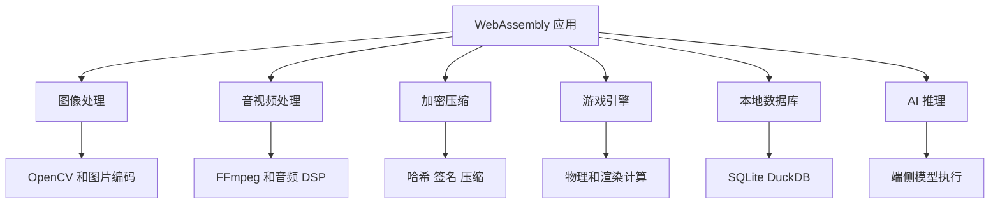

## 十七、案例：浏览器中处理图片

一个典型图片处理应用可以这样设计：

- 用户选择图片。
- JS 读取图片为 ArrayBuffer 或 ImageData。
- 把像素数据传入 Worker。
- Worker 调用 Wasm 处理图片。
- Wasm 返回处理后的像素。
- JS 使用 Canvas 显示结果。

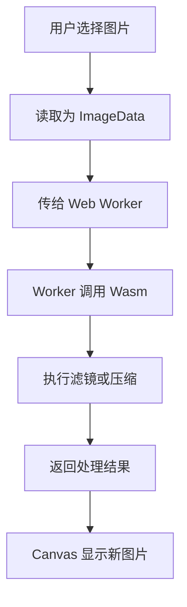

这种方案能避免主线程卡顿，也能复用高性能图像算法。

## 十八、案例：浏览器中运行 SQLite

通过 SQLite Wasm，可以在浏览器中执行 SQL 查询。常见应用包括：

- 离线数据分析。
- 本地优先应用。
- 前端数据看板。
- 导入 CSV 后查询统计。
- 浏览器内嵌轻量数据库。

示意流程：

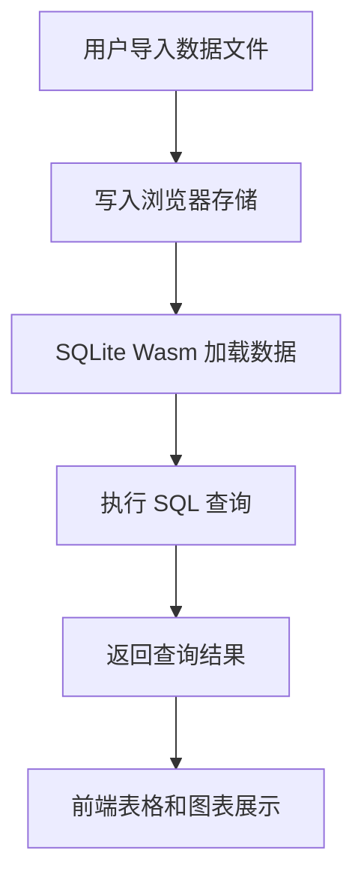

需要注意：浏览器中的数据库能力受内存、存储空间、文件大小和性能限制影响，不能简单等同于服务端数据库。

## 十九、案例：FFmpeg Wasm

FFmpeg Wasm 可以把部分音视频处理放到浏览器中完成，例如：

- 视频截帧。
- 音频提取。
- 简单格式转换。
- 裁剪和拼接。
- 添加水印。

优势：

- 不必上传原始文件到服务器。
- 隐私更好。
- 减少服务端转码成本。

限制：

- Wasm 包体积较大。
- 处理大视频消耗内存和 CPU。
- 移动端性能可能不足。
- 浏览器环境不适合长时间重负载转码。

## 二十、Wasm 包体积优化

Wasm 常见问题之一是包体积偏大。优化方向包括：

- 开启编译优化，例如 `-O3`、`-Oz`。
- 移除未使用代码。
- 拆分模块，按需加载。
- 使用 gzip 或 brotli 压缩传输。
- 避免引入过大的运行时。
- 对 Emscripten 项目裁剪文件系统、异常、调试符号等能力。

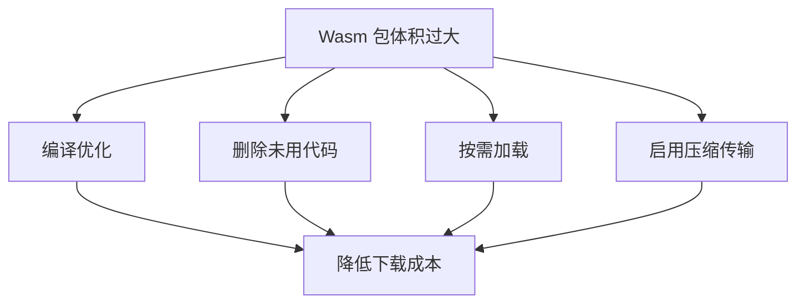

## 二十一、Wasm 加载性能优化

### 使用正确 MIME 类型

服务器应返回：

```txt
Content-Type: application/wasm
```

这样浏览器才能使用 `instantiateStreaming` 高效加载。

### 使用缓存

`.wasm` 文件通常可以配合 hash 文件名和长缓存策略。

### 懒加载

不要在首屏无关场景提前加载大型 Wasm。用户触发相关功能时再加载。

### 预加载

如果功能很快会用到，可以使用：

```html
<link
  rel="preload"
  href="/module.wasm"
  as="fetch"
  type="application/wasm"
  crossorigin
/>
```

### Worker 中加载

大型 Wasm 初始化可以放到 Worker 中，减少主线程压力。

## 二十二、内存管理与资源释放

Wasm 模块常常需要自己管理内存，尤其是 C/C++ 编译产物。如果绑定层没有自动释放，就可能出现内存泄漏。

常见注意点：

- 申请的 Wasm 内存要释放。
- 大数组处理后及时清理引用。
- Worker 不用时终止。
- 大型模块避免重复实例化。
- 图片、视频、文件处理要控制峰值内存。

Rust wasm-bindgen 生成的对象有时需要显式调用 `free()`：

```js
const obj = new WasmObject()
try {
  obj.process()
} finally {
  obj.free()
}
```

是否需要手动释放取决于具体工具链和导出对象。

## 二十三、WebAssembly 的安全模型

WebAssembly 在浏览器中运行时受到沙箱限制。

### 不能直接访问系统资源

Wasm 不能直接访问文件系统、网络、DOM、摄像头、麦克风等。它需要通过宿主环境导入能力。

### 内存访问受限

Wasm 只能访问自己的线性内存，不能随意读写 JS 引擎或浏览器内存。

### 仍然需要防范业务风险

Wasm 安全沙箱不代表业务绝对安全。仍要注意：

- 不可信 Wasm 模块不要随意运行。
- 加密逻辑不能只靠前端保护。
- 不要把密钥硬编码在 Wasm 中。
- 文件解析类 Wasm 也可能存在漏洞。
- 第三方 Wasm 包需要供应链审查。

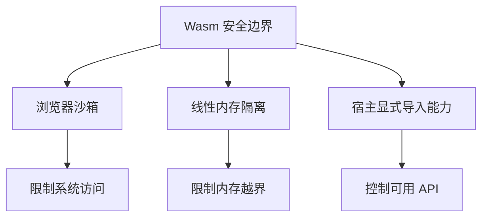

## 二十四、WebAssembly 与多线程

WebAssembly 支持线程能力时，通常依赖 `SharedArrayBuffer` 和 `Atomics`。在浏览器中使用共享内存通常需要跨源隔离相关响应头。

常见要求：

```txt
Cross-Origin-Opener-Policy: same-origin
Cross-Origin-Embedder-Policy: require-corp
```

多线程 Wasm 适合重度计算场景，例如图像处理、音视频处理、物理模拟等。但它也会带来构建、部署、浏览器兼容和调试复杂度。

## 二十五、WebAssembly SIMD

SIMD 允许一条指令同时处理多个数据，适合向量化计算。

适合场景：

- 图像像素处理。
- 音频采样处理。
- 矩阵运算。
- 加密压缩。
- 机器学习推理。

如果编译器和浏览器支持 SIMD，Wasm 可以获得更高的数值计算吞吐。

## 二十六、WASI 与服务端 Wasm

WASI，全称 WebAssembly System Interface，是 WebAssembly 在浏览器之外访问系统能力的一套接口规范。它让 Wasm 可以在服务端、边缘计算、插件系统中更标准地访问文件、时间、随机数等能力。

前端开发了解 WASI 的意义在于：WebAssembly 已经不只是浏览器技术，它正在成为一种跨环境的安全沙箱运行格式。

常见方向：

- 边缘计算函数。
- 插件系统。
- 服务端沙箱执行。
- 跨语言组件模型。

## 二十七、WebAssembly 与 WebGPU

WebAssembly 适合 CPU 侧高性能计算，WebGPU 适合 GPU 并行计算和图形渲染。两者可以组合：

- JS 负责调度和 UI。
- Wasm 负责 CPU 算法和数据预处理。
- WebGPU 负责 GPU 并行计算或渲染。

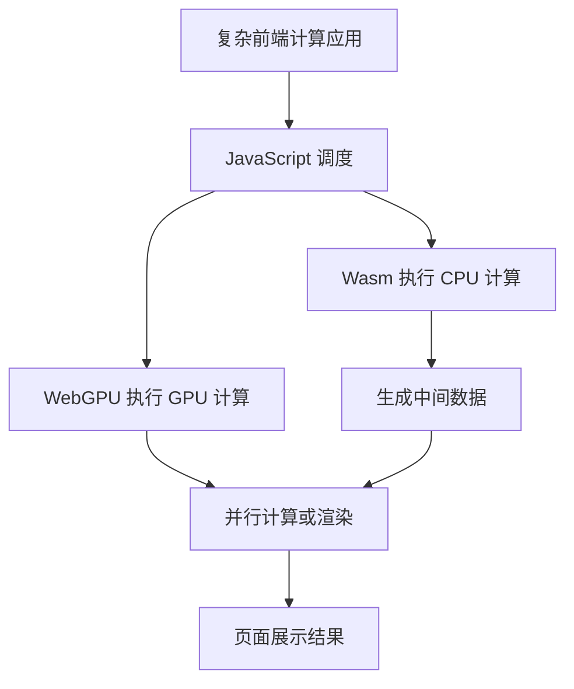

例如浏览器端 AI、图像编辑器、3D 编辑器、科学可视化都可能同时使用 Wasm 和 WebGPU。

## 二十八、工程化接入建议

### 先确认是否真的需要 Wasm

可以先问：

- 性能瓶颈是否在计算层？
- 是否存在成熟原生库可复用？
- JS 优化、算法优化、Worker 是否已经足够？
- Wasm 的包体积、构建复杂度是否值得？

### 设计清晰边界

Wasm 模块最好只负责纯计算和数据处理，不要混入 UI 状态和业务流程。

### 减少跨边界调用

把小函数频繁调用改成批量处理，减少 JS 与 Wasm 的交互次数。

### 使用 Worker 承载重任务

避免 Wasm 长任务阻塞主线程。

### 做好降级方案

老浏览器、特殊 WebView、低端设备可能不适合运行大型 Wasm，需要提供降级或服务端处理方案。

### 监控真实性能

上线后监控加载耗时、初始化耗时、计算耗时、内存峰值、错误率和设备分布。

## 二十九、常见问题排查

### Wasm 加载失败

检查：

- 文件路径是否正确。
- 服务器是否返回 `application/wasm`。
- 是否被跨域策略拦截。
- 构建产物路径是否被打包工具改写。
- 浏览器是否支持当前 Wasm 特性。

### `instantiateStreaming` 报错

常见原因是 MIME 类型不正确。可以改用 ArrayBuffer 加载，或修复服务器响应头。

### 运行结果不正确

检查：

- JS 传入类型是否符合 Wasm 期望。
- 指针和长度是否正确。
- 字符串编码是否一致。
- 内存是否越界。
- 大整数是否需要使用 BigInt。

### 性能没有提升

检查：

- 是否频繁 JS 和 Wasm 互相调用。
- 数据复制成本是否过高。
- 任务是否本身不适合 Wasm。
- 是否没有开启编译优化。
- 是否在主线程执行导致 UI 卡顿。

### 内存持续上涨

检查：

- Wasm 分配的内存是否释放。
- JS 是否持有大对象引用。
- Worker 是否重复创建未销毁。
- 是否重复实例化大型 Wasm 模块。

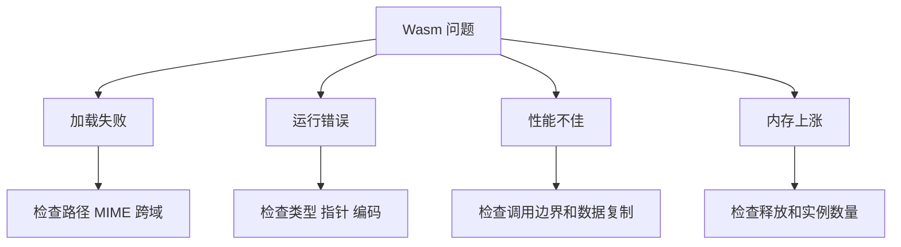

## 三十、最佳实践清单

### 适用性判断

- 适合计算密集型任务。
- 适合复用 C、C++、Rust 原生库。
- 不适合普通 DOM 业务逻辑。
- 不适合大量细粒度 JS 对象交互。

### 性能实践

- 批量传输数据。
- 避免循环中频繁跨边界调用。
- 大数据使用线性内存或 Transferable。
- 重任务放到 Web Worker。
- 开启编译优化和压缩。

### 工程实践

- Wasm 模块独立封装。
- 使用 TypeScript 定义调用接口。
- 配置正确 MIME 类型。
- 按需加载大型模块。
- 做好错误处理和降级。

### 安全实践

- 不运行不可信 Wasm。
- 不把密钥硬编码进 Wasm。
- 审查第三方 Wasm 依赖。
- 文件解析类模块要考虑异常输入。
- 敏感能力通过宿主显式授权。

## 三十一、WebAssembly 与常见技术对比

### WebAssembly 与 Web Worker

Web Worker 是线程能力，WebAssembly 是执行格式。二者经常组合使用：Worker 负责不阻塞主线程，Wasm 负责高性能计算。

### WebAssembly 与 asm.js

asm.js 是 JavaScript 的一个高性能子集，曾用于把 C/C++ 编译到 Web。WebAssembly 是更现代、更高效、更标准化的方案。

### WebAssembly 与 Native App

Wasm 可以让 Web 承载更复杂的能力，但它仍受浏览器沙箱、API、性能和内存限制。对强系统能力、后台常驻、硬件深度访问的场景，Native App 仍有优势。

### WebAssembly 与 WebGPU

Wasm 偏 CPU，WebGPU 偏 GPU。高性能图形、并行计算、AI 推理场景可能同时使用二者。

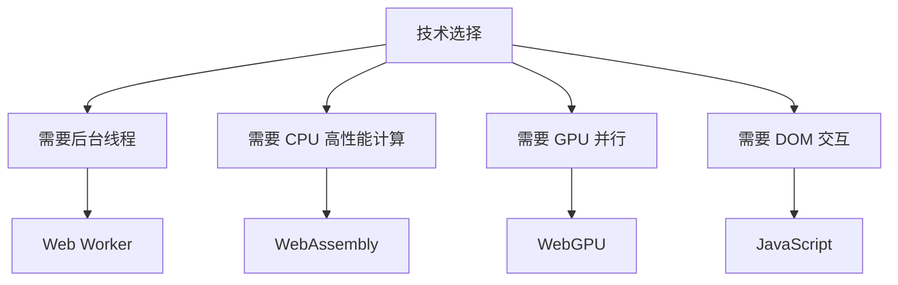

## 三十二、面试常见问题

### WebAssembly 会取代 JavaScript 吗

不会。Wasm 不擅长 DOM 操作和普通业务逻辑，JavaScript 仍是 Web 平台的主要胶水语言。Wasm 更适合高性能计算和原生库迁移。

### WebAssembly 为什么快

它采用紧凑二进制格式、静态类型、线性内存和更接近底层的指令模型，浏览器可以更快验证、编译和优化。但具体是否更快取决于任务类型和数据交互方式。

### Wasm 能直接操作 DOM 吗

通常不能直接操作 DOM。Wasm 需要通过 JavaScript 导入函数间接操作页面。实际工程中也不建议把 DOM 操作放进 Wasm。

### Wasm 是否安全

Wasm 在浏览器沙箱中运行，内存访问受限，不能直接访问系统资源。但业务安全仍需要自己保证，例如不要运行不可信模块、不要硬编码密钥、不要忽视第三方依赖风险。

### Wasm 适合哪些前端场景

适合图像处理、音视频处理、加密压缩、游戏引擎、文件解析、本地数据库、AI 推理、科学计算等计算密集型场景。

### 为什么 Wasm 性能有时不如 JS

可能因为任务不适合 Wasm、JS 与 Wasm 高频交互、数据复制成本太高、没有开启优化、Wasm 运行在主线程导致 UI 卡顿等。

## 三十三、总结

WebAssembly 是现代前端的重要底层能力，它让浏览器可以运行高性能、跨语言、可沙箱化的二进制模块。它最适合解决计算密集、原生库复用、复杂桌面级应用迁移等问题。

理解 WebAssembly 可以抓住六条主线：

- 定位：Wasm 是 JavaScript 的高性能补充，不是替代品。
- 加载：浏览器下载、验证、编译、实例化 `.wasm` 模块。
- 交互：JS 通过 exports 调用 Wasm，通过 imports 向 Wasm 提供能力。
- 内存：Wasm 使用线性内存，复杂数据需要通过指针、长度、编码约定传递。
- 工程：Rust、C/C++、AssemblyScript 等语言可以编译到 Wasm。
- 应用：图像、音视频、加密压缩、数据库、游戏、AI、科学计算等。

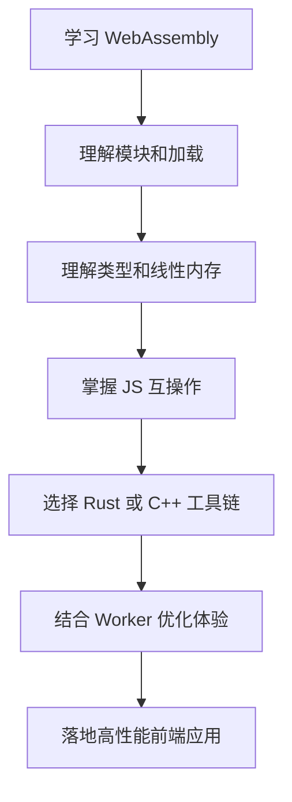

在实际项目中，最重要的不是“用了 Wasm”，而是明确它是否解决了真实瓶颈。合理的架构通常是：JavaScript 负责业务和 UI，Web Worker 负责线程隔离，WebAssembly 负责高性能核心计算。三者配合，才能把 Web 应用推向更复杂、更高性能的场景。
