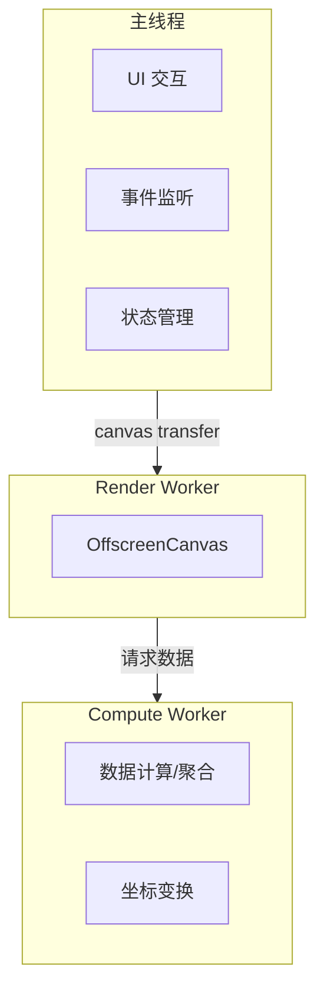

页面上有个 Canvas 在画图表，数据量一上来，拖拽、缩放直接卡成幻灯片。打开 DevTools 看火焰图，一帧干到 200ms，全是 JS 执行时间。按钮点了没反应，算法优化了好几轮还是没用。

问题不在算法，在主线程。

浏览器主线程是个单行道——JS 执行、DOM 更新、事件处理、样式计算全挤在一条线上。往 Canvas 上画 10 万个点的时候，按钮的点击回调只能排队等着。这不是"优化一下就好了"的事，得从架构层面换思路。

Web Worker + OffscreenCanvas，把单行道变成双车道。

## 先搞清楚瓶颈在哪

不是所有卡顿都该搬进 Worker。搬之前先确认：_瓶颈是计算，还是渲染？_

Chrome Performance 面板录一段，看火焰图：

- 大块黄色（Scripting）→ 计算瓶颈，Worker 能救
- 大块绿色（Painting）→ 渲染瓶颈，换思路（减少绘制面积、分层）
- 大块紫色（Layout/Style）→ DOM 结构问题，跟 Worker 没关系

确认是计算瓶颈之后，再往下看。

## Web Worker 基础：隔离但不共享

Worker 跑在独立线程，有自己的事件循环。代价是：_不能访问 DOM，不能访问 window，跟主线程之间只能靠消息通信_。

```ts:main.ts
const worker = new Worker(new URL('./heavy.worker.ts', import.meta.url), {
  type: 'module'
})

worker.postMessage({ type: 'calc', data: hugeArray })

worker.onmessage = (e) => {
  renderChart(e.data.result)
}
```

```ts:heavy.worker.ts
self.onmessage = (e) => {
  if (e.data.type === 'calc') {
    const result = heavyComputation(e.data.data)
    self.postMessage({ result })
  }
}

function heavyComputation(data: number[]) {
  return data.sort((a, b) => a - b).reduce(/* ... */)
}
```

真用起来有几个坑。

### postMessage 的序列化成本

postMessage 传数据走结构化克隆（Structured Clone）。传个小对象没感觉，传个 50MB 的 Float64Array，光序列化就能卡主线程几百毫秒，本末倒置了。

解法是 _Transferable Objects_：

```ts
// ❌ 克隆传输 → 大数组会卡主线程
worker.postMessage({ buffer: hugeFloat64Array })

// ✅ 转移所有权 → 零拷贝
worker.postMessage({ buffer: hugeFloat64Array.buffer }, [hugeFloat64Array.buffer])
// transfer 之后主线程的 hugeFloat64Array 长度变 0，不能再用
```

transfer 是"移交"不是"复制"——数据从主线程转给 Worker，主线程就失去访问权。零拷贝，没有性能损失，但架构上要想清楚数据的所有权流转。

### SharedArrayBuffer：真正的共享内存

如果需要两边同时读写同一块数据，SharedArrayBuffer 是另一条路。

```ts:main.ts
const sab = new SharedArrayBuffer(1024 * 1024) // 1MB 共享内存
const view = new Int32Array(sab)

worker.postMessage({ sab }) // 不需要 transfer，两边都能用

Atomics.store(view, 0, 42)
// Worker 里也能读到这个 42
```

不过 SharedArrayBuffer 在业务项目里用得不多。一方面要配 COOP/COEP 响应头（`Cross-Origin-Opener-Policy` 和 `Cross-Origin-Embedder-Policy`），部署上得改 Nginx 配置；另一方面并发读写要用 `Atomics` 做同步，心智负担跟写 C 的多线程差不多。

大部分场景 Transferable 就够了。

## OffscreenCanvas：Worker 里直接画

Web Worker 能算但不能画——没有 DOM 访问权限。计算完的数据要画到 Canvas 上，正常情况下得传回主线程再画。

OffscreenCanvas 解决的就是这个问题：让 Worker 直接操作 Canvas 的绘图上下文。

```ts:main.ts
const canvas = document.getElementById('chart') as HTMLCanvasElement
const offscreen = canvas.transferControlToOffscreen()
worker.postMessage({ canvas: offscreen }, [offscreen])
// 转移之后，主线程不能再操作这个 canvas
```

```ts:render.worker.ts
let ctx: OffscreenCanvasRenderingContext2D

self.onmessage = (e) => {
  if (e.data.canvas) {
    const canvas = e.data.canvas as OffscreenCanvas
    ctx = canvas.getContext('2d')!
    startRenderLoop()
  }
}

function startRenderLoop() {
  function frame() {
    ctx.clearRect(0, 0, ctx.canvas.width, ctx.canvas.height)
    drawTenThousandPoints(ctx)
    requestAnimationFrame(frame)
  }
  frame()
}

function drawTenThousandPoints(ctx: OffscreenCanvasRenderingContext2D) {
  for (let i = 0; i < 10000; i++) {
    const x = Math.random() * ctx.canvas.width
    const y = Math.random() * ctx.canvas.height
    ctx.fillStyle = `hsl(${(i / 10000) * 360}, 70%, 50%)`
    ctx.fillRect(x, y, 2, 2)
  }
}
```

`transferControlToOffscreen()` 之后，Canvas 的渲染完全在 Worker 线程完成。主线程上的按钮点击、页面滚动、文字输入完全不受影响。

之前做地图上的实时轨迹热力图，几千条轨迹同时渲染，没用 OffscreenCanvas 的时候缩放地图掉帧明显。搬到 Worker 之后帧率稳在 55-60，体感差距很大。

## 实战架构：计算和渲染都丢出去

典型架构：



主线程只管 UI 交互和事件分发。计算丢给 Compute Worker，渲染丢给 Render Worker。两个 Worker 之间用 `MessageChannel` 直接通信，不绕回主线程。

```ts
// main.ts —— 搭建通信管道
const computeWorker = new Worker(new URL('./compute.worker.ts', import.meta.url), { type: 'module' })
const renderWorker = new Worker(new URL('./render.worker.ts', import.meta.url), { type: 'module' })

const channel = new MessageChannel()
computeWorker.postMessage({ port: channel.port1 }, [channel.port1])
renderWorker.postMessage({ port: channel.port2 }, [channel.port2])

canvas.addEventListener('wheel', (e) => {
  computeWorker.postMessage({
    type: 'zoom',
    delta: e.deltaY,
    center: { x: e.offsetX, y: e.offsetY }
  })
})
```

```ts:compute.worker.ts
let port: MessagePort

self.onmessage = (e) => {
  if (e.data.port) {
    port = e.data.port
    return
  }
  if (e.data.type === 'zoom') {
    const transformed = transformAllPoints(e.data)
    port.postMessage({ type: 'bindPoints', points: transformed })
  }
}
```

主线程基本就是个调度员，自己不干重活。

## 实际用下来的几个痛点

_调试体验一般。_  Worker 里的代码在 DevTools 里能调试，但 Source Map 有时候不太稳定，尤其是 Vite 开发环境下。断点打不上、变量看不了的情况偶尔出现，最后还是靠 `console.log` 排查。

_错误处理容易漏。_  Worker 里抛异常不会冒泡到主线程，必须显式监听 error 事件。不监听的话 Worker 默默挂了完全没有感知。

```javascript
worker.onerror = (e) => {
  console.error('Worker 挂了:', e.message, e.filename, e.lineno)
}
```

_生命周期管理。_  Worker 创建有开销（加载和解析脚本），频繁创建销毁不划算。长驻 Worker 又得注意内存泄漏。比较稳妥的做法是搞个 Worker 池，初始化时创建 2~4 个，任务来了分配，空闲了回收但不销毁。

_OffscreenCanvas 的兼容性。_  Safari 16.4+（2024 年底）才正式支持。老版本 Safari 需要降级处理：

```ts
function setupCanvas(canvas: HTMLCanvasElement) {
  if (typeof canvas.transferControlToOffscreen === 'function') {
    const offscreen = canvas.transferControlToOffscreen()
    renderWorker.postMessage({ canvas: offscreen }, [offscreen])
  } else {
    fallbackRender(canvas) // 主线程渲染
  }
}
```

## 什么时候不该用

Worker 不是银弹。搬进 Worker 意味着更复杂的代码结构、更难的调试、更多的通信协调。

几个不值得搬的场景：

- 计算本身就很快（< 5ms）：通信开销可能比计算本身还大
- 强依赖 DOM 的操作：Worker 里没有 DOM，相关逻辑只能留在主线程
- 数据量小但交互频繁：每次交互都发 postMessage，序列化反序列化的开销会累积

粗暴的判断标准：某段逻辑执行时间稳定超过 16ms（一帧的预算），考虑搬。低于 16ms，不折腾。

## Worker + WebAssembly 的组合

如果计算密集任务是纯数学运算（图像处理、物理模拟、加密解密），Worker + Wasm 是目前浏览器里的性能天花板。

```ts:compute.worker.ts
import init, { process_image } from './image_processor_bg.wasm'

self.onmessage = async (e) => {
  await init()
  const inputBuffer = new Uint8Array(e.data.imageBuffer)
  const result = process_image(inputBuffer, e.data.width, e.data.height)
  self.postMessage({ processed: result.buffer }, [result.buffer])
}
```

Worker 提供独立线程，Wasm 提供接近原生的执行速度。两者叠加，某些场景下性能提升能到一个数量级。不过 Wasm 本身开发成本不低，JS 够用的情况下没必要上。

## 总结

主线程是稀缺资源——处理用户输入、跑框架更新逻辑、执行动画、计算布局，每一帧只有 16ms 预算。塞进去一个 50ms 的计算任务，用户就能感知到卡顿。

Worker 和 OffscreenCanvas 的核心价值不是"让代码跑得更快"，而是"让主线程只干它该干的事"。计算归计算线程，渲染归渲染线程，主线程管交互和调度，各司其职。

架构上多一层抽象确实多一层复杂度。但 Canvas 上要画几万个元素、做实时数据可视化、跑客户端 AI 推理的时候，这层抽象值得投入。
