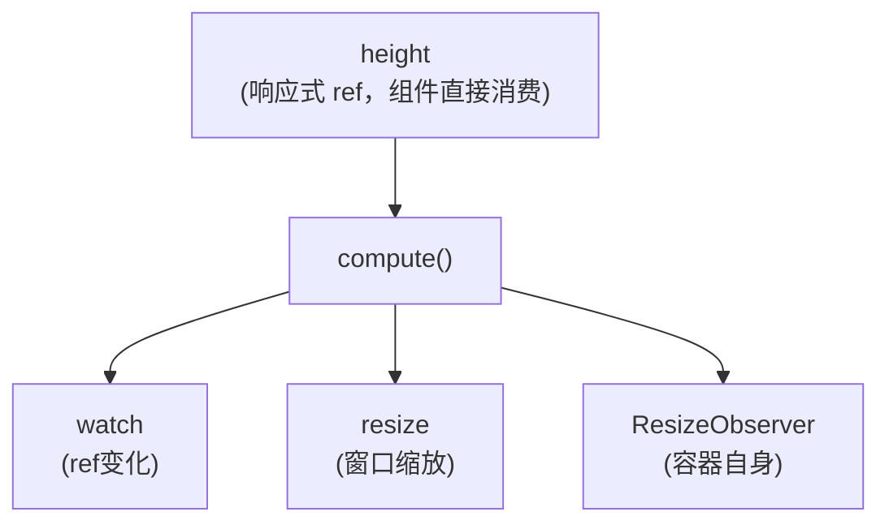

> "让表格铺满剩下的空间"——这个需求听起来简单，但要做到窗口缩放不抖、元素挂载不闪、容器变化不漏，背后是一整套响应式监听体系的精密协作。本文拆解一个生产验证过的 Hook，看它如何用 140 行代码优雅地解决这个问题。

## 一个看似简单的需求

后台管理系统中，页面结构通常是这样的：

```txt
┌──────────────────────────────────────┐
│  Header（固定高度）                  │
├──────────────────────────────────────┤
│  Breadcrumb / Tabs（固定高度）       │
├──────────────────────────────────────┤
│                                      │
│  表格区域（需要撑满剩余空间）        │
│                                      │
│                                      │
├──────────────────────────────────────┤
│  Footer / 分页器                     │
└──────────────────────────────────────┘
```

表格上面有面包屑、标签页，下面有分页器。如果给表格写死 `height: 600px`，小屏幕上会溢出，大屏幕上会留白。真正的需求是：_表格高度 = 视口高度 - 表格顶部到视口顶部的距离 - 底部预留。_

CSS 能解决一部分：`height: calc(100vh - 200px)`。但 `200px` 是拍脑袋的——页头高度会变、面包屑可能换行、标签页可能增删。一旦布局变化，硬编码的 `200px` 就崩了。

## 核心公式

`useAutoContainerFullHeight` 的核心计算只有一行：

```ts
剩余高度 = window.innerHeight - container.getBoundingClientRect().top - offsetBottom
```

- `window.innerHeight`：浏览器视口的可视高度，随窗口缩放实时变化
- `getBoundingClientRect().top`：容器顶部到视口顶边的当前距离，随滚动位置变化
- `offsetBottom`：底部预留高度，比如固定分页器的高度

这个公式的妙处在于：它不关心上面有多少东西。Header 变高了？面包屑换行了？`rect.top` 自动跟着变大，剩余高度自动变小。完全解耦了"上面有什么"这个变量。

```ts
const getContainerFullHeight = (containerRef: Ref<HTMLElement | null>) => {
  return window.innerHeight - containerRef.value.getBoundingClientRect().top
}
```

## API 设计：原语 + 托管

Hook 提供了两层 API：

### 第一层：计算原语（无副作用）

```ts
const { getContainerOffsetTop, getFullHeight, getContainerFullHeight } = useAutoContainerFullHeight()

// 拿到原始数值，自己决定怎么用
const top = getContainerOffsetTop(containerRef) // 容器距视口顶部距离
const full = getFullHeight() // 视口总高度
const remain = getContainerFullHeight(containerRef) // 剩余可用高度
```

这三个函数是纯计算，不注册任何监听器，不产生任何副作用。适合需要手动控制刷新时机的场景。

### 第二层：托管监听（自动响应）

```ts
const { height, recalculate, stop } = watchContainerFullHeight(containerRef, {
  minHeight: 200,      // 保底最小高度
  debounceMs: 100,     // 防抖间隔
  offsetBottom: 52,    // 底部预留（分页器高度）
})

// 模板中直接绑定
<div :style="{ height: height + 'px' }">
  <AgGridTable ... />
</div>
```

`height` 是一个响应式 `ref<number>`，任何触发条件满足后自动更新。组件只需绑定它，不用关心"什么时候该重新算"。

## 三层监听体系

这是整个 Hook 最精巧的部分——不是简单加个 `resize` 事件就完事，而是设计了三层互补的监听策略：



### 第一层：watch — 感知 ref 挂载/卸载

```ts
const stopWatch = watch(
  () => containerRef.value,
  (el) => {
    bindResizeObserver(el) // el 变化时重建 ResizeObserver
    if (el) {
      nextTick(compute) // 🔑 等 DOM 落位后再算
    } else {
      height.value = 0 // 元素卸载，高度归零
    }
  },
  { flush: 'post', immediate: true }
)
```

关键细节：

- `flush: 'post'`：确保回调在 DOM 更新后才执行。如果组件用 `v-if` 控制容器，watch 触发时 DOM 可能还没渲染完，flush: 'post' 保证拿到的是真实 DOM。
- `immediate: true`：组件挂载时立即执行一次，不需要手动触发。
- `nextTick(compute)`：即使 `flush: 'post'` 保证了 DOM 已更新，元素的最终布局（CSS 计算、flex/grid 分配）可能还没完成。再等一个 `nextTick`，确保 `getBoundingClientRect().top` 拿到正确的值。

### 第二层：`window resize` — 感知视口变化

```ts
window.addEventListener('resize', debouncedCompute, { passive: true })
```

- `passive: true`：告诉浏览器这个监听器不会调用 `preventDefault()`，浏览器可以放心地异步处理，不阻塞滚动性能。
- 走防抖逻辑，避免拖拽窗口边缘时疯狂触发计算。

### 第三层：ResizeObserver — 感知容器自身变化

```ts
resizeObserver = new ResizeObserver(() => {
  debouncedCompute()
})
resizeObserver.observe(el)
```

这是 CSS `calc(100vh - 200px)` 做不到的关键能力。当容器内部元素变化导致容器自身尺寸改变时——比如表格数据增多导致出现横向滚动条、或者折叠面板展开——`ResizeObserver` 会触发重算。

> 注意：ResizeObserver 只监听目标元素自身的尺寸变化，不监听祖先。如果上方 Header 的高度变化导致 `rect.top` 改变，这由 `window.resize` 覆盖（Header 高度变化通常伴随窗口缩放）；极端情况下如果 Header 通过 JS 动态改变高度，业务侧需要手动调用 `recalculate()`。

### 为什么三层都需要？

| 场景         | 触发者                                        | 举例                              |
| :----------- | :-------------------------------------------- | :-------------------------------- |
| 容器从无到有 | `watch`                                       | `v-if` 条件满足，表格区域首次渲染 |
| 窗口缩放     | `window resize`                               | 用户拖拽浏览器边缘                |
| 容器内部变化 | ResizeObserver                                | 表格数据加载后出现滚动条          |
| 祖先布局变化 | `window resize` (间接) 或手动 `recalculate()` | 侧边栏折叠                        |

如果只做 `resize`，容器内部变化会漏掉。如果只做 `ResizeObserver`，窗口缩放会漏掉。如果只做以上两者但不用 `watch` 感知 `ref` 挂载，`v-if` 场景就会出 bug——初始时 `ref` 为 `null`，后续变为真实 DOM 时没人触发计算。

## 防抖与同步的平衡

```ts
const debouncedCompute = debounce(compute, debounceMs) // 默认 100ms
```

拖拽窗口边缘时，`resize` 事件以每秒几十次的频率触发。每次都算一遍 `getBoundingClientRect()` 会引发布局抖动（layout thrashing）。100ms 的防抖是一个经验值——人眼感知不到 100ms 的延迟，但 CPU 能感知到没有这个防抖时的卡顿。

但防抖也意味着最后一次事件后还要等 100ms 才更新 UI。对于需要即时响应的场景——比如用户点击"收起侧边栏"——Hook 暴露了 `recalculate`：

```ts
return {
  height,
  recalculate: compute, // 同步立即计算，不走防抖
  stop
}
```

业务侧在侧边栏切换动画完成后调用 `recalculate()`，立即拿到正确高度，不用等 100ms。

## 资源清理：一个都不漏

```ts
const stop = () => {
  if (stopped) return // 🔑 幂等——多次调用安全
  stopped = true
  stopWatch() // ① 停止 Vue watch
  window.removeEventListener('resize', debouncedCompute) // ② 移除 window 事件
  resizeObserver?.disconnect() // ③ 断开 ResizeObserver
  resizeObserver = null
  debouncedCompute.cancel() // ④ 取消还在排队的防抖任务
}

onUnmounted(stop) // 组件卸载时自动清理
```

四个清理步骤，少一个都是内存泄漏：

- `stopWatch()`：停止 Vue 的响应式追踪
- `removeEventListener`：窗口 `resize` 是全局事件，不移除会累积
- `disconnect()`：ResizeObserver 持有 DOM 引用，不释放会阻止 GC
- `cancel()`：lodash `debounce` 内部有 `setTimeout`，组件卸载后如果定时器还在排期，回调执行时会访问已被销毁的响应式对象

`stopped` 标志位保证幂等性——`stop()` 可以安全地多次调用，这在 `onUnmounted` + 手动 `stop()` 共存的场景下很重要。

## 配置参数

```ts
type WatchContainerFullHeightOptions = {
  minHeight?: number // 保底最小高度，默认 0
  debounceMs?: number // 防抖毫秒，默认 100
  offsetBottom?: number // 底部预留高度，默认 0
}
```

### minHeight — 防止容器塌陷

当视口很小或容器位置很靠下时，计算出的剩余高度可能为负值。`Math.max(minHeight, computedHeight)` 确保表格至少有一个合理的最小高度，不会塌成一条线。

### offsetBottom — 底部元素预留

页面底部如有固定分页器或操作栏，设置 `offsetBottom: 52` 可以在计算时减去这个高度，避免表格被遮挡。

### debounceMs — 性能调优

默认 100ms 对大多数场景足够。如果页面布局特别复杂、单次 `getBoundingClientRect()` 很耗时，可以适当调大。

## 使用示例

```vue
<template>
  <div>
    <!-- 上方固定区域 -->
    <PageHeader />
    <el-tabs v-model="activeTab">...</el-tabs>

    <!-- 需要撑满剩余高度的表格容器 -->
    <div
      ref="tableContainerRef"
      :style="{ height: tableHeight + 'px' }"
    >
      <AgGridTable
        :rowData="list"
        :columnDefs="columns"
      />
    </div>

    <!-- 底部分页器 -->
    <div class="pagination-wrapper">
      <el-pagination ... />
    </div>
  </div>
</template>

<script setup lang="ts">
  import { ref } from 'vue'
  import { useAutoContainerFullHeight } from '@/hooks/web/useAutoContainerFullHeight'

  const tableContainerRef = ref<HTMLElement | null>(null)
  const { watchContainerFullHeight } = useAutoContainerFullHeight()

  const { height: tableHeight } = watchContainerFullHeight(tableContainerRef, {
    minHeight: 300, // 表格至少 300px
    offsetBottom: 52 // 分页器大约 52px
  })

  // tableHeight 自动响应窗口缩放、布局变化、ref 挂载/卸载
</script>
```

## 与类似方案的对比

| 方案                          | 优点                         | 缺点                                                         |
| :---------------------------- | :--------------------------- | :----------------------------------------------------------- |
| `height: calc(100vh - 200px)` | 纯 CSS，零 JS                | 上方高度变化时失效，需要手动调整魔数                         |
| `height: 100%` + flex 布局    | 标准方案，语义清晰           | 要求父级链全部设置 height，对于深层嵌套的复杂布局难以落地    |
| `useElementSize` (VueUse)     | 通用性强                     | 返回的是元素自身尺寸，不处理"距离视口底部的剩余高度"这个语义 |
| `useAutoContainerFullHeight`  | 语义精准，自动适应，三层监听 | 仅适用"剩余视口高度"场景                                     |

## 总结

这个 140 行的 Hook 值得分享的原因不在于代码量，而在于 "把一件小事做到极致" 的工程态度：

- 核心公式直观：`innerHeight - rect.top`，一行就够。但围绕这个公式构建的监听、清理、边界处理体系才是真正的工程价值。
- 三层监听互补：`watch` + `resize` + `ResizeObserver`，各自覆盖一种变化来源，组合起来做到"不漏也不重"。
- 清理干净利落：四个清理步骤 + 幂等 guard，不留内存泄漏。
- API 分层合理：计算原语给需要手动控制的场景，托管监听给标准场景，`recalculate` 给需要即时响应的场景。
- 文档即设计：JSDoc 写清楚了计算原理、使用注意、典型场景、参数含义。接手的人不需要读源码就能正确使用。

后台管理系统里，"表格撑满剩余空间"是高频需求，但很少有人把它沉淀为一个完整的 Hook。这个实现用一个简单公式 + 三层监听 + 严密清理，给出了一个可以放心复用的答案。
