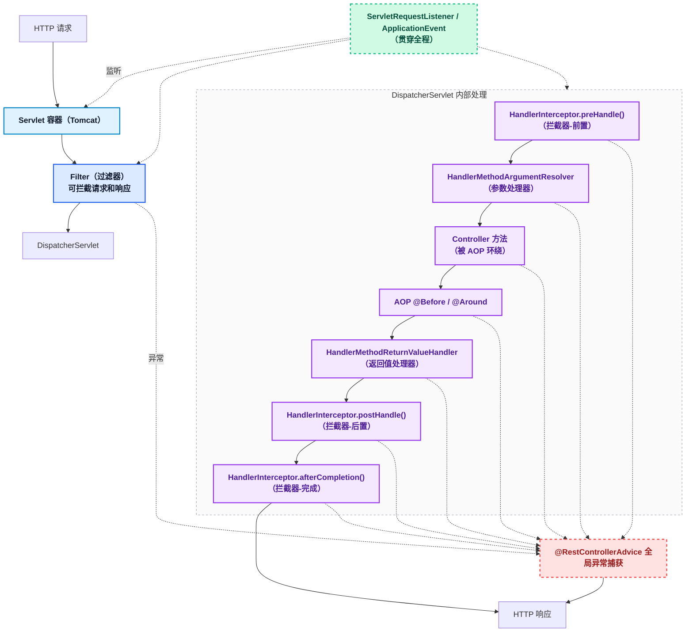
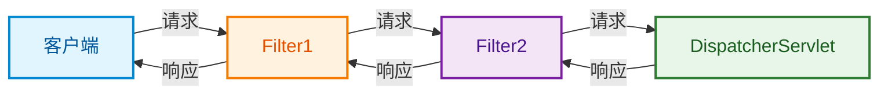
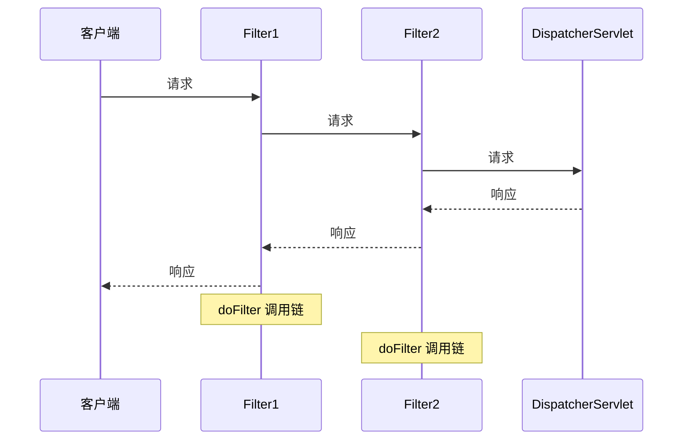
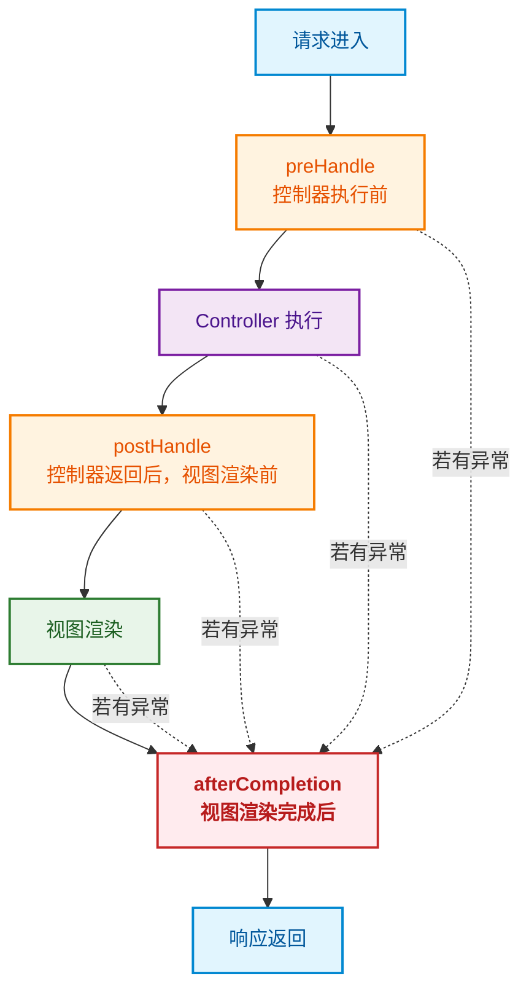
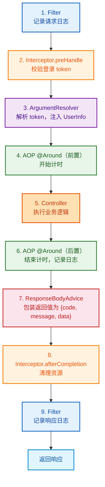
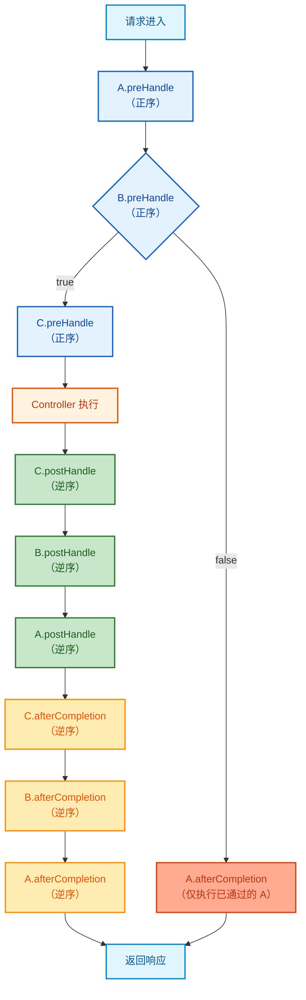
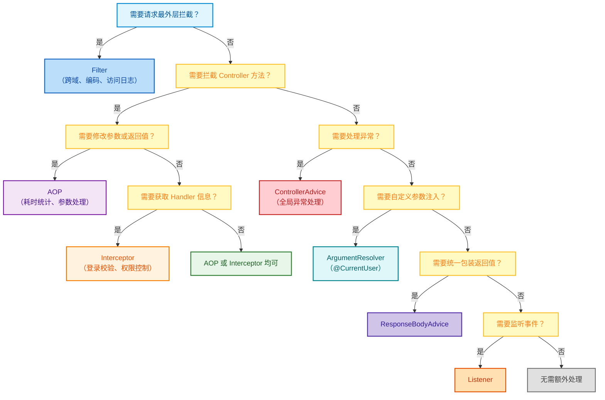

> Spring Boot 提供了多种组件来处理请求的不同阶段：过滤器、拦截器、AOP、监听器、ControllerAdvice、参数/返回值处理器。它们功能上有重叠但各有定位，初学者容易混淆。本文系统讲解每种组件的原理、用法，并从执行顺序、适用场景、功能交叉点等维度进行横向对比，帮助在不同场景下做出正确选型。

## 整体架构与执行流程 ##

### 请求处理全链路 ###

一个 HTTP 请求到达 Spring Boot 应用后，会依次经过以下组件：



### 六大组件定位 ###

| 组件 | 所属层级 | 核心职责 | 一句话定位 |
| :--- | :--- | :--- | :--- |
| Filter | Servlet 容器 | 请求/响应的过滤与包装 | 最外层的守门员 |
| Interceptor | Spring MVC | Controller 前后拦截 | Controller 的贴身保镖 |
| AOP | Spring 容器 | 方法级别的横切逻辑 | 任意 Bean 方法的拦截器 |
| Listener | Servlet / Spring | 事件监听与回调 | 全局事件的观察者 |
| ControllerAdvice | Spring MVC | 全局异常处理与数据绑定 | Controller 的后勤保障 |
| ArgumentResolver | Spring MVC | 自定义参数解析 | 请求参数 → Controller 入参 |
| ReturnValueHandler | Spring MVC | 自定义返回值处理 | Controller 返回值 → 响应 |

## Filter（过滤器） ##

### 原理 ###

Filter 是 Servlet 规范的一部分，运行在 DispatcherServlet 之前和之后，可以拦截所有 HTTP 请求（包括静态资源）。





### 用法 ###

```java
import jakarta.servlet.*;
import jakarta.servlet.http.HttpServletRequest;
import jakarta.servlet.http.HttpServletResponse;
import org.springframework.core.annotation.Order;
import org.springframework.stereotype.Component;

import java.io.IOException;

/**
 * 请求日志过滤器
 */
@Component
@Order(1)
public class RequestLogFilter implements Filter {

    @Override
    public void doFilter(ServletRequest request, ServletResponse response,
                         FilterChain chain) throws IOException, ServletException {
        HttpServletRequest req = (HttpServletRequest) request;
        HttpServletResponse resp = (HttpServletResponse) response;

        long start = System.currentTimeMillis();
        System.out.println("[Filter] 请求进入: " + req.getMethod() + " " + req.getRequestURI());

        // 放行到下一个 Filter 或 DispatcherServlet
        chain.doFilter(request, response);

        long cost = System.currentTimeMillis() - start;
        System.out.println("[Filter] 请求完成: " + req.getRequestURI() + " 耗时 " + cost + "ms 状态码 " + resp.getStatus());
    }
}
```

也可以通过 `FilterRegistrationBean` 注册：

```java
import org.springframework.boot.web.servlet.FilterRegistrationBean;
import org.springframework.context.annotation.Bean;
import org.springframework.context.annotation.Configuration;

@Configuration
public class FilterConfig {

    @Bean
    public FilterRegistrationBean<RequestLogFilter> requestLogFilter() {
        FilterRegistrationBean<RequestLogFilter> bean = new FilterRegistrationBean<>();
        bean.setFilter(new RequestLogFilter());
        bean.addUrlPatterns("/*");
        bean.setOrder(1);
        bean.setName("requestLogFilter");
        return bean;
    }
}
```

### 特点 ###

| 特点 | 说明 |
| :--- | :--- |
| 拦截范围 | 所有请求（包括静态资源、非 Controller 请求） |
| 能否访问 Spring Bean | 可以（通过注入） |
| 能否获取 Controller 信息 | 不能（不知道哪个 Controller 处理） |
| 能否修改请求/响应体 | 可以（通过包装 HttpServletRequestWrapper） |
| 执行时机 | DispatcherServlet 之前和之后 |

## Interceptor（拦截器） ##

### 原理 ###

Interceptor 是 Spring MVC 提供的机制，运行在 DispatcherServlet 内部，可以感知到 HandlerExecutionChain（即哪个 Controller 方法将要执行）。



### 用法 ###

```java
import jakarta.servlet.http.HttpServletRequest;
import jakarta.servlet.http.HttpServletResponse;
import org.springframework.stereotype.Component;
import org.springframework.web.servlet.HandlerInterceptor;

/**
 * 登录校验拦截器
 */
@Component
public class LoginInterceptor implements HandlerInterceptor {

    @Override
    public boolean preHandle(HttpServletRequest request, HttpServletResponse response,
                             Object handler) throws Exception {
        String token = request.getHeader("Authorization");
        if (token == null || token.isEmpty()) {
            response.setStatus(401);
            response.getWriter().write("未登录");
            return false; // 中断请求
        }
        System.out.println("[Interceptor] preHandle: token=" + token);
        return true; // 放行
    }

    @Override
    public void postHandle(HttpServletRequest request, HttpServletResponse response,
                           Object handler, ModelAndView modelAndView) throws Exception {
        System.out.println("[Interceptor] postHandle: Controller 执行完毕");
    }

    @Override
    public void afterCompletion(HttpServletRequest request, HttpServletResponse response,
                                Object handler, Exception ex) throws Exception {
        System.out.println("[Interceptor] afterCompletion: 请求结束, ex=" + ex);
    }
}
```

注册拦截器并配置拦截路径：

```java
import org.springframework.context.annotation.Configuration;
import org.springframework.web.servlet.config.annotation.InterceptorRegistry;
import org.springframework.web.servlet.config.annotation.WebMvcConfigurer;

@Configuration
public class WebMvcConfig implements WebMvcConfigurer {

    @Override
    public void addInterceptors(InterceptorRegistry registry) {
        registry.addInterceptor(new LoginInterceptor())
                .addPathPatterns("/api/**")       // 拦截路径
                .excludePathPatterns("/api/login"); // 排除路径
    }
}
```

### 特点 ###

| 特点 | 说明 |
| :--- | :--- |
| 拦截范围 | Controller 请求（不拦截静态资源） |
| 能否获取 Controller 信息 | 可以（handler 参数包含 HandlerMethod ） |
| 能否中断请求 | 可以（preHandle 返回 false ） |
| preHandle | Controller 执行前，返回 false 中断 |
| postHandle | Controller 正常返回后执行（抛异常则不执行） |
| afterCompletion | 最终执行（无论是否异常） |

> 注意：postHandle 在 Controller 抛出异常时不会执行，但 afterCompletion 一定会执行。

## AOP（面向切面编程） ##

### 原理 ###

AOP 是 Spring 容器级别的机制，基于动态代理（JDK 或 CGLIB），可以拦截 Spring Bean 的方法调用。它不局限于 Controller，可以作用于任何 Bean。

```mermaid
flowchart TD
    Start[调用 target.method()] --> Proxy[代理对象拦截]
    Proxy --> AroundBegin["@Around（环绕通知-前置）"]
    AroundBegin -->|判断是否继续执行| Before["@Before（方法执行前）"]
    Before --> Target[执行目标方法]
    Target --> Exception{是否抛出异常？}
    Exception -- 否 --> AfterReturning["@AfterReturning（正常返回后）"]
    Exception -- 是 --> AfterThrowing["@AfterThrowing（抛出异常后）"]
    AfterReturning --> After["@After（方法结束后，无论成败）"]
    AfterThrowing --> After
    After --> AroundEnd["@Around（环绕通知-后置）"]
    AroundEnd --> Response[返回结果]

    %% 配色方案（内联 style，兼容所有 Mermaid 版本）
    style Start fill:#e1f5fe,stroke:#0288d1,stroke-width:2px,color:#01579b
    style Proxy fill:#f3e5f5,stroke:#7b1fa2,stroke-width:2px,color:#4a148c
    style AroundBegin fill:#f3e5f5,stroke:#7b1fa2,stroke-width:2px,color:#4a148c
    style AroundEnd fill:#f3e5f5,stroke:#7b1fa2,stroke-width:2px,color:#4a148c
    style Before fill:#e3f2fd,stroke:#1565c0,stroke-width:2px,color:#0d47a1
    style Target fill:#fff3e0,stroke:#e65100,stroke-width:2px,color:#bf360c
    style AfterReturning fill:#c8e6c9,stroke:#2e7d32,stroke-width:2px,color:#1b5e20
    style AfterThrowing fill:#ffcdd2,stroke:#c62828,stroke-width:2px,color:#b71c1c
    style After fill:#ffe0b2,stroke:#f57c00,stroke-width:2px,color:#e65100
    style Response fill:#e1f5fe,stroke:#0288d1,stroke-width:2px,color:#01579b
```

### 用法 ###

```java
import lombok.extern.slf4j.Slf4j;
import org.aspectj.lang.ProceedingJoinPoint;
import org.aspectj.lang.annotation.*;
import org.springframework.stereotype.Component;

/**
 * 接口耗时统计切面
 */
@Slf4j
@Aspect
@Component
public class TimeLogAspect {

    /**
     * 定义切入点：controller 包下所有 public 方法
     */
    @Pointcut("execution(public * com.example.demo.controller.*.*(..))")
    public void controllerPointcut() {
    }

    /**
     * 环绕通知：统计方法执行耗时
     */
    @Around("controllerPointcut()")
    public Object around(ProceedingJoinPoint pjp) throws Throwable {
        long start = System.currentTimeMillis();
        String methodName = pjp.getSignature().toShortString();

        log.info("[AOP] 方法开始: {}", methodName);

        try {
            Object result = pjp.proceed(); // 执行目标方法
            long cost = System.currentTimeMillis() - start;
            log.info("[AOP] 方法结束: {}, 耗时 {}ms", methodName, cost);
            return result;
        } catch (Throwable e) {
            long cost = System.currentTimeMillis() - start;
            log.error("[AOP] 方法异常: {}, 耗时 {}ms", methodName, cost, e);
            throw e;
        }
    }

    /**
     * 前置通知
     */
    @Before("controllerPointcut()")
    public void before() {
        // 在 @Around 的 proceed() 之前执行
    }
}
```

### 特点 ###

| 特点 | 说明 |
| :--- | :--- |
| 拦截范围 | 任何 Spring Bean 的方法（不限于 Controller） |
| 能否获取方法参数 | 可以（`JoinPoint.getArgs()`） |
| 能否修改参数 | 可以（`@Around` 中修改 args 后 `proceed`） |
| 能否修改返回值 | 可以（`@Around` 中替换返回值） |
| 能否中断执行 | 可以（`@Around` 中不调用 `proceed`） |

## Listener（监听器） ##

### 原理 ###

监听器是观察者模式的实现，用于监听容器或应用中发生的事件。Spring Boot 中有两种监听器：

| 类型 | 接口 | 事件 |
| :--- | :--- | :--- |
| Servlet监听器 | ServletRequestListener | 请求创建/销毁 |
| Spring事件监听器 | ApplicationListener | 应用启动、刷新、自定义事件 |

### Servlet 请求监听器 ###

```java
import jakarta.servlet.ServletRequestEvent;
import jakarta.servlet.ServletRequestListener;
import jakarta.servlet.annotation.WebListener;
import org.springframework.stereotype.Component;

/**
 * Servlet 请求监听器
 */
@Component
public class RequestListener implements ServletRequestListener {

    @Override
    public void requestInitialized(ServletRequestEvent sre) {
        System.out.println("[Listener] 请求创建: " + sre.getServletRequest());
    }

    @Override
    public void requestDestroyed(ServletRequestEvent sre) {
        System.out.println("[Listener] 请求销毁");
    }
}
```

### Spring 事件监听器 ###

```java
import org.springframework.context.event.EventListener;
import org.springframework.stereotype.Component;

/**
 * Spring 事件监听器
 */
@Component
public class SpringEventListener {

    /**
     * 监听应用启动完成事件
     */
    @EventListener
    public void onApplicationReady(ApplicationReadyEvent event) {
        System.out.println("[Listener] 应用启动完成");
    }

    /**
     * 监听自定义事件
     */
    @EventListener
    public void onOrderCreated(OrderCreatedEvent event) {
        System.out.println("[Listener] 收到订单创建事件: " + event.getOrderId());
    }
}
```

自定义事件：

```java
import lombok.Getter;
import org.springframework.context.ApplicationEvent;

/**
 * 订单创建事件
 */
@Getter
public class OrderCreatedEvent extends ApplicationEvent {

    private final String orderId;

    public OrderCreatedEvent(Object source, String orderId) {
        super(source);
        this.orderId = orderId;
    }
}
```

发布事件：

```java
import org.springframework.context.ApplicationEventPublisher;
import org.springframework.stereotype.Service;

@Service
public class OrderService {

    private final ApplicationEventPublisher eventPublisher;

    public OrderService(ApplicationEventPublisher eventPublisher) {
        this.eventPublisher = eventPublisher;
    }

    public void createOrder(String orderId) {
        // 业务逻辑...
        System.out.println("订单创建: " + orderId);

        // 发布事件
        eventPublisher.publishEvent(new OrderCreatedEvent(this, orderId));
    }
}
```

与 Filter/Interceptor 的区别：Listener 是被动的事件回调，不能拦截或中断请求流程。

## ControllerAdvice（全局异常与数据绑定） ##

### 原理 ###

`@RestControllerAdvice` / `@ControllerAdvice` 是 Spring MVC 提供的全局增强机制，可以处理 Controller 层的异常、全局数据绑定、全局数据预处理。

### 全局异常处理 ###

```java
import lombok.extern.slf4j.Slf4j;
import org.springframework.http.HttpStatus;
import org.springframework.web.bind.annotation.*;

import java.util.HashMap;
import java.util.Map;

/**
 * 全局异常处理器
 */
@Slf4j
@RestControllerAdvice
public class GlobalExceptionHandler {

    /**
     * 处理业务异常
     */
    @ExceptionHandler(BusinessException.class)
    @ResponseStatus(HttpStatus.OK)
    public Map<String, Object> handleBusiness(BusinessException e) {
        log.warn("业务异常: {}", e.getMessage());
        Map<String, Object> result = new HashMap<>();
        result.put("code", e.getCode());
        result.put("message", e.getMessage());
        return result;
    }

    /**
     * 处理参数校验异常
     */
    @ExceptionHandler(IllegalArgumentException.class)
    @ResponseStatus(HttpStatus.BAD_REQUEST)
    public Map<String, Object> handleIllegalArg(IllegalArgumentException e) {
        log.warn("参数异常: {}", e.getMessage());
        Map<String, Object> result = new HashMap<>();
        result.put("code", "400");
        result.put("message", e.getMessage());
        return result;
    }

    /**
     * 兜底：处理所有未捕获异常
     */
    @ExceptionHandler(Exception.class)
    @ResponseStatus(HttpStatus.INTERNAL_SERVER_ERROR)
    public Map<String, Object> handleException(Exception e) {
        log.error("系统异常", e);
        Map<String, Object> result = new HashMap<>();
        result.put("code", "500");
        result.put("message", "系统繁忙");
        return result;
    }
}
```

### 全局数据绑定 ###

```java
@RestControllerAdvice
public class GlobalDataBinder {

    @InitBinder
    public void initBinder(WebDataBinder binder) {
        // 注册自定义编辑器
        binder.registerCustomEditor(String.class, new StringTrimmerEditor(true));
    }
}
```

### 全局数据预处理 ###

```java
@RestControllerAdvice
public class GlobalRequestBodyAdvice {

    @ModelAttribute
    public void addCommonAttributes(Model model) {
        model.addAttribute("serverTime", System.currentTimeMillis());
    }
}
```

关键：`@ExceptionHandler` 只能捕获 Controller 层抛出的异常，不能捕获 Filter 层的异常。

## HandlerMethodArgumentResolver（参数处理器） ##

### 原理 ###

参数处理器负责将 HTTP 请求中的数据解析为 Controller 方法的入参。Spring MVC 内置了多个处理器：

| 处理器类 | 对应的注解 |
| :--- | :--- |
| `RequestParamMethodArgumentResolver` | `@RequestParam` |
| `PathVariableMethodArgumentResolver` | `@PathVariable` |
| `RequestBodyMethodArgumentResolver` | `@RequestBody` |
| `RequestHeaderMethodArgumentResolver` | `@RequestHeader` |
| `ModelAttributeMethodProcessor` | `@ModelAttribute` |

当内置处理器不满足需求时，可以自定义。

### 自定义参数处理器示例 ###

场景：从 Token 中解析当前登录用户，直接注入 Controller 方法。

```java
import org.springframework.core.MethodParameter;
import org.springframework.stereotype.Component;
import org.springframework.web.bind.support.WebDataBinderFactory;
import org.springframework.web.context.request.NativeWebRequest;
import org.springframework.web.method.support.HandlerMethodArgumentResolver;
import org.springframework.web.method.support.ModelAndViewContainer;

import jakarta.servlet.http.HttpServletRequest;

/**
 * 自定义参数处理器：解析 @CurrentUser 注解
 */
@Component
public class CurrentUserArgumentResolver implements HandlerMethodArgumentResolver {

    @Override
    public boolean supportsParameter(MethodParameter parameter) {
        return parameter.hasParameterAnnotation(CurrentUser.class)
                && parameter.getParameterType().equals(UserInfo.class);
    }

    @Override
    public Object resolveArgument(MethodParameter parameter,
                                  ModelAndViewContainer mavContainer,
                                  NativeWebRequest webRequest,
                                  WebDataBinderFactory binderFactory) throws Exception {
        HttpServletRequest request = webRequest.getNativeRequest(HttpServletRequest.class);
        String token = request.getHeader("Authorization");

        // 从 token 解析用户信息（实际项目中通常从 JWT 或缓存中获取）
        UserInfo user = parseToken(token);
        return user;
    }

    private UserInfo parseToken(String token) {
        UserInfo user = new UserInfo();
        user.setId(1001L);
        user.setName("张三");
        return user;
    }
}
```

自定义注解：

```java
import java.lang.annotation.*;

@Target(ElementType.PARAMETER)
@Retention(RetentionPolicy.RUNTIME)
@Documented
public @interface CurrentUser {
}
```

用户信息类：

```java
import lombok.Data;

@Data
public class UserInfo {
    private Long id;
    private String name;
}
```

注册参数处理器：

```java
import org.springframework.context.annotation.Configuration;
import org.springframework.web.method.support.HandlerMethodArgumentResolver;
import org.springframework.web.servlet.config.annotation.WebMvcConfigurer;

import java.util.List;

@Configuration
public class WebMvcConfig implements WebMvcConfigurer {

    private final CurrentUserArgumentResolver currentUserResolver;

    public WebMvcConfig(CurrentUserArgumentResolver currentUserResolver) {
        this.currentUserResolver = currentUserResolver;
    }

    @Override
    public void addArgumentResolvers(List<HandlerMethodArgumentResolver> resolvers) {
        resolvers.add(currentUserResolver);
    }
}
```

在 Controller 中使用：

```java
@RestController
@RequestMapping("/api/user")
public class UserController {

    @GetMapping("/profile")
    public Map<String, Object> getProfile(@CurrentUser UserInfo user) {
        Map<String, Object> result = new HashMap<>();
        result.put("id", user.getId());
        result.put("name", user.getName());
        return result;
    }
}
```

## HandlerMethodReturnValueHandler（返回值处理器） ##

### 原理 ###

返回值处理器负责将 Controller 方法的返回值转换为 HTTP 响应。内置处理器包括：

| 内置处理器 | 处理场景 |
| :--- | :--- |
| RequestResponseBodyMethodProcessor | `@ResponseBody` / `@RestController` |
| ModelAndViewModelReturnValueHandler | 返回 ModelAndView |
| ViewMethodReturnValueHandler | 返回 String（视图名） |
| HttpEntityMethodProcessor | 返回 ResponseEntity |

### 自定义返回值处理器示例 ###

场景：Controller 方法返回实体对象，自动包装为统一响应格式 `Result<T>`。

```java
import org.springframework.core.MethodParameter;
import org.springframework.http.MediaType;
import org.springframework.http.converter.HttpMessageConverter;
import org.springframework.http.server.ServerHttpRequest;
import org.springframework.http.server.ServerHttpResponse;
import org.springframework.web.bind.annotation.RestControllerAdvice;
import org.springframework.web.servlet.mvc.method.annotation.ResponseBodyAdvice;

import java.util.HashMap;
import java.util.Map;

/**
 * 统一返回值包装
 * <p>
 * 通过 ResponseBodyAdvice 实现，它本质上是返回值处理器的增强钩子。
 */
@RestControllerAdvice
public class GlobalResponseHandler implements ResponseBodyAdvice<Object> {

    @Override
    public boolean supports(MethodParameter returnType,
                            Class<? extends HttpMessageConverter<?>> converterType) {
        // 如果已经是 Result 类型，则不再包装
        return !returnType.getParameterType().equals(Result.class);
    }

    @Override
    public Object beforeBodyWrite(Object body,
                                  MethodParameter returnType,
                                  MediaType selectedContentType,
                                  Class<? extends HttpMessageConverter<?>> selectedConverterType,
                                  ServerHttpRequest request,
                                  ServerHttpResponse response) {
        Map<String, Object> result = new HashMap<>();
        result.put("code", 0);
        result.put("message", "success");
        result.put("data", body);
        return result;
    }
}
```

统一响应类：

```java
import lombok.Data;

@Data
public class Result<T> {
    private int code;
    private String message;
    private T data;

    public static <T> Result<T> success(T data) {
        Result<T> r = new Result<>();
        r.setCode(0);
        r.setMessage("success");
        r.setData(data);
        return r;
    }

    public static <T> Result<T> fail(String message) {
        Result<T> r = new Result<>();
        r.setCode(500);
        r.setMessage(message);
        return r;
    }
}
```

> 注意：`ResponseBodyAdvice` 不是完整的 `ReturnValueHandler`，而是在 `RequestResponseBodyMethodProcessor` 内部的增强钩子。完整自定义需要实现 `HandlerMethodReturnValueHandler` 接口并注册，但实际项目中 `ResponseBodyAdvice` 已足够。

## 横向对比 ##

### 执行顺序 ###

```txt
HTTP 请求到达
    │
    ├── 1. Listener.requestInitialized()    ← Servlet 请求监听器
    │
    ├── 2. Filter.doFilter() [请求阶段]     ← 过滤器
    │       (Filter1 → Filter2 → ...)
    │
    ├── 3. DispatcherServlet
    │       │
    │       ├── 3.1 Interceptor.preHandle()  ← 拦截器-前置
    │       │
    │       ├── 3.2 ArgumentResolver         ← 参数处理器
    │       │
    │       ├── 3.3 AOP @Around [前半段]     ← AOP（如果有）
    │       │       ├── AOP @Before
    │       │       ├── Controller 方法执行
    │       │       └── AOP @AfterReturning / @AfterThrowing
    │       │       └── AOP @After
    │       │       └── AOP @Around [后半段]
    │       │
    │       ├── 3.4 ReturnValueHandler       ← 返回值处理器
    │       │       └── ResponseBodyAdvice
    │       │
    │       ├── 3.5 Interceptor.postHandle() ← 拦截器-后置
    │       │
    │       └── 3.6 Interceptor.afterCompletion() ← 拦截器-完成
    │
    ├── 4. Filter.doFilter() [响应阶段]
    │       (... → Filter2 → Filter1)
    │
    └── 5. Listener.requestDestroyed()       ← Servlet 请求监听器
```

异常分支：

```txt
    Controller 抛出异常
        → AOP @AfterThrowing
        → Interceptor.afterCompletion()
        → @RestControllerAdvice @ExceptionHandler
    Filter 抛出异常
        → 不会进入 ControllerAdvice（需在 Filter 中自行处理）
```

> 核心记忆：Filter → Interceptor.preHandle → ArgumentResolver → AOP → Controller → ReturnValueHandler → Interceptor.postHandle → Interceptor.afterCompletion → Filter

### 功能对比矩阵 ###

| 能力 | Filter | Interceptor | AOP | Listener | ControllerAdvice | ArgumentResolver | ReturnValueHandler |
| :--- | :--- | :--- | :--- | :--- | :--- | :--- | :--- |
| 拦截所有请求 | ✅ | ❌ 仅 Controller | ❌ 仅 Bean 方法 | ✅ | ❌ | ❌ | ❌ |
| 拦截静态资源 | ✅ | ❌ | ❌ | ✅ | ❌ | ❌ | ❌ |
| 获取 Controller 方法信息 | ❌ | ✅ | ✅ | ❌ | ✅ | ✅ | ✅ |
| 获取方法参数值 | ❌ | ✅ | ✅ | ❌ | ❌ | ✅（可修改） | ❌ |
| 修改方法参数 | ❌ | ❌ | ✅ | ❌ | ❌ | ✅ | ❌ |
| 修改返回值 | ❌ | ❌ | ✅ | ❌ | ❌ | ❌ | ✅ |
| 中断请求 | ✅ | ✅ | ✅ | ❌ | ❌ | ❌ | ❌ |
| 处理异常 | ✅（自行处理） | ❌ | ✅ | ❌ | ✅ | ❌ | ❌ |
| 感知事务 | ❌ | ✅ | ✅ | ❌ | ❌ | ❌ | ❌ |
| 作用范围 | Servlet 容器 | Spring MVC | Spring 容器 | Servlet/Spring | Spring MVC | Spring MVC | Spring MVC |

### 适用场景对比 ###

| 场景 | 推荐组件 | 理由 |
| :--- | :--- | :--- |
| 请求日志记录 | Filter | 能记录所有请求（含静态资源），且在最早阶段拦截 |
| 登录鉴权 | Interceptor | 只需拦截Controller请求，可获取Handler信息，可排除特定路径 |
| 权限校验 | Interceptor | 同上，且可获取Controller注解 |
| 接口耗时统计 | AOP | 可精确到方法级别，可统计Service层耗时 |
| 参数校验/签名 | AOP或Interceptor | AOP更灵活（可作用于Service层），Interceptor更简单 |
| 统一返回值包装 | ResponseBodyAdvice | 不侵入Controller代码，自动包装所有返回值 |
| 自定义参数注入 | ArgumentResolver | 如 `@currentUser` 注入登录用户 |
| 全局异常处理 | ControllerAdvice | 统一处理Controller异常，避免try-catch散落各处 |
| 跨域处理 | Filter或CorsFilter | 在最早阶段处理CORS预检请求 |
| 请求体加密/解密 | Filter+Wrapper | 需要在请求到达Controller前修改请求体 |
| 事件通知 | Listener | 异步解耦，如订单创建后发通知 |
| 接口限流 | Filter或Interceptor | Filter更早拦截减少资源消耗 |

### 功能交叉点分析 ###

#### 交叉点一：Filter vs Interceptor — 都能拦截请求 ####

- 相同点：
  - 都能在请求前后执行逻辑
  - 都能中断请求
  - 都能获取 HttpServletRequest / HttpServletResponse

- 不同点：
  - Filter 拦截所有请求（含静态资源），Interceptor 只拦截 Controller
  - Filter 不感知 Controller 信息，Interceptor 可以获取 HandlerMethod
  - Filter 在 DispatcherServlet 外，Interceptor 在内
  - Interceptor 的 excludePathPatterns 配置更灵活

- 选型建议：
  - 需要拦截所有请求 → Filter（如跨域、字符编码）
  - 只需拦截 Controller → Interceptor（如登录校验、权限控制）

#### 交叉点二：Interceptor vs AOP — 都能拦截 Controller 方法 ####

- 相同点：
  - 都能在 Controller 方法前后执行逻辑
  - 都能获取方法签名和参数
  - 都能中断执行

- 不同点：
  - Interceptor 只能拦截 Controller，AOP 能拦截任何 Bean
  - Interceptor 有 postHandle（视图渲染前），AOP 没有
  - AOP 更灵活（`@Around` 可控制是否执行、可修改参数和返回值）
  - Interceptor 更简单（实现接口即可，无需切点表达式）
  - AOP 基于动态代理，同类内部方法调用不走代理（自调用问题）

- 选型建议：
  - 只需拦截 Controller、逻辑简单 → Interceptor
  - 需要拦截 Service 层、需要修改参数或返回值 → AOP

#### 交叉点三：ControllerAdvice vs Interceptor — 都能处理异常 ####

- 相同点：
  - 都在 Spring MVC 层面工作

- 不同点：
  - ControllerAdvice 专门处理异常，Interceptor 的 afterCompletion 只能感知异常但不能处理
  - ControllerAdvice 可以针对不同异常类型返回不同响应
  - Interceptor 无法修改异常的走向，异常会继续传播

- 选型建议：
  - 异常处理 → 始终用 ControllerAdvice

#### 交叉点四：Filter vs Interceptor — 都能做日志记录 ####

- Filter 做日志：
  + 能记录所有请求（含 404、静态资源）
  + 能获取最终响应状态码
  - 不能获取 Controller 类名和方法名

- Interceptor 做日志：
  + 能获取 Controller 类名和方法名
  + 可以排除不需要记录的路径
  - 不能记录非 Controller 请求（如 404）

- 选型建议：
  - 访问日志（access log）→ Filter
  - 接口调用日志（需要方法名）→ Interceptor 或 AOP

## 实战：组合使用示例 ##

一个典型的 Spring Boot 项目通常同时使用多种组件：

```java
import org.springframework.context.annotation.Configuration;
import org.springframework.web.method.support.HandlerMethodArgumentResolver;
import org.springframework.web.servlet.config.annotation.InterceptorRegistry;
import org.springframework.web.servlet.config.annotation.WebMvcConfigurer;

import java.util.List;

/**
 * Web MVC 统一配置
 */
@Configuration
public class WebMvcConfig implements WebMvcConfigurer {

    private final LoginInterceptor loginInterceptor;
    private final CurrentUserArgumentResolver currentUserResolver;

    public WebMvcConfig(LoginInterceptor loginInterceptor,
                        CurrentUserArgumentResolver currentUserResolver) {
        this.loginInterceptor = loginInterceptor;
        this.currentUserResolver = currentUserResolver;
    }

    @Override
    public void addInterceptors(InterceptorRegistry registry) {
        registry.addInterceptor(loginInterceptor)
                .addPathPatterns("/api/**")
                .excludePathPatterns("/api/login", "/api/register");
    }

    @Override
    public void addArgumentResolvers(List<HandlerMethodArgumentResolver> resolvers) {
        resolvers.add(currentUserResolver);
    }
}
```

各组件分工：

| 组件 | 职责 |
| :--- | :--- |
| Filter | 请求日志、跨域处理、字符编码 |
| Interceptor | 登录校验、权限控制 |
| AOP | 接口耗时统计、操作日志 |
| ControllerAdvice | 全局异常处理 |
| ArgumentResolver | @CurrentUser注入登录用户 |
| ResponseBodyAdvice | 统一返回值包装 |
| Listener | 应用启动初始化、订单事件通知 |

Controller 代码保持极简：

```java
@RestController
@RequestMapping("/api/order")
public class OrderController {

    private final OrderService orderService;

    public OrderController(OrderService orderService) {
        this.orderService = orderService;
    }

    @PostMapping("/create")
    public OrderVO createOrder(@CurrentUser UserInfo user,
                               @RequestBody @Valid OrderCreateRequest request) {
        return orderService.createOrder(user.getId(), request);
    }
}
```

执行流程：



## 常见误区与最佳实践 ##

### 常见误区 ###

| 误区 | 正确说明 |
| :--- | :--- |
| Filter 中抛异常会被 ControllerAdvice 捕获 | ❌ 不会。Filter 在 DispatcherServlet 之外，需要自行 try-catch |
| Interceptor 的 postHandle 在异常时也会执行 | ❌ Controller 抛异常时 postHandle 不执行，只有 afterCompletion 执行 |
| AOP 可以拦截同类内部方法调用 | ❌ `this.method()` 不走代理，只有外部调用才走代理 |
| Listener 可以中断请求 | ❌ Listener 是事件回调，不能中断流程 |
| ResponseBodyAdvice 对所有返回值生效 | ❌ 只对 `@ResponseBody` / `@RestController` 的方法生效 |
| 多个 Interceptor 的 postHandle 按注册顺序执行 | ❌ postHandle 和 afterCompletion 按注册的顺序执行 |

### 多个拦截器的执行顺序 ###



### 最佳实践 ###

- 职责单一：每个组件只做一件事，不要在 Filter 中做业务逻辑
- 异常处理分层：Filter 异常自行处理，Controller 异常交给 ControllerAdvice
- 避免循环依赖：Filter 中注入 Bean 时注意 Bean 的初始化时机
- 拦截器路径配置：用 `excludePathPatterns` 排除登录、注册等公开接口
- AOP 自调用问题：同类方法内部调用不走代理，需要通过 `AopContext.currentProxy()` 或拆分到不同类
- 参数处理器优先级：自定义 ArgumentResolver 添加到列表末尾，避免覆盖内置处理器
- ResponseBodyAdvice 判断类型：在 `supports()` 中排除已是 Result 类型的返回值，避免重复包装

## 总结 ##

### 选型决策树 ###



12.2 核心要点速查

- Filter 在 DispatcherServlet 外，拦截所有请求，适合跨域、编码、访问日志
- Interceptor 在 DispatcherServlet 内，只拦截 Controller，适合登录鉴权、权限控制
- AOP 基于 Spring 动态代理，能拦截任何 Bean 方法，适合耗时统计、操作日志
- Listener 是事件回调，不能中断请求，适合应用初始化、事件通知
- ControllerAdvice 专门处理 Controller 层异常，不能捕获 Filter 层异常
- ArgumentResolver 自定义参数解析，如 `@CurrentUser` 注入登录用户
- ResponseBodyAdvice 统一包装返回值，不侵入 Controller 代码
- 执行顺序：Filter → Interceptor.preHandle → ArgumentResolver → AOP → Controller → ReturnValueHandler → Interceptor.postHandle → afterCompletion → Filter
- Interceptor 的 postHandle 和 afterCompletion 按注册逆序执行
- AOP 自调用不走代理，需通过 `AopContext.currentProxy()` 解决

