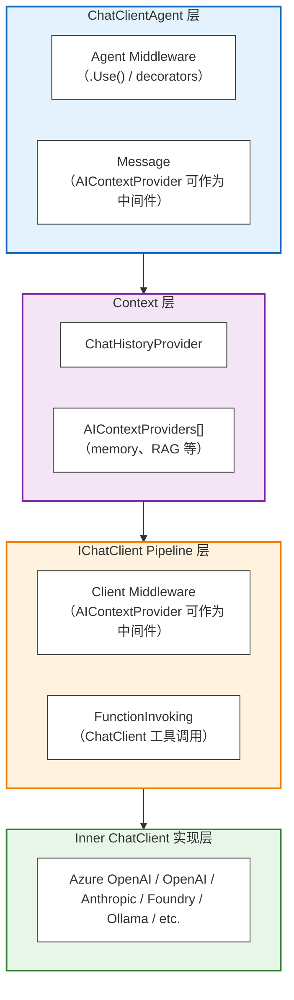
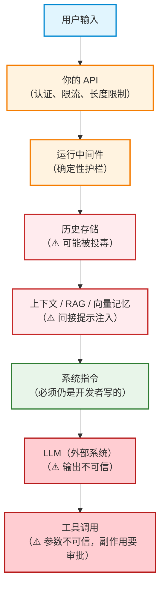

> 本文用一个会逐步变复杂的公司差旅助手「小旅」，把 Agent Framework 里分散的机制写成同一条运行时。先建立管道，再按业务往上加能力：多轮、跨会话记忆、长对话压缩、护栏、换模型、自定义智能体。每个决定都写清：挂在哪一层、为什么是这一层、挂错会怎样。

## 一次调用到底走过哪些层 ##

一次智能体调用不是“把一句话丢给模型”。调用方始终只看见三样东西：

```dotnet
AIAgent agent = ...;
AgentSession session = await agent.CreateSessionAsync();
AgentResponse response = await agent.RunAsync("帮我订下周二去悉尼的机票", session);
```

`ChatClientAgent`、自定义智能体、A2A / Copilot 这类远程代理，外观都是 `AIAgent`。编排代码认这三行即可。模型、历史、中间件、记忆都可以换，调用方不必跟着换。

本地的 `ChatClientAgent` 内部是一条分层管道：

```txt
调用方
  └─ RunAsync / RunStreamingAsync
       ├─ ① 智能体中间件（对任何 AIAgent 都有效，含 A2A）
       ├─ ② ChatHistoryProvider（唯一，负责“这一通以前说过什么”）
       ├─ ③ AIContextProviders（多个，负责“这次还要额外塞什么”）
       ├─ ④ IChatClient 中间件 / 客户端层上下文（只对本地聊天客户端有效）
       ├─ ⑤ 默认函数调用包装（可关）
       └─ ⑥ 真正的 LLM
            响应原路返回
            历史提供程序和上下文提供程序收到“刚发生了什么”
```

远程智能体（`A2AAgent`、`GitHubCopilotAgent`、`CopilotStudioAgent`）没有④⑤⑥这套本地客户端。它们仍然是 `AIAgent`，所以①仍然可用；不能给它们加 `IChatClient` 中间件，也不能假定本地一定有一份完整消息列表。

管道上有两个时钟，后面几乎所有“我加了但没生效”都来自挂错时钟：

- 外层时钟：一次 `RunAsync`。用户说一句话，你得到一个 `AgentResponse`。
- 内层时钟：工具循环。模型可能先查天气、再查航班、再下单，一次 `RunAsync` 里打多次 LLM。

压缩、按每次模型调用写历史、Harness 的默认行为，对齐的是内层时钟。智能体级上下文提供程序、外层护栏，对齐的是外层时钟。

还有一个贯穿全文的拆分：*提供程序和中间件的实例挂在智能体上，所有会话共用；某一次对话的数据只能放进 `AgentSession`*。 字段里保存“当前用户的记忆 ID”或“当前对话的数据库主键”，用户 A 和用户 B 会写串。

## 场景怎么长：小旅的七期 ##

「小旅」是内部差旅助手。需求分七期，每一期对应管道上的一层。

| 期 | 业务现象 | 接到哪一层 | 原因 |
| :--- | :--- | :--- | :--- |
| 0 | 能问答、能调工具 | `ChatClientAgent` + 函数工具 | 先有一个能跑的本地智能体 |
| 1 | “我刚才说窗口位”下一句还记得 | `AgentSession` + `ChatHistoryProvider` | 多轮靠会话，不靠手搓 List |
| 2 | 新开一通也记得“我常坐窗边” | `AIContextProvider` / 向量记忆 | 这是跨会话语义记忆，不是当前窗口 |
| 3 | 聊了40轮开始超窗口、变贵、变慢 | 压缩策略 | 只对调用方自己管的内存历史有意义 |
| 4 | 不能乱订、不能把护照号送进模型、下单 | 中间件 | 横切能力，不靠提示词 |
| 5 | 闲聊走便宜模型，订票走强模型 | 运行时路由 | 能换的是历史原文，不是下一个endpoint |
| 6 | 不走聊天模型，也要能进同一套编排 | 自定义 `AIAgent` | 守会话和两套 `Run` 的契约 |
| 7 | 每一层都按不可信输入来处理 | 安全 | 框架给挂钩，校验是应用的事 |

中途会插入内容类型、三个上下文挂载点、三种会话持久化，因为它们不是附录，而是第 1、4、5 期会用错的前提。

## 第 0 期：先有一个能跑的 ChatClientAgent ##

`ChatClientAgent` 是应用自己拥有、背后挂一个 `IChatClient` 的智能体。它本地拥有指令、工具、可选中间件、可选的本地或服务托管历史。任何实现 `Microsoft.Extensions.AI.IChatClient` 的客户端都能垫在下面。

框架默认再包一层函数调用：看到 `FunctionCallContent` 就执行工具，把 `FunctionResultContent` 喂回去。底层客户端自己已经会跑工具循环时，打开 `UseProvidedChatClientAsIs = true`，否则会出现双循环——框架调一次，客户端再调一次。这个开关和后文“在工具循环内写历史”是同一条内层时钟上的配置，一个管包装，一个管落盘。

适用：模型在你这边调，你要自己管工具、历史、中间件，并且希望以后还能换成自定义智能体或远程代理而不改编排。

不适用：对话状态完全在 Copilot Studio / Foundry Agent Service 那边，你只是远程调用；或者根本不需要 LLM，只是要一个符合 `AIAgent` 接口的组件。

```C#
using Microsoft.Agents.AI;
using Microsoft.Extensions.AI;

static string GetWeather(string city)
    => city.Contains("悉尼", StringComparison.OrdinalIgnoreCase)
        ? "悉尼多云，22°C，适合出行"
        : $"暂无 {city} 的实时天气";

static string SearchFlights(string from, string to, string date)
    => $"找到 {date} {from}->{to}：8:10 QF431、14:20 VA823";

IChatClient chatClient = /* Azure OpenAI / OpenAI / Foundry 的 IChatClient */;

AIAgent agent = new ChatClientAgent(
    chatClient,
    new ChatClientAgentOptions
    {
        Name = "XiaoLv",
        ChatOptions = new ChatOptions
        {
            Instructions = """
                你是公司差旅助手小旅。
                先确认出发地、目的地、日期，再查天气和航班。
                不要编造不存在的航班号。
                """,
            Tools =
            [
                AIFunctionFactory.Create(GetWeather),
                AIFunctionFactory.Create(SearchFlights)
            ]
        }
        // 若 chatClient 自己已经执行工具循环：
        // UseProvidedChatClientAsIs = true
    });

Console.WriteLine(await agent.RunAsync("下周二从墨尔本去悉尼，帮我看看。"));
```

### 响应里不只有答案 ###

`RunAsync` 回来的是 `AgentResponse`，里面可能同时有文本、工具调用、工具结果、推理文本、状态更新。不要把整个响应当成最终答案。所有响应类型都有 `Text`，用来汇总各条消息里的 `TextContent`。要做审计或自己写编排，走 `Messages` / `Contents`。

```C#
AgentResponse response = await agent.RunAsync("墨尔本天气怎么样？");
Console.WriteLine(response.Text);
Console.WriteLine(response.Messages.Count);

await foreach (var update in agent.RunStreamingAsync("再看看悉尼"))
{
    if (!string.IsNullOrEmpty(update.Text))
        Console.Write(update.Text);
}
```

流式和非流式不是两套语义，只是切片方式不同。非流式等全部结束给你一个 `AgentResponse`；流式把同一批内容切成 `AgentResponseUpdate`。中间件如果只实现了非流式版本，框架会把流式降成“内部先跑完再假装流”，打字机效果会丢。

`AgentRunOptions` 在抽象层几乎没有通用旋钮，因为 `ChatClientAgent`、A2A、自定义回显智能体能改的东西不是一类。知道具体类型时，再传类型专用选项。稳定能力放构造期，一次请求的临时能力放 `RunOptions`：

```C#
var chatOptions = new ChatOptions
{
    Tools = [AIFunctionFactory.Create(GetWeather)]
};

await agent.RunAsync(
    "阿姆斯特丹天气如何？",
    options: new ChatClientAgentRunOptions(chatOptions));
```

这些 `ChatOptions` 会和智能体构造时的选项合并，再交给底层 `IChatClient`。

### 消息是内容项的列表，历史能不能带走取决于类型 ###

输入输出都是 `ChatMessage`，消息再拆成继承 `AIContent` 的内容项。提供方可以加自己的子类。常用的几种决定了后文压缩和换模型能不能成立：

| 类型 | 含义 | 对历史和路由 |
| :--- | :--- | :--- |
| `TextContent` | 用户话或助手文本答案 | 几乎所有模型都吃 |
| `DataContent` | 图片 / 音频 / 视频字节 | 目标模型必须支持该模态；换厂商时常丢 |
| `UriContent` | 托管文件 URL | URL 对新厂商是否可见、会不会过期 |
| `FunctionCallContent` | 推理服务要求调用工具 | 必须和结果成对；压缩按组删 |
| `FunctionResultContent` | 工具返回 | 单独删会让下一跳 API 报错 |


「调用方管理历史就能换模型」是不完整的。完整条件是：你拥有原文，并且下一跳接受这些角色、模态和工具消息对。小旅如果允许用户发登机牌照片（`DataContent`），切到只支持文本的便宜模型时，不是改一个路由名就结束，要先剥离或改写这部分内容。

管道怎么定制：中间件一层，上下文有三个挂载点



理解管道，是为了把东西挂对层。智能体中间件用构建器包在最外：


```C#
var middlewareAgent = originalAgent
    .AsBuilder()
    .Use(runFunc: MyAgentMiddleware, runStreamingFunc: MyStreamingMiddleware)
    .Build();
```

这一层包住整个执行，包括上下文解析和客户端调用。好处是 A2A、GitHub Copilot 也能用；代价是这里不能假设内层一定是 `ChatClientAgent`，只能动各智能体共通的输入输出。

上下文不是只有一个插槽。三个挂载点改的不是同一段数据：

```txt
A. agent.AsBuilder().UseAIContextProviders(...)
   智能体最外层，任意 AIAgent 都能用
   适合往远程智能体里塞几条消息
   看不见本地 IChatClient，也不能假定有完整本地历史

B. new ChatClientAgent(..., options.AIContextProviders = [...])
   ChatClientAgent 的上下文层
   发生在历史加载之后、打模型之前
   这里产生的合成消息，可能被 ChatHistoryProvider 当新消息存盘
   向量记忆、业务画像通常挂这里

C. chatClient.AsBuilder().UseAIContextProviders(...)
   聊天客户端层，走进工具循环的每一次 LLM 调用
   必须处在正在运行的 AIAgent 上下文里
   压缩、按每次模型调用改 prompt，挂这里
```

```C#
// A：任意智能体都能注入消息
var contextAgent = originalAgent
    .AsBuilder()
    .UseAIContextProviders(new MyMessageContextProvider())
    .Build();

// B：ChatClientAgent 构造期
var agent = new ChatClientAgent(chatClient, new ChatClientAgentOptions
{
    ChatHistoryProvider = new InMemoryChatHistoryProvider(),
    AIContextProviders = [new MyMemoryProvider(), new MyRagProvider()],
});

// C：客户端层，进入工具循环
var chatClient = rawChatClient
    .AsBuilder()
    .Use(CustomChatClientMiddleware)
    .UseAIContextProviders(new MyContextProvider())
    .Build();
```

小旅可以三层同时存在，但职责必须错开：A 给远程智能体打审计前缀，B 放跨会话座位偏好，C 做每次工具循环前的压缩。三层都挂同一套记忆提供程序，会检索三次、写入三次，记忆反馈环加倍。

智能体在把消息发给聊天客户端之前，会依次调用每个提供程序的 `InvokingAsync()`，上一个的输出成为下一个的输入。跑完后再通知它们有新消息。默认的完整顺序是：

- 智能体中间件（若配置）
- `ChatHistoryProvider` 把对话历史装进请求消息列表
- `AIContextProviders` 追加消息、工具或指令
- `IChatClient` 中间件（若装饰）
- `IChatClient` 把请求发给 LLM
- 响应沿相同各层回流
- 通知历史提供程序和上下文提供程序

`ChatClientAgent` 默认会给传入的客户端包装函数调用。要跳过，设 `UseProvidedChatClientAsIs = true`。

## 第 1 期：多轮的本质是 Session，不是手里的 List ##

没有会话时，每次 `RunAsync` 都是一次新交互。模型看不到上一句“我叫刘振”。

`AgentSession` 不是消息列表的别名。它是这通对话的不透明状态容器：

- `StateBag`：任意键值，给提供程序和工具放会话级状态
- 具体实现还可能带服务端对话 ID（`resp_*`、`conv_*`、A2A 的 context/task）
- 序列化后必须用创建它的那个智能体配置还原

C# 里 `AgentSession` 是抽象基类。`CreateSessionAsync()` 得到的具体类型可能额外带远程历史 ID。会话和智能体、提供方绑定。拿到另一套配置上复用，上下文会坏掉。

### 历史归谁，后面所有能力都从这里分叉 ###

| 维度 | 调用方管理 | 推理服务管理 |
| :--- | :--- | :--- |
| 消息存储 | 应用内存 / 数据库 / 自定义 ChatHistoryProvider | 服务端，你只拿一个不透明 ID |
| 每次请求内容 | 相关历史 + 本轮新消息 | ID + 本轮新消息 |
| 能否换模型/厂商 | 可以，前提是目标吃得下旧内容类型 | 基本不能跨厂；同厂换模型也取决于服务自己 |
| 压缩策略 | 有 | 没有，服务自己管窗口 |
| 多租户/隔离风险 | 你自己隔离存储键 | 不能把服务端 ID 当用户凭证 |

OpenAI Responses 的 `store=true/false` 就是在这两档之间切换。有的服务两种 API 都提供，不要只看产品名。

*标准用法*：

```C#
AgentSession session = await agent.CreateSessionAsync();

await agent.RunAsync("我叫刘振，座位偏好靠窗。", session);
var reply = await agent.RunAsync("那帮我订下周二墨尔本到悉尼的机票。", session);
Console.WriteLine(reply.Text);

var payload = agent.SerializeSession(session);
AgentSession resumed = await agent.DeserializeSessionAsync(payload);
await agent.RunAsync("我刚才说的座位偏好是什么？", resumed);
```

从已有服务对话恢复，因智能体类型而异：

```C#
AgentSession session = await chatClientAgent.CreateSessionAsync(existingConversationId);
AgentSession a2aSession = await a2aAgent.CreateSessionAsync(contextId, taskId);
```

服务托管历史时，会话里是远程标识。OpenAI Responses 可能把 `resp_*` 当作 `previous_response_id`，Conversations 可能把 `conv_*` 当作 `conversation`。这些 ID 默认绑在 API 密钥或项目上，不绑你的登录用户。

单用户应用、或每个租户一把密钥时，这个边界刚好够用。危险模式是：同一个 key / 同一个 Foundry project 服务许多最终用户，把原始服务端 ID 回传给浏览器，再不加校验地接回来。正确做法是服务端存映射表 `你的 sessionId` -> `服务端 conversationId`，恢复前验证当前用户或租户。不要把 `service_session_id`、`previous_response_id`、`conversation_id` 当成授权边界。

查看内存历史——只有调用方管理、并且用的是内置内存提供程序时才成立：

```C#
var provider = agent.GetService<InMemoryChatHistoryProvider>();
List<ChatMessage>? messages = provider?.GetMessages(session);
```

服务托管时这里常常是空的，权威在服务端。若要看远程 ID：

```C#
ChatClientAgentSession typed = (ChatClientAgentSession)session;
Console.WriteLine(typed.ConversationId);
```

### 两种现成会话，三种“谁来读写” ###

自定义智能体或自己选存储时，先选会话基类：

| 类型 | 自己存不消息 | 什么时候用 |
| :--- | :--- | :--- |
| `InMemoryAgentSession` | 存，可序列化成 JSON | 调用方管理历史、要压缩、要换模型、要本地审计 |
| `ServiceIdAgentSession` | 不存消息，只挂一个外部 ID | 历史在 Redis 或服务端会话里，你只保存钥匙 |

这和两种存储模式是同一件事的两端：本地会话状态对应内存会话 + 内存历史提供程序；服务托管对应会话里一个服务端 ID。

读写会话还有三个不同角色，不要混成一个“持久化”：

- `SerializeSession` / `DeserializeSessionAsync`：把整袋状态变成字节，应对进程重启。要存完整对象，不只存文本。
- `ChatHistoryProvider`：每次 Run（或每次模型调用）读写消息，决定 prompt 里出现哪些旧话。
- `AgentSessionStore`：自托管时按 `continuation ID` 在每次 HTTP 请求里取送整颗会话。它既不是手动序列化的替代，也不是历史提供程序的替代。

Continuation ID 必须是你签发、并绑定用户的 ID，不能把 `resp_*` 直接当 continuation。还原时用同一套智能体和提供方配置；序列化会话和任何服务端 ID 都按敏感应用状态来存，按已认证用户或租户绑定后再允许恢复。

Harness Agent 用同一套会话生命周期。跨轮次复用同一个会话，待办、运行模式、文件记忆、工具审批、后台任务状态才连在一起。进程要重启就序列化整颗会话。HarnessAgent 默认 `InMemoryChatHistoryProvider`，要换存储走 `HarnessAgentOptions.ChatHistoryProvider`。`AsHarnessAgent(options)` 等于 `new HarnessAgent(chatClient, options)`。

Harness 在工具循环内部、每次模型调用之后就写本地历史，而不是只在外层 RunAsync 结束时写一次。继续传入同一会话，循环内历史和默认上下文提供程序的状态才会保留。

### 历史提供程序：盖章是为了避免把旧账再记一遍 ###

`ChatHistoryProvider` 实例挂在智能体上，所有会话共用。字段里只放数据库客户端、集合名、序列化选项；这一次对话的 DbKey、已加载消息放进 `Session`。工具类是 `ProviderSessionState<T>`。

简单实现重写两个方法：

- `ProvideChatHistoryAsync`：读出旧消息
- `StoreChatHistoryAsync`：写入本轮新消息

基类的 `InvokingCoreAsync` 会给历史消息盖「来源章」`AgentRequestMessageSourceType.ChatHistory`，把历史前置到调用方输入前面。`InvokedCoreAsync` 在运行失败时直接返回；成功则滤掉已经来自历史的消息，只把新消息交给 `StoreChatHistoryAsync`。不盖章，存储会把已经存过的历史再存一遍，列表指数膨胀。

构造函数上的 `provideOutputMessageFilter`、`storeInputMessageFilter` 用来改这两道过滤。升到自己重写 `InvokingCoreAsync` / `InvokedCoreAsync` 时，要把基类这套合并、盖章、失败短路重新做一遍。

内存历史上的粗暴限流，用归约器，不是后文的压缩框架：

```C#
ChatHistoryProvider = new InMemoryChatHistoryProvider(
    new InMemoryChatHistoryProviderOptions
    {
        ChatReducer = new MessageCountingChatReducer(20)
    })
```

归约器是存储侧“最多留 20 条”。压缩是按语义组、按 token、按轮次来砍。归约器配置只作用于内存历史提供程序；服务托管历史怎么缩，由服务自己决定。

默认本地历史提供程序在整次 `RunAsync` 结束才落盘。一次订票却可能是：用户一句话 → 调 SearchFlights → 调 GetWeather → 才给出建议。三次模型调用之间，若希望历史长得像服务托管对话那样细，打开按每次服务调用持久化（文档中的 `require_per_service_call_history_persistence=True`），让历史提供程序围着内层时钟转。短问答、工具最多一跳，不必开。

第三方存储的要点只有三条：消息放在会话作用域的键下；返回给模型的历史保持在窗口内；提供程序自己的标识符进 Session。简单版把 `List<ChatMessage>` 直接放进会话状态即可起步；生产里换成 Redis / 数据库，结构不变。

## 第 2 期：当前窗口、会话工作记忆、跨会话语义记忆 ##

“记得”在框架里不是一个 List，是三层：

| 层次 | 机制 | 记住什么 | 生命周期 |
| :--- | :--- | :--- | :--- |
| 当前对话窗口 | `ChatHistoryProvider` | 这通话里原始消息 | 随会话 |
| 会话级工作记忆 | `StateBag`；Harness 的 todo、模式、文件记忆 | 这通话的结构化状态 | 随会话，可序列化 |
| 跨会话语义记忆 | `ChatHistoryMemoryProvider` 或自定义 `AIContextProvider` | 向量化后的相关片段 | 按 user / app / agent 作用域活着 |

只要“这一通里上一句还在”，用历史提供程序，不要上向量库。要把 RAG 文档、用户画像、动态政策塞进本轮，自定义 `AIContextProvider`。要“新开一通也能想起我爱靠窗”，用 `ChatHistoryMemoryProvider`。要用待办、技能、文件记忆，用 `HarnessAgent` 的默认组合，再用 `Disable*` 减配。

`AIContextProvider` 同样是实例跨会话共享、会话数据进 `Session`。调用前注入指令、消息、工具；调用后从新消息抽状态。简单实现重写：

- `ProvideAIContextAsync`
- `StoreAIContextAsync`

基类 `InvokingCoreAsync` 默认只把调用方传入的消息交给 `ProvideAIContextAsync`（可用 `provideInputMessageFilter` 改），给返回消息盖上 `AIContextProvider` 章，再把消息、工具、指令追加到现有内容后面。`InvokedCoreAsync` 遇到失败就停；成功则同样先滤输入，再交给 `StoreAIContextAsync`（`storeInputMessageFilter` 可改）。

升到高级实现、自己重写 `Core` 方法时，只对 `AgentRequestMessageSourceType.External` 做检索和存储。否则注入的记忆会被再写进记忆，变成“我记得我记得……”。历史盖的是 `ChatHistory`，上下文盖的是 `AIContextProvider`，调用方原话才是 External。三种来源混在同一个 `Messages` 列表里发给模型。

Harness 创建时按顺序装上 `TodoProvider`、`AgentModeProvider`、`FileMemoryProvider`、`AgentSkillsProvider`，再追加 `HarnessAgentOptions.AIContextProviders`。用 `DisableTodoProvider`、`DisableAgentModeProvider`、`DisableFileMemory`、`DisableAgentSkillsProvider` 减配。模式和技能用 `AgentModeProviderOptions`、`AgentSkillsSource` 配；文件记忆存储可换成 `FileMemoryStore`。文件访问走 `FileAccessStore` / `FileAccessProviderOptions`，后台委派走 `BackgroundAgents` / `BackgroundAgentsProviderOptions`，都是 `opt-in`。不要在 `Harness` 上再重复挂一套同等功能的提供程序，除非先 `Disable*`。

### 向量记忆：作用域拆成两个，过滤器是同一套盖章的旋钮 ###

`ChatHistoryMemoryProvider` 分两阶段：每次调用后把新消息连同嵌入写入向量库；每次调用前（或按需通过工具）按当前用户输入做语义检索，注入为上下文。作用域用应用、智能体、用户、会话四个标识控制。

先决条件：`Microsoft.Extensions.VectorData.Abstractions` 上的向量存储（内存、Azure AI Search 或其他已对接实现）、存储上配好的嵌入模型、聊天模型部署、.NET 8+。生产不要用内存向量库。

```C#
VectorStore vectorStore = new InMemoryVectorStore(new InMemoryVectorStoreOptions
{
    EmbeddingGenerator = embeddingGenerator
});

AIAgent agent = chatClient.AsAIAgent(new ChatClientAgentOptions
{
    Name = "MemoryAgent",
    ChatOptions = new() { Instructions = "你是差旅助手。优先尊重已知的座位和航司偏好。" },
    AIContextProviders =
    [
        new ChatHistoryMemoryProvider(
            vectorStore,
            collectionName: "chathistory",
            vectorDimensions: 3072,
            session => new ChatHistoryMemoryProvider.State(
                storageScope: new()
                {
                    UserId = "user-123",
                    SessionId = Guid.NewGuid().ToString()
                },
                searchScope: new()
                {
                    UserId = "user-123"
                }))
    ]
});

AgentSession s1 = await agent.CreateSessionAsync();
await agent.RunAsync("我坐飞机一定要靠窗。", s1);

AgentSession s2 = await agent.CreateSessionAsync();
Console.WriteLine(await agent.RunAsync("帮我订墨尔本到悉尼的机票。", s2));
```

`storageScope` 决定写入时打哪些元数据；`searchScope` 决定检索过滤。两者可以故意不一致：写入带上 `UserId` + `SessionId`，方便按会话清理；检索只带 `UserId`，新会话也能搜到旧偏好。还可以加 `AgentId`、`ApplicationId` 做更细隔离。同一会话挂两个记忆提供程序时改 `StateKey`，否则会在 `StateBag` 里抢键。

*搜索时机*：

- `BeforeAIInvoke`（默认）：每轮自动搜。适合座位偏好、差旅政策这种几乎每次都有用的记忆。
- `OnDemandFunctionCalling`：暴露 `Search` 工具，让模型自己决定要想。适合记忆很吵的场景。代价是模型可能不调或乱调；搜索词由模型生成，对向量库是不可信输入，和“工具参数不可信”是同一条规则。

*其余旋钮不是装饰*：

| 参数 | 实际影响 |
| :--- | :--- |
| `MaxResults` | 3，每轮往 prompt 里塞几条旧记忆 |
| `ContextPrompt` | `## Memories...`，模型把检索结果当成什么角色的文本 |
| `SearchInputMessageFilter` | 只拿 External，避免用历史和记忆搜自己 |
| `StorageInputRequestMessageFilter` | 只存 External，避免把注入文本再写入向量库 |
| `StorageInputResponseMessageFilter` | 不过滤助手回复，助手幻觉也会被记住 |
| `FunctionToolName` / `FunctionToolDescription` | `Search` / 一段默认描述，仅按需搜索时有效 |
| `EnableSensitiveTelemetryData` / `Redactor` | 关闭 / 打码为 `<redacted>`，Trace 级日志会含 PII 和检索词 |
| `StateKey` | 类型名，多实例共会话时必须改 |

座位偏好这种要长期记住的，可以存用户原话。助手随口说的“已订妥”默认也会进向量库，除非给响应过滤器加上限制。否则新会话会把上次幻觉当事实检索出来。向量库被投毒时，内容会原样进 LLM 上下文，提供程序不做校验。按需搜索的查询词按不可信输入处理。生产关闭 Trace 级完整查询日志，或使用 `Redactor`。

## 第 3 期：窗口炸了以后，压缩的是消息组 ##

每调一次 LLM，整段历史都要付 token。压缩解决超窗口、费用、延迟。它只对调用方自己管的内存历史有意义。Foundry Agent、默认 `store=true` 的 Responses、Copilot Studio，上下文在服务端，配压缩等于没配。

压缩是实验性能力，使用前加上 `#pragma warning disable MAAI001`。

它不直接操作扁平 `List<ChatMessage>`，先编成 `MessageIndex`，再切成原子 `MessageGroup`。每个组跟踪消息数、字节数、估计 token。组类型决定为什么不能按条删：

| 组类型 | 为什么成组 |
| :--- | :--- |
| `System` | 系统消息始终保留，删了人格就没了 |
| `User` | 一轮的起点 |
| `AssistantText` | 纯文本回答 |
| `ToolCall` | 助手的工具调用 + 对应工具结果，拆开会让下一跳报错 |
| `Summary` | 摘要策略生成的浓缩组 |

每个策略有两个谓词。Trigger 决定要不要开始砍，false 就整段跳过。Target 决定砍到什么时候停；不设时默认是 Trigger `的反条件。MinimumPreserved` 保护最近若干非系统组，避免把正在进行的这一轮也摘要掉。

`CompactionTrigger` 是 `Func<MessageIndex, bool>`。常用工厂：`Always`、`Never`、`TokensExceed`、`MessagesExceed`、`TurnsExceed`、`GroupsExceed`、`HasToolCalls`。用 `All` 做与、`Any` 做或。例如只有既有工具调用、token 又超了，才折叠工具结果：

```C#
CompactionTrigger trigger = CompactionTriggers.All(
    CompactionTriggers.HasToolCalls(),
    CompactionTriggers.TokensExceed(2000));
```

*五种策略从温和到暴力*：

#### ToolResultCompactionStrategy ####

只把旧工具组收成 `[Tool calls: SearchFlights, GetWeather]`。不碰用户原话和纯文本回答。`MinimumPreserved` 默认 2。不耗额外 LLM。适合工具输出又长又臭的第一刀。

#### SummarizationCompactionStrategy ####

另起一个 `IChatClient`，把更旧的对话收成一段摘要，插入为 `Summary` 组。默认提示保留事实、决策、偏好、工具结果，可换自定义提示。`MinimumPreserved `默认 4。要钱，有幻觉风险，摘要客户端用便宜小模型。

#### SlidingWindowCompactionStrategy ####

按用户轮次留最近 N 轮，不是按消息条数。一轮 = 一条用户消息 + 后面所有助手 / 工具组，直到下一个用户。系统消息始终留。`MinimumPreserved` 默认 1。

#### TruncationCompactionStrategy ####

从最旧非系统组开始丢，直到达标。遵守原子组边界。`MinimumPreserved` 默认 32。这是熔断器，不是日常策略。

#### PipelineCompactionStrategy ####

管道自身 Trigger 永远为真，每个子策略看自己的 Trigger。顺序必须温和在前、暴力在后。

```C#
var pipeline = new PipelineCompactionStrategy(
    new ToolResultCompactionStrategy(CompactionTriggers.TokensExceed(0x200)),
    new SummarizationCompactionStrategy(summarizerClient, CompactionTriggers.TokensExceed(0x500)),
    new SlidingWindowCompactionStrategy(CompactionTriggers.TurnsExceed(8)),
    new TruncationCompactionStrategy(
        CompactionTriggers.TokensExceed(0x8000),
        minimumPreserved: 10));
```

挂载位置决定压缩的是请求里的副本，还是存盘历史：

- 挂在 `ChatClientBuilder.UseAIContextProviders`：走进工具循环，每次打 LLM 前压当前请求。原始存盘历史可以保持完整。这是大多数生产想要的，对应上文挂载点 C。
- 挂在 `ChatClientAgentOptions.AIContextProviders`：智能体级上下文，发生在历史落盘之前。摘要可能被历史提供程序当成新消息存进去。以后历史里会出现合成摘要，原话可能已经没了。对应挂载点 B。

```C#
AIAgent agent = agentChatClient
    .AsBuilder()
    .UseAIContextProviders(new CompactionProvider(pipeline))
    .BuildAIAgent(new ChatClientAgentOptions
    {
        Name = "XiaoLv",
        ChatOptions = new()
        {
            Instructions = "你是差旅助手。",
            Tools = [AIFunctionFactory.Create(SearchFlights)]
        }
    });
```

只需要一种策略时，不必包管道，直接把策略传给 `CompactionProvider`。没有会话、只对一堆旧消息做一次离线压缩，用 `CompactionProvider.CompactAsync`。

Harness 把压缩接到每次模型调用前。默认关。同时设 `MaxContextWindowTokens` 和 `MaxOutputTokens` 会生成默认的 `ContextWindowCompactionStrategy`；或自己设 `CompactionStrategy`。`DisableCompaction = true` 覆盖这些，但 `MaxOutputTokens` 仍会写到 `ChatOptions`。若 Harness 同时创建默认内存历史提供程序，会把策略的聊天归约器配上去；自定义历史提供程序则按你给的用。

## 第 4 期：中间件——在模型之外把门关上 ##

前三期解决的是“模型能不能看见该看见的话”：有智能体、有会话、有跨会话记忆、有压缩。第 4 期解决的是另一件事：*有些事不能交给模型决定*。

系统提示做不到这件事。提示词是启发式的，用户换一种说法就能绕。中间件是管道上的挂钩：可以在进模型之前拒绝，在工具真正执行前改参数或掐死循环，在出站之后改写回复。

小旅这一期要落地的具体行为：

- 聊天框里出现护照号、密码，整次 `Run` 都不要打模型
- 模型已经选中禁飞航班并要调用 `CreateBooking`，这一跳必须停
- HTTP 层认出的 `user_id` 必须写进下单工具，不能让模型猜
- 预订号要在下一句“就订这个”时还在
- 超时不能把异常甩到员工脸上
- 每条对外回复末尾加免责声明
- 发给模型的最终 prompt 要能审计

这些不是六套框架，是同一条 `RunAsync` 上不同深度的挂钩。

### 三类挂钩卡在三个深度 ###

| 类型 | 拦截点 | 能改什么 | 谁能用 |
| :--- | :--- | :--- | :--- |
| 智能体运行中间件 | `RunAsync` / `RunStreamingAsync` 最外层 | 整次运行的输入输出，可整次短路 | 任何 AIAgent，包括 A2A、Copilot |
| 函数调用中间件 | 每一个工具真正执行前后 | 参数、返回值、要不要继续工具循环 | 仅 `FunctionInvokingChatClient` 这条线，典型是 `ChatClientAgent` |
| `IChatClient` 中间件 | 每次真正访问推理服务前后 | 已经拼好历史和记忆之后的消息、`ChatOptions` | 只有本地 `IChatClient` 智能体 |

同类多个实例组成链，每个必须调用 `next` / `innerAgent`，除非有意短路。先注册的在外。

```C#
var middlewareEnabledAgent = originalAgent
    .AsBuilder()
    .Use(runFunc: CustomAgentRunMiddleware, runStreamingFunc: CustomAgentRunStreamingMiddleware)
    .Use(CustomFunctionCallingMiddleware)
    .Build();
```

`IChatClient` 中间件不挂在 `AIAgent` 上，挂在客户端用于 `ChatClientAgent` 之前，或写在 SDK 辅助方法的 `clientFactory` 里：

```C#
var agent = projectClient.AsAIAgent(
    model: "gpt-4o-mini",
    instructions: "你是差旅助手。",
    clientFactory: chatClient => chatClient
        .AsBuilder()
        .Use(getResponseFunc: CustomChatClientMiddleware, getStreamingResponseFunc: null)
        .Build());
```

开发里 `DefaultAzureCredential` 方便，生产换成明确凭据（例如托管标识），避免探测链带来的延迟和意外回退。

小旅怎么选层：

| 需求 | 用哪一层 | 原因 |
| :--- | :--- | :--- |
| 输入含证件号，直接拒绝 | 运行中间件 | 要在进管道前返回，模型计费为零 |
| 回复未尾加免责声明、超长截断 | 运行中间件改 `AgentResponse` | 改的是给调用方的最终消息 |
| 超时返回中文 | 运行中间件 `try/catch` | 外层时钟的失败 |
| 记录每次真正发给模型的 `prompt` | `IChatClient` 中间件 | 这时历史、记忆、压缩都已经发生过 |
| 强制给 `CreateBooking` 填入当前用户 | 函数中间件 | 模型可能不传或不传对 |
| 禁飞航班已经进入下单 | 函数中间件 + Terminate | 模型已经叫过，要掐的是工具循环 |
| 给 A2A 远程智能体加审计 | 只能用运行中间件 | 没有 `IChatClient`，也没有本地函数循环 |

远程智能体仍然是 `AIAgent`，所以运行中间件和“只注入消息”的 `UseAIContextProviders` 可用；不能给它们加聊天客户端中间件，也不能假定本地一定有完整消息列表。

### 先分清两个作用域，再写函数 ###

*智能体级*：构造时包好，此后每次 Run 都在。

*运行级*：对这一次调用临时再包一层。

两者同时存在时，智能体级在外，运行级在内，再进真正执行。

```txt
护栏 / 异常处理（智能体级，每次都在）
  调试日志（运行级，只对这一次）
    历史 + 上下文 + 压缩
      IChatClient 中间件
        LLM
          工具循环
            注入 user_id
            Terminate
```

```C#
var agentWithMiddleware = baseAgent
    .AsBuilder()
    .Use(runFunc: SecurityMiddleware, runStreamingFunc: SecurityStreamingMiddleware)
    .Build();

Console.WriteLine(await agentWithMiddleware.RunAsync("巴黎天气怎么样？"));

Console.WriteLine(await baseAgent
    .AsBuilder()
    .Use(runFunc: DebugMiddleware, runStreamingFunc: DebugStreamingMiddleware)
    .Build()
    .RunAsync("东京天气怎么样？"));
```

`.AsBuilder().Use(...).Build()` 是轻量包装，可以链式叠多个 `.Use()`。不要为了“这一次多打一行日志”去改智能体构造。


流式有一条硬规则：理想情况下 `runFunc` 和 `runStreamingFunc` 都给。只给非流式时，框架会把流式收成“内部先跑完”，打字机效果丢了。只想在入口看一眼输入、不碰输出、也不要阻断流式，用 `Use(sharedFunc: ...)`。加免责声明、截断、吞异常，必须用完整的一对函数——那些都要碰输出。

四类回调的形状如下。除非打算中止，否则必须调用内层。

```C#
async Task<AgentResponse> CustomAgentRunMiddleware(
    IEnumerable<ChatMessage> messages,
    AgentSession? session,
    AgentRunOptions? options,
    AIAgent innerAgent,
    CancellationToken cancellationToken)
{
    var response = await innerAgent
        .RunAsync(messages, session, options, cancellationToken)
        .ConfigureAwait(false);
    return response;
}

async IAsyncEnumerable<AgentResponseUpdate> CustomAgentRunStreamingMiddleware(
    IEnumerable<ChatMessage> messages,
    AgentSession? session,
    AgentRunOptions? options,
    AIAgent innerAgent,
    [EnumeratorCancellation] CancellationToken cancellationToken)
{
    await foreach (var update in innerAgent.RunStreamingAsync(
        messages, session, options, cancellationToken))
    {
        yield return update;
    }
}

async ValueTask<object?> CustomFunctionCallingMiddleware(
    AIAgent agent,
    FunctionInvocationContext context,
    Func<FunctionInvocationContext, CancellationToken, ValueTask<object?>> next,
    CancellationToken cancellationToken)
{
    Console.WriteLine($"Function Name: {context.Function.Name}");
    var result = await next(context, cancellationToken);
    Console.WriteLine($"Function Call Result: {result}");
    return result;
}

async Task<ChatResponse> CustomChatClientMiddleware(
    IEnumerable<ChatMessage> messages,
    ChatOptions? options,
    IChatClient innerChatClient,
    CancellationToken cancellationToken)
{
    Console.WriteLine($"[ChatLog] Sending {messages.Count()} messages.");
    foreach (var msg in messages)
    {
        var preview = msg.Text is null
            ? ""
            : msg.Text[..Math.Min(msg.Text.Length, 80)];
        Console.WriteLine($"[ChatLog]   {msg.Role}: {preview}");
    }

    var response = await innerChatClient.GetResponseAsync(messages, options, cancellationToken);
    Console.WriteLine($"[ChatLog] Received {response.Messages.Count} messages.");
    return response;
}
```

客户端中间件看到的 `messages`，已经包含历史和记忆。要审计“模型真正吃到了什么”，挂这里，不要挂在运行中间件入口——入口里还没有旧对话。

### 护栏：进模型之前、出模型之后各拦一道 ###

护栏管的是整次 `Run` 进不进、出不出。入站拒绝时不调用 `innerAgent`，这一跳模型计费为零。

```C#
async Task<AgentResponse> GuardrailMiddleware(
    IEnumerable<ChatMessage> messages,
    AgentSession? session,
    AgentRunOptions? options,
    AIAgent innerAgent,
    CancellationToken cancellationToken)
{
    var lastMessage = messages.LastOrDefault()?.Text?.ToLowerInvariant() ?? "";
    string[] blockedWords = ["password", "secret", "credentials", "护照号", "身份证"];

    foreach (var word in blockedWords)
    {
        if (lastMessage.Contains(word))
        {
            Console.WriteLine($"[Guardrail] Blocked request containing '{word}'.");
            return new AgentResponse(
            [
                new ChatMessage(
                    ChatRole.Assistant,
                    $"抱歉，我不能处理包含“{word}”的请求。")
            ]);
        }
    }

    var response = await innerAgent.RunAsync(messages, session, options, cancellationToken);

    var responseText = response.Messages.LastOrDefault()?.Text ?? "";
    if (responseText.Length > 5000)
    {
        Console.WriteLine("[Guardrail] Response too long, truncating.");
        return new AgentResponse(
        [
            new ChatMessage(
                ChatRole.Assistant,
                responseText[..5000] + "... [truncated]")
        ]);
    }

    return response;
}

var guardedAgent = agent
    .AsBuilder()
    .Use(runFunc: GuardrailMiddleware, runStreamingFunc: null)
    .Build();

Console.WriteLine(await guardedAgent.RunAsync("下周二墨尔本到悉尼怎么走？"));
Console.WriteLine(await guardedAgent.RunAsync("我的 password 是什么？"));
```

第一句会进模型。第二句在中间件里就被挡回来，`innerAgent.RunAsync` 根本不会执行。默认短路等于这次 Run 在管道中途结束：历史提供程序看不到一次“成功的模型回合”。若连这条拒绝也要记进会话，自己在返回前把用户消息和拒绝消息交给历史层，或把拒绝写成一次正常 Run 的结果再存。

只给了 `runFunc`、`runStreamingFunc: null` 时，流式调用会被收成非流式，才能满足“先看完全文再决定拦不拦”。入站检查可以在流式中间件开头做完再 `yield`；出站截断很难在真流式里做干净，因为全文还没到。所以：

- 入站拒答：流式、非流式都可以在调用内层之前做
- 出站改写、限长：用非流式，或在流式里先收齐 `updates.ToAgentResponse()` 再决定——那已经不是真流式了
关键词列表仍然是启发式护栏。FIDES 按标签做信息流控制，拦的是“检索来的毒文档想借订票工具把数据带出去”。两者叠用：关键词挡明显不该问的，FIDES 挡间接外泄。

### 改结果、吞异常：还是这层，只是动手位置不同 ###

免责声明、降级文案，和护栏共用运行中间件，区别只是在调用内层之后，或在 `catch` 里。

```C#
async Task<AgentResponse> ResultOverrideMiddleware(
    IEnumerable<ChatMessage> messages,
    AgentSession? session,
    AgentRunOptions? options,
    AIAgent innerAgent,
    CancellationToken cancellationToken)
{
    var response = await innerAgent.RunAsync(messages, session, options, cancellationToken);

    var modified = response.Messages.Select(msg =>
    {
        if (msg.Role == ChatRole.Assistant && msg.Text is not null)
        {
            return new ChatMessage(
                ChatRole.Assistant,
                msg.Text + "\n\n_免责声明：行程信息由 AI 生成，下单前请以航司页面为准。_");
        }
        return msg;
    }).ToList();

    return new AgentResponse(modified);
}

async Task<AgentResponse> ExceptionHandlingMiddleware(
    IEnumerable<ChatMessage> messages,
    AgentSession? session,
    AgentRunOptions? options,
    AIAgent innerAgent,
    CancellationToken cancellationToken)
{
    try
    {
        return await innerAgent.RunAsync(messages, session, options, cancellationToken);
    }
    catch (TimeoutException ex)
    {
        Console.WriteLine($"[ExceptionHandler] timeout: {ex.Message}");
        return new AgentResponse(
        [
            new ChatMessage(ChatRole.Assistant, "请求超时，请稍后再试。")
        ]);
    }
    catch (Exception ex)
    {
        Console.WriteLine($"[ExceptionHandler] error: {ex.Message}");
        return new AgentResponse(
        [
            new ChatMessage(ChatRole.Assistant, "处理请求时出错。")
        ]);
    }
}
```

注册顺序有意义。异常处理放最外，才能接住护栏之后各层抛出的超时。改结果放在护栏出站之外或之内，决定免责声明会不会被截断逻辑再切一刀。先想洋葱，再写 `.Use()`。

### 终止：掐的是工具循环，不是整次 Run ###

护栏返回一个 `AgentResponse`，等于整次 Run 结束。`FunctionInvocationContext.Terminate = true` 不是这件事。它发生在更里面：模型已经要求调工具，函数中间件正在执行这个工具，你决定不要把工具结果再送回模型。

```C#
static string CreateBooking(string flightNo, string userId, string tenant = "default")
    => $"booking:{tenant}:{userId}:{flightNo}";

async ValueTask<object?> BookingApprovalMiddleware(
    AIAgent agent,
    FunctionInvocationContext context,
    Func<FunctionInvocationContext, CancellationToken, ValueTask<object?>> next,
    CancellationToken cancellationToken)
{
    if (context.Function.Name == nameof(CreateBooking))
    {
        var flightNo = context.Arguments.TryGetValue("flightNo", out var raw)
            ? raw?.ToString()
            : "";

        if (string.Equals(flightNo, "VA823", StringComparison.OrdinalIgnoreCase))
        {
            context.Terminate = true;
            return "该航班不在公司协议范围内，已中止本轮工具循环。请改订协议航司。";
        }
    }

    return await next(context, cancellationToken);
}

var agent = baseAgent
    .AsBuilder()
    .Use(BookingApprovalMiddleware)
    .Build();
```

`Terminate` 为 `true` 之后：

- 框架不会再发一轮“带着工具结果问模型该怎么跟用户说”的请求
- 如果这一跳本来还排队了别的工具，那些工具也可能根本不会跑
- 你返回的对象会作为这次函数调用的结果出现在内容里，但模型没有机会根据它再组织一句自然语言

所以它适合“这个工具绝对不能继续、也不想再让模型发挥”，不适合“先查天气再决定订不订”——后一种必须让循环走完。

硬警告：掐断循环可能让聊天历史处于不一致状态，例如有 `FunctionCallContent`、没有对应的 `FunctionResultContent`。这样的会话再拿去跑下一轮，有的模型会直接拒收。一旦 `Terminate`，就要自己保证：

- 仍然返回一个结果对象，让调用记录成对；
- 不要把这次残缺历史写进长期会话，下一轮换新 `session`或
- 在运行中间件里看到中止后再补一条助手说明，并确认历史提供程序存下来的是成对内容

*和护栏对比*：

| 发生层 | 护栏短路 | Terminate |
| :--- | :--- | :--- |
| 模型有没有被叫到 | 智能体运行中间件 | 函数调用中间件 |
| 其他工具还跑不跑 | 入站护栏：没有 | 已经叫过，正在调工具 |
| 历史风险 | 整次 Run 结束 | 本轮剩余工具可能被跳过 |
| 小旅行时用 | 这次可能完全不落模型消息 | 容易留下不成对的 tool call |
| 用户把护照号贴进聊天框 | 模型已经选中禁飞航班并要下单 |  |

函数调用中间件目前只挂在走 `FunctionInvokingChatClient` 的智能体上，也就是典型的 `ChatClientAgent`。`UseProvidedChatClientAsIs = true` 时，默认函数循环包装不在，函数中间件也挂不上。A2A、Copilot 远程智能体没有这一层，要中止只能用外层护栏或远端自己的审批。

*同一回调里还有三条路，不要混*：

- 改 `context.Arguments` 再 `next`：工具照跑，参数被改过
- 不调用 `next`，自己返回：跳过这个工具，循环通常还会把结果送回模型
- 设 `Terminate = true`：循环在这一跳停死

### 共享状态：链上的中间件怎么说话 ###

一次 Run 会穿过一串中间件。计时、请求号、累计调用次数、审计标记，往往不是某一个人能单独完成的：外层打上 request_id，内层才能写进日志，工具才能写进预订备注。

框架没有单独的“中间件总线”。能用来传话的只有三处，加上一个文档示例里用过、但生产要小心的闭包：

| 载体 | 活多久 | 谁看得见 | 适合 |
| :--- | :--- | :--- | :--- |
| 闭包里的 Dictionary | 进程内、跨用户、重启即丢 | 捕获了它的那些中间件 | 当前进程的计数器、演示洋葱 |
| `AgentRunOptions.AdditionalProperties` | 这一次 Run | 运行中间件；经 CurrentRunContext 的 | 请求级 `user_id`/`tenant`/`request_id` |
| `AgentSession.StateBag` | 这一通话会，可随会话序列化 | 同一 session 的后续 Run、工具、中间件 | 预订号、已确认航段 |
| `FunctionInvocationContext.Arguments` | 这一次工具调用 | 函数中间件和工具本身 | 把上面两处的值写进工具参数 |

*闭包字典能演示链是通的*：

```C#
var sharedState = new Dictionary<string, object> { ["callCount"] = 0 };

async Task<AgentResponse> CounterMiddleware(
    IEnumerable<ChatMessage> messages,
    AgentSession? session,
    AgentRunOptions? options,
    AIAgent innerAgent,
    CancellationToken cancellationToken)
{
    var count = (int)sharedState["callCount"] + 1;
    sharedState["callCount"] = count;
    Console.WriteLine($"[Counter] Call #{count}");
    return await innerAgent.RunAsync(messages, session, options, cancellationToken);
}

async Task<AgentResponse> EnrichMiddleware(
    IEnumerable<ChatMessage> messages,
    AgentSession? session,
    AgentRunOptions? options,
    AIAgent innerAgent,
    CancellationToken cancellationToken)
{
    var response = await innerAgent.RunAsync(messages, session, options, cancellationToken);
    var count = (int)sharedState["callCount"];
    Console.WriteLine($"[Enrich] Total calls so far: {count}");
    return response;
}

var agentWithState = agent
    .AsBuilder()
    .Use(runFunc: CounterMiddleware, runStreamingFunc: null)
    .Use(runFunc: EnrichMiddleware, runStreamingFunc: null)
    .Build();

await agentWithState.RunAsync("纽约天气怎么样？");
await agentWithState.RunAsync("伦敦现在几点？");
Console.WriteLine($"Total calls: {sharedState["callCount"]}");
```

这段能跑，但它是*进程级共享*。小旅如果把“当前预订号”放进这个字典，用户 A 和下一个用户 B 会抢同一格。演示链顺序、打点计数可以用闭包；业务状态不要用。

`Use(sharedFunc: ...)` 也能让多个中间件在入口处看见同一份输入，但它碰不到输出，也不能当状态袋。只要需要“外层写、内层读、出站再读”，用 `AdditionalProperties` 或 `StateBag`。

### 运行时上下文：这一跳、这一通、这一次工具 ###

共享状态回答“中间件之间把数据放哪”。运行时上下文回答“执行到一半时，代码怎么把当前环境读回来”：当前用户、当前租户、当前 session、当前这次 Run 的选项、当前这个工具的参数。

C# 里三条面：

| 用途 | API | 从哪读 |
| :--- | :--- | :--- |
| 跨 Run 保存通话对话的数据 | `AgentSession.StateBag` | 运行中间件里的 `session.StateBag`；工具里的 `AIAgent.CurrentRunContext?.Session` |
| 把这一跳的元数据传给中间件或工具 | `AgentRunOptions.AdditionalProperties` | 运行中间件里的 `options.AdditionalProperties`；工具和函数中间件里的 `AIAgent.CurrentRunContext?.RunOptions` |
| 检查或改写即将执行的工具参数 | `FunctionInvocationContext` | 函数调用中间件的回调参数 |

原则是能窄就窄。HTTP 层刚认出的 `user_id` 只活这一跳，放 `AdditionalProperties`。订票号下一句还要用，放 StateBag。模型没传、不能让模型传的 `userId`，在函数中间件里写入 `Arguments`。

### 把这一跳的值打进工具参数 ###

```C#
static string SendEmail(string address, string userId, string tenant = "default")
    => $"Queued email for {address} from {userId} ({tenant})";

async ValueTask<object?> InjectRunContext(
    AIAgent agent,
    FunctionInvocationContext context,
    Func<FunctionInvocationContext, CancellationToken, ValueTask<object?>> next,
    CancellationToken cancellationToken)
{
    var runOptions = AIAgent.CurrentRunContext?.RunOptions;
    if (runOptions?.AdditionalProperties is { } props)
    {
        if (props.TryGetValue("user_id", out var userId))
            context.Arguments["userId"] = userId;

        if (props.TryGetValue("tenant", out var tenant))
            context.Arguments["tenant"] = tenant;
    }

    return await next(context, cancellationToken);
}

var agent = baseAgent
    .AsBuilder()
    .Use(InjectRunContext)
    .Build();

var response = await agent.RunAsync(
    "把上线通知发给 finance@example.com",
    session,
    options: new AgentRunOptions
    {
        AdditionalProperties = new AdditionalPropertiesDictionary
        {
            ["user_id"] = "user-123",
            ["tenant"] = "contoso",
        }
    });
```

`AIAgent.CurrentRunContext` 是环境里的当前 `Run`。函数中间件从这里取出 `RunOptions`，在 `next` 之前改 `context.Arguments`，工具看到的就是改过的值。不要让模型“猜”当前用户是谁。

同一套回调也可以只补缺省值，不读 `RunOptions`：

```C#
async ValueTask<object?> EnrichToolContext(
    AIAgent agent,
    FunctionInvocationContext context,
    Func<FunctionInvocationContext, CancellationToken, ValueTask<object?>> next,
    CancellationToken cancellationToken)
{
    if (!context.Arguments.ContainsKey("tenant"))
        context.Arguments["tenant"] = "contoso";

    if (!context.Arguments.ContainsKey("requestSource"))
        context.Arguments["requestSource"] = "middleware";

    return await next(context, cancellationToken);
}
```

### 工具读写这一通会话 ###

```C#
static string RememberTopic(string topic)
{
    var session = AIAgent.CurrentRunContext?.Session;
    if (session is null)
        return "No session available.";

    session.StateBag.SetValue("topic", topic);
    return $"Stored '{topic}' in session state.";
}

var session = await agent.CreateSessionAsync();
await agent.RunAsync("记住预算评审在周五。", session: session);
Console.WriteLine(session.StateBag.GetValue<string>("topic"));
```

必须把 `session` 显式传进 `RunAsync`。`StateBag` 类型安全、线程安全，活在这一通会话里，序列化会话时一起走。小旅可以把“已确认航段”“待审批的预订号”放这里，下一句“就订这个”才能对上。

### 运行中间件先盖章，工具后读取 ###

```C#
async Task<AgentResponse> StampRequestMetadata(
    IEnumerable<ChatMessage> messages,
    AgentSession? session,
    AgentRunOptions? options,
    AIAgent innerAgent,
    CancellationToken cancellationToken)
{
    if (session is not null && options?.AdditionalProperties is { } props)
    {
        if (props.TryGetValue("request_id", out var requestId))
            session.StateBag.SetValue("requestId", requestId?.ToString());
    }

    return await innerAgent.RunAsync(messages, session, options, cancellationToken);
}

var agent = baseAgent
    .AsBuilder()
    .Use(runFunc: StampRequestMetadata, runStreamingFunc: null)
    .Build();

var session = await agent.CreateSessionAsync();
await agent.RunAsync(
    "你好",
    session: session,
    options: new AgentRunOptions
    {
        AdditionalProperties = new AdditionalPropertiesDictionary
        {
            ["request_id"] = "req-abc-123",
        }
    });

Console.WriteLine(session.StateBag.GetValue<string>("requestId"));
```

外层中间件把这一跳的 `request_id` 盖进 `Session`。同一请求里后面的函数中间件和工具，经 `AIAgent.CurrentRunContext?.Session` 就能读到。下一轮 `Run` 只要还传同一个 `session`，这个值还在。如果希望它只活一跳，就不要写进 `StateBag`，让工具直接读 `AdditionalProperties`。

### 第 4 期在管道上的完整位置 ###

```txt
RunAsync
  ├─ ExceptionHandling（最外，接住后面所有失败）
  ├─ Guardrail 入站（危险词：不调用 innerAgent）
  ├─ StampRequestMetadata（AdditionalProperties → StateBag）
  ├─ 历史 / 记忆 / 压缩
  ├─ IChatClient 中间件（审计最终 prompt）
  ├─ LLM
  │    └─ 工具循环
  │         ├─ InjectRunContext（AdditionalProperties → Arguments）
  │         ├─ BookingApproval（必要时 Terminate）
  │         └─ 工具本体（可读 StateBag）
  ├─ Guardrail 出站 / ResultOverride
  └─ 回到调用方
```

### 把第 4 期的门收进同一份构造 ###

下面假定第 0–3 期已经有一个 `inner`：`ChatClientAgent`、调用方管理的历史、跨会话记忆、客户端层压缩。第 4 期只往外加挂钩。

```C#
AIAgent agent = inner
    .AsBuilder()
    .Use(runFunc: ExceptionHandlingMiddleware, runStreamingFunc: null)
    .Use(runFunc: GuardrailMiddleware, runStreamingFunc: null)
    .Use(runFunc: StampRequestMetadata, runStreamingFunc: null)
    .Use(runFunc: ResultOverrideMiddleware, runStreamingFunc: null)
    .Use(InjectRunContext)
    .Use(BookingApprovalMiddleware)
    .Build();

AgentSession session = await agent.CreateSessionAsync();

var options = new AgentRunOptions
{
    AdditionalProperties = new AdditionalPropertiesDictionary
    {
        ["user_id"] = currentUserId,
        ["tenant"] = "contoso",
        ["request_id"] = Guid.NewGuid().ToString()
    }
};

Console.WriteLine(await agent.RunAsync("我坐窗边。先查下周二墨尔本到悉尼。", session, options));
Console.WriteLine(await agent.RunAsync("就订最早那班。", session, options));
Console.WriteLine(await agent.RunAsync("我的 password 是什么？", session, options));
```

前两句会进模型、进工具循环；`CreateBooking` 时 `userId` 来自 `AdditionalProperties`，不是模型填的。若模型选中 VA823，`Terminate` 会掐死循环。第三句在入站护栏被拦下，模型计费为零。

## 第 5 期：运行时换模型——能换的是历史原文，不是下一个 endpoint ##

应用可能按用户选择、能力、可用性、成本，在同一通对话的不同轮次换模型。路由有两步：下一跳打到哪个客户端；那个客户端能否看到截至目前的对话。第二步完全由历史归属决定。

调用方管理历史时，路由器把同一袋消息重放到新模型。服务管理历史时，手里只有一个对别的厂毫无意义的 ID。访问还取决于创建对话时的账户、项目、端点、凭据。另一家服务的客户端无法用这个 ID 取回消息；同一服务、不同作用域的客户端也可能看不到。某服务允许“这个 `conversation` 换个 `model` 继续”，那是服务特性，不是可移植路由。通用路由器做不到把 OpenAI 的 resp_* 交给另一家。要跨厂，先把消息取出来重建，再改走调用方管理模式。

因此：想在对话中途切模型，历史必须是调用方管理的——本地会话或你自己的数据库。新模型还必须吃得下旧内容类型：角色、图片、工具调用和工具结果。只换文本模型却历史里全是 `tool call` 组，会在 API 层失败。

框架的做法：对 `ChatClientAgent`，路由客户端插在管道的聊天客户端层。智能体和会话不变，每次请求由路由客户端挑选一个命名 `IChatClient`。顺序是：历史提供程序加载历史 → 智能体合并本轮输入 → 路由客户端选路 → 被选中的客户端拿到完整请求 → 跑完后历史提供程序写入新消息。因为被选中的客户端收到的是提供程序加载的历史，换路不必手搓重放。

.NET 上实验性的 `RoutePersistingRoutingChatClient` 用 `DefaultRoute` 设初始路由，`GetActiveRoute` 查看，`SetActiveRoute` 更改。不设默认就用构造时的第一条。`Microsoft.Extensions.AI` 里还有更多路由客户端。完整示例见多模型路由 sample。

*对照*：

- 用户手动选强模型 / 小模型：调用方历史 + `SetActiveRoute`
- 工具多、推理重的一轮切强模型，闲聊切回便宜模型：按 Run 改路由
- 已经在 `store=true` 的 `Responses` 里聊了 20 轮，突然要换厂商：先取消息，新开调用方历史，旧 ID 作废
- 历史里有登机牌照片：先确认新模型吃 `DataContent` / `UriContent`

> 第 4 期的门仍然在外层。换的只是打到哪一个 `IChatClient`。

## 第 6 期：离开 ChatClientAgent——自定义智能体要守的契约 ##

`ChatClientAgent` 假设核心动作是“拼上下文，然后问一个聊天模型”。组件如果只做规则、工作流、回显、内部 RPC，或者要把一个完全不像 `IChatClient` 的后端伪装成智能体，就继承 `AIAgent`，自己实现会话工厂和两套 `Run`。

*先加包*：

```bash
dotnet add package Microsoft.Agents.AI.Abstractions --prerelease
```

会话仍从两个工厂方法创建，以便智能体在构造会话时附带额外状态。选 `InMemoryAgentSession` 还是 ServiceIdAgentSession，决定后面能不能压缩、能不能换模型——和存储模式那张表是同一选择。

```C#
internal sealed class CustomAgentSession : InMemoryAgentSession
{
    internal CustomAgentSession() : base() { }
    internal CustomAgentSession(JsonElement serializedSessionState, JsonSerializerOptions? jsonSerializerOptions = null)
        : base(serializedSessionState, jsonSerializerOptions) { }
}

internal sealed class UpperCaseParrotAgent : AIAgent
{
    protected override ValueTask<AgentSession> CreateSessionCoreAsync(
        CancellationToken cancellationToken = default)
        => new(new CustomAgentSession());

    protected override ValueTask<AgentSession> DeserializeSessionCoreAsync(
        JsonElement serializedState,
        JsonSerializerOptions? jsonSerializerOptions = null,
        CancellationToken cancellationToken = default)
        => new(new CustomAgentSession(serializedState, jsonSerializerOptions));
}
```

核心逻辑里要把输入克隆成合法的助手消息：`Role` 改成 `Assistant`，换新 `MessageId`，写上 AuthorName。两套 Run 都要：没传 `session` 就创建；跑之前问历史提供程序的 `InvokingAsync`；跑完告诉 `InvokedAsync`。不走这四步，自定义智能体就无法多轮，也无法被中间件和编排器当标准 `AIAgent` 用。流式把同一批内容切成 `AgentResponseUpdate`。

工具面完全由你决定。内部若再包一个 `IChatClient` 并把 `tools` 传下去，就继承那个客户端的工具能力，函数中间件也才能挂上。回显智能体不调模型，就没有工具可调。方法都实现正确之后，它就是标准 `AIAgent`，运行方式与第 0 期相同。

## 第 7 期：安全是管道每一层的默认假设 ##

构建安全智能体是框架和开发者的共同责任。框架提供抽象、提供程序和编排；校验输入、保护数据流、按场景配置工具，是应用的事。FIDES 作为智能体能力，用信息流控制中间件在敏感工具运行前强制策略，补充下面这些启发式做法。

数据流经的信任边界：



外部服务的认证、加密、连接细节由你选的客户端 SDK 管理，框架不管。

工具参数按 Web API 的外部输入处理：允许列表优于黑名单；校验类型和范围；限制字符串长度；文件路径解析成绝对路径并限制在允许目录内；SQL / shell 用参数化或转义，禁止拼接。默认会调用你提供的全部工具。改数据、发信、下单、删除，走审批。看副作用、敏感度、可否逆转、影响面。原文没有给出审批 API 的完整代码，第 4 期的 `Terminate` 不能代替正式审批。

*消息角色就是权限*：

| 角色 | 信任 |
| :--- | :--- |
| system | 最高，直接塑造行为，绝不能拼接用户原文 |
| user | 不可信，可能含提示注入 |
| assistant | 不可信，来自外部 LLM |
| tool | 不可信，可能含外部系统或被用户影响的数据 |

框架把未标明角色的文本默认当 `user`，但你自己 `new ChatMessage` 时写错 `Role` 会直接造成权限提升。上下文提供程序和历史提供程序可以注入任意角色、包括 `system`，只挂你信任的。RAG 文档和向量记忆都是间接注入通道。

LLM 输出同样不可信：会幻觉，会被检索来的毒文档带偏，可能含 XSS、SQL、shell 载荷。渲染到 HTML、当代码执行、进数据库、传入安全敏感上下文之前，先校验和清理。不要把模型输出直接当权威。

日志默认必须干净。`Trace` 会打出完整 `ChatMessages`，可能含 PII，生产不要开。`EnableSensitiveData` 会把函数调用和结果打进遥测，生产不要开。记忆提供程序还有 `Redactor`。

会话是敏感物。反序列化被篡改的会话，等于接受不可信输入，角色都能被改。存在带访问控制和加密的存储里，按用户或租户绑定。

框架不替你限流。输入长度、MaxOutputTokens、请求速率都是应用责任。压缩解决窗口和费用，不是 DoS。

## 收束：写代码前先问的七件事 ##

### 智能体住在哪？ ###

我这边调模型 → C`hatClientAgent`。远程协议 / 托管智能体 → 对应 `Agent Service`，只加智能体级中间件。根本不是 LLM → 自定义 `AIAgent`。

### 历史谁说了算？ ###

要换模型、要压缩、要自己审计每一条消息 → 调用方管理，选 `InMemoryAgentSession` 或等价的自定义历史。满足于服务原生会话、接受锁在这家服务里 → 服务托管，多租户下做 ID 映射。

### “记得”是哪一种？ ###

这一通的上一句 → `ChatHistoryProvider`。这一通的待办 / 模式 / 文件 → Session / Harness。跨通的偏好与事实 → `ChatHistoryMemoryProvider`，并让 `searchScope` 宽于 `storageScope`。助手幻觉默认也会进向量库，要存什么用过滤器决定。

### 长对话怎么活？ ###

服务托管 → 别配压缩。内存历史 → 先折叠工具结果，再摘要，再滑窗，最后截断；压缩挂在 `ChatClientBuilder` 上，避免写脏存盘历史。

### 横切逻辑卡在哪一层？ ###

整次 `Run` 的门禁、降级、改最终回复 → 智能体运行中间件。每次工具的参数与放行 → 函数中间件 / 工具审批。每次真正打模型的 prompt → `IChatClient` 中间件。只改输入且保真流式 → `sharedFunc`。

### 身份和租户怎么传？ ###

这一跳 → `AdditionalProperties`。写入工具 → 函数中间件改 `Arguments`。跨轮 → `StateBag` 或你的数据库。不要放进进程级闭包字典。

### 要不要 Harness？ ###

需要 todo、技能、文件记忆、工具循环内历史、循环内压缩 → `HarnessAgent`，用 `Disable*` 减配。只要干净管道、自己拼提供程序 → 普通 `ChatClientAgent`。

上下文挂在 A / B / C 哪一点，问的是同一句话：要改的是任意智能体的外层输入、会落盘的上下文，还是工具循环里每一次即将发出的 prompt。

## 收束：把各层收在同一份骨架里 ##

下面不是 Hello World，而是前面各期落在同一处的样子。注释标明每一层存在的原因。

```C#
#pragma warning disable MAAI001

using Microsoft.Agents.AI;
using Microsoft.Extensions.AI;

static string GetWeather(string city) => $"{city}：22°C，多云";
static string SearchFlights(string from, string to, string date)
    => $"{date} {from}->{to}：QF431 08:10 / VA823 14:20";

static string CreateBooking(string flightNo, string userId, string tenant = "default")
    => $"booking:{tenant}:{userId}:{flightNo}";

IChatClient mainClient = /* 主模型 */;
IChatClient cheapClient = /* 摘要用小模型 */;

var compaction = new PipelineCompactionStrategy(
    new ToolResultCompactionStrategy(CompactionTriggers.TokensExceed(512)),
    new SummarizationCompactionStrategy(cheapClient, CompactionTriggers.TokensExceed(1280)),
    new SlidingWindowCompactionStrategy(CompactionTriggers.TurnsExceed(8)),
    new TruncationCompactionStrategy(CompactionTriggers.TokensExceed(32_000), minimumPreserved: 10));

IChatClient instrumented = mainClient
    .AsBuilder()
    // C：压的是即将发给模型的请求，不污染存盘历史
    .UseAIContextProviders(new CompactionProvider(compaction))
    // 这里看到的 messages 已经包含历史和记忆
    .Use(getResponseFunc: async (messages, options, inner, ct) =>
    {
        Console.WriteLine($"[llm] in={messages.Count()}");
        return await inner.GetResponseAsync(messages, options, ct);
    }, getStreamingResponseFunc: null)
    .Build();

AIAgent inner = new ChatClientAgent(instrumented, new ChatClientAgentOptions
{
    Name = "XiaoLv",
    ChatOptions = new ChatOptions
    {
        Instructions = """
            你是差旅助手小旅。确认日期与航段后再查航班。
            预订必须调用 CreateBooking，禁止口头宣称已经订好。
            """,
        Tools =
        [
            AIFunctionFactory.Create(GetWeather),
            AIFunctionFactory.Create(SearchFlights),
            AIFunctionFactory.Create(CreateBooking)
        ]
    },
    // 调用方管理历史：后面才能压缩、换模型和自己审计
    ChatHistoryProvider = new InMemoryChatHistoryProvider(),
    AIContextProviders =
    [
        // B：跨会话偏好。存储按会话打标，搜索按用户打通
        new ChatHistoryMemoryProvider(
            vectorStore,
            collectionName: "chathistory",
            vectorDimensions: 3072,
            session => new ChatHistoryMemoryProvider.State(
                storageScope: new() { UserId = currentUserId, SessionId = Guid.NewGuid().ToString() },
                searchScope: new() { UserId = currentUserId }))
    ]
});

async ValueTask<object?> InjectUser(
    AIAgent _,
    FunctionInvocationContext context,
    Func<FunctionInvocationContext, CancellationToken, ValueTask<object?>> next,
    CancellationToken ct)
{
    var props = AIAgent.CurrentRunContext?.RunOptions?.AdditionalProperties;
    if (props?.TryGetValue("user_id", out var uid) == true)
        context.Arguments["userId"] = uid;
    if (props?.TryGetValue("tenant", out var tenant) == true)
        context.Arguments["tenant"] = tenant;
    return await next(context, ct);
}

async Task<AgentResponse> GuardrailMiddleware(
    IEnumerable<ChatMessage> messages,
    AgentSession? session,
    AgentRunOptions? options,
    AIAgent innerAgent,
    CancellationToken cancellationToken)
{
    var last = messages.LastOrDefault()?.Text?.ToLowerInvariant() ?? "";
    string[] blocked = ["password", "secret", "credentials", "护照号"];
    foreach (var word in blocked)
    {
        if (last.Contains(word))
        {
            return new AgentResponse(
            [
                new ChatMessage(ChatRole.Assistant, $"不能处理包含“{word}”的请求。")
            ]);
        }
    }

    try
    {
        var response = await innerAgent.RunAsync(messages, session, options, cancellationToken);
        var text = response.Messages.LastOrDefault()?.Text ?? "";
        if (text.Length > 5000)
        {
            return new AgentResponse(
            [
                new ChatMessage(ChatRole.Assistant, text[..5000] + "... [truncated]")
            ]);
        }
        return response;
    }
    catch (TimeoutException)
    {
        return new AgentResponse(
        [
            new ChatMessage(ChatRole.Assistant, "请求超时，请稍后再试。")
        ]);
    }
}

AIAgent agent = inner
    .AsBuilder()
    .Use(runFunc: GuardrailMiddleware, runStreamingFunc: null)
    .Use(InjectUser)
    .Build();

AgentSession session = await agent.CreateSessionAsync();

var options = new AgentRunOptions
{
    AdditionalProperties = new AdditionalPropertiesDictionary
    {
        ["user_id"] = currentUserId,
        ["tenant"] = "contoso",
        ["request_id"] = Guid.NewGuid().ToString()
    }
};

Console.WriteLine(await agent.RunAsync("我坐窗边。先查下周二墨尔本到悉尼。", session, options));
Console.WriteLine(await agent.RunAsync("就订最早那班。", session, options));
```

按数据走一遍：

1. 护栏先看用户原话，危险词直接返回，模型计费为 0。
2. 内存历史把本通旧消息前置，并盖上 `ChatHistory` 章。
3. 向量记忆按 `userId` 搜出“靠窗”，盖上 `AIContextProvider` 章。
4. 压缩在即将调用模型前按组砍请求副本。
5. 客户端中间件打出最终 `prompt` 规模。
6. 模型可能先调 `SearchFlights` / `GetWeather`；函数中间件在 `CreateBooking` 前写入 `userId`。
7. 外层 Run 结束，历史提供程序只存 `External` 新消息；记忆提供程序按过滤器向量化本轮内容。
8. 同一 `session` 交给下一句“就订最早那班”，`StateBag` 和历史都还在。

如果把第 4 步的压缩挪到 `ChatClientAgentOptions.AIContextProviders`，第 7 步可能把摘要存进历史。如果把历史改成 `store=true` 的服务托管，第 4 步压缩失效，第 8 步之后也没法把这通会话转到另一家模型厂。如果把 `userId` 放进进程级字典而不是 `AdditionalProperties`，多用户会串单。

外观始终是 `AIAgent + AgentSession + Run`。本地聊天智能体内部是「外层中间件 → 唯一历史提供程序 → 一组上下文提供程序 → 客户端中间件与压缩 → 可选函数循环包装 → 模型」。远程智能体只有外层。历史归谁，决定压缩、换模型、审计是否成立。提供程序实例跨会话共用，会话数据只能放 Session。消息必须盖来源章，记忆和历史才不会自我投喂。外层 Run 和内层工具循环是两个时钟，挂错层就表现为加了但没生效。
