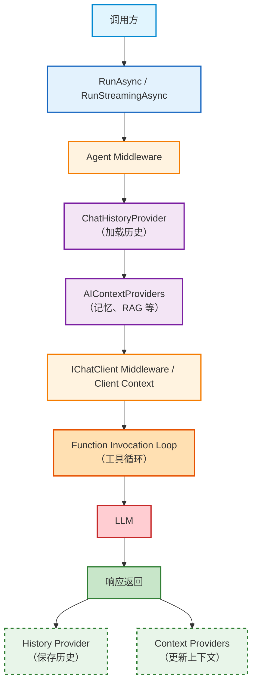

第一次看到 Microsoft Agent Framework 的时候，很容易产生一种错觉：它好像只是把各种 Agent 能力整理成了一套比较完整的 API。

于是我们看到 `AIAgent`，就去看 `Agent` 怎么创建；看到 `AgentSession`，就去看 `Session` 怎么保存；看到 `ChatHistoryProvider`，就去看历史怎么加载；再往后又遇到 `AIContextProvider`、`Middleware`、`Compaction`、`Harness`、`Routing`……每一个概念单独拿出来都不难，可一旦它们同时出现在一个真实项目里，问题反而变成了：“这些东西为什么都存在？它们到底应该放在哪里？”

更麻烦的是，很多问题并不是 API 不会用，而是概念之间的边界没有建立起来。比如，为什么我已经有了 Session，下一轮对话还是会失忆？为什么加了 Memory 以后，同一条记忆会被重复保存？为什么明明配置了 Compaction，发送给模型的上下文还是越来越长？为什么在 AIAgent 上加了 Middleware，却拿不到最终 Prompt？为什么 `Terminate = true` 之后，下一轮模型开始拒绝历史？为什么只是在运行时换了一下模型，会话就突然接不上了？

这些问题看起来分别属于 Session、Memory、Middleware、Compaction 和 Routing，实际上它们都在追问同一件事：

> 这一段逻辑，到底发生在 Agent Runtime 的哪一层？

所以，理解 Agent Framework 最好的方式，可能不是从 API 名字开始，而是先把它想成一条运行时管道。

## 一次 RunAsync，究竟发生了什么？ ##

从调用方的角度，Agent Framework 故意把事情做得很简单。你通常只需要：

```C#
AIAgent agent = ...;

AgentSession session =
    await agent.CreateSessionAsync();

AgentResponse response =
    await agent.RunAsync(
        "帮我订下周二去悉尼的机票",
        session);
```

外部代码看到的只有 `AIAgent`、`AgentSession` 和一次 `Run`。这三个东西足以把不同实现统一到一个编排模型里：今天你的 Agent 可能是 `ChatClientAgent`，明天可能换成自定义 `AIAgent`，后天甚至可能接到 A2A、GitHub Copilot 或其他远程 Agent 服务。上层编排代码不需要因为底层实现换了，就重写一遍。

真正复杂的是 Agent 内部。

对于一个典型的本地 `ChatClientAgent`，一次调用可以抽象成这样：



这里面每一层都在回答一个不同的问题。

`Agent Middleware` 管的是“这一整次运行要不要发生、最后要返回什么”；`ChatHistoryProvider` 管的是“这一通对话以前发生过什么”；`AIContextProviders` 管的是“除了历史之外，这次还需要额外知道什么”；`IChatClient` 层管的是“真正发送给模型的请求是什么”；函数调用循环则负责处理“模型决定调用工具之后应该怎么继续”。

远程 Agent 的情况又不一样。像 `A2AAgent`、`GitHubCopilotAgent`、`CopilotStudioAgent` 虽然同样是 `AIAgent`，因此依然可以被 Agent Middleware 包住，也可以使用适用于 Agent 层的上下文提供程序，但它们没有本地 `IChatClient` 这一层，也没有你可以直接控制的本地函数调用循环。因此，一旦看到 `AIAgent`，不要下意识地认为“下面一定藏着一个 IChatClient”。这是后面理解 Middleware、Prompt 审计和工具控制时非常重要的一条边界。

更容易让人犯错的，还有一个经常被忽略的事实：*一次 `RunAsync` 不一定只调用一次模型*。

比如“小旅”收到这样一个请求：

> “下周二从墨尔本去悉尼，帮我订最合适的航班。”

它完全可能经历：

```txt
用户
 ↓
LLM
 ↓
SearchFlights
 ↓
LLM
 ↓
GetWeather
 ↓
LLM
 ↓
CreateBooking
 ↓
LLM
 ↓
最终回答
```

所以 Agent Runtime 实际上同时存在两个时间尺度。

第一个是*外层时钟*：一次 `RunAsync` 从开始到结束，调用方最后拿到一个 `AgentResponse`。第二个是*内层时钟*：同一个 Run 为了完成任务，模型和工具可能循环很多次。

这两个时钟非常重要，因为后面几乎所有“我明明配置了，怎么没生效”的问题，都和它有关。Guardrail、异常处理、最终回复改写，天然属于外层 Run；而“每一次真正调用模型之前做压缩”、“每次模型调用之后保存历史”则明显属于内层工具循环。原稿里把这件事称为“两个时钟”，我认为这是理解整个框架非常值得保留的核心隐喻。

还有一条规则要从一开始就记住：

> Agent 上挂的是共享组件，Session 里放的是某一次对话的状态。

Provider、Middleware 等实例通常挂在 Agent 上，因此会被多个 `Session` 共用。反过来，某一个用户的 `UserId`、这一通会话的数据库主键、当前预订号之类的数据，必须属于 Session。否则用户 A 的数据和用户 B 的数据很容易在一个共享对象里串起来。

理解了这几条，下面“小旅”的所有能力，其实都只是继续往这条管道上增加东西。

## 小旅为什么是一个很好的例子？ ##

假设我们正在开发一个公司的内部差旅助手，叫“小旅”。

一开始，它只需要能回答问题和调用几个工具；接着，它要记得当前对话；再往后，它要记住用户跨会话的偏好；聊天一长，又需要解决上下文越来越大的问题；最后，还要让它遵守权限、审批、审计和安全规则。

于是，一个看似简单的产品会自然地演化成：

```txt
第一阶段：Agent + Tools
第二阶段：Session + History
第三阶段：Memory
第四阶段：Compaction
第五阶段：Middleware
第六阶段：Model Routing
第七阶段：Custom Agent
最后：Security
```

这几期并不是随意排列的。它们恰好对应了 `Runtime` 中越来越深的一层：先让 `Agent` 能运行，再让它拥有状态，再让它拥有更长的记忆，再解决上下文规模，再控制执行路径，最后才进入更复杂的路由和自定义 `Agent`。

## 第一阶段：先让 Agent 能真正工作 ##

`ChatClientAgent` 可以理解成一种非常直接的 `Agent`：应用自己拥有这个 `Agent`，底层连接一个实现了 `IChatClient` 的聊天客户端。

所以它适合这样的系统：模型调用掌握在你手里，工具、指令、历史、中间件都希望自己控制，同时又希望未来可以把它替换成另一个 `AIAgent` 实现，而不影响上层编排。

例如小旅最开始可以简单到只有两个工具：

```C#
using Microsoft.Agents.AI;
using Microsoft.Extensions.AI;

static string GetWeather(string city)
    => city.Contains(
        "悉尼",
        StringComparison.OrdinalIgnoreCase)
        ? "悉尼多云，22°C，适合出行"
        : $"暂无 {city} 的实时天气";

static string SearchFlights(
    string from,
    string to,
    string date)
    => $"找到 {date} {from}->{to}：8:10 QF431、14:20 VA823";

IChatClient chatClient =
    /* Azure OpenAI / OpenAI / Foundry 的 IChatClient */;

AIAgent agent =
    new ChatClientAgent(
        chatClient,
        new ChatClientAgentOptions
        {
            Name = "XiaoLv",

            ChatOptions = new ChatOptions
            {
                Instructions = """
                    你是公司差旅助手小旅。
                    先确认出发地、目的地、日期，
                    再查天气和航班。
                    不要编造不存在的航班号。
                    """,

                Tools =
                [
                    AIFunctionFactory.Create(GetWeather),
                    AIFunctionFactory.Create(SearchFlights)
                ]
            }

            // 如果 chatClient 自己已经完成工具循环：
            // UseProvidedChatClientAsIs = true
        });

Console.WriteLine(
    await agent.RunAsync(
        "下周二从墨尔本去悉尼，帮我看看。"));
```

这里有一个非常容易忽略的地方：`ChatClientAgent` 默认会在底层客户端之上再提供函数调用循环。也就是说，模型产生 `FunctionCallContent` 后，框架会执行工具，再把 `FunctionResultContent` 送回模型。

这本身没有问题，直到你使用的底层 `IChatClient` 已经自己实现了完整的 `Tool Loop`。这时候，如果 Framework 再包一层，就会出现“双循环”：框架跑一遍，`Client` 自己又跑一遍。于是才有 `UseProvidedChatClientAsIs = true` 这样的开关。

这个配置看上去只是一个小细节，但它其实告诉我们一件很重要的事：*Agent Framework 并不假设底层 Client 是一个毫无能力的“裸模型接口”*。 你的 `Client` 可能已经拥有一部分 Agent 行为，`Framework` 允许你选择由谁接管这些能力。

### AgentResponse 不是“模型最后那句话” ###

第一次写 Agent，最自然的代码就是：

```C#
AgentResponse response =
    await agent.RunAsync(
        "墨尔本天气怎么样？");

Console.WriteLine(response.Text);
```

这没错，但不要因此把 `AgentResponse` 理解成一个普通字符串容器。

一次 Agent 执行里可能同时存在文本、工具调用、工具结果、推理内容或者其他状态信息。因此，`response.Text` 只是一个方便的文本聚合；如果你真正要做审计、调试或自定义编排，就应该关注 `Messages` 和 `Contents`。

`Streaming` 也是同一个执行模型，只是返回方式不同：

```C#
await foreach (
    var update in agent.RunStreamingAsync("再看看悉尼"))
{
    if (!string.IsNullOrEmpty(update.Text))
    {
        Console.Write(update.Text);
    }
}
```

非流式是等全部执行结束后，把结果作为一个 `AgentResponse` 给你；流式则把执行过程切成多个 `AgentResponseUpdate`。但语义本身没有变。

真正要注意的是 Middleware。如果你的 Middleware 只实现了非流式版本，框架为了让它工作，可能不得不先把流式结果收完再交给你的中间件处理。于是代码看起来仍然使用 RunStreamingAsync，用户实际看到的却已经不是即时输出了。也就是说，*Streaming 并不是 UI 层的一个小优化，它是 Runtime Contract 的一部分*。

### 消息也不是一个字符串 ###

另外一个必须建立起来的概念，是消息的结构。

`ChatMessage` 只是消息容器，真正的内容由一组 `AIContent` 组成。常见内容包括：

| 类型 | 含义 | 为什么会影响后面的能力 |
| :--- | :--- | :--- |
| TextContent | 普通文本 | 几乎所有模型都能处理 |
| DataContent | 图片、音频、视频等数据 | 新模型必须支持对应模态 |
| UriContent | 文件URL | URL是否仍然有效、目标模型是否能访问 |
| FunctionCallContent | 模型要求调用工具 | 必须和结果形成正确关系 |
| FunctionResultContent | 工具执行结果 | 不能随便和对应调用拆开 |

这直接带出一个以后非常重要的结论：

> “我自己保存历史，所以我以后就可以随便换模型。”这句话并不完整。

完整条件是：你不仅要拥有原始历史，还必须保证下一跳模型理解这些消息的角色、内容类型和工具关系。

举个非常现实的例子：小旅如果允许用户上传登机牌照片，那么历史里可能存在 `DataContent`。今天我们使用一个支持视觉的模型，一切正常；明天为了省成本，把这一轮切给一个只接受文本的模型，此时问题就不是简单地把 model name 换掉，而是必须先决定图片内容怎么处理。

所以，*可替换模型的基础不是 Router，而是可重放且兼容的消息历史*。

## 第二阶段：多轮对话的本质不是 `List<ChatMessage>`，而是 `Session` ##

现在的小旅遇到一个自然的问题。

用户第一句话：

> “我叫刘振，座位喜欢靠窗。”

下一句话：

> “那帮我订下周二墨尔本到悉尼的机票。”

如果 Agent 想知道“我”是谁，就必须让第二次调用看到第一次发生过的事情。

很多人第一反应是自己保存：

```C#
List<ChatMessage> history;
```

这当然可以，但 Agent Framework 想让你拥有的并不只是一个消息列表，而是：

```C#
AgentSession
```

`AgentSession` 更适合被理解成：

这一通对话的运行时状态容器。

消息历史只是其中的一部分。Session 还可以包含 `StateBag`、`Provider` 的会话状态，以及某些服务端会话 ID。不同 Agent 的具体 Session 实现还可能携带远程服务的上下文标识。

所以：

```txt
Agent
 ├─ Session A
 ├─ Session B
 ├─ Session C
 └─ Session D
```

而 Session A 里面又可能是：

```txt
Session A
 ├─ History
 ├─ StateBag
 ├─ Provider State
 └─ Remote Conversation ID
```

这也解释了为什么不能简单地把“当前用户的记忆 ID”塞进 Provider 实例。Provider 是 Agent 级共享对象，而用户数据属于 Session。

### 但真正关键的问题其实是：历史到底归谁？ ###

一旦讨论 Session，马上会遇到一个非常重要的架构分叉。

#### 方案一：历史由调用方管理 ####

*消息存在*：

- 应用内存
- 数据库
- 自定义 `ChatHistoryProvider`

你每次调用模型的时候，自己决定哪些历史应该重新发出去。

#### 方案二：历史由推理服务管理 ####

应用只保存：

```txt
conversation ID
```

每次请求把：

```txt
conversation ID + 当前消息
```

交给服务。

两种方式都可以，但它们其实决定了后面很多能力。

| 维度 | 调用方管理 | 服务方管理 |
| :--- | :--- | :--- |
| 历史存储位置 | 应用自己掌握 | 服务端（通常不行） |
| 压缩能力 | 可以自己压缩 | 基本不行 |
| 跨厂商换模型 | 可以重新构建消息 | 取决于服务接口 |
| 审计历史 | 可以自己审计 | 仍然需要业务层映射 |
| 多租户隔离 | 应用自己负责 | （未提及） |

所以，如果你的产品要求：

> “同一个会话里今天使用模型 A，明天可以切到模型 B；上下文还要自己控制；还要自己做压缩和审计。”

那么调用方管理历史，往往更有价值。

反过来，如果你使用的 Agent Service 已经替你管理了会话，而且你接受它的模型和上下文边界，那么让服务托管历史反而更简单。

### Session 持久化、History 持久化，不是一回事 ###

这里特别容易把三个概念混成一个“持久化”。

*第一件事是*：

```C#
agent.SerializeSession(session);
agent.DeserializeSessionAsync(...);
```

它解决的是：*进程重启以后，怎么把整颗 Session 状态恢复回来*。

第二件事是 `ChatHistoryProvider`。它解决的是：*每次运行时，到底加载哪些历史消息，以及这次运行结束后保存哪些新消息*。

第三件事是 `AgentSessionStore`。它解决的是：*HTTP 请求到来时，怎么根据 continuation ID 把完整 Session 找回来*。

它们分别对应：

```txt
Session serialization
      ≠
Message history persistence
      ≠
Session lookup/store
```

不要把其中任何一个当成另外两个的替代品。

### 服务端 conversation ID 也绝对不是授权凭证 ###

如果你使用某些服务托管的会话，Session 中可能保存：

```txt
resp_*
conv_*
context_id
task_id
```

这些 ID 只是服务端理解对话的标识，不应该自动被当成：

> “这个用户拥有这段对话。”

尤其是在一个 Azure/OpenAI/Foundry project 需要服务多个最终用户的情况下，如果你把服务端 conversation ID 原样返回浏览器，再让浏览器以后拿回来直接调用，很容易把“知道某个 ID”和“有权访问这个会话”混为一谈。

更安全的结构应该是：

```txt
你的 sessionId
      ↓
你的数据库
      ↓
userId / tenantId
      ↓
service conversation ID
```

恢复时先验证当前用户或租户，再决定是否允许使用这个远程 ID。服务端的 `previous_response_id`、`conversation_id`、`service_session_id` 都不应该直接充当业务授权边界。

### History Provider 为什么要给消息“盖章”？ ###

这是一个非常漂亮的设计，也很值得理解。

假设数据库里已经保存：

```txt
Hello
你好
我喜欢靠窗
好的
```

下一次请求时，History Provider 把这些消息重新加载进当前请求：

```txt
历史
+
本轮新输入
```

如果运行结束后，把整个列表再次保存，那么下一次就可能变成：

```txt
Hello
你好
我喜欢靠窗
好的

Hello
你好
我喜欢靠窗
好的
我现在想订机票
```


再下一轮继续重复。

所以 Framework 给历史消息标记：`AgentRequestMessageSourceType.ChatHistory`

它表达的意思其实非常直白：

> “这条消息是旧账，不是这次新发生的事情。”

于是存储阶段就可以过滤掉那些已经来自历史的消息，只保存本轮真正产生的新内容。否则历史会随着每轮调用重复膨胀。

这里又有一个容易混淆的点：`InMemoryChatHistoryProvider` 上的 `ChatReducer` 是存储侧的消息数量限制，而后面要讲的 Compaction 是上下文层面的语义压缩，两者解决的问题不同。前者更像“最多保存多少条”，后者则是在问“为了让模型继续工作，哪些历史可以被缩短”。

## 第三阶段：“记住”其实至少有三种意思 ##

当产品经理说：

> “我要让小旅记住用户。”

作为工程师，第一反应不应该是“上一个向量数据库”。

因为首先应该问：

> 记住什么？

如果用户说：

> “我刚刚说要周二出发。”

下一句还能理解“周二”，这是当前对话历史的问题，不需要向量数据库。

如果用户在当前流程里已经确认：

```txt
selectedFlight = QF431
waitingApproval = true
bookingId = xxx
```

这是结构化的 Session 工作状态，也不应该塞进 Vector DB。

只有当用户上个月说：

> “我每次坐飞机都喜欢靠窗。”

而这次打开的是一个全新的 Session，你仍然希望 Agent 能想起来，这才是跨会话语义记忆。

所以可以把“记忆”拆成三层：

| 层次 | 机制 | 记住什么 |
| :--- | :--- | :--- |
| 当前对话窗口 | ChatHistoryProvider | 原始对话历史 |
| Session 工作记忆 | StateBag / Harness state | 当前任务状态 |
| 跨会话语义记忆 | ChatHistoryMemoryProvider / AIContextProvider | 长期有价值的事实和偏好 |

这个划分一旦理解，很多设计决定会变得非常自然。

### AIContextProvider 是干什么的？ ###

它可以理解成一个扩展点：

> 在调用模型之前，我还要不要补充一些上下文？调用结束之后，我又要不要从这次运行里保存一些东西？

最简单的接口思路就是：

```txt
ProvideAIContextAsync
        ↓
把额外上下文加入请求
        ↓
LLM / Tools
        ↓
StoreAIContextAsync
```

所以它非常适合：

- 用户画像
- RAG
- 动态业务政策
- 跨会话记忆
- 外部知识

但 Provider 又会遇到一个与 History Provider 非常相似的问题：自己注入的内容不能无意中成为下一次自己检索的数据。

假设 Memory Provider 注入：

> “用户喜欢靠窗。”

如果下一次保存的时候，它又把这条 `AIContextProvider` 内容当成 `External` 新消息保存进去，就会变成某种“记忆套娃”。

所以高级实现需要区分消息来源：

- External
- ChatHistory
- AIContextProvider

原始用户输入是 `External`；历史是 `ChatHistory`；`Provider` 自己注入的内容则应该保持为 `AIContextProvider`。检索和保存通常只应该针对合适的来源，否则记忆系统会开始“记住自己记得什么”。

## 跨会话 Memory：真正值得注意的是“写入范围”和“检索范围”可以不同 ##

假设用户第一次对话说：

> “我坐飞机一定要靠窗。”

我们可以把它写入：

```txt
storageScope:
    UserId = user-123
    SessionId = session-abc
```

这样它在存储层可以被精确地追踪和清理。

但下一次搜索时，我们只需要：

```txt
searchScope:
    UserId = user-123
```

于是：

```txt
写入：User + Session
检索：User
```

同一位用户开启新 Session，依然可以找到旧偏好。

这就是 `storageScope` 与 `searchScope` 最值得理解的地方：它们并不要求保持完全一致。前者描述“这条记忆属于谁以及从哪里来”，后者描述“这次搜索应该在哪个范围里找”。还可以进一步加入 `AgentId`、`ApplicationId` 等维度，实现更严格的隔离。

*例如*：

```C#
VectorStore vectorStore =
    new InMemoryVectorStore(
        new InMemoryVectorStoreOptions
        {
            EmbeddingGenerator = embeddingGenerator
        });

AIAgent agent =
    chatClient.AsAIAgent(
        new ChatClientAgentOptions
        {
            Name = "MemoryAgent",

            ChatOptions = new()
            {
                Instructions =
                    "你是差旅助手。优先尊重已知的座位和航司偏好。"
            },

            AIContextProviders =
            [
                new ChatHistoryMemoryProvider(
                    vectorStore,
                    collectionName: "chathistory",
                    vectorDimensions: 3072,

                    session =>
                        new ChatHistoryMemoryProvider.State(
                            storageScope: new()
                            {
                                UserId = "user-123",
                                SessionId =
                                    Guid.NewGuid().ToString()
                            },

                            searchScope: new()
                            {
                                UserId = "user-123"
                            }))
            ]
        });

AgentSession s1 =
    await agent.CreateSessionAsync();

await agent.RunAsync(
    "我坐飞机一定要靠窗。",
    s1);

AgentSession s2 =
    await agent.CreateSessionAsync();

Console.WriteLine(
    await agent.RunAsync(
        "帮我订墨尔本到悉尼的机票。",
        s2));
```

第一次对话把偏好写进去，第二次完全不同的 Session 仍然可以通过 User scope 找回这条记忆。

### 自动搜索，还是让模型自己决定搜索？ ###

Memory 还有一个设计选择：搜索到底什么时候发生。

一种方式是 `BeforeAIInvoke`。每轮模型调用之前自动检索，适合用户偏好、政策这类“几乎每次都有可能用到”的内容。

另一种方式是 `OnDemandFunctionCalling`。把 Memory Search 暴露成工具，让模型自己决定这次是否需要查。

后者看起来更加聪明，但同时引入了一个很重要的安全边界：

> 模型生成的搜索词本身就是不可信输入。

也就是说，`SearchMemory("...")` 和 `GetWeather("...")` 在安全模型上其实没有本质区别。它们都是模型提出的参数，数据库和工具层都应该对其做约束。

还有一个非常值得留意的问题：默认情况下，助手回复本身也可能被写入 Memory。

这意味着模型一次错误地说：

> “已经帮你订好了。”

如果这句话后来进入向量库，那么下一次新会话里，Memory Search 可能把它找出来，而模型会把这次幻觉重新当成事实。

所以长期 Memory 真正的问题从来不是：

> “怎么把东西都记住？”

而是：

> “什么东西值得被当成事实记住？”

## 第四阶段：当聊天开始变长，问题变成“模型究竟还要看多少？” ##

假设小旅和用户聊了 40 轮。

系统越来越慢，Token 越来越贵，最终甚至超过模型上下文窗口。

这就是 Compaction 出场的时候。

但这里先要强调一个非常重要的边界：

> Compaction 只对你自己拥有的历史有意义。

如果对话历史完全由 Foundry Agent、Copilot Studio 或某些服务端 Conversation 管理，那么真正发送给模型的是服务端决定的内容。此时你在本地配置一个 Compaction Provider，并不会神奇地改变服务器内部维护的历史。

所以 Compaction 的前提依然是：

```txt
历史在我手里
```

而不是：

```txt
历史在别人手里
```

原稿里这一点其实非常关键，而且应该放在介绍策略之前，因为它直接决定读者到底有没有必要继续看后面的 Compaction API。

### Compaction 为什么不是简单地 `RemoveAt()`？ ###

因为 Agent 消息不是一个纯粹的字符串列表。

框架会先建立 `MessageIndex`，再把消息划分成原子性的 `MessageGroup`。每个 Group 会跟踪消息数量、字节数和估算 Token。

为什么要这么麻烦？

因为很多消息不能单独删除。

例如：

- FunctionCallContent
- FunctionResultContent

它们构成了一个完整的工具交互。如果只删其中一个，下一轮模型就可能看到：

> “我调用过某个工具。”

却看不到：

> “工具到底返回了什么。”

于是整个消息序列可能变得非法。

所以 Compaction 的基本思想不是：

> “删几条消息。”

而是：

> “按语义边界删消息组。”

常见的 Group 可以理解为：

- System
- User
- AssistantText
- ToolCall
- Summary

其中 `ToolCall` 本身就代表一个需要保持结构完整的工具交互。

### Trigger 和 Target：什么时候开始压，压到哪里停？ ###

每个 Compaction 策略都可以拆成两个问题。

第一个是 Trigger：

> “现在有没有必要开始压缩？”

例如：

```C#
CompactionTriggers.TokensExceed(2000)
```

或者：

```C#
CompactionTriggers.HasToolCalls()
```

它们还可以组合：

```C#
var trigger =
    CompactionTriggers.All(
        CompactionTriggers.HasToolCalls(),
        CompactionTriggers.TokensExceed(2000));
```

表达的是：

> 只有“存在工具调用”并且“Token 超过 2000”时，才开始折叠。

第二个是 Target：

> “压到什么时候算够？”

而 `MinimumPreserved` 则是一个保护措施，用来避免把最近的内容一下子全部卷走。

### 五种策略，其实是一把把越来越重的刀 ###

最温和的是 `ToolResultCompactionStrategy`。它只针对旧工具结果，把很长的工具输出压成类似：

```txt
[Tool calls: SearchFlights, GetWeather]
```

而用户原话和普通助手文本仍然保留。它不需要额外 LLM，是最适合“先把工具输出收拾干净”的第一刀。

再往前一步是 `SummarizationCompactionStrategy`。它会额外调用一个 `IChatClient`，把较老的对话压成一个 Summary Group。好处是可以压得非常狠，代价则很明确：需要额外的模型调用，而且摘要天然存在信息丢失和幻觉风险。因此很常见的做法是让主模型负责真正的工作，让一个便宜的小模型负责摘要。

`SlidingWindowCompactionStrategy` 更简单，它不关心消息条数，而是保留最近 N 个用户轮次。一个轮次包括一条 User 消息以及后面所有属于这一轮的 Assistant / Tool Group，直到遇到下一条 User 消息。这样可以避免从语义中间拦腰切断。

`TruncationCompactionStrategy` 则是最后的保险丝：从最老的非系统 `Group` 开始往前删，直到满足目标。它可靠，但很粗暴，所以更适合当熔断器，而不是日常策略。

最后才是 `PipelineCompactionStrategy`，把前面几种策略串起来。例如：

```C#
var pipeline =
    new PipelineCompactionStrategy(
        new ToolResultCompactionStrategy(
            CompactionTriggers.TokensExceed(512)),

        new SummarizationCompactionStrategy(
            summarizerClient,
            CompactionTriggers.TokensExceed(1280)),

        new SlidingWindowCompactionStrategy(
            CompactionTriggers.TurnsExceed(8)),

        new TruncationCompactionStrategy(
            CompactionTriggers.TokensExceed(32_000),
            minimumPreserved: 10));
```

这个顺序很有意义：*先做便宜、低损失的处理，再逐渐升级到昂贵和激进的手段，最后才使用硬截断*。

### 一个经常被低估的决定：Compaction 到底应该改 Prompt，还是改历史？ ###

这是整个 Compaction 设计里最重要的一道分水岭。

如果你把它挂在 `ChatClientBuilder.UseAIContextProviders`，那么它位于真正调用模型之前。它压缩的是：

> 本次请求准备发给模型的副本。

因此可以形成：

```txt
原始历史 ──────────→ 持久化
    │
    └→ Compaction → Prompt → LLM
```

这是大多数生产系统更愿意采用的方式：数据库里继续保留完整历史，而每次调用模型时再根据 Token 预算做压缩。

但如果你把 `Compaction` 放在 `ChatClientAgentOptions.AIContextProviders`，它发生得更靠前，生成出来的 Summary 可能会被 History Provider 当成一条新的上下文写回历史。

于是：

```txt
原始历史
   ↓
压缩
   ↓
Summary
   ↓
History
```

这已经不是“Prompt 优化”，而是在修改持久化的事实本身。

所以：

> 你到底是在压缩模型看到的东西，还是在压缩你保存的历史？这是两个完全不同的设计。

## 第五阶段：Middleware——因为有些事根本不能交给模型决定 ##

到这里，小旅已经会聊天、有历史、有长期记忆，也知道怎么控制上下文长度。

但是它离一个真正的生产 Agent 还差很远。

因为有些事情，根本不应该让模型决定。

例如：

- 用户把护照号、密码发进来了，应该直接拒绝；
- 模型选中了禁飞航班，不能真正调用 `CreateBooking`；
- 当前登录用户是谁，不能让模型自己猜；
- 工具执行超时，不能把内部异常直接扔给用户；
- 最终对外回复必须统一加免责声明；
- 真实发送给模型的 Prompt 必须可以审计。

这些事情看起来完全不同，但它们其实都属于一个概念：

> 横切逻辑。

Agent Framework 用 Middleware 把这些能力插入 Runtime。

### 三层 Middleware，三个不同深度 ###

最外层是 Agent Middleware，它围住的是整个 `RunAsync`。因此任何 AIAgent 都能使用，包括远程 Agent。它最适合做整次运行的门禁、异常处理、最终结果改写。

中间是 Function Middleware，它发生在每一次工具真正执行之前和之后，适合做工具参数修改、权限判断、审批和工具循环终止。

最里面是 `IChatClient` Middleware，它发生在每一次真正访问推理服务之前和之后。到了这个位置，历史、Memory、Compaction 等通常都已经完成，所以它最适合做最终 Prompt 审计、模型调用日志和 Token/Latency 统计。

可以把它画成：

```txt
Agent Run
 │
 ├─ Agent Middleware
 │
 ├─ History / Memory / Compaction
 │
 ├─ IChatClient Middleware
 │
 ├─ LLM
 │
 └─ Tool Loop
      │
      ├─ Function Middleware
      │
      └─ Tool
```

这个图本身就足以解释很多 API 应该放在哪里。

### 为什么“审计最终 Prompt”必须靠近 IChatClient？ ###

假设你的需求是：

> “我需要把真正发给模型的 Prompt 打进审计日志。”

如果你在 `RunAsync` 入口做：

```C#
Console.WriteLine(messages);
```

你看到的其实还不是最终 Prompt，因为这时候历史和 `Memory` 可能都还没注入。

相反，如果在 `IChatClient` Middleware：

```C#
async Task<ChatResponse> CustomChatClientMiddleware(
    IEnumerable<ChatMessage> messages,
    ChatOptions? options,
    IChatClient innerChatClient,
    CancellationToken cancellationToken)
{
    Console.WriteLine(
        $"[ChatLog] Sending {messages.Count()} messages.");

    foreach (var msg in messages)
    {
        var preview =
            msg.Text is null
                ? ""
                : msg.Text[..Math.Min(
                    msg.Text.Length,
                    80)];

        Console.WriteLine(
            $"[ChatLog] {msg.Role}: {preview}");
    }

    var response =
        await innerChatClient.GetResponseAsync(
            messages,
            options,
            cancellationToken);

    Console.WriteLine(
        $"[ChatLog] Received " +
        $"{response.Messages.Count} messages.");

    return response;
}
```

这里拿到的 messages 已经是上下文加工之后的结果了，所以它才真正接近：

> “模型这一刻究竟看到了什么？”

这也是为什么 `IChatClient` Middleware 不应该被理解成“另一个 Agent Middleware”。它们虽然都叫 Middleware，但它们站在完全不同的运行时深度。

### Guardrail：不是让模型遵守规则，而是让代码决定规则 ###

例如，小旅收到：

> “我的 password 是什么？”

不应该让模型先被调用，再告诉它“不要回答”。

更合理的路径是：

```txt
用户输入
  ↓
Guardrail
  ↓
直接拒绝
```

核心代码类似：

```C#
async Task<AgentResponse> GuardrailMiddleware(
    IEnumerable<ChatMessage> messages,
    AgentSession? session,
    AgentRunOptions? options,
    AIAgent innerAgent,
    CancellationToken cancellationToken)
{
    var lastMessage =
        messages.LastOrDefault()?.Text?
            .ToLowerInvariant()
        ?? "";

    string[] blockedWords =
    [
        "password",
        "secret",
        "credentials",
        "护照号",
        "身份证"
    ];

    foreach (var word in blockedWords)
    {
        if (lastMessage.Contains(word))
        {
            return new AgentResponse(
            [
                new ChatMessage(
                    ChatRole.Assistant,
                    $"抱歉，我不能处理包含“{word}”的请求。")
            ]);
        }
    }

    return await innerAgent.RunAsync(
        messages,
        session,
        options,
        cancellationToken);
}
```

关键不是关键词列表有多聪明，而是：

```C#
innerAgent.RunAsync(...)
```

在拒绝路径上根本不会被调用。

这意味着这次 `Run` 连模型都没有进入。

所以一个非常值得长期记住的区别是：

```txt
Prompt
    → 告诉模型“应该怎么做”

Middleware
    → 决定程序“允许做到哪里”
```

二者不是替代关系。

### Terminate：停止工具循环，而不是回到“什么都没发生” ###

另一个特别容易理解错的 API 是：

```C#
context.Terminate = true;
```

它不是 Guardrail 的另一个写法。

Guardrail 是外层的：

```txt
整个 Run
```

而 Terminate 发生在：

```txt
模型已经决定调用 Tool
        ↓
Function Middleware
        ↓
发现这一跳不允许继续
```

比如模型选择：

```C#
CreateBooking("VA823")
```

而公司规定 VA823 不在协议范围。

那么可以：

```C#
if (context.Function.Name
    == nameof(CreateBooking))
{
    var flightNo =
        context.Arguments.TryGetValue(
            "flightNo",
            out var raw)
            ? raw?.ToString()
            : "";

    if (string.Equals(
        flightNo,
        "VA823",
        StringComparison.OrdinalIgnoreCase))
    {
        context.Terminate = true;

        return
            "该航班不在公司协议范围内，" +
            "已中止本轮工具循环。";
    }
}

return await next(
    context,
    cancellationToken);
```

这里发生的事情是：模型已经被调用了，也已经产生了工具调用，只是 Runtime 在真正继续工具循环之前把它掐掉了。

因此 `Terminate` 和 `Guardrail` 的区别可以概括成：

```txt
Guardrail
→ 不让整个 Run 继续

Terminate
→ 不让当前 Tool Loop 继续
```

这个区别特别重要，因为设置 `Terminate` 后，框架不会再自动发一轮模型请求，让模型根据你刚刚返回的字符串重新组织自然语言。如果还有其他排队中的工具调用，也可能直接被跳过。

更棘手的是历史。

如果某次执行已经产生了：

```txt
FunctionCallContent
```

却因为终止没有留下合法的：

```txt
FunctionResultContent
```

那么下一次继续复用这个 `Session` 时，某些模型可能会直接拒绝这份不完整历史。

所以 `Terminate` 是一个*执行控制机制*，不是一个*历史修复机制*。使用它时必须同时考虑如何保证 Tool Call / Tool Result 的历史结构仍然完整。

### Middleware 之间怎么传状态？ ###

当 Middleware 越来越多，就会自然产生一个问题：

> 外层知道 `request_id`，内层工具怎么知道？

可以使用的状态载体主要有几种。

| 载体 | 生命周期 | 典型用途 |
| :--- | :--- | :--- |
| 闭包 `Dictionary` | 进程级 | Demo、简单计数 |
| `AdditionalProperties` | 一次 Run | user_id、tenant、request_id |
| `StateBag` | 一个 Session | bookingId、已确认航段 |
| `FunctionInvocationContext.Arguments` | 一个工具调用 | 给 Tool 注入可信参数 |

其中最容易犯错的是闭包。

Demo 中：

```C#
var sharedState =
    new Dictionary<string, object>
    {
        ["callCount"] = 0
    };
```

完全没问题。

但是如果你开始往里面放：

```txt
currentBooking
currentUser
currentTenant
```

那就不行了，因为它已经变成：

```txt
整个进程共享
```

而不是：

```txt
当前用户 / 当前 Session
```

所以原稿里关于这个问题的判断非常值得保留：*闭包可以用来演示 Middleware 链；业务状态不要放进去*。

#### AdditionalProperties 与 StateBag 的边界 ####

假设 HTTP 层刚刚认证出：

```txt
user_id
tenant
request_id
```

这些信息只需要活这一轮，那么把它们放进：

```txt
AgentRunOptions.AdditionalProperties
```

很自然：

```C#
var options = new AgentRunOptions
{
    AdditionalProperties =
        new AdditionalPropertiesDictionary
        {
            ["user_id"] = currentUserId,
            ["tenant"] = "contoso",
            ["request_id"] =
                Guid.NewGuid().ToString()
        }
};
```

但如果某个值下一轮还需要，例如：

```txt
selectedFlight
bookingId
waitingApproval
```

那么它应该进入：

```txt
session.StateBag
```

因为它的生命周期已经从“一次 Run”变成了“一通 Session”。

这个判断可以简单地理解成：

> 状态应该活多久，就放到对应生命周期的容器里。

### 身份不要让模型猜，要从应用层注入 ###

这是 Agent 系统和普通 LLM Demo 的一个关键分界。

假设工具定义：

```C#
CreateBooking(
    string flightNo,
    string userId,
    string tenant)
```

最危险的方案是让模型自己生成：

```json
{
  "flightNo": "QF431",
  "userId": "user-123",
  "tenant": "contoso"
}
```

因为 `userId` 和 `tenant` 根本不是模型推理得到的东西，它们来自：

```txt
HTTP Authentication
Application Context
Tenant Context
```

所以正确的路径应该是：

```txt
HTTP / Auth
    ↓
AdditionalProperties
    ↓
Function Middleware
    ↓
context.Arguments
    ↓
Tool
```

例如：

```C#
async ValueTask<object?> InjectRunContext(
    AIAgent agent,
    FunctionInvocationContext context,
    Func<
        FunctionInvocationContext,
        CancellationToken,
        ValueTask<object?>> next,
    CancellationToken cancellationToken)
{
    var runOptions =
        AIAgent.CurrentRunContext?.RunOptions;

    if (runOptions?.AdditionalProperties
        is { } props)
    {
        if (props.TryGetValue(
            "user_id",
            out var userId))
        {
            context.Arguments["userId"] =
                userId;
        }

        if (props.TryGetValue(
            "tenant",
            out var tenant))
        {
            context.Arguments["tenant"] =
                tenant;
        }
    }

    return await next(
        context,
        cancellationToken);
}
```

因此：

> 模型可以决定订哪一班，但不能决定自己是谁。

这是一个非常值得从 Agent 开发延伸到整个 AI Application Architecture 的原则。

## 第六阶段：运行时换模型，真正难的是“历史能不能跟过去” ##

现在假设产品经理提出一个很合理的需求：

> 闲聊用便宜模型，复杂订票用强模型。

听起来就是一个 Routing 问题。

但真正困难的第二问是：

> 新模型能不能看到旧对话？

如果历史由调用方管理，那么路由可以很自然：

```txt
History
   ↓
Router
   ├─ Cheap Client
   ├─ Strong Client
   └─ Another Client
```

因为每个模型都收到同一份历史。

如果历史由服务端管理，那么你手里可能只有：

```txt
OpenAI conversation ID
```

你不能简单地把它交给另一家模型服务。这个 ID 对另一家服务没有意义。

所以跨厂商模型切换真正的必要条件不是：

```txt
“我有 Router。”
```

而是：

```txt
“我能重新得到可兼容的原始消息。”
```

之后才是：

```txt
“我把消息交给哪个模型。”
```

因此 Routing 实际上由两个问题组成：

> 下一跳打哪个客户端？

以及：

> 下一跳能否理解截至目前的上下文？

前者是路由；后者是历史所有权和消息兼容性。

这也是为什么“调用方管理历史”具有非常大的架构价值。

## 第七阶段：不是所有 Agent 都必须是聊天模型 ##

到这里，如果你已经把 `ChatClientAgent` 理解成：

```txt
Agent
=
上下文
+
聊天模型
+
Tool Loop
```

那下一步就会发现，这个定义其实太窄了。

有些 Agent 根本不是聊天模型：

- 规则引擎
- 工作流
- RPC 服务
- 固定逻辑
- 状态机
- 另一个 Agent

但上层仍然希望它符合：

> AIAgent

这样才能继续被统一地编排、持有 Session、使用 Middleware。

这就是 Custom Agent 的价值。

你可以继承：

> AIAgent

自己实现 Session 创建、Session 恢复，以及 `Run` / `RunStreaming` 的核心行为。

最重要的并不是把某个类写出来，而是：

> 自定义 Agent 也必须尊重 Agent Runtime 的生命周期。

也就是说，运行之前要给 `History`/`Context Provider` 机会参与；运行之后也要让它们得到本轮结果；Session 必须能够创建与恢复；Streaming 也必须有对应语义。

否则你的类虽然“*长得像 AIAgent*”，实际上却没有真正融入 Agent Framework 的运行时。

这也是抽象层真正的价值：上层只知道：

```C#
AgentSession session =
    await agent.CreateSessionAsync();

await agent.RunAsync(
    "...",
    session);
```

至于下面到底是 LLM、Workflow、Remote Agent 还是你自己的实现，都可以隐藏起来。

## 最后一个阶段：安全不是“再加一层 Guardrail”那么简单 ##

当 Agent 已经具备：

```txt
History
Memory
Tools
Compaction
Middleware
Routing
```

安全问题其实才真正开始暴露。

因为数据进入模型的路径可能是：

```txt
用户输入
   ↓
你的 API
   ↓
认证 / 限流 / 长度限制
   ↓
Agent Middleware
   ↓
History
   ↓
Memory / RAG
   ↓
System Instruction
   ↓
LLM
   ↓
Tool
   ↓
外部系统
```

这里任何一层都可能带入不可信数据。

因此，用户输入不可信，Tool Result 不可信，RAG 文档不可信，Vector Memory 不可信，Assistant Output 也不可信。

角色本身就可以看成一种权限边界：

| Role | 默认信任程度 |
| :--- | :--- |
| `system` | 最高 |
| `user` | 不可信 |
| `assistant` | 不可信 |
| `tool` | 不可信 |

最容易被误解的是 `assistant` 和 `tool`。

`assistant` 并不代表“这是你的程序写出来的可信数据”，它可能来自外部 LLM；`tool` 也不代表“这是系统事实”，它可能包含第三方 API 数据、用户可控内容或者被污染的数据。RAG 文档与 Vector Memory 同样可能成为间接提示注入通道。

所以工具参数应该按照普通 Web API 的外部输入来处理：限制长度、范围和允许值；文件路径限制在指定目录；SQL 和 Shell 使用参数化方式；涉及发信、下单、删除、修改数据等副作用时，考虑显式审批。

而模型输出也不能直接当成事实，更不能不经检查地直接：

```txt
渲染成 HTML
执行成代码
拼接 SQL
执行 Shell
写入高可信数据库
```

换句话说：

> 模型只是一个“不可信但非常有用的推理组件”。

它能帮你决定，但不能自动获得系统权限。

## 现在，再把所有东西放回同一条管道 ##

如果一路跟着小旅走到这里，你会发现原本那些看起来互不相关的 API，其实都可以放回同一个 Runtime：

```txt
                       AIAgent
                          │
                 ┌────────┴────────┐
                 │                 │
             Middleware         Session
                 │                 │
                 │         ┌───────┼────────┐
                 │         │       │        │
                 │      History   State   Memory
                 │         │       │        │
                 └─────────┴───────┴────────┘
                           │
                      Context Build
                           │
                       Compaction
                           │
                   IChatClient Layer
                           │
                          LLM
                           │
                       Tool Loop
                           │
               ┌───────────┼───────────┐
               │           │           │
          Function MW   Approval    Terminate
               │
              Tool
```

到这个时候，`Agent`、`Session`、`Memory`、`Compaction`、`Middleware`、`Tool`、`Routing` 已经不再是一堆零散 API 了。

它们是在回答不同的问题。

`AIAgent` 回答的是：“这个组件怎么以 Agent 的形式运行？”

`AgentSession` 回答的是：“这一通对话的状态是什么？”

`ChatHistoryProvider` 回答的是：“这一通以前发生过什么？”

`AIContextProvider` 回答的是：“这一次还需要额外知道什么？”

`Compaction` 回答的是：“信息太多时，模型还需要看多少？”

`Middleware` 回答的是：“哪些事情不能完全交给模型？”

`Function Middleware` 回答的是：“模型想调用工具时，我到底允许它做到哪一步？”

`Routing` 回答的是：“这一轮应该把请求交给哪个模型？”

`Custom Agent` 则回答：“如果底层根本不是聊天模型，能不能仍然遵守同一个 Agent Contract？”

## 最后真正需要记住的，不是 API，而是三条边界 ##

如果把整篇文章压缩成几个工程上真正有用的判断，我反而不建议去背几十个类名，而是记住下面三件事。

*第一件事是*：

> 问自己：我要操作的是哪一个时钟？

如果我要控制整次 `RunAsync`，就在外层；如果我要控制每一次模型调用，就要深入工具循环和 `IChatClient`；如果我要控制某一次工具执行，就继续往 `Function Middleware` 里走。

*第二件事是*：

> 问自己：这份数据应该活多久？

只活一个工具调用的，就放 `Tool Context`；只活一次 `Run` 的，就放 `AdditionalProperties`；整个 `Session` 都需要，就放 `StateBag`；多个 `Session` 共用的，才应该进入 `Agent` 级 `Provider` 或服务。

*第三件事是*：

> 问自己：我到底是在改变“历史”，还是改变“这一次模型看到的请求”？

这是很多设计决定真正的分叉点。

`Memory` 可以改变当前请求，但未必应该改变历史。

`Compaction` 可以缩短 Prompt，但未必应该破坏持久化历史。

`Routing` 可以更换模型，但它是否成立，取决于历史是不是掌握在调用方手里。

`Middleware` 可以拒绝一次 `Run`，也可以阻止一次 `Tool`，但它们发生的位置不同，行为也完全不同。

## 结语：真正的 Agent Framework，其实是在定义一个“运行时” ##

如果只把 Agent Framework 看成一个“调用 LLM 的 SDK”，那么你会不断遇到：

> 这个功能应该用哪个 API？

但如果把它看成一个运行时，问题就会变成另一种形式：

> 这份数据属于哪个生命周期？

> 这段逻辑发生在 Run 的哪一层？

> 我正在修改的是历史、当前请求，还是整个 Agent 的执行行为？

这也是为什么一旦理解了 Runtime，前面的所有概念会突然变得很简单。

`AgentSession` 不是“一个更高级的消息列表”，它是会话状态边界。

`ChatHistoryProvider` 不是“一个存消息的类”，它决定了模型下一次能看到怎样的历史。

`AIContextProvider` 不是“另一个 Memory API”，它决定了一次调用还要额外引入哪些上下文。

`Compaction` 不是“删除旧消息”，它是在一个结构化的消息模型上减少模型看到的上下文。

`Middleware` 也不是“拦截请求的工具”，而是 Runtime 在不同深度暴露出来的控制点。

而 Agent Framework 真正想统一的，也许从来不是某一种 Agent。

它统一的是：

```txt
Agent
  +
Session
  +
Context
  +
Execution
  +
Tools
  +
State
```

这一整套生命周期。

所以，当你下一次面对 Agent Framework 的某个新 API 时，与其先问：

> “这个类是干什么的？”

不如先问：

> “它插在这条运行时管道的哪里？”

再问：

> “它操作的是哪个时钟？”

最后问：

> “它管理的是谁的状态？”

一旦这三个问题能回答出来，很多 API 其实就不需要死记了。因为你已经不是在学习一堆 Agent Framework 的组件，而是在理解它背后的运行时。

而这，才是从“会用 Agent Framework”，走到“真正理解 Agent Framework”的分界线。
