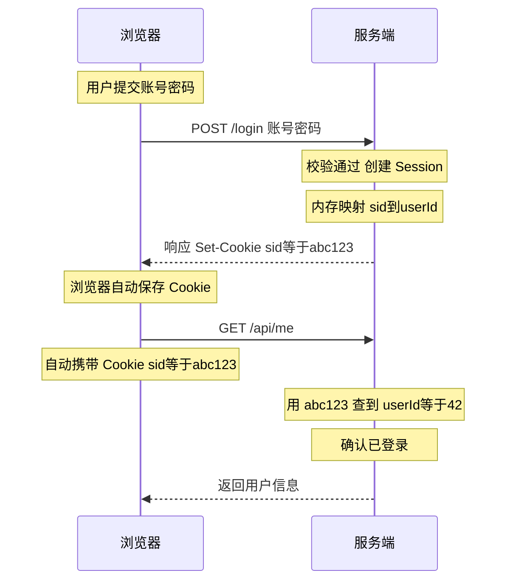

> HTTP 是无状态协议：服务端处理完一个请求，不会记得「刚才那个人是谁」。登录凭证要解决的就是这一件事——在*后续请求中安全地证明「我还是刚才登录的那个用户」*。
>
> 本文按演进顺序讲解三种主流方案：Session-Cookie -> Redis-Token -> JWT，给出可运行的 Node.js 实现，并纠正一些常见的理解偏差。核心结论先说：*没有绝对最优的方案，只有最适合特定场景的方案*，你需要在安全性、扩展性、用户体验和系统复杂度之间做权衡。

## 方案一：Session-Cookie（服务端有状态的经典方案） ##

### 工作原理 ###

1. 用户提交账号密码，服务端校验通过；
2. 服务端在自己这边创建一个 Session（一块存用户信息的内存/存储），生成随机的 Session ID；
3. 服务端通过 `Set-Cookie` 响应头把 Session ID 写入浏览器 Cookie；
4. 之后浏览器对同域名的每次请求都会*自动携带*这个 Cookie；
5. 服务端拿 Session ID 去 Session 存储里查：查得到就是已登录，查不到（或已过期）就是未登录。



*凭证本身（Session ID）不含任何业务信息*，只是一把随机钥匙，真正的用户数据都在服务端。这是它与 JWT 最本质的区别。

### 最小实现（Express + express-session） ###

```ts
const express = require('express');
const session = require('express-session');

const app = express();
app.use(express.json());

app.use(session({
  secret: process.env.SESSION_SECRET,  // 用于给 Session ID Cookie 签名，防篡改
  name: 'sid',                         // 不用默认名 connect.sid，减少技术栈指纹
  resave: false,
  saveUninitialized: false,
  cookie: {
    httpOnly: true,                    // JS 读不到，防 XSS 窃取
    secure: true,                      // 仅 HTTPS 下发送
    sameSite: 'lax',                   // 缓解 CSRF
    maxAge: 30 * 60 * 1000,            // 30 分钟
  },
}));

app.post('/login', async (req, res) => {
  const user = await verifyPassword(req.body.username, req.body.password);
  if (!user) return res.status(401).json({ message: '账号或密码错误' });

  req.session.regenerate((err) => {    // 登录成功后更换 Session ID，防会话固定攻击
    if (err) return res.status(500).end();
    req.session.userId = user.id;
    res.json({ message: '登录成功' });
  });
});

app.get('/api/me', (req, res) => {
  if (!req.session.userId) return res.status(401).json({ message: '未登录' });
  res.json({ userId: req.session.userId });
});

app.post('/logout', (req, res) => {
  req.session.destroy(() => res.json({ message: '已退出' }));  // 服务端直接销毁，立即失效
});
```

几个容易被忽略但重要的安全细节：

- `HttpOnly`：禁止 JavaScript 读取 Cookie，即使页面存在 XSS，攻击者也拿不到 Session ID；
- `SameSite=Lax/Strict`：限制跨站请求携带 Cookie，是现代浏览器缓解 CSRF 的第一道防线（敏感操作仍建议叠加 CSRF Token）；
- 登录成功后调用 `regenerate` 更换 Session ID：防止「会话固定」攻击（攻击者预先塞给受害者一个已知的 Session ID）。

### 真正的问题：分布式下 Session 不共享 ###

单机时代这套方案几乎无懈可击。问题出在多实例部署：Session 默认存在各实例自己的内存里，负载均衡把用户的下一个请求分到另一台机器时，那台机器上没有他的 Session，就会被误判为未登录。

需要说明的是：*这个问题本身有多种经典解法*，并非只能换方案：

| 解法 | 思路 | 缺点 |
| :--- | :--- | :--- |
| 粘性会话（Sticky Session） | 负载均衡按 IP/Cookie 把同一用户固定路由到同一实例 | 实例宕机则该实例上的会话全部丢失；扩缩容不友好 |
| Session 复制 | 实例间互相同步 Session | 网络与内存开销随实例数膨胀，仅适合小集群 |
| 集中存储 | 把 Session 统一放到 Redis 等共享存储 | 引入一个中间件依赖（可接受） |

其中「集中存储」是主流答案——而它，正是方案二。

## 方案二：Redis-Token（集中存储的有状态方案） ##

### 工作原理 ###

本质上是把「Session 存哪、凭证怎么传」这两件事都升级了：

- 存储：登录态从各实例内存改为统一的 Redis；
- 传递：凭证从 Cookie 自动携带，改为前端手动放在请求头（如 `Authorization`）中携带，天然适配 App、小程序等没有浏览器 Cookie 机制的客户端。

*流程*：

1. 登录成功后，服务端生成一个加密安全的随机 Token；
2. 以 `token -> 用户信息` 存入 Redis，并设置过期时间（TTL）；
3. Token 返回给前端，前端存起来（存储位置的权衡见 3.5 节）；
4. 后续请求前端把 Token 放进请求头；服务端拿它查 Redis，查到即已登录；
5. 登出 = 删掉 Redis 里这个 key，立即生效。

任何一台服务器实例都连着同一个 Redis，天然解决了共享问题；同时保留了有状态方案最大的优点——服务端对登录态有完全控制权（强制下线、踢人、改密码后使所有会话失效，都只是删几个 key 的事）。

### 实现（Koa + ioredis） ###

```ts
const Koa = require('koa');
const Router = require('koa-router');
const bodyParser = require('koa-bodyparser');
const Redis = require('ioredis');
const crypto = require('crypto');

const app = new Koa();
const router = new Router();
const redis = new Redis(process.env.REDIS_URL);

const TOKEN_TTL = 30 * 60;           // 30 分钟（秒）
const tokenKey = (token) => `auth:token:${token}`;

router.post('/login', async (ctx) => {
  const user = await verifyPassword(ctx.request.body.username, ctx.request.body.password);
  if (!user) {
    ctx.status = 401;
    ctx.body = { message: '账号或密码错误' };
    return;
  }

  // 必须用 CSPRNG 生成，绝不能用 Math.random / 自增 ID / 可预测的拼接
  const token = crypto.randomBytes(32).toString('hex');

  await redis.set(
    tokenKey(token),
    JSON.stringify({ userId: user.id, loginAt: Date.now() }),
    'EX', TOKEN_TTL,
  );

  ctx.body = { token };
});

// 鉴权中间件：查 Redis + 滑动续期
async function auth(ctx, next) {
  const token = ctx.get('Authorization')?.replace(/^Bearer\s+/i, '');
  if (!token) {
    ctx.status = 401;
    ctx.body = { message: '未登录' };
    return;
  }

  const raw = await redis.get(tokenKey(token));
  if (!raw) {
    ctx.status = 401;
    ctx.body = { message: '登录已过期' };
    return;
  }

  // 滑动续期：用户只要持续活跃就不会被登出；长时间不操作自然过期
  await redis.expire(tokenKey(token), TOKEN_TTL);

  ctx.state.user = JSON.parse(raw);
  await next();
}

router.get('/api/me', auth, (ctx) => {
  ctx.body = { userId: ctx.state.user.userId };
});

router.post('/logout', auth, async (ctx) => {
  const token = ctx.get('Authorization').replace(/^Bearer\s+/i, '');
  await redis.del(tokenKey(token));   // 服务端主动失效，立即生效
  ctx.body = { message: '已退出' };
});

app.use(bodyParser()).use(router.routes());
```

### 两个工程细节 ###

#### 滑动续期（Sliding Expiration） ####

上面 `redis.expire` 那一行就是「续期机制」：固定 TTL 会让正在填表单的用户突然被登出，体验很差；滑动续期则是「只要活跃就一直有效，闲置超过 TTL 才过期」。更严格的系统会同时设一个绝对上限（比如无论多活跃，7 天必须重新登录），两者结合。

#### 想「踢掉某个用户的所有设备」怎么办？ ####

`token -> user` 的单向映射查不到「某个用户有哪些 token」。常见做法是再维护一个反向索引：

```ts
// 登录时追加
await redis.sadd(`auth:user:${user.id}:tokens`, token);

// 强制下线该用户所有会话
const tokens = await redis.smembers(`auth:user:${userId}:tokens`);
await redis.del(...tokens.map(tokenKey), `auth:user:${userId}:tokens`);
```

### 代价 ###

每个请求多一次 Redis 网络往返（单次通常小于 1ms，绝大多数业务无感）；
Redis 成为关键依赖，需要考虑它自身的高可用（主从 + 哨兵 / Cluster）。

## 方案三：JWT（无状态方案） ##

### 和前两者的本质区别 ###

Session-Cookie 和 Redis-Token 的凭证都只是「一把随机钥匙」，数据在服务端；JWT 反过来——把用户数据和防伪签名直接装进凭证本身，服务端不存任何东西。验证时只需要用密钥核对签名、检查过期时间，不查库、不查 Redis。

### JWT 的结构 ###

一个 JWT 分三段，以 `.` 分隔：

```txt
eyJhbGciOiJIUzI1NiIsInR5cCI6IkpXVCJ9        <- Header：令牌类型 + 签名算法
.eyJ1aWQiOjQyLCJleHAiOjE3NTY2MDgwMDB9       <- Payload：业务数据（用户 ID、过期时间等）
.SflKxwRJSMeKKF2QT4fwpMeJf36POk6yJV_adQssw5c <- Signature：签名
```

- Header / Payload 只是 Base64URL 编码，不是加密——任何人拿到令牌都能直接解码看到内容。绝不能把密码、手机号等敏感信息放进 Payload（这是实践中最容易踩的坑）；
- Signature 由 `HMAC-SHA256(base64(header) + "." + base64(payload), secret)`（HS256 对称签名）或 RSA/ECDSA 私钥（RS256/ES256 非对称签名）生成。攻击者改了 Payload 里的任何一个字节，签名校验就会失败——它保证的是防篡改，不是保密。

> 对称还是非对称？单体或密钥可以安全共享时用 HS256 就够；微服务下建议 RS256——只有认证服务持有私钥能签发，其余服务用公钥验签即可，密钥泄露面小得多。

> 另一个必须防的坑：`alg: none` 攻击。早期一些 JWT 库允许令牌声明「无签名」并直接放行。验证时必须显式指定允许的算法白名单（见下面代码中的 `algorithms` 参数）。

### 基础实现（jsonwebtoken） ###

```ts
const jwt = require('jsonwebtoken');

const SECRET = process.env.JWT_SECRET;

// 签发
function signToken(user) {
  return jwt.sign(
    { uid: user.id },                 // Payload：只放必要的、不敏感的数据
    SECRET,
    { expiresIn: '30m', algorithm: 'HS256' },
  );
}

// 验证中间件（Express 风格）
function auth(req, res, next) {
  const token = req.headers.authorization?.replace(/^Bearer\s+/i, '');
  if (!token) return res.status(401).json({ message: '未登录' });

  try {
    // algorithms 白名单必须显式写，防 alg:none / 算法混淆攻击
    req.user = jwt.verify(token, SECRET, { algorithms: ['HS256'] });
    next();
  } catch (e) {
    const message = e.name === 'TokenExpiredError' ? '登录已过期' : '无效令牌';
    res.status(401).json({ message });
  }
}
```

### 无状态的代价：签发之后，覆水难收 ###

服务端不存状态，意味着*签出去的令牌在过期前无法主动作废*：

- 用户点了「退出登录」，令牌其实还有效（前端删掉只是自欺欺人）；
- 用户改了密码，旧令牌依然能用；
- 令牌被 XSS / 抓包截获，攻击者在剩余有效期内畅通无阻；
- 想封禁一个账号、踢一个用户下线，做不到。

两种主流补救，注意它们都是在给无状态方案「加回一点状态」——这正是工程权衡的体现：

#### 补救一：Redis 黑名单（按需记录，量小） ####

登出/封禁时，把令牌唯一标识 `jti` 写入 Redis，TTL 设为该令牌的剩余有效期（到期自动清理，黑名单不会无限膨胀）；每次验签后额外检查一次黑名单。

```ts
// 签发时带上唯一 ID
jwt.sign({ uid: user.id, jti: crypto.randomUUID() }, SECRET, { expiresIn: '30m' });

// 登出：拉黑剩余有效期
async function logout(payload) {
  const remainSeconds = payload.exp - Math.floor(Date.now() / 1000);
  if (remainSeconds > 0) {
    await redis.set(`jwt:blacklist:${payload.jti}`, 1, 'EX', remainSeconds);
  }
}

// 验证时多查一步
if (await redis.exists(`jwt:blacklist:${payload.jti}`)) {
  return res.status(401).json({ message: '令牌已失效' });
}
```

代价：每个请求又要查一次 Redis——「不查存储」的优势被部分抵消，但黑名单只存少量注销记录，远比全量会话轻。

#### 补救二：双 Token（Access Token + Refresh Token） ####

|  | Access Token | Refresh Token |
| :--- | :--- | :--- |
| 有效期 | 短（5-30分钟） | 长（7-30天） |
| 用途 | 访问业务接口，每个请求都带 | 仅用于换取新的 Access Token |
| 传输频率 | 高 | 极低（只在刷新时） |
| 服务端是否存储 | 否（保持无状态） | 是（存 Redis/DB，可撤销） |

思路：把高频传输的凭证做短命，把长命的凭证做低频 + 可撤销。即使 Access Token 被截获，攻击窗口也只有几分钟；Refresh Token 存在服务端，登出/封禁时直接删除，用户下次刷新就会失败。

```ts
router.post('/login', async (ctx) => {
  const user = await verifyPassword(/* ... */);

  const accessToken = jwt.sign({ uid: user.id }, SECRET, { expiresIn: '15m' });
  const refreshToken = crypto.randomBytes(32).toString('hex');

  // Refresh Token 是有状态的：服务端可随时撤销
  await redis.set(`auth:refresh:${refreshToken}`, user.id, 'EX', 7 * 24 * 3600);

  ctx.body = { accessToken, refreshToken };
});

router.post('/refresh', async (ctx) => {
  const { refreshToken } = ctx.request.body;
  const userId = await redis.get(`auth:refresh:${refreshToken}`);
  if (!userId) {
    ctx.status = 401;
    ctx.body = { message: '请重新登录' };
    return;
  }

  // 轮换（rotation）：旧的作废、发新的。旧 Refresh Token 若再次出现，说明可能被盗用
  await redis.del(`auth:refresh:${refreshToken}`);
  const nextRefreshToken = crypto.randomBytes(32).toString('hex');
  await redis.set(`auth:refresh:${nextRefreshToken}`, userId, 'EX', 7 * 24 * 3600);

  ctx.body = {
    accessToken: jwt.sign({ uid: Number(userId) }, SECRET, { expiresIn: '15m' }),
    refreshToken: nextRefreshToken,
  };
});
```

前端配合：请求收到 401 时先调 `/refresh` 换新令牌并重放原请求，刷新也失败才跳登录页（在 axios 拦截器里做，用户无感）。

### 令牌存哪？XSS 与 CSRF 的取舍 ###


这是 JWT 落地时绕不开的问题：

|  | XSS 风险 | CSRF 风险 | 说明 |
| :--- | :--- | :--- | :--- |
| localStorage | 高：任意注入脚本可读走 | 无 | 实现最简单，也最常见 |
| HttpOnly Cookie | 低：JS 读不到 | 有：浏览器自动携带 | 需配 `SameSite` + CSRF Token，且又回到了 Cookie 跨域的限制 |
| 内存（JS 变量） | 较低：刷新即丢 | 无 | 常与「Refresh Token 放 HttpOnly Cookie」组合 |

安全要求高的场景推荐组合拳：Access Token 放内存，Refresh Token 放 HttpOnly + Secure + SameSite Cookie。多数一般业务用 localStorage + 严格的 XSS 治理（CSP、输入转义）也是可接受的现实选择。

## 三方案对比与选型 ##

### 横向对比 ###

| 维度 | Session-Cookie | Redis-Token | JWT |
| :--- | :--- | :--- | :--- |
| 服务端是否存状态 | 是（本机） | 是（Redis 集中） | 否（双 Token 时 Refresh Token 除外） |
| 分布式支持 | 差（需额外方案） | 好 | 好 |
| 主动失效（登出/踢人） | 容易 | 容易 | 难（需黑名单/双 Token 补救） |
| 每请求验证开销 | 查本机 Session | 一次 Redis 往返 | 纯 CPU 验签，最快 |
| 非浏览器客户端（App/小程序） | 不友好（依赖 Cookie） | 友好 | 友好 |
| 跨域 | 受 Cookie 域限制 | 无限制 | 无限制 |
| 凭证含业务信息 | 否 | 否 | 是（明文可读，防篡改不防偷看） |
| 实现复杂度 | 低 | 中 | 看似低，做完整（刷新/撤销/存储）后中高 |

### 怎么选 ###

*优先有状态方案（Session-Cookie / Redis-Token），当*：

- 系统对安全和管控要求高：需要强制登出、踢人下线、改密码全端失效、后台审计在线会话——有状态方案里这些是「删一个 key」，无状态方案里这些是「打补丁」；
- 传统企业后台、管理系统、单体应用：单体直接 Session-Cookie；多实例上 Redis-Token（或 Session 集中存 Redis，二者本质相同）。

*优先无状态方案（JWT），当*：

- 前后端分离 + 分布式/微服务：各服务本地验签即可确认身份，不必都依赖同一个会话存储，服务间调用也可以直接传递令牌；
跨域、多端（App / 小程序 / 第三方开放接口）：不依赖 Cookie，Authorization 头走天下；
- 对水平扩展要求高、希望认证层无共享状态。

*一个诚实的提醒*：如果你发现自己给 JWT 加上了黑名单、双 Token、反向索引……此时它的复杂度和依赖已经和 Redis-Token 相差无几，而管控能力仍然更弱。很多中小规模系统，Redis-Token 是复杂度和能力最均衡的选择；JWT 的收益要在「验签不查存储」真正成为架构优势（服务多、调用链长）时才充分体现。

### 无论选哪种，都要做的事 ###

- 全站 HTTPS——任何方案在明文传输下都形同虚设；
- 凭证必须由 CSPRNG 生成（`crypto.randomBytes` / UUID v4），杜绝可预测性；
- 登录接口做限流与暴力破解防护；
- 设置合理的过期时间，别为了省事签发「永久有效」的凭证；
- 密钥/Secret 走环境变量或配置中心，定期轮换，绝不进代码仓库。

## 总结 ##

三种方案是一条清晰的演进线：

- Session-Cookie：服务端记住你，浏览器带钥匙。简单可靠，倒在分布式的 Session 共享上；
- Redis-Token：把「记忆」集中到 Redis，钥匙改放请求头。解决了共享与多端问题，保留了服务端的完全控制权，代价是每请求一次 Redis 往返；
- JWT：服务端不再记忆，把数据和签名装进令牌本身。换来了极致的水平扩展能力，代价是失去主动失效能力——于是又用黑名单、双 Token 把一部分「状态」请了回来。

技术选型没有银弹。当你纠结用哪种时，先回答三个问题：我需要随时踢用户下线吗？我的服务是单体还是一大堆？我的客户端有没有浏览器 Cookie 可用？——答案自然就浮出来了。
