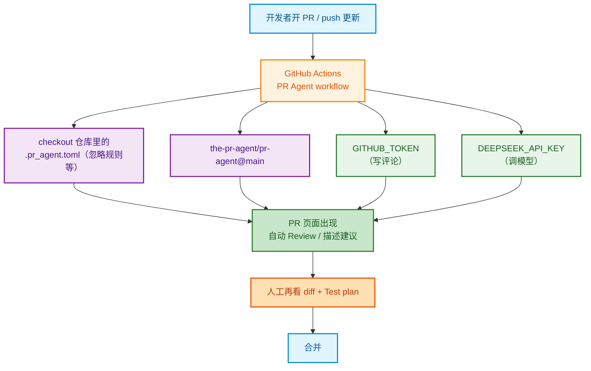

## 前言 ##

开了 PR 不等于有人看。人一忙，review 就变成「先合了再说」。

更稳的做法是给仓库加一层 *自动 Review*：PR 一打开（或更新），机器人先扫一遍 diff，用评论指出明显问题；人再做最终判断。

这篇文章讲的是我们仓库里已经在用的方案：*PR-Agent* + *DeepSeek*，跑在 GitHub Actions 上。不依赖 Cursor Bugbot，也不绑死某一家商业 Code Review SaaS。

## 方案选型（简表） ##

| 方案 | 特点 | 适合 |
| :--- | :--- | :--- |
| PR-Agent (本文) | Actions 一键接入，模型可自选，可配置中文 | 想自己控模型与提示词 |
| GitHub Copilot Review | 官方集成，省事 | 已买 Copilot，想少维护 |
| CodeRabbit / 同类 | 产品化体验好 | 愿意付订阅、少改 YAML |
| Cursor Bugbot | IDE/产品侧能力 | 团队已深度用 Cursor |

我们选 PR-Agent，主要因为：

- 配置全在仓库里，可复用到多个项目
- 能用自己的 `DEEPSEEK_API_KEY`
- 可以强制「用中文回复 + 聚焦某技术栈」

## 整体链路 ##



注意：自动 Review **不能替代** CI 和人工。它负责「多一双眼睛」，合并不合仍由人和 CI 门禁决定。

### 准备 Secrets ###

仓库 → Settings → Secrets and variables → Actions，新增：

| Name | 说明 |
| :--- | :--- |
| `DEEPSEEK_API_KEY` | DeepSeek 开放平台的 API Key |

`GITHUB_TOKEN` 一般不用手建，workflow 里用 <code v-pre>${{ secrets.GITHUB_TOKEN }}</code> 即可。

记得在 job 上给够权限：`pull-requests: write`、`issues: write`。

组织级仓库也可以把 Key 配在 Organization secrets，再授权给仓库用。

### 加 GitHub Actions Workflow ###

在仓库创建 `.github/workflows/pr-agent.yml`，核心如下（与现网配置同思路）：

```yml
# PR-Agent：用 DeepSeek 做 PR 自动 review
name: PR Agent

on:
  pull_request:
    types: [opened, reopened, ready_for_review, synchronize]
  issue_comment:
    types: [created]

jobs:
  pr_agent_job:
    if: ${{ github.event.sender.type != 'Bot' && (github.event_name != 'issue_comment' || github.event.issue.pull_request) }}
    runs-on: ubuntu-latest
    permissions:
      contents: read
      pull-requests: write
      issues: write
    name: Run PR Agent
    steps:
      - uses: actions/checkout@v4
        with:
          sparse-checkout: |
            .pr_agent.toml
          sparse-checkout-cone-mode: false

      - name: PR Agent
        uses: the-pr-agent/pr-agent@main
        env:
          GITHUB_TOKEN: ${{ secrets.GITHUB_TOKEN }}
          DEEPSEEK_API_KEY: ${{ secrets.DEEPSEEK_API_KEY }}
          config.model: "deepseek/deepseek-v4-flash"
          config.fallback_models: '["deepseek/deepseek-v4-flash"]'
          github_action_config.pr_actions: '["opened", "reopened", "ready_for_review", "synchronize"]'
          github_action_config.auto_review: "true"
          github_action_config.auto_describe: "true"
          github_action_config.auto_improve: "false"
          pr_reviewer.extra_instructions: >-
            Reply in Chinese (简体中文). Focus on your stack here.
            Flag security and correctness issues. Ignore lockfile-only noise.
```

几个值得注意的点：

- `synchronize` *要显式打开* 否则只在 PR 打开时跑一次，后续 push 更新可能不再 review。
- 过滤 Bot `github.event.sender.type != 'Bot'`，避免机器人互相触发死循环。
- `sparse-checkout` 只拉 `.pr_agent.toml`，启动更快；忽略规则仍生效。
- `auto_describe` 可帮 PR 补描述；若你强制手写 `Summary` / `Test plan`，也可以关掉，避免和团队模板抢戏。

官方安装说明可参考：[PR-Agent GitHub 安装文档](https://qodo-merge-docs.qodo.ai/installation/github/)。

### 仓库根目录加 `.pr_agent.toml` ###

Workflow 里的 `env` 优先级通常更高；`.pr_agent.toml` 适合放默认模型、忽略文件、统一中文指令。

```ini
# https://github.com/the-pr-agent/pr-agent/blob/main/pr_agent/settings/configuration.toml

[config]
model = "deepseek/deepseek-v4-flash"
fallback_models = ["deepseek/deepseek-v4-flash"]

[github_action_config]
pr_actions = ["opened", "reopened", "ready_for_review", "synchronize"]
auto_review = true
auto_describe = true
auto_improve = false

[ignore]
glob = [
  "package-lock.json",
  "pnpm-lock.yaml",
  "yarn.lock",
  ".agents/**",
  ".agent/**",
]

[pr_reviewer]
extra_instructions = "Reply in Chinese (简体中文). Focus on security and correctness."
```

按仓库技术栈改 `extra_instructions`，例如：

- NestJS / TypeORM：强调 auth、JWT、校验、migration
- Nuxt / Vue：强调 XSS、服务端权限、数据获取
- 管理后台：强调权限、表单校验、危险操作确认

### 开一个 PR 验证 ###

1. 从 `develop` 拉小改动，推到远程并开 PR（或 `develop → main`）
2. 看 Actions 里 PR Agent 是否成功
3. 回到 PR 页面，应出现机器人评论（Review / 描述建议）
4. 再 push 一次，确认 synchronize 会重新跑

*若失败，优先查*：

1. `DEEPSEEK_API_KEY` 是否配置、是否有额度
2. `job permissions` 是否够写 PR 评论
3. 模型名是否仍有效（DeepSeek 模型 ID 可能会变）
4. 是否被 `if: Bot` 条件跳过

## 和「规范的 PR 正文」怎么配合 ##

自动 Review 解决的是「有没有人看代码」。

PR 模板解决的是「作者有没有说清楚改了什么、怎么测」。

建议 PR 正文至少包含：

```md
## Summary

- 改了什么、为什么

## Test plan

- [ ] 本地/预览如何验证
- [ ] 关键路径与回归点
```

机器审 diff，人审意图和验收清单，两者一起才完整。

## 多仓库复用建议 ##

前端、后台、API 可以共用同一套骨架，只改两处：

- `pr_reviewer.extra_instructions`（技术栈不同）
- `[ignore].glob`（锁文件、生成物路径不同）

`DEEPSEEK_API_KEY` 适合放在 Organization secrets，避免每个仓库复制一份。

## 小结 ##

给 GitHub 仓库加 PR 自动 Review，落地成本其实不高：

1. 配置 `DEEPSEEK_API_KEY`
2. 添加 `.github/workflows/pr-agent.yml`
3. 添加 `.pr_agent.toml`
4. 开 PR 验证评论是否出现

它不会替你保证线上零事故，但能显著降低「没人看就合并」的概率，也适合作为 AI 辅助研发规范链里的一环。

> 如果你已经有 CI、约定式提交和双分支策略，把自动 Review 接上之后，PR 门禁会完整很多：本地快检 → 远程 CI → 自动 Review → 人工确认 → 合并发布。
