## 摘要 ##

从JWT原理出发，用React+Zustand构建完整登录鉴权：Mock服务端签发token、Axios拦截器注入Authorization、路由守卫保护敏感页面，拆解前后端鉴权全链路。

## JWT 解决的核心问题 ##

HTTP 是无状态的。用户登录后，下一次请求服务器不知道你是谁。传统的 cookie-session 方案由服务器内存存储会话对象，在分布式架构下 session 需要共享存储，扩展困难。

JWT（JSON Web Token）的解法是：*用户登录后，服务器签发一个加密的 token 给客户端，客户端每次请求带上 token，服务器解码 token 即可验证身份*。JWT 不需要服务器存储会话信息，任何一台服务器签发的 token 可以在其他服务器上解码验证，天然适合分布式架构。

JWT 的核心操作只有两个：`sign`（签发）和 `verify`（验证）。

## 项目依赖与架构 ##

项目基于 React 19 + Vite 8，核心依赖：

```json
{
  "dependencies": {
    "axios": "^1.19.0",
    "jsonwebtoken": "^9.0.3",
    "react": "^19.2.6",
    "react-router-dom": "^7.18.2",
    "zustand": "^5.0.15"
  },
  "devDependencies": {
    "vite": "^8.0.12",
    "vite-plugin-mock": "^3.0.2"
  }
}
```

`vite-plugin-mock` 提供本地 mock 服务，开发阶段模拟后端接口，不需要启动真实的后端服务器。jsonwebtoken 在 mock 服务中完成 JWT 的签发和验证。

## Mock 服务端：JWT 签发与验证 ##

mock 服务模拟了两个接口：`/api/login` 和 `/api/repo`，覆盖了 JWT 的 sign 和 verify 两个核心操作。

### 登录接口：签发 token ###

```ts
import jwt from 'jsonwebtoken';
const secret = 'secret888!$';

export default [
  {
    url: '/api/login',
    method: 'post',
    response: (req, res) => {
      const body = req.body;
      if (body.username !== 'admin' || body.password !== '123456') {
        return { code: -1, message: 'username or password 错误' };
      }
      const token = jwt.sign(
        { user: body.username, role: 'admin' },
        secret,
        { expiresIn: 86400 }
      );
      return {
        code: 0,
        user: { username: body.username },
        token: token
      };
    }
  }
]
```

`jwt.sign` 接收三个参数：

- 荷载（payload）——包含用户身份信息的 JSON 对象；
- 密钥（secret）——服务端保密的加盐字符串；
- 选项（options）——`expiresIn: 86400` 表示 token 24 小时后过期。

`jwt.sign` 把 `{ user: 'admin', role: 'admin' }` 加密成一串无意义的字符串，客户端拿到这个字符串就拥有了身份凭证。服务器不存储任何会话信息，身份信息就编码在 token 本身。

### 受保护接口：验证 token ###

```json
{
  url: '/api/repo',
  method: 'get',
  response: req => {
    const auth = req.headers['authorization'];
    const token = auth ? auth.split(' ')[1] : '';
    try {
      let decoded = jwt.verify(token, secret);
      return { code: 0, data: decoded.user };
    } catch (err) {
      return { code: 401, msg: 'token 错误' };
    }
  }
}
```

客户端请求 `Authorization` 头部的格式是 `Bearer <token>`，服务端从中提取 token 后用 `jwt.verify(token, secret)` 解码。如果 token 被篡改、过期或密钥不匹配，`jwt.verify` 会抛出异常，返回 401 未授权。

## Zustand：全局鉴权状态管理 ##

Zustand 是一个轻量级的状态管理库，比 Redux 简洁得多，适合中小型项目。整个应用只需要一个 store 来管理用户身份状态：

```ts
import { create } from 'zustand'

export const useAuthStore = create(set => ({
  token: localStorage.getItem('token') || '',
  user: JSON.parse(localStorage.getItem('user')) || null,

  setAuth: ({ token, user }) => {
    localStorage.setItem('token', token);
    localStorage.setItem('user', JSON.stringify(user));
    set({ token, user });
  },

  logout: () => {
    localStorage.removeItem('token');
    localStorage.removeItem('user');
    set({ token: '', user: null });
  }
}))
```

`create` 接收一个函数，返回一个 React Hook。set 方法更新状态并触发组件重新渲染。

三个关键设计决策：

- *初始化时从 localStorage 恢复状态*：页面刷新后 token 和 user 从 localStorage 读取，登录状态不会丢失。

- *setAuth 同步更新 localStorage 和内存*：登录成功后，token 和用户信息同时写入 localStorage 和 Zustand store，持久化与响应式同步完成。

- *logout 清除两处数据*：退出登录时清除 localStorage 和 store 状态，确保安全。

## Axios 拦截器：自动注入 token ##

客户端每次请求受保护接口都需要携带 token，手动添加 `Authorization` 头繁琐且容易遗漏。Axios 拦截器提供了全局拦截机制：

```ts
import axios from 'axios';

const instance = axios.create({
  baseURL: '/api',
  timeout: 5000
});

instance.interceptors.request.use(config => {
  const token = localStorage.getItem('token');
  if (token) {
    config.headers['Authorization'] = `Bearer ${token}`;
  }
  return config;
});

instance.interceptors.response.use(res => {
  return res.data;
});

export default instance;
```

*请求拦截器*：在每个请求发出前拦截，从 localStorage 读取 token，拼装成 `Bearer <token>` 格式注入到 Authorization 头部。有 token 就自动携带，没有就不加，后端接口根据 token 是否存在决定返回数据还是 401。

*响应拦截器*：默认 axios 的响应包裹在 `res.data` 中，每次取数据都要写 `res.data`。拦截器直接返回 `res.data`，业务代码中 `await axios.get('/repo')` 拿到的就是后端返回的 JSON 数据体。

## 登录页面：表单验证与请求 ##

登录页面包含表单验证和 JWT 登录请求：

```ts
function Login() {
  const navigate = useNavigate();
  const location = useLocation();
  const from = location.state?.from || '/';
  const setAuth = useAuthStore(state => state.setAuth);

  const [formData, setFormData] = useState({ username: '', password: '' });
  const [errors, setErrors] = useState({ username: '', password: '' });
  const [isValid, setIsValid] = useState(false);

  useEffect(() => {
    const newErrors = { username: '', password: '' };
    if (!formData.username.trim()) {
      newErrors.username = '用户名不能为空';
    } else if (formData.username.length < 3) {
      newErrors.username = '用户名至少3位';
    }
    if (!formData.password.trim()) {
      newErrors.password = '密码不能为空';
    } else if (formData.password.length < 6) {
      newErrors.password = '密码至少6位';
    }
    setErrors(newErrors);
    setIsValid(!newErrors.username && !newErrors.password);
  }, [formData]);

  const handleLogin = async e => {
    e.preventDefault();
    const res = await login(formData);
    if (res.code === 0) {
      setAuth({ token: res.token, user: res.user });
      navigate(from, { replace: true });
    } else {
      alert(res.message || '登录失败');
    }
  };
  // ... 渲染表单
}
```

`useEffect` 监听 `formData` 变化，每次输入都实时验证。isValid 为 false 时提交按钮置灰，防止无效提交。

`location.state?.from` 记录了用户从哪里跳转到登录页的。登录成功后 `navigate(from, { replace: true })` 跳回原来的页面，而不是硬编码跳转到首页——这是用户体验细节。

## 路由守卫：保护敏感页面 ##

`/pay` 页面需要登录才能访问，`RequireAuth` 组件实现了路由守卫逻辑：

```tsx
import { Navigate } from 'react-router-dom';
import { useAuthStore } from '../store/user';

function RequireAuth({ children }) {
  const token = useAuthStore((state) => state.token);
  if (!token) {
    return <Navigate to="/login" replace />;
  }
  return children;
}
```

`useAuthStore(state => state.token)` 精确订阅 token 字段，只在 token 变化时重新渲染。没有 token 时用 `<Navigate to="/login" replace />` 重定向到登录页，登录成功后 Zustand 状态更新，组件重新渲染，token 存在则渲染 children。

在 App.jsx 中使用：

```tsx
<Route path="/pay" element={
  <RequireAuth>
    <Pay />
  </RequireAuth>
}/>
```

## 导航栏：根据登录状态动态渲染 ##

Nav 组件根据 Zustand 中的 `token` 和 `user` 状态动态展示不同的 UI：

```tsx
function Nav() {
  const token = useAuthStore((state) => state.token);
  const user = useAuthStore((state) => state.user);
  const logout = useAuthStore((state) => state.logout);

  return (
    <nav>
      <Link to="/">Home</Link>
      <Link to="/pay">Pay</Link>
      {!token && <Link to="/login">Login</Link>}
      {user && <a>{user.username}</a>}
      {token && <button onClick={handleLogout}>Logout</button>}
    </nav>
  );
}
```

未登录时显示 Login 链接，已登录时显示用户名和 Logout 按钮，实现了"未登录看不到登录后功能"的数据驱动视图切换。

## 完整请求链路 ##

```mermaid
flowchart TD
    Start["用户输入账号密码<br>点击登录"] --> Validate["Login 组件校验表单"]
    Validate --> CallLogin["调用 login API"]
    CallLogin --> ReqInt1["Axios 请求拦截器<br>注入 token（登录时无 token，跳过）"]
    ReqInt1 --> MockLogin["Mock 服务端 /api/login<br>验证账号密码"]
    MockLogin --> Sign["jwt.sign 签发 token"]
    Sign --> ReturnToken["返回 token + user"]
    ReturnToken --> SetAuth["setAuth<br>写入 localStorage + Zustand store"]
    SetAuth --> Navigate["navigate 跳回来源页面"]
    Navigate --> Render["目标页面组件渲染"]
    Render --> SendReq["发送数据请求"]
    SendReq --> ReqInt2["Axios 请求拦截器<br>从 localStorage 读取 token"]
    ReqInt2 --> Inject["自动注入<br>Authorization: Bearer &lt;token&gt;"]
    Inject --> MockRepo["Mock 服务端 /api/repo<br>验证 token"]
    MockRepo --> Verify["jwt.verify 解码"]
    Verify --> ReturnData["返回受保护数据"]

    %% 配色方案
    style Start fill:#e1f5fe,stroke:#0288d1,stroke-width:2px,color:#01579b
    style Validate fill:#f3e5f5,stroke:#7b1fa2,stroke-width:2px,color:#4a148c
    style CallLogin fill:#f3e5f5,stroke:#7b1fa2,stroke-width:2px,color:#4a148c
    style ReqInt1 fill:#fff3e0,stroke:#f57c00,stroke-width:2px,color:#e65100
    style MockLogin fill:#e8f5e9,stroke:#2e7d32,stroke-width:2px,color:#1b5e20
    style Sign fill:#e8f5e9,stroke:#2e7d32,stroke-width:2px,color:#1b5e20
    style ReturnToken fill:#c8e6c9,stroke:#2e7d32,stroke-width:2px,color:#1b5e20
    style SetAuth fill:#ffe0b2,stroke:#e65100,stroke-width:2px,color:#bf360c
    style Navigate fill:#ffe0b2,stroke:#e65100,stroke-width:2px,color:#bf360c
    style Render fill:#e1f5fe,stroke:#0288d1,stroke-width:2px,color:#01579b
    style SendReq fill:#e1f5fe,stroke:#0288d1,stroke-width:2px,color:#01579b
    style ReqInt2 fill:#fff3e0,stroke:#f57c00,stroke-width:2px,color:#e65100
    style Inject fill:#fff3e0,stroke:#f57c00,stroke-width:2px,color:#e65100
    style MockRepo fill:#e8f5e9,stroke:#2e7d32,stroke-width:2px,color:#1b5e20
    style Verify fill:#e8f5e9,stroke:#2e7d32,stroke-width:2px,color:#1b5e20
    style ReturnData fill:#c8e6c9,stroke:#2e7d32,stroke-width:2px,color:#1b5e20
```



## 总结 ##

JWT 登录鉴权的核心是"签发 - 存储 - 携带 - 验证"四个环节。服务端用 `jwt.sign` 签发 token、`jwt.verify` 验证 token，客户端用 Zustand 管理全局鉴权状态，Axios 拦截器自动注入 `Authorization` 头部，路由守卫组件保护敏感页面。这套架构不依赖服务端会话存储，状态持久化在客户端的 `localStorage` 中，页面刷新后登录状态自动恢复，是前后端分离项目中最常见的鉴权模式。
