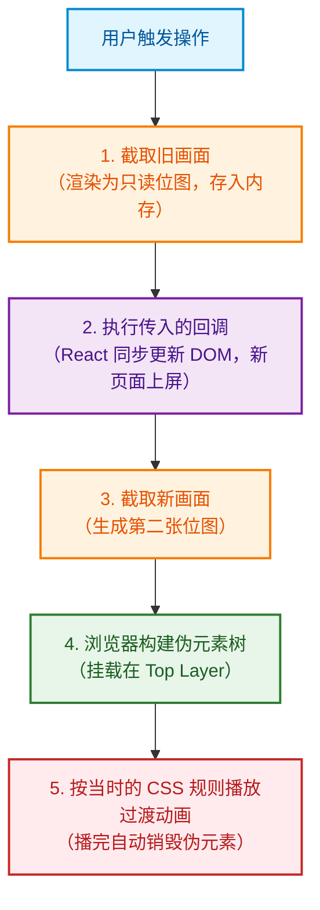

> 从「为什么单页应用切换页面没有动画」讲到「按导航语义播放不同的过渡」。
>
> 阅读前提：了解 React 组件 / Hook / ref，以及 CSS `@keyframes`。不要求特定项目背景。

在单页应用（SPA）中实现平滑的页面转场，过去一直是件性价比极低的事：

| 方案 | 包体积 / 依赖 | 内存开销 | 核心痛点 |
| :--- | :--- | :--- | :--- |
| 传统双组件树方案 (framer-motion / react-transition-group) | 增加几十 KB 运行时 | 高（旧页面延迟卸载，内存中并存两棵树） | 布局脱标、高度塌陷、离开前旧组件状态管理极其繁琐 |
| 浏览器原生 View Transitions | 0 KB（原生 API） | 极低（两张只读位图） | 无需维持双树，纯 GPU 合成，两行代码告别硬切 |


本文将深入拆解 View Transitions 的底层工作时序，并给出结合 React Router 工业级落地的完整解法。

## 问题：为什么 SPA 切换页面没有动画 ##

传统多页网站（MPA）跳转时，浏览器整页刷新，天然有「旧页面消失 → 白屏/加载 → 新页面出现」的瞬间。单页应用（SPA）的路由切换是另一回事：

```txt
用户点击链接 → React 卸载旧页面组件 → 挂载新页面组件 → 浏览器在同一次提交中渲染新 DOM
```

旧页面瞬间消失，新页面瞬间顶上，中间没有任何过渡态。动画爱好者管这个叫「硬切」。

想加动画，会碰到一个根本障碍：动画需要新旧两个画面同时存在，而 SPA 同一时刻在 DOM 树中只有一棵组件树。

传统做法是让两棵树共存一段时间——旧页面延迟卸载、新页面提前挂载，再用 CSS 或 JS 动画库编排。代价很明确：多一个庞大的第三方依赖、离场动画结束前旧组件依然占着内存与事件监听、两套界面争抢布局空间。

2018 年之后，浏览器标准团队给了一条更轻的路：不必让两棵树共存，让浏览器把旧画面拍成一张静态图。

## 核心思想：让浏览器自己截图 ##

这就是 *View Transitions API*。其核心只有一个入口方法：

```js
document.startViewTransition(() => {
  // 在这个回调里同步更新 DOM
})
```

调用后，浏览器会严格按以下四步时序推进：



关键在于：*动画播放的是两张「静态位图」，而不是两棵活着的组件树*。 你的应用在任何时刻都只维护一棵树。这就是它无论在内存占用还是性能上都远超双树方案的原因。

### 伪元素树：动画写在哪 ###

浏览器把这两张位图挂到了一组脱离正常文档流的特殊伪元素上：

```txt
::view-transition                          ← 全屏顶层容器（位于 top layer，不产生滚动条）
└─ ::view-transition-group(root)           ← 过渡单元分组；整页过渡默认只有 root
   └─ ::view-transition-image-pair(root)
      ├─ ::view-transition-old(root)       ← 旧页面位图快照
      └─ ::view-transition-new(root)       ← 新页面位图快照
```

所谓「写转场动画」，本质就是给 `::view-transition-old(root)` 和 `::view-transition-new(root)` 写标准的 CSS 动画属性。Chrome / Safari / Firefox 的开发者工具中可以直接暂停并检查它们。

### 兼容性分层认知 ###

不要把兼容性记成一张粗暴的是非表，它分为三个层次：

- 同文档基础过渡（本文范围，`document.startViewTransition`）：Chrome 111+、Safari 18+、Firefox 144+。全主流浏览器均已支持，属于 Baseline Newly available。
- 官方类型切换机制（types / `:active-view-transition-type()`）：Chrome 125+、Safari 18.2+、Firefox 147+，属于更新的特性层。
- 跨文档过渡（MPA 整页跳转）：Chrome 较完整，Safari 紧跟，Firefox 仍偏弱（本文不涉及）。

不支持该 API 的浏览器不会报错，只是平稳降级为无动效的硬切。

## 第一个动画：覆盖默认的交叉淡入淡出 ##

先不碰框架。什么 CSS 都不写、只调用 `startViewTransition`，浏览器会自动播放默认的交叉淡入淡出（旧快照淡出、新快照淡入）。这已经能解决最刺眼的瞬切。

若想改成「新页面从右侧滑入，旧页面向左微移退出」，只需覆盖伪元素的动画：

```css
::view-transition-old(root),
::view-transition-new(root) {
  animation-duration: 200ms;
  animation-timing-function: cubic-bezier(0.2, 0.7, 0.3, 1);
}

::view-transition-new(root) {
  animation-name: page-enter;
}

::view-transition-old(root) {
  animation-name: page-exit;
}

@keyframes page-enter {
  from {
    opacity: 0.4;
    transform: translateX(48px);
  }
  /* 结束状态不写：自然落回 transform: none; opacity: 1 */
}

@keyframes page-exit {
  to {
    opacity: 0;
    transform: translateX(-24px);
  }
  /* 起始状态不写：起点即当前页面自然状态 */
}
```

这里有两个很实用的细节：

- 不必把 `from` / `to` 写成闭环：`page-enter` 只写 `from`，动画结束时自动恢复到正常布局状态；`page-exit` 只写 `to`，起点就是截图时的画面。

- 位移不会撑出横向滚动条：快照树渲染在 Top Layer，溢出屏幕的部分不会触发布局重排，也不会触发宿主容器的滚动条。

## 接入 react-router：一个隐蔽的模式陷阱 ##

### 正确姿势 ###

react-router（v7 / v8）内置了对接能力。给导航组件加上 `viewTransition` 属性，router 就会在底层把页面状态更新包裹进 `document.startViewTransition`：

```tsx
<Link to="/about" viewTransition>关于我们</Link>
<NavLink to="/dashboard" viewTransition>控制台</NavLink>
```

编程式导航同样支持布尔配置：

```ts
const navigate = useNavigate()
navigate('/about', { viewTransition: true })
```

### 陷阱：三种运行模式，一种静默失效 ###

翻开 `react-router` 的类型定义，`viewTransition` 明确标注了 `[modes: framework, data]`。如果你的项目运行在不支持的模式下，它不会在控制台抛出任何 Warning，而是静默忽略：

| 运行模式 | 创建方式 | viewTransition | 支持情况 |
| :--- | :--- | :--- | :--- |
| framework | Remix / React Router 框架全栈项目 | 支持 | |
| data | createHashRouter / createBrowserRouter + <RouterProvider> | 支持 | |
| declarative | 传统的 `<HashRouter>` / `<BrowserRouter>` 内部包裹 `<Routes>` JSX | ❌ 静默失效 (完全不调用 API) | |


很多老项目使用的是声明式 `<HashRouter>`。在那条代码路径上，Router 只执行了 `React.startTransition(...)`，压根没有调用原生 `document.startViewTransition`。很多人以为是自己 CSS 动画选择器写错了，其实是这行代码根本没进到 API。

改造方式：迁移到 Data 模式。

即便不用它的 `loader` 或数据 API，为了动效链路也是值得迁的。URL 保持不变，只需重构路由配置写法：

```tsx
// ❌ 之前（declarative 模式，viewTransition 永远无效）
<HashRouter>
  <Routes>
    <Route element={<RootLayout />}>
      <Route path="/" element={<Home />} />
      <Route path="about" element={<About />} />
    </Route>
  </Routes>
</HashRouter>

//  现在（data 模式，正确对接底层 API）
import { createHashRouter, RouterProvider } from 'react-router'

const router = createHashRouter([
  {
    element: <RootLayout />,
    children: [
      { path: '/', element: <Home /> },
      { path: 'about', element: <About /> },
    ],
  },
])

function App() {
  return <RouterProvider router={router} />
}
```

> ⚠️ 排查铁律：遇到页面动效不生效，第一步永远不要去调 CSS，而是在浏览器控制台断点检查：这条路由跳转路径到底有没有人触发 `document.startViewTransition`？

## 进阶：不同场景播放不同动画 ##

单一的转场动效无法满足真实业务。常见的产品语义包括：

- 进入下一层级（如 列表 → 详情）：新页面向左滑入，旧页面向左退出（推进感）。
- 返回上一层级：反向滑出，新页面从左向右回退（后退感）。
- 同层级切换（如 Tab 切换、侧栏平级导航）：仅使用交叉淡入淡出。如果同层也做滑入，用户会感知到不存在的层级关系。

### 原理：在两次截图之间留下标记 ###

回看第 2 节的时序，动画匹配发生在新快照截取之后。浏览器会根据当时的 DOM 与 CSS 来匹配动效伪元素。

因此只要保证：*旧快照已经截完、新快照尚未截取之前*，我们在 `<html>` 根节点打上一个标记（例如 `data-nav="slide"`），CSS 就能精准分流。

```css
::view-transition-old(root),
::view-transition-new(root) {
  animation-duration: 200ms;
}

/* 前进：右进左出 */
html[data-nav='slide']::view-transition-old(root) { animation-name: page-exit; }
html[data-nav='slide']::view-transition-new(root) { animation-name: page-enter; }

/* 后退：左进右出 */
html[data-nav='slide-back']::view-transition-old(root) { animation-name: page-exit-back; }
html[data-nav='slide-back']::view-transition-new(root) { animation-name: page-enter-back; }

/* 未标记或 fade：不修改 animation-name，走默认淡入淡出 */
```

> 关于标准 types 的说明：W3C 标准方案是 `startViewTransition({ types: ['slide'] })`，搭配 CSS `:active-view-transition-type(slide)`。但目前 react-router 的 viewTransition prop 仅接受 boolean，尚未开放传入自定义 types。因此通过 `<html data-nav="...">` 注入是目前生态下最稳妥的工业级方案。

### 布局分组：用 handle 替代路径正则 ###

如何在代码里判断当前跳转是“跨层”还是“同层”？

很多人的直觉是用正则去匹配 URL 路径（如 `/\/detail\//`）。这会导致路由元信息散落在业务组件各处，后续增删路由极易遗漏。

利用 React Router 原生提供的 `handle` 元属性，把分组定义锁在路由表里：

```ts
const router = createHashRouter([
  {
    element: <RootLayout />,
    children: [
      {
        // 标记为基础框架组（同级）
        handle: { group: 'app' },
        element: <AppLayout />,
        children: [
          { path: 'dashboard', element: <Dashboard /> },
          { path: 'settings', element: <Settings /> },
        ],
      },
      {
        // 标记为详情子层级
        handle: { group: 'detail' },
        children: [
          { path: 'products/:id', element: <ProductDetail /> },
          { path: 'products/:id/reviews', element: <Reviews /> },
        ],
      },
    ],
  },
])
```

使用时通过 `useMatches()` 向上提取当前匹配路由的 group：

```ts
const matches = useMatches()
const group = matches
  .map((m) => (m.handle as { group?: string } | undefined)?.group)
  .find(Boolean) ?? 'app'
```

### 标记写入时机：必须是 `useLayoutEffect` ###

这一步的时序非常敏感。React Router 在执行 `startViewTransition` 时，其回调内部会使用 `flushSync` 同步提交 DOM。三个候选时机对比：

| 写入位置 | 执行时钟周期 | 运行结果 |
| :--- | :--- | :--- |
| useEffect | 异步微任务 / Passive Effect | ⚠️ 时序滞后：往往在新快照已截取后才执行，动效标记丢失或错乱 |
| 直接在 Render 阶段写 document | Render 阶段 | ❌ 副作用污染：React StrictMode 下触发双重渲染，计算出脏状态 |
| useLayoutEffect | Commit 阶段，在 flushSync 内部同步执行 | 完美嵌入：精确卡在旧快照截取后、新快照截取前 |

*代码实现*：

```ts
import { useLayoutEffect, useRef } from 'react'
import { useLocation, useMatches, useNavigationType } from 'react-router'

function ViewTransitionMode() {
  const location = useLocation()
  const navType = useNavigationType() // PUSH / POP / REPLACE
  const matches = useMatches()

  const group = matches
    .map((m) => (m.handle as { group?: string } | undefined)?.group)
    .find(Boolean) ?? 'app'

  const prevGroup = useRef<string | null>(null)

  useLayoutEffect(() => {
    let mode = 'fade'

    // 跨组跳转才触发位移滑动
    if (prevGroup.current !== null && prevGroup.current !== group) {
      mode = navType === 'POP' ? 'slide-back' : 'slide'
    }

    // 同步修改 DOM，确保新快照捕获到当前属性
    document.documentElement.dataset.nav = mode
    prevGroup.current = group
  }, [location.pathname, group, navType]) // 注意：依赖必须包含 location.pathname

  return null
}
```

说明：REPLACE 跳转（如登录失效重定向、参数校验归一化）会默认 `fallback` 到 `fade`，避免页面产生奇怪的滑动推进感。

## 几个会让你以为 CSS 写错了的点 ##

排查转场动画异常时，最让人头疼的是：画面完全不动，或者方向偶尔抽风，但控制台一个报错都没有。 绝大多数时候，根因不在 CSS，而在时序和 React 生命周期。

### 声明式路由静默忽略 viewTransition ###

*现象*：加了 prop，CSS 也写对了，页面切换时依旧生硬硬切，毫无动静。

*病因*：使用的是旧版 `<BrowserRouter>` / `<HashRouter>` 组件，其内部调用链没有触发 `startViewTransition`。必须迁移到基于对象的 `createBrowserRouter` + `RouterProvider`。

### Effect 依赖写成派生值，导致标记“冻结” ###

*现象*：跨层进入详情页正常滑动，但在详情页内部切同级子页面时，本该是淡入淡出，却依然在“疯狂滑动”。

*病因*：如果 `useLayoutEffect` 的依赖项只写了 `[group]`，同组跳转时 `group` 未改变，effect 不重新执行，`document.documentElement.dataset.nav` 就会死死冻结在上次跨组写入的 '`slide`' 上。必须把导航事件源头 `location.pathname` 写入依赖。

### 千万不要在 Render 阶段直接修改 DOM ###

*现象*：线上构建打包后偶尔正常，本地开发时动画方向有时对、有时反，飘忽不定。

*病因*：开发环境的 React StrictMode 会执行两次 Render。在 Render 中直接写 `dataset` 会基于上一次被污染的 `ref` 计算出脏值再次覆写。DOM 操作必须严格限制在 Commit 阶段的 useLayoutEffect。

### 连续快速点击不需要手动写防抖 ###

*现象*：连击导航时会不会引发多个动画堆叠、状态撕裂？

*病因*：不必自己实现节流防抖。当一个过渡未结束又触发新的跳转时，React Router 会在底层调用原生的 `transition.skipTransition()` 立即跳过上一段动效。你只需保证每次写入 data-nav 是整表全量覆写，而不是做数组累加。

### 并不是所有跳转都配拥有动画 ###

*现象*：页面切换时像抽搐一样播了两次转场动画。

病因：路由 `loader` 中的 `redirect()`、未授权拦截、URL 参数初始化格式化等内部跳板操作，切勿配置 `viewTransition: true`，否则会在极短时间内级联播放两次过渡快照。

## 渐进增强与可访问性 ##

### 优雅降级 ###

浏览器不支持时无需写兼容垫片。不支持 `startViewTransition` 的环境下，React Router 会自动优雅降级为普通的瞬时状态更新。

若你自己手写封装，保证安全降级只需判断是否存在即可：

```ts
if (document.startViewTransition) {
  document.startViewTransition(updateDOM)
} else {
  updateDOM()
}
```

### 尊重系统的「减弱动效」 ###

前庭敏感或容易眩晕的用户会在操作系统中开启「减少动态效果」（Reduce Motion）。对大面积位图像素做快速位移很容易引起生理不适。

必须使用标准媒体查询进行包裹：

```ts
@media (prefers-reduced-motion: no-preference) {
  /* 所有涉及大范围 transform 位移、缩放的过渡规则，一律写在这里 */
  ::view-transition-old(root),
  ::view-transition-new(root) {
    animation-duration: 200ms;
    animation-timing-function: cubic-bezier(0.2, 0.7, 0.3, 1);
  }
}
```

开启减弱动效后，页面会自动回归到浏览器默认的交叉淡入淡出（Cross-fade），既优雅又具备包容性。

## 可直接复制的骨架 ##

### App.tsx ###

```tsx
import { useLayoutEffect, useRef } from 'react'
import {
  createHashRouter,
  Outlet,
  RouterProvider,
  useLocation,
  useMatches,
  useNavigationType,
} from 'react-router'
import './styles.css'

function ViewTransitionMode() {
  const location = useLocation()
  const navType = useNavigationType()
  const matches = useMatches()

  // 提取路由配置中的 group handle
  const group = matches
    .map((m) => (m.handle as { group?: string } | undefined)?.group)
    .find(Boolean) ?? 'app'

  const prevGroup = useRef<string | null>(null)

  useLayoutEffect(() => {
    let mode = 'fade'
    if (prevGroup.current !== null && prevGroup.current !== group) {
      mode = navType === 'POP' ? 'slide-back' : 'slide'
    }

    // 注入当前过渡语义标记
    document.documentElement.dataset.nav = mode
    prevGroup.current = group
  }, [location.pathname, group, navType])

  return null
}

function RootLayout() {
  return (
    <>
      <ViewTransitionMode />
      {/* 全局导航组件，按需携带 viewTransition 属性 */}
      <Outlet />
    </>
  )
}

const router = createHashRouter([
  {
    element: <RootLayout />,
    children: [
      {
        handle: { group: 'app' },
        element: <Outlet />,
        children: [
          { path: '/', element: <div>首页（同层）</div> },
          { path: '/settings', element: <div>设置（同层）</div> },
        ],
      },
      {
        handle: { group: 'detail' },
        children: [
          { path: '/products/:id', element: <div>详情页（子层级）</div> },
        ],
      },
    ],
  },
])

export function App() {
  return <RouterProvider router={router} />
}
```

### styles.css ###

```ts
/* 系统未开启“减弱动效”时才应用滑动位移 */
@media (prefers-reduced-motion: no-preference) {
  ::view-transition-old(root),
  ::view-transition-new(root) {
    animation-duration: 200ms;
    animation-timing-function: cubic-bezier(0.2, 0.7, 0.3, 1);
  }

  /* 前进滑动动画 */
  html[data-nav='slide']::view-transition-old(root) {
    animation-name: page-exit;
  }
  html[data-nav='slide']::view-transition-new(root) {
    animation-name: page-enter;
  }

  /* 后退滑动动画 */
  html[data-nav='slide-back']::view-transition-old(root) {
    animation-name: page-exit-back;
  }
  html[data-nav='slide-back']::view-transition-new(root) {
    animation-name: page-enter-back;
  }
}

@keyframes page-enter {
  from { opacity: 0.4; transform: translateX(48px); }
}
@keyframes page-exit {
  to { opacity: 0; transform: translateX(-24px); }
}
@keyframes page-enter-back {
  from { opacity: 0.4; transform: translateX(-48px); }
}
@keyframes page-exit-back {
  to { opacity: 0; transform: translateX(24px); }
}
```

## 总结与方案边界 ##

最后清晰说明这套方案的工程边界：

- 适用场景：整页级别的推进进入、返回回退、同层平滑淡入淡出。

- 不适用的场景：列表项缩略图“无缝飞跃膨胀”到详情大图那种共享元素转场。那种场景需要为每个具体 DOM 元素单独分配全局唯一的 view-transition-name，机制与整页过渡完全不同。

- 生态兼容：`<html data-nav="...">` 是现阶段路由库尚未开放底层原生 types 参数前的最佳实践。React 19 实验性的 `<ViewTransition>` 组件与路由器的 `viewTransition prop` 属于不同层面的抽象，在现有成熟生产体系中不要混淆。
