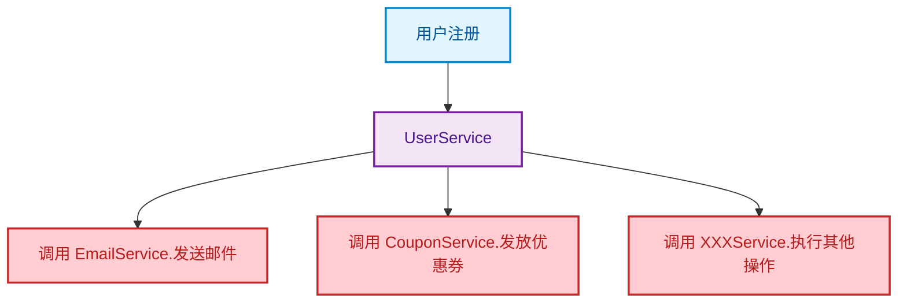
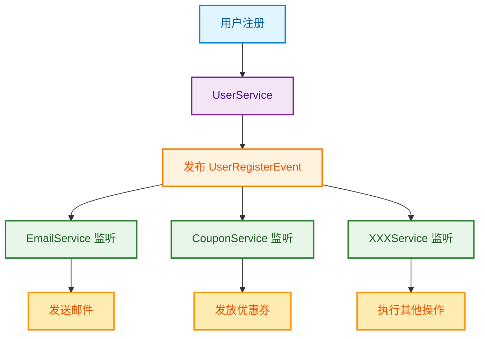
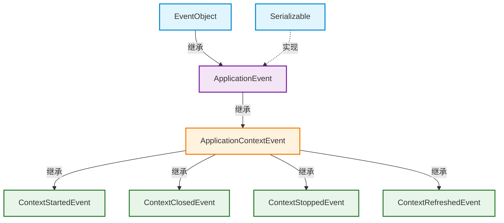
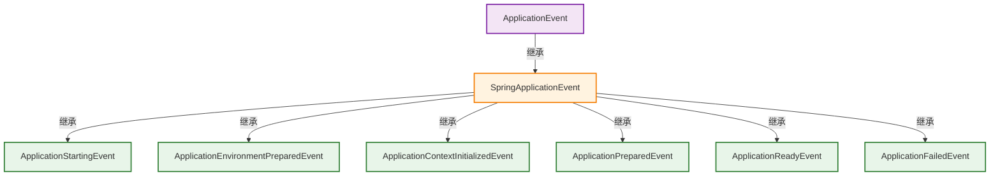

## 前言 ##

相信很多人对它的认知，只停留在“监听 SpringBoot 启动”的浅层用法，甚至觉得“日常开发用不上”。但实际上，它是 Spring 全家桶中最强大的解耦神器，更是 SpringBoot 自身底层实现的核心依赖（比如自动配置、启动流程、上下文刷新，都靠事件机制驱动）。日常开发中，无论是用户注册后的通知推送、订单支付后的后续处理，还是系统初始化、日志收集、监控告警，用事件机制都能让代码变得简洁、解耦、可扩展，还能轻松实现异步处理，避免阻塞主线程。

## 事件机制的核心本质 ##

### 概述 ###

在分布式系统开发中，事件驱动架构是解耦业务逻辑的关键技术。以用户注册的场景来举例子，假设在用户注册完成时，需要给该用户发送邮件、发送优惠劵等等操作，如下图所示：






### Spring 事件机制 ###

Spring 事件机制，本质是标准的观察者模式（发布-订阅模式），核心目的是解耦发布者与订阅者，让两者之间没有直接依赖，仅通过“事件”进行通信。Spring 事件机制完美对应观察者模式的三个核心角色，搞懂这三个角色，就掌握了事件机制的核心逻辑：

| 组件 | 说明 |
| :--- | :--- |
| 事件（Event） | 事件本身，是发布者与监听器之间通信的载体，包含事件相关的所有数据。Spring 中所有事件都必须继承 `ApplicationEvent` 类。 |
| 发布者（Publisher） | 事件的发起者，负责创建事件，并将事件发布到 Spring 容器中。Spring 中通过 `ApplicationEventPublisher` 接口实现事件发布。 |
| 监听器（Listener） | 事件的订阅者，负责监听指定类型的事件，当事件被发布时，自动执行对应的处理逻辑。Spring 中所有监听器都需要实现 `ApplicationListener` 接口，或通过注解标注。 |

### 事件机制的核心流程 ###

ApplcationEvent 是 Spring 为我们提供的一个事件监听、订阅的实现，在一些与业务无关的、通用的操作方法，我们可以把它设计成事件监听器，事件发布者不需要考虑谁去监听、监听的具体内容是什么，发布者的工作只是为了发布事件而已。

> ✅ 核心优势：发布者只需要关注“发布事件”，不用关心谁会监听、如何处理；监听器只需要关注“监听事件”，不用关心事件是谁发布的、从哪来的。两者完全解耦，后续修改任何一方的逻辑，都不会影响另一方。

## 核心 API 详解 ##

Spring 事件机制的核心，就是三个核心 API：ApplicationEvent（事件）、ApplicationListener（监听器）、ApplicationEventPublisher（发布者）。

### 事件（ApplicationEvent） ###

ApplicationEvent 是 Spring 中所有事件的顶层抽象类，位于 `org.springframework.context` 包下，所有自定义事件都必须继承它。

```java
public abstract class ApplicationEvent extends EventObject {
    // 事件发生的时间戳（自动赋值）
    private final long timestamp;

	  // 构造方法：必须传入事件源（source），即事件的发布者
    public ApplicationEvent(Object source) {
        super(source);
        this.timestamp = System.currentTimeMillis();
    }

    public ApplicationEvent(Object source, Clock clock) {
        super(source);
        this.timestamp = clock.millis();
    }

	  // 获取事件发生时间
    public final long getTimestamp() {
        return this.timestamp;
    }
}
```

ApplicationEvent 继承于 JDK 的 EventObject，该类维护了一个 source 字段，用于存储事件源（发布者）。内置 timestamp 字段，自动记录事件发生的时间戳，无需手动赋值。

### 事件监听器（ApplicationListener） ###

ApplicationListener 是 Spring 中所有监听器的顶层接口，用于定义“事件触发时的处理逻辑”，所有监听器都需要实现该接口（或通过注解替代）。

```java
@FunctionalInterface
public interface ApplicationListener<E extends ApplicationEvent> extends EventListener {
    void onApplicationEvent(E event);
}
```

ApplicationListener 是一个函数式接口，只有一个抽象方法 `onApplicationEvent(E event)`，该方法会在事件被发布时自动调用。泛型 E 必须是 ApplicationEvent 的子类，表示该监听器只监听指定类型的事件。注意监听器必须被 Spring 管理（添加 `@Component`、`@Service` 等注解），否则 Spring 容器无法识别，无法触发事件处理。

### 事件发布者（ApplicationEventPublisher） ###

ApplicationEventPublisher 是 Spring 提供的事件发布接口，用于发布事件，所有事件都必须通过该接口发布，Spring 容器会自动将事件转发给对应的监听器。

```java
@FunctionalInterface
public interface ApplicationEventPublisher {
    default void publishEvent(ApplicationEvent event) {
        this.publishEvent((Object)event);
    }

    void publishEvent(Object event);
}
```

## 代码实现 ##

### 依赖 ###

在这里只是简单的讲解如何使用ApplicationEvent以及使用Listen来完成业务逻辑的解耦，不涉及到复杂的数据交互，所有需要引入的依赖很少，项目Pom.xml配置文件如下：

```xml
<dependency>
    <groupId>org.springframework.boot</groupId>
    <artifactId>spring-boot-starter-web</artifactId>
</dependency>
```

### 自定义事件源 ###

首先要创建一个事件，监听都是围绕着事件来进行的。创建 UserRegisterEvent 事件类，只需继承 ApplicationEvent，必须重写构造方法，传入事件源，除此之外，还可以添加自身需要的业务字段（如用户信息、订单信息）以及Getter方法。

```java
@Getter
public class UserRegisterEvent extends ApplicationEvent {
    // 自定义业务字段
    private UserInfo user;

    public UserRegisterEvent(Object source, UserInfo user) {
        super(source);
        this.user = user;
    }
}
```

### 事件发布 ###

事件发布是由 ApplicationContext 对象管控的，在事件发布之前需要注入 ApplicationContext 对象，然后通过 publishEvent 方法完成事件发布。日常开发中，发布事件有两种常用方式；

通过实现 ApplicationEventPublisherAware 接口，Spring 会自动注入 ApplicationEventPublisher 对象：

```java
@Service
public class UserServiceImpl implements ApplicationEventPublisherAware {
    // 事件发布器（Spring 自动注入）
    private ApplicationEventPublisher publisher;

    @Override
    public void userRegister(UserInfo user) {
        publisher.publishEvent(new UserRegisterEvent(this, user));
    }
}
```

直接 `@Autowired` 或者 `@Resource` 注入 ApplicationEventPublisher，这种方式简单直接，适合不需要实现接口的场景，上面方式一致。

```java
@Service
public class UserServiceImpl implements UserService {
    // 直接注入事件发布器
    @Resource
    private ApplicationEventPublisher publisher;

    @Override
    public void userRegister(UserInfo user) {
        publisher.publishEvent(new UserRegisterEvent(this, user));
    }
}
```

### 事件监听与实现 ###

#### 实现 ApplicationListener 接口 ####

最基础的方式，适用于所有场景，尤其是需要自定义复杂处理逻辑的情况：

```java
@Component
@Slf4j
public class UserRegisterListener implements ApplicationListener<UserRegisterEvent> {

    @Override
    public void onApplicationEvent(UserRegisterEvent event) {
        // 1. 获取事件中的业务数据
        UserInfo user = event.getUser();
        // 2. 处理业务逻辑（如发送通知）
        log.info("监听器1（接口方式）：用户 {} 注册，发送短信通知...", user.getUsername());
    }
}
```

✅ 特点：通用、灵活，可处理复杂逻辑，支持泛型指定监听的事件类型，避免接收无关事件。

#### 使用 `@EventListener` 注解 ####

Spring 4.2+ 新增注解方式，无需实现接口，只需在方法上添加 `@EventListener` 注解，指定监听的事件类型，简洁高效，可监听多个事件，是日常开发中最推荐的方式。

```java
@Slf4j
@Component
public class UserRegisterAnnotationListener {
    /**
     * 注解指定监听的事件类型，方法参数为事件对象
     */
    @EventListener(UserRegisterEvent.class)
    public void handleUserRegisterEvent(UserRegisterEvent event) {
        UserInfo user = event.getUser();
        log.info("监听器2（注解方式）：用户 {}注册，记录注册日志...", user.getUsername());
    }

    /**
     * 一个方法可监听多个事件（用数组指定）
     */
    @EventListener({UserRegisterEvent.class, OrderPayEvent.class})
    public void handleMultiEvent(ApplicationEvent event) {
        if (event instanceof UserRegisterEvent) {
            log.info("监听器2（注解方式）：处理用户注册事件");
        } else if (event instanceof OrderPayEvent) {
            log.info("监听器2（注解方式）：处理订单支付事件");
        }
    }
}
```

⚠️ 注意：方法参数必须是事件对象（或事件的 payload），否则 Spring 无法识别监听的事件类型。

#### 使用 `@TransactionalEventListener` 注解 ####

日常开发中，经常需要“事务提交后，再执行事件处理逻辑”（如订单支付事务提交后，再发送支付通知，避免事务未提交，通知已发送，出现数据不一致）。此时就需要用 `@TransactionalEventListener` 注解，它是 `@EventListener` 的子类，支持事务绑定。

```xml
<dependency>
    <groupId>org.springframework</groupId>
    <artifactId>spring-tx</artifactId>
</dependency>
```

```java
@Component
@Slf4j
public class UserRegisterTransactionalListener {
    /**
     * 事务提交后，再执行事件处理
     */
    @TransactionalEventListener(value = UserRegisterEvent.class, phase = TransactionPhase.AFTER_COMMIT)
    public void handleUserRegisterAfterCommit(UserRegisterEvent event) {
        UserInfo user = event.getUser();
        log.info("监听器3（事务绑定）：用户 {} 注册事务已提交，发送邮件通知...", user.getUsername());
    }

    /**
     * 事务提交前执行（如校验数据）
     */
    @TransactionalEventListener(value = UserRegisterEvent.class, phase = TransactionPhase.BEFORE_COMMIT)
    public void handleBeforeCommit(UserRegisterEvent event) {
        UserInfo user = event.getUser();
        log.info("监听器3（事务绑定）：用户 {} 注册事务即将提交...", user.getUsername());
    }
}
```


> ⚠️ 注意：该注解只有在“发布事件的方法被 `@Transactional` 标注”时才生效，否则事务阶段不生效。

#### 实现 SmartApplicationListener 接口 ####

上述几种方式，监听器的执行顺序是不确定的。如果需要指定多个监听器的执行顺序（如先记录日志，再发送通知，最后赠送积分），就需要实现SmartApplicationListener 接口，它是ApplicationListener 的子接口，支持指定监听顺序。

```java
@Component
public class RegisterLogSmartListener implements SmartApplicationListener {

    /**
     * 指定监听的事件类型
     */
    @Override
    public boolean supportsEventType(Class<? extends ApplicationEvent> eventType) {
        // 只监听 UserRegisterEvent 事件
        return UserRegisterEvent.class.isAssignableFrom(eventType);
    }

    /**
     * 指定监听的事件源类型（可选，可省略）
     */
    @Override
    public boolean supportsSourceType(Class<?> sourceType) {
        // 只监听 UserService 发布的事件
        return UserService.class.isAssignableFrom(sourceType);
    }

    /**
     * 指定执行顺序（值越小，优先级越高）
     */
    @Override
    public int getOrder() {
        return SmartApplicationListener.super.getOrder();
    }

    /**
     * 事件处理逻辑
     */
    @Override
    public void onApplicationEvent(ApplicationEvent event) {
        UserRegisterEvent registerEvent = (UserRegisterEvent) event;
        UserInfo user = registerEvent.getUser();
        log.info("监听器4（顺序1）：用户 {} 注册，记录日志...", user.getUsername());
    }
}
```

## 高级特性实现 ##

### 监听器的执行方式 ###

Spring 事件机制默认是同步执行的，发布者发布事件后，会阻塞主线程，等待所有监听器执行完成，才会继续执行后续代码。但很多场景下，我们需要异步执行（如发送通知、记录日志，不阻塞核心业务），此时就需要配置异步监听器。通过配置 `@EnableAsync` 注解和 `@Async` 注解，实现监听器异步执行，不阻塞主线程。

#### 开启异步执行 ####

在我们的启动类上增加一个 `@EnableAsync` 注解，开启异步支持，如下所示：

```java
@SpringBootApplication
@EnableAsync // 开启异步
public class EventDemoApplication {
    public static void main(String[] args) {
        SpringApplication.run(EventDemoApplication.class, args);
    }
}
```

#### 异步调用 ####

在事件处理的方法上增加 `@Async` 异步调用注解

```java
@Component
public class UserRegisterAsyncListener {

    @Async
    @EventListener(UserRegisterEvent.class)
    public void handleUserRegisterAsync(UserRegisterEvent event) {
        try {
            Thread.sleep(2000); // 模拟耗时操作
        } catch (InterruptedException e) {
            e.printStackTrace();
        }
        System.out.println("异步监听器执行：" + Thread.currentThread().getName());
    }
}
```

✅ 优势：主线程无需等待监听器执行完成，直接继续执行后续逻辑，提升核心业务响应速度；监听器在子线程中执行，不影响主线程。

#### 自定义线程池 ####

默认情况下，Spring 会使用默认的线程池（SimpleAsyncTaskExecutor），该线程池每次都会创建新线程，性能较差。实际开发中，建议自定义线程池，优化异步性能。

```java
// 自定义异步线程池配置
@Configuration
@EnableAsync
public class AsyncConfig {

    // 自定义线程池
    @Bean(name = "eventAsyncPool")
    public Executor eventAsyncPool() {
        ThreadPoolTaskExecutor executor = new ThreadPoolTaskExecutor();
        // 核心线程数
        executor.setCorePoolSize(5);
        // 最大线程数
        executor.setMaxPoolSize(10);
        // 队列容量
        executor.setQueueCapacity(20);
        // 线程空闲时间（秒）
        executor.setKeepAliveSeconds(60);
        // 线程名称前缀
        executor.setThreadNamePrefix("event-async-");
        // 拒绝策略（队列满时，直接抛出异常）
        executor.setRejectedExecutionHandler(new ThreadPoolExecutor.AbortPolicy());
        // 初始化线程池
        executor.initialize();
        return executor;
    }
}

// 监听器指定使用自定义线程池
@Component
public class UserRegisterAsyncListener {

    // 指定线程池名称，使用自定义线程池
    @Async("eventAsyncPool")
    @EventListener(UserRegisterEvent.class)
    public void handleUserRegisterAsync(UserRegisterEvent event) {
        try {
            Thread.sleep(2000);
        } catch (InterruptedException e) {
            e.printStackTrace();
        }
        System.out.println("异步监听器执行：" + Thread.currentThread().getName());
    }
}
```

### Spring 内置事件 ###

在 Spring 框架中，自定义了非常多的自定义事件，让我们更容易的进行拓展。ApplicationContextEvent 是 Spring Context 相关的事件基类，如下图所示：



### SpringBoot 内置事件 ###

SpringBoot 提供了多个内置事件，SpringBoot 自身的启动流程、自动配置、上下文刷新等功能，都是通过事件机制驱动的。我们也可以监听这些事件，实现自定义逻辑（如项目启动后初始化缓存、启动完成后发送通知）。



| 内置事件 | 触发时机 | 核心用途 |
| :--- | :--- | :--- |
| ApplicationStartingEvent | SpringBoot 应用启动开始时（最早触发，上下文未初始化） | 初始化一些启动前的配置（如系统参数初始化） |
| ApplicationEnvironmentPreparedEvent | 环境配置（Environment）准备完成后，上下文未创建 | 修改环境配置、添加自定义配置源 |
| ApplicationContextInitializedEvent | 应用上下文（ApplicationContext）初始化完成，Bean未加载 | 上下文相关的初始化操作 |
| ApplicationPreparedEvent | 应用上下文准备完成，Bean已加载，未刷新 | Bean加载后的自定义操作 |
| ContextRefreshedEvent | 应用上下文刷新完成（所有Bean已初始化） | 初始化缓存、加载字典数据、启动定时任务 |
| ApplicationStartedEvent | SpringBoot 应用启动完成（所有Bean已初始化，服务未就绪） | 启动完成后的通知、监控告警 |
| ApplicationReadyEvent | 应用启动完成，服务已就绪，可接收请求 | 发送应用启动成功通知、执行初始化任务 |
| ApplicationFailedEvent | 应用启动失败时 | 记录启动失败日志、发送告警通知、清理资源 |
