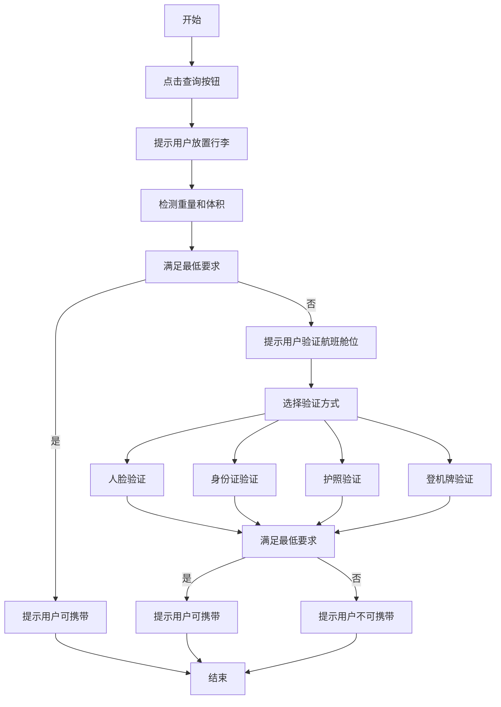
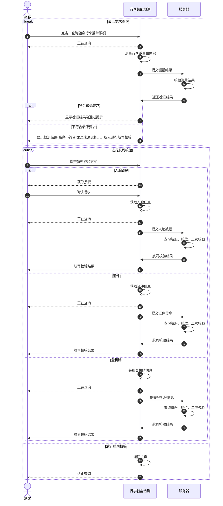
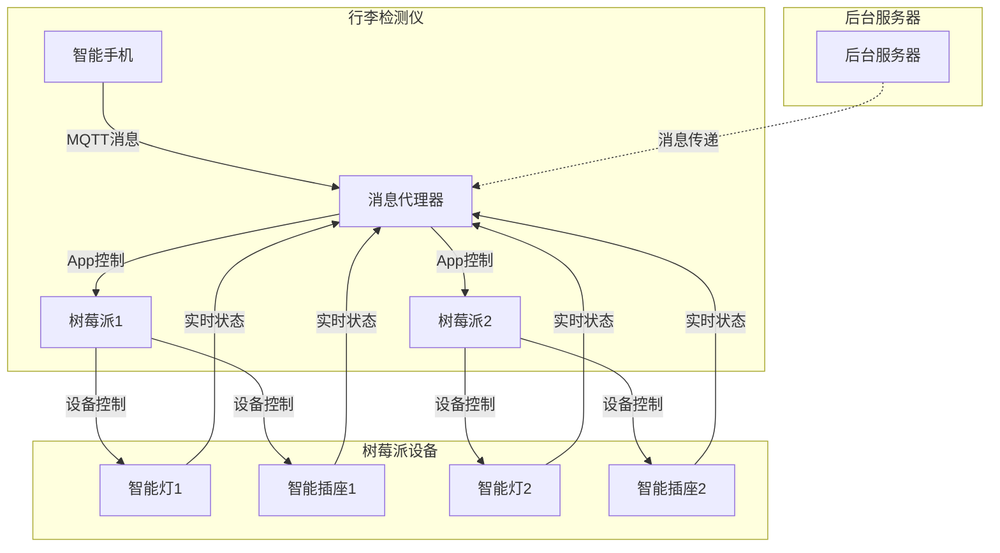

## 项目目标 ##

为从无锡硕放机场出发的常旅客提供随身行李额度自助查询，避免旅客在通过安检时因携带行李尺寸和重量限制需前往值机柜台办理行李托运，通过降低往返值机柜台频次及节省重复安检排队时间，充分满足旅客对顺畅出行的美好向往，以此提升无锡硕放机场地面服务的整体水平、维护机场良好形象。

::: tip 个性功能
每一步操作均有语音引导提示，尽可能降低用户理解难度，增强应用产品力，提高设备利用率。
:::

## 系统要求 ##

- Windows 10 X64 及以上版本
- DOTNET 8 Runntime
- 人脸识别、证件识别、登机牌识别等相关硬件要求环境依赖

## 业务流程 ##

## 操作流程 ##

## 功能页面 ##

{data-zoomable}

{data-zoomable}

{data-zoomable}

{data-zoomable}

## 横版设计 ##

{data-zoomable}

{data-zoomable}

{data-zoomable}

{data-zoomable}

{data-zoomable}

## 硬件交互 ##

