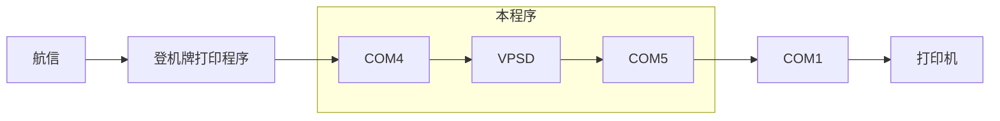
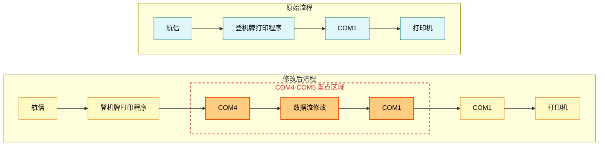
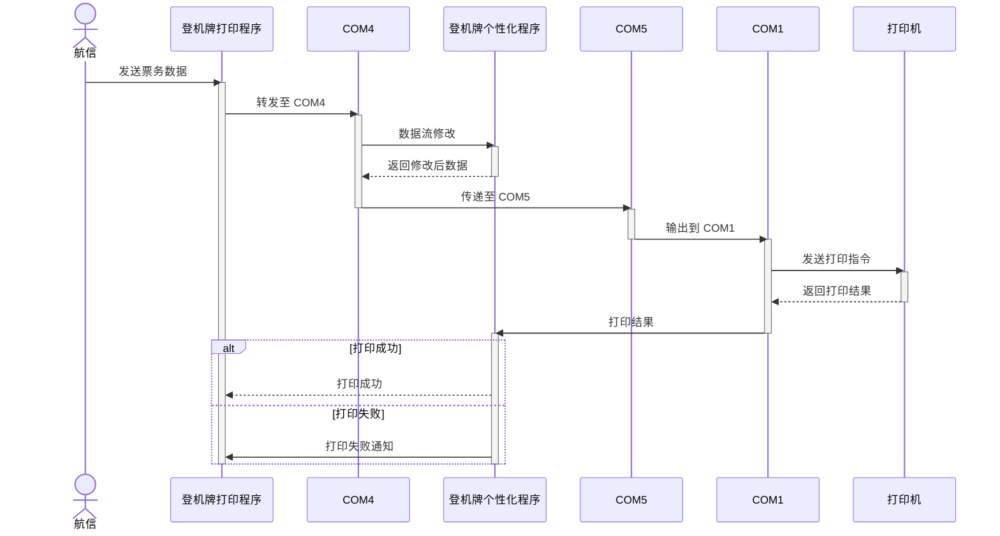
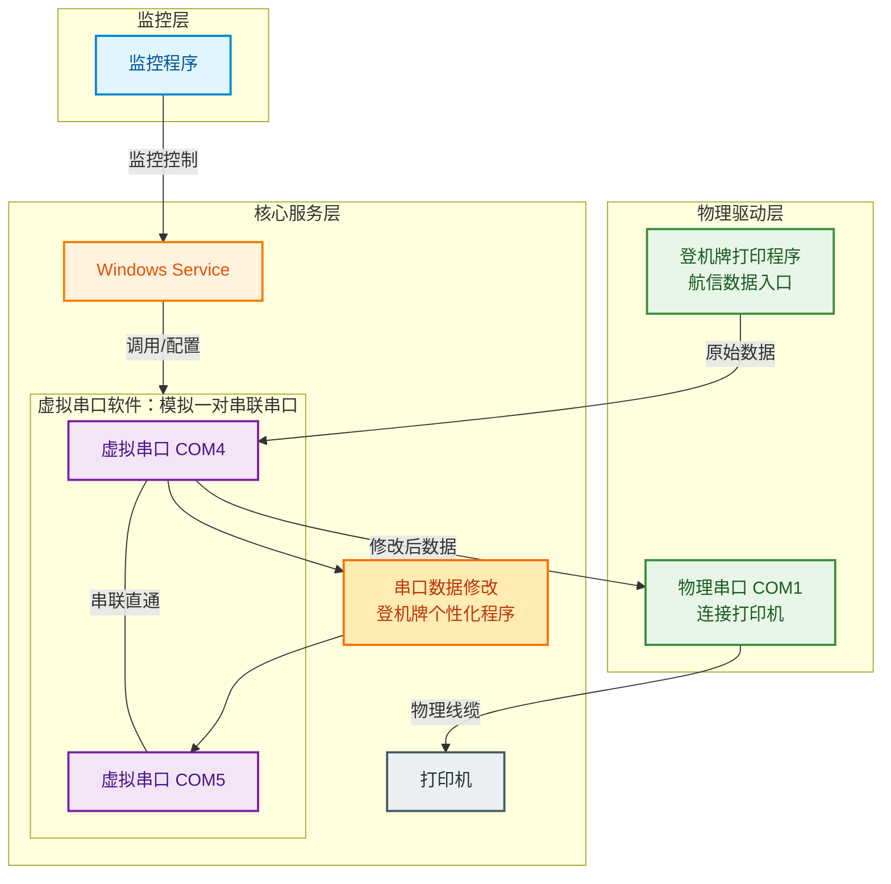

## 项目背景 

应机场和部分航司要求，希望可以在登机牌上给旅客输出相关个性化内容。

## 项目方案

结合现场环境(同时兼容 Windows 7、10、11 操作系统)，采用基于 .NET Framework 4.8 和 Windows Service 的项目架构。

基于 Pack 流配置的特殊性

## 数据流程

### 原始流程

### 新版流程

### 流程变化

### 业务时序图

## 系统架构

- [测试用例](/zh-CN/gallery/bpp_test)
