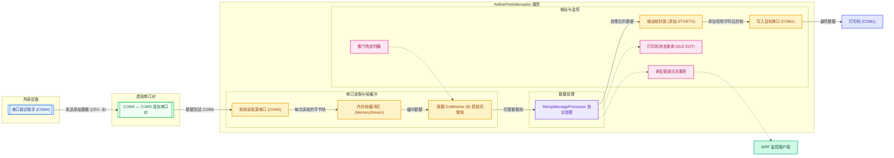

# 登机牌打印拦截系统 测试用例文档（v3.2）

## 1. 文档概述
- **测试目标**：全面验证 `AirlinePrintService` 服务与 `AirlinePrinterMonitor` 客户端在新帧逻辑、多触发标识、输出封装、配置校验等功能下的正确性、稳定性及兼容性。
- **核心特性**：
  - 接收端按 `$` 切分完整数据帧（`EndMarker` 可配）。
  - `StringMessageProcessor` 支持多触发标识（逗号分隔）、前缀正则校验、多规则处理、内容长度补齐。
  - `SerialPortForwarder` 轮询读取源串口，自动提取帧，处理后在写入打印机前智能添加 STX/ETX 输出封装（可配，防重复）。
  - 服务启动时严格校验所有必填配置项，防止因配置缺失导致运行时异常。
  - WPF 客户端实时日志、连接状态、单实例检测。
- **数据流向**：

- **测试环境**：
- 操作系统：Windows 7 / 10 / 11
- 虚拟串口：VSPD 创建的 COM4 ↔ COM5 对
- 目标打印机端口：COM1（可接真实打印机或留空）
- 模拟工具：串口调试助手连接 COM4
- 配置：`appsettings.json` 中 `SourcePort = COM5`, `TargetPort = COM1`

---

## 2. 帧接收与切分测试

### TC‑FR‑01 单个 `$` 结尾的帧正确提取

| 项目 | 内容 |
| ----- | ------ | 
| **用例编号** | TC‑FR‑01 |
| **测试目的** | 验证仅使用 `$` 作为结束标记时，轮询线程能从串口数据流中提取完整帧。 |
| **前置条件** | 1. `SerialPort` 配置：`EndMarker = "$"`, `StartMarker = ""` 2. 服务已启动，源端口 `COM5` 已打开 3. 虚拟串口对 COM4 ↔ COM5 已创建 4. 串口调试助手连接 COM4 |
| **测试步骤** | 从 COM4 发送字符串：`CP#1C01#01V#05Hello#$` |
| **预期结果** | 1. 服务日志输出“本轮提取到 1 个完整帧” 2. 帧队列收到完整数据 `CP#1C01#01V#05Hello#$` 3. 后续 `StringMessageProcessor` 正常接收该帧（若满足触发标识） |

### TC‑FR‑02 连续两帧按 `$` 分离

| 项目 | 内容 |
| ----- | ------ | 
| **用例编号** | TC‑FR‑02 |
| **测试目的** | 当多个帧合并为一个数据块到达时，系统能根据 `$` 正确切分为多个帧。 |
| **前置条件** | 同 TC‑FR‑01 |
| **测试步骤** | 从 COM4 一次性发送：`CP#1#A#$CP#2#B#$` |
| **预期结果** | 1. 服务日志显示“本轮提取到 2 个完整帧” 2. 第一帧内容为 `CP#1#A#$`，第二帧内容为 `CP#2#B#$` 3. 两帧分别独立进入 `ProcessSingle` 处理 |

### TC‑FR‑03 无 `$` 结尾时不提取，看门狗超时后重置

| 项目 | 内容 |
| ----- | ------ | 
| **用例编号** | TC‑FR‑03 |
| **测试目的** | 当收到不完整帧（缺失结束标记）时，数据应保留在缓冲区不处理；若长时间无后续数据，看门狗应触发串口重置。 |
| **前置条件** | 同 TC‑FR‑01，且看门狗超时时间设置为 30 秒 |
| **测试步骤** | 1. 从 COM4 发送 `CP#1#A#`（故意不带 `$`） 2. 在 35 秒内不再发送任何数据 |
| **预期结果** | 1. 第一条数据保存在帧缓冲区，不进入处理流程 2. 约 30 秒后，服务日志输出“看门狗超时…准备重启串口” 3. 串口被重置，缓冲区清空，服务恢复等待状态 |

### TC‑FR‑04 起始标记为空，直接从缓冲区头部查找 `$`

| 项目 | 内容 |
| ----- | ------ | 
| **用例编号** | TC‑FR‑04 |
| **测试目的** | 验证当 `StartMarker` 配置为空字符串时，系统直接从缓冲区起始位置查找结束标记来切帧。 |
| **前置条件** | `SerialPort` 配置：`StartMarker = ""`, `EndMarker = "$"` |
| **测试步骤** | 从 COM4 发送 `AABB$CCDD$` |
| **预期结果** | 提取两帧：`AABB$` 和 `CCDD$` |

### TC‑FR‑05 结束标记为空时自动禁用帧检测

| 项目 | 内容 |
| ----- | ------ | 
| **用例编号** | TC‑FR‑05 |
| **测试目的** | 当 `EndMarker` 配置为空字符串时，系统应自动关闭帧检测，并将每次读取的数据块作为一帧处理。 |
| **前置条件** | `SerialPort` 配置：`EndMarker = ""`（模拟误配置） |
| **测试步骤** | 从 COM4 发送任意数据 `CP#1#` |
| **预期结果** | 1. 日志显示帧检测已禁用 2. 数据块直接入队并作为一帧处理 |

---

## 3. 协议处理模块测试 (`StringMessageProcessor`)

### 3.1 触发标识匹配（支持多标识）

#### TC‑TR‑01 单个触发标识匹配成功

| 项目 | 内容 |
| ----- | ------ | 
| **用例编号** | TC‑TR‑01 |
| **测试目的** | 配置单个触发标识 `#088L` 时，仅包含该独立字段的数据帧会触发规则处理。 |
| **前置条件** | `TriggerIdentifier = "#088L"`，配置有至少一条规则（例如替换 #05） |
| **测试步骤** | 从 COM4 发送帧 `CP#1C01#01V#088L#Hello#$` |
| **预期结果** | 1. 日志输出“找到触发标识字段 #088L” 2. 数据按配置的规则被修改 |

#### TC‑TR‑02 内容中的子串不触发（严格字段匹配）

| 项目 | 内容 |
| ----- | ------ | 
| **用例编号** | TC‑TR‑02 |
| **测试目的** | 验证触发标识必须作为独立的 `#xxx` 字段存在，内容中的相同字符不会误触发。 |
| **前置条件** | 同 TC‑TR‑01 |
| **测试步骤** | 从 COM4 发送帧 `CP#1C01#01V#05Test088L#$` |
| **预期结果** | 1. 日志输出“未找到任何触发标识字段 (#088L)” 2. 数据原样转发，不被修改 |

#### TC‑TR‑03 多个触发标识匹配第一个

| 项目 | 内容 |
| ----- | ------ | 
| **用例编号** | TC‑TR‑03 |
| **测试目的** | 逗号分隔的多个标识中，数据包含第一个标识即可触发处理。 |
| **前置条件** | `TriggerIdentifier = "#088L,#089L"` |
| **测试步骤** | 从 COM4 发送 `CP#1C01#01V#088L#Data#$` |
| **预期结果** | 日志“找到触发标识字段 #088L”，规则被执行 |

#### TC‑TR‑04 多个触发标识匹配第二个

| 项目 | 内容 |
| ----- | ------ | 
| **用例编号** | TC‑TR‑04 |
| **测试目的** | 数据包含列表中第二个标识也应被识别。 |
| **前置条件** | 同 TC‑TR‑03 |
| **测试步骤** | 从 COM4 发送 `CP#1C01#01V#089L#Data#$` |
| **预期结果** | 日志“找到触发标识字段 #089L”，规则被执行 |

#### TC‑TR‑05 所有标识均不匹配时原样转发

| 项目 | 内容 |
| ----- | ------ | 
| **用例编号** | TC‑TR‑05 |
| **测试目的** | 数据中不包含任何配置的触发标识时，数据应当原封不动地输出。 |
| **前置条件** | 同 TC‑TR‑03 |
| **测试步骤** | 从 COM4 发送 `CP#1C01#01V#05Other#$` |
| **预期结果** | 1. 日志“未找到任何触发标识字段 (#088L,#089L)” 2. 处理后数据与原始数据完全一致 |

#### TC‑TR‑06 标识列表中包含空格可正确解析

| 项目 | 内容 |
| ----- | ------ | 
| **用例编号** | TC‑TR‑06 |
| **测试目的** | 配置中的空格应被忽略，例如 `#088L , #089L` 能正确匹配。 |
| **前置条件** | `TriggerIdentifier = "#088L , #089L"` |
| **测试步骤** | 从 COM4 发送 `CP#1C01#01V#089L#Test#$` |
| **预期结果** | 匹配成功，日志输出“找到触发标识字段 #089L” |

### 3.2 替换与插入规则

#### TC‑RPI‑01 目标字段存在，替换内容

| 项目 | 内容 |
| ----- | ------ | 
| **用例编号** | TC‑RPI‑01 |
| **测试目的** | 当数据中已存在目标标识符时，应将其后的内容替换为自定义内容。 |
| **前置条件** | 规则：`TargetIdentifier = "#05"`, `CustomContent = "WANG"` |
| **测试步骤** | 从 COM4 发送 `CP#1C01#01V#05Zhang#$` |
| **预期结果** | 1. 处理后数据为 `CP#1C01#01V#05WANG#$` 2. 日志记录“已替换 #05 后的内容为：WANG” |

#### TC‑RPI‑02 目标字段不存在，在合适位置插入

| 项目 | 内容 |
| ----- | ------ | 
| **用例编号** | TC‑RPI‑02 |
| **测试目的** | 目标标识符不在数据中时，应在小于该标识符的最大字段之后插入新字段。 |
| **前置条件** | 规则：`TargetIdentifier = "#23"`, `CustomContent = "VIP"` |
| **测试步骤** | 从 COM4 发送 `CP#1C01#01V#05Zhang#07Li#$` |
| **预期结果** | 1. 在 `<#23` 的最大标识符 `#07` 之后插入 `#23VIP` 2. 处理结果类似 `CP#1C01#01V#05Zhang#07Li#23VIP#$` |

#### TC‑RPI‑03 多规则顺序执行

| 项目 | 内容 |
| ----- | ------ | 
| **用例编号** | TC‑RPI‑03 |
| **测试目的** | 配置多条规则时，它们应按顺序依次对数据进行修改。 |
| **前置条件** | 规则1：替换 `#05` 为 `A` 规则2：插入 `#99` 内容 `Tail` |
| **测试步骤** | 从 COM4 发送 `CP#1C01#01V#05Old#07Old#$` |
| **预期结果** | 1. 先替换 `#05` 为 `A` 2. 再在合适位置插入 `#99Tail` 3. 最终数据包含两处修改 |

### 3.3 内容长度补齐

#### TC‑PAD‑01 内容不足时补空格

| 项目 | 内容 |
| ----- | ------ | 
| **用例编号** | TC‑PAD‑01 |
| **测试目的** | 当规则配置了 `ContentLength` 且实际内容较短时，尾部补空格至指定长度。 |
| **前置条件** | 规则：`TargetIdentifier = "#05"`, `CustomContent = "Hi"`, `ContentLength = 10` |
| **测试步骤** | 从 COM4 发送 `CP#1C01#01V#05Test#$` |
| **预期结果** | 1. 替换后字段为 `#05Hi       #`（8 个空格） 2. 日志显示最终内容长度为 10 |

#### TC‑PAD‑02 内容长度已满足或不需补齐

| 项目 | 内容 |
| ----- | ------ | 
| **用例编号** | TC‑PAD‑02 |
| **测试目的** | 当自定义内容长度 ≥ 配置长度或 `ContentLength` ≤ 0 时，不进行补齐。 |
| **前置条件** | 规则：`TargetIdentifier = "#05"`, `CustomContent = "Hello"`, `ContentLength = 2` |
| **测试步骤** | 从 COM4 发送 `CP#1C01#01V#05A#$` |
| **预期结果** | 输出 `#05Hello`，无多余空格 |

### 3.4 前缀校验（可配置正则）

#### TC‑PFX‑01 匹配前缀时校验通过

| 项目 | 内容 |
| ----- | ------ | 
| **用例编号** | TC‑PFX‑01 |
| **测试目的** | 数据与 `PrefixPattern` 正则匹配时，记录通过日志并继续处理。 |
| **前置条件** | `PrefixPattern = "^[1-3]?CP#[^#]+#[^#]+#[^#]+#"` |
| **测试步骤** | 从 COM4 发送 `2CP#1C01#01V#05Test#$` |
| **预期结果** | 日志输出“前缀校验通过” |

#### TC‑PFX‑02 不匹配前缀时警告但继续

| 项目 | 内容 |
| ----- | ------ | 
| **用例编号** | TC‑PFX‑02 |
| **测试目的** | 数据不符合前缀时只记录警告，不影响后续流程。 |
| **前置条件** | 同 TC‑PFX‑01 |
| **测试步骤** | 从 COM4 发送 `WRONG#1C01#01V#05#$` |
| **预期结果** | 1. 日志警告“数据格式不符合配置前缀…” 2. 如果满足触发标识，仍会执行规则处理 |

### 3.5 日志按项输出

#### TC‑LOG‑01 处理前后输出完整数据项

| 项目 | 内容 |
| ----- | ------ | 
| **用例编号** | TC‑LOG‑01 |
| **测试目的** | 确保按 `#` 分割后的各项能完整打印到日志，便于人工核对。 |
| **前置条件** | 配置替换规则 `#05→WANG` |
| **测试步骤** | 从 COM4 发送 `CP#1C01#01V#05Zhang#07Li#$` |
| **预期结果** | 日志包含类似： `原始数据项(4项): CP#; 1C01#; 01V#; 05Zhang#; 07Li#$` `处理后数据项(4项): CP#; 1C01#; 01V#; 05WANG#; 07Li#$` |

---

## 4. 输出帧封装测试（防重复）

#### TC‑WRP‑01 写入打印机前自动添加 STX/ETX

| 项目 | 内容 |
| ----- | ------ | 
| **用例编号** | TC‑WRP‑01 |
| **测试目的** | 启用输出帧封装后，所有发往打印机的数据都应自动加上配置的帧头帧尾。 |
| **前置条件** | `EnableOutputFrameWrapping = true`, `OutputStartMarker = "\u0002"`, `OutputEndMarker = "\u0003\u0010"` |
| **测试步骤** | 处理一帧数据（如 `CP#1#A#$`），观察目标端口 COM1 的实际输出字节 |
| **预期结果** | COM1 收到的数据为 `\u0002CP#1#A#$\u0003\u0010`，日志显示“添加输出帧头”“添加输出帧尾” |

#### TC‑WRP‑02 已含标记时不重复添加

| 项目 | 内容 |
| ----- | ------ | 
| **用例编号** | TC‑WRP‑02 |
| **测试目的** | 智能检测：若待发送数据已包含 STX 和 ETX，则直接发送，避免重复封装。 |
| **前置条件** | 同 TC‑WRP‑01，但模拟数据本身已经带有控制字符（极少场景） |
| **测试步骤** | 通过某种方式让处理器输出 `\u0002CP#1#A#$\u0003\u0010` 字符串 |
| **预期结果** | 日志输出“数据已包含输出帧头/帧尾，无需重复封装”，实际发送字节与处理器输出一致 |

#### TC‑WRP‑03 禁用输出封装时数据原样写入

| 项目 | 内容 |
| ----- | ------ | 
| **用例编号** | TC‑WRP‑03 |
| **测试目的** | 当 `EnableOutputFrameWrapping = false` 时，不添加任何控制字符。 |
| **前置条件** | `EnableOutputFrameWrapping = false` |
| **测试步骤** | 发送任意数据 |
| **预期结果** | 写入 COM1 的数据与 `StringMessageProcessor` 返回的字符串编码后完全一致 |

---

## 5. 串口通信与容错测试

#### TC‑COM‑01 高频连续数据无丢失

| 项目 | 内容 |
| ----- | ------ | 
| **用例编号** | TC‑COM‑01 |
| **测试目的** | 验证系统在较高频率数据流下的稳定性与吞吐能力。 |
| **前置条件** | 服务正常运行，轮询间隔 50ms |
| **测试步骤** | 从 COM4 以 50ms 间隔连续发送 50 帧不同内容的数据 |
| **预期结果** | 所有帧均被完整提取和处理，日志中无错误或丢失，看门狗未被触发 |

#### TC‑COM‑02 源串口打开失败重试（Polly）

| 项目 | 内容 |
| ----- | ------ | 
| **用例编号** | TC‑COM‑02 |
| **测试目的** | 当 COM5 被占用或不存在时，打开操作应自动重试，最终失败则停止服务。 |
| **前置条件** | 启动服务前用其他工具占用 COM5 |
| **测试步骤** | 启动服务 |
| **预期结果** | 1. 日志显示三次“打开串口重试”，每次间隔 2 秒 2. 三次失败后服务停止，若以 Windows 服务安装则 SCM 会自动重启服务 |

#### TC‑COM‑03 写入目标失败重试与日志记录

| 项目 | 内容 |
| ----- | ------ | 
| **用例编号** | TC‑COM‑03 |
| **测试目的** | 写入 COM1 失败时自动进行两次重试，同时记录警告日志，不影响后续数据处理。 |
| **前置条件** | 运行中通过 VSPD 移除或占用 COM1 |
| **测试步骤** | 发送一帧数据 |
| **预期结果** | 1. 日志显示“写入目标串口重试 1/2”“写入目标串口重试 2/2” 2. 重试失败后记录错误，服务未崩溃 3. 后续恢复 COM1 后，数据又能正常发送 |

#### TC‑COM‑04 看门狗超时自动重置串口

| 项目 | 内容 |
| ----- | ------ | 
| **用例编号** | TC‑COM‑04 |
| **测试目的** | 超过配置时间无数据接收时，看门狗应触发串口重启，恢复监听能力。 |
| **前置条件** | 服务正常运行，看门狗超时 30 秒 |
| **测试步骤** | 停止从 COM4 发送数据 35 秒，然后恢复发送 |
| **预期结果** | 1. 约 30 秒后日志输出“看门狗超时…准备重启串口” 2. 串口被重置并重新打开 3. 之后发送的数据可正常接收和处理 |

---

## 6. WPF 监控客户端测试

#### TC‑CL‑01 服务未启动时客户端友好提示

| 项目 | 内容 |
| ----- | ------ | 
| **用例编号** | TC‑CL‑01 |
| **测试目的** | 确保监控程序在服务不可用时不崩溃，并给出明确提示。 |
| **前置条件** | Windows 服务未运行 |
| **测试步骤** | 启动 `AirlinePrinterMonitor.exe` |
| **预期结果** | 界面显示“连接失败（服务可能未启动）”，状态栏红色，无异常弹窗 |

#### TC‑CL‑02 服务启动后手动重连成功

| 项目 | 内容 |
| ----- | ------ | 
| **用例编号** | TC‑CL‑02 |
| **测试目的** | 当服务就绪后，用户点击“重新连接”应能成功建立管道并接收实时日志。 |
| **前置条件** | 服务已启动，命名管道打开 |
| **测试步骤** | 点击客户端“重新连接”按钮 |
| **预期结果** | 1. 连接状态变为“已连接”，颜色变绿 2. 日志区开始滚动显示服务端推送的日志 |

#### TC‑CL‑03 日志级别颜色区分

| 项目 | 内容 |
| ----- | ------ | 
| **用例编号** | TC‑CL‑03 |
| **测试目的** | 不同级别的日志在客户端应以不同颜色显示。 |
| **前置条件** | 客户端已连接，服务端产生包含 Error/Warning/Info/Debug 的日志 |
| **测试步骤** | 观察客户端日志列表 |
| **预期结果** | Error 行红色、Warning 行橙色、Information 行绿色、Debug 行灰色 |

#### TC‑CL‑04 单实例检测与窗口激活

| 项目 | 内容 |
| ----- | ------ | 
| **用例编号** | TC‑CL‑04 |
| **测试目的** | 确保同一时间只有一个客户端实例运行，重复启动时激活已有窗口。 |
| **前置条件** | 已有一个客户端窗口打开 |
| **测试步骤** | 再次双击运行 `AirlinePrinterMonitor.exe` |
| **预期结果** | 1. 新进程退出 2. 原有窗口被置于前台并激活 |

---

## 7. 配置热更新测试

#### TC‑HOT‑01 修改规则内容后立即生效

| 项目 | 内容 |
| ----- | ------ | 
| **用例编号** | TC‑HOT‑01 |
| **测试目的** | 在不重启服务的情况下，修改配置文件中的自定义内容，下一条数据应使用新值。 |
| **前置条件** | 服务运行中，初始 `CustomContent` 为 "OLD" |
| **测试步骤** | 1. 修改 `appsettings.json` 中某规则的 `CustomContent` 为 "NEW" 并保存 2. 从 COM4 发送一帧数据 |
| **预期结果** | 1. 日志输出“协议规则已热更新” 2. 处理后的数据包含新内容 "NEW" |

#### TC‑HOT‑02 触发标识热更新

| 项目 | 内容 |
| ----- | ------ | 
| **用例编号** | TC‑HOT‑02 |
| **测试目的** | 运行时修改 `TriggerIdentifier`，只有包含新标识的数据才会被处理。 |
| **前置条件** | 初始 `TriggerIdentifier = "#088L"` |
| **测试步骤** | 1. 修改为 `"#99"` 并保存 2. 分别发送包含 `#088L` 和 `#99` 的帧 |
| **预期结果** | 1. 包含 `#088L` 的帧原样转发 2. 包含 `#99` 的帧被规则修改 |

---

## 8. 配置校验测试（启动时）

#### TC‑VAL‑01 必填字段缺失时服务启动中止

| 项目 | 内容 |
| ----- | ------ | 
| **用例编号** | TC‑VAL‑01 |
| **测试目的** | 若 `appsettings.json` 中缺少关键配置（如 `SourcePort` 为空），服务应停止启动并记录错误。 |
| **前置条件** | 故意将 `SourcePort` 配置为空字符串 |
| **测试步骤** | 启动服务 |
| **预期结果** | 日志记录“[配置错误] SerialPort.SourcePort 不能为空”，服务启动失败 |

#### TC‑VAL‑02 非法正则表达式被检测

| 项目 | 内容 |
| ----- | ------ | 
| **用例编号** | TC‑VAL‑02 |
| **测试目的** | 若 `PrefixPattern` 是非法正则，应在启动时报告错误。 |
| **前置条件** | 配置 `PrefixPattern = "[invalid"` |
| **测试步骤** | 启动服务 |
| **预期结果** | 日志记录配置错误，服务启动中止 |

#### TC‑VAL‑03 规则中目标标识符为空时报错

| 项目 | 内容 |
| ----- | ------ | 
| **用例编号** | TC‑VAL‑03 |
| **测试目的** | 规则必须指定 `TargetIdentifier`，否则启动失败。 |
| **前置条件** | 某条规则的 `TargetIdentifier` 为空 |
| **测试步骤** | 启动服务 |
| **预期结果** | 日志记录“MessageProcessing.Rules[0].TargetIdentifier 不能为空”，服务中止 |

---

**文档版本**：v3.2  
**最后更新**：2026-05-20
