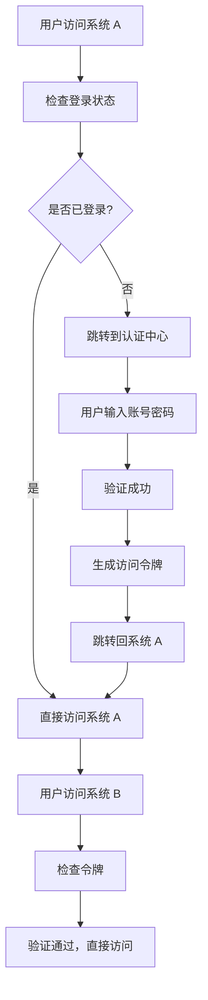
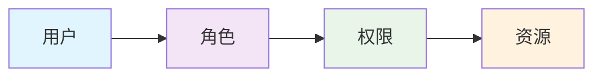
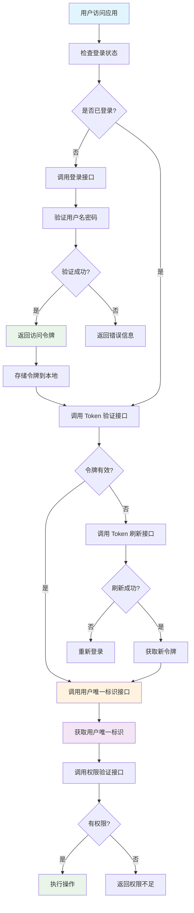

## 📋 摘要 ##

统一认证平台是企业数字化转型核心安全基础设施，解决多系统账号管理混乱、用户重复登录、权限分散等痛点。通过 SSO（单点登录）、统一用户管理、集中权限控制功能，实现"一次登录，多点通行"安全访问体验。

## 🎯 什么是统一认证平台 ##

### 核心概念解析 ###

统一认证平台就像一个智能门禁系统，想象一下：

- 传统方式：每个房间都有独立的门锁，你需要携带不同的钥匙
- 统一认证：一张智能卡就能打开所有授权房间的门

统一认证平台（Unified Authentication Platform）是一个集中式的身份认证与授权管理系统，为企业提供统一的用户身份验证和访问控制服务。

### 主要特征 ###

| 特征   |   说明     |   适用水平 |
| :----------: | :----------: | :---------:  |
| 集中管理 | 统一管理所有用户账号和权限 | 小白 |
| 单点登录 | 一次登录访问所有授权系统 | 初级 |
| 安全可靠 | 支持多种认证方式和安全策略 | 中级 |
| 易于集成 | 提供标准 API（Application Programming Interface，应用程序编程接口） | 高级 |

## 🚀 统一认证平台的核心价值 ##

### 解决多系统账号管理混乱 ###

**问题场景**：

- 员工需要记住 10+ 个不同系统的账号密码
- 密码策略不统一，安全风险高
- 离职员工账号清理困难

**解决方案**：

```java
// 传统方式：每个系统独立管理用户
class TraditionalUserManagement {
    // 系统 A 的用户管理
    public void createUserInSystemA(User user) { /* ... */ }
    
    // 系统 B 的用户管理  
    public void createUserInSystemB(User user) { /* ... */ }
    
    // 系统 C 的用户管理
    public void createUserInSystemC(User user) { /* ... */ }
}

// 统一认证方式：集中管理
class UnifiedUserManagement {
    // 一次创建，全系统生效
    public void createUser(User user) {
        // 自动同步到所有授权系统
        syncToAllSystems(user);
    }
}
```

### 提升用户体验 ###

**生活化比喻**：就像使用微信登录各种 App 一样，不需要重复注册和登录。

### 降低运维成本 ###

- 账号同步：新增用户自动同步到所有系统
- 权限管理：集中设置用户权限，避免遗漏
- 安全审计：统一记录所有访问日志

## 🛠️ 统一认证平台的核心功能 ##

### 单点登录（SSO） ###

**工作原理**：



**适用水平**：小白 - 高级

### 统一用户管理 ###

**功能特点**：

- 用户生命周期管理：注册、激活、禁用、删除
- 用户信息同步：自动同步到所有授权系统
- 批量操作：支持批量导入、导出用户信息

**代码示例**：

```java
// 用户管理接口示例
@RestController
@RequestMapping("/api/users")
public class UserController {
    
    // 创建用户 - 适用水平：初级
    @PostMapping
    public ResponseEntity<User> createUser(@RequestBody UserDTO userDTO) {
        // 创建用户并同步到所有系统
        User user = userService.createUser(userDTO);
        return ResponseEntity.ok(user);
    }
    
    // 更新用户信息 - 适用水平：初级
    @PutMapping("/{userId}")
    public ResponseEntity<User> updateUser(@PathVariable String userId, 
                                         @RequestBody UserDTO userDTO) {
        User user = userService.updateUser(userId, userDTO);
        return ResponseEntity.ok(user);
    }
    
    // 禁用用户 - 适用水平：中级
    @PutMapping("/{userId}/disable")
    public ResponseEntity<Void> disableUser(@PathVariable String userId) {
        userService.disableUser(userId);
        return ResponseEntity.ok().build();
    }
}
```

### 权限管理 ###

**权限模型**：

- RBAC（Role-Based Access Control，基于角色的访问控制）
- ABAC（Attribute-Based Access Control，基于属性的访问控制）

**权限管理流程**：



### 多因素认证（MFA） ###

**认证方式**：

- 静态密码：传统用户名密码
- 动态密码：短信验证码、邮件验证码
- 生物识别：指纹、人脸识别
- 硬件令牌：USB Key、智能卡

## 🔌 统一认证平台提供的接口 ##

### 核心接口清单 ###

统一认证平台就像一个多功能服务台，需要提供以下核心接口：

| 接口类型   |   接口名称     |   功能描述 |  适用水平 |
| :----------: | :----------: | :---------:  | :---------:  |
| 用户认证 | 登录接口 | 验证用户身份，返回访问令牌 | 小白 |
| 用户认证 | 注册接口 | 创建新用户账号 | 小白 |
| 用户认证 | 登出接口 | 清除用户会话，注销令牌 | 初级 |
| 令牌管理 | Token 验证接口 | 验证访问令牌有效性 | 初级 |
| 令牌管理 | Token 刷新接口 | 刷新过期令牌 | 中级 |
| 用户管理 | 用户信息查询接口 | 获取用户基本信息 | 初级 |
| 用户管理 | 用户信息更新接口 | 修改用户信息 | 中级 |
| 权限管理 | 权限验证接口 | 检查用户是否有特定权限 | 中级 |
| 权限管理 | 角色管理接口 | 管理用户角色和权限 | 高级 |
| 用户标识 | 用户唯一标识接口 | 获取用户跨系统唯一标识 | 初级 |

### 用户唯一标识的重要性 ###

统一认证平台就像一个身份证系统，需要为每个用户分配一个唯一且不变的标识（如 openId、userId），让其他系统能够准确识别用户身份。

### 为什么需要用户唯一标识？ ###

- 跨系统用户识别：不同系统通过同一个用户标识识别同一个用户
- 数据一致性：确保用户在不同系统中的数据关联正确
- 权限管理：基于用户标识进行统一的权限控制
- 审计追踪：通过用户标识追踪用户在各系统的操作记录

### 用户唯一标识接口 ###

#### 获取用户唯一标识接口（User Unique ID API） ####

**适用水平**：初级

**功能**：获取用户在统一认证平台中的唯一标识

```java
// 获取用户唯一标识接口 - 适用水平：初级
@GetMapping("/user/unique-id")
public ResponseEntity<UserUniqueIdResponse> getUserUniqueId(
        @RequestHeader("Authorization") String token) {
    
    String accessToken = token.replace("Bearer ", "");
    
    try {
        // 验证令牌并获取用户ID
        Claims claims = tokenService.validateToken(accessToken);
        String userId = claims.getSubject();
        
        // 获取用户信息
        User user = userService.findById(userId);
        
        if (user != null) {
            UserUniqueIdResponse response = new UserUniqueIdResponse();
            response.setUniqueId(user.getUniqueId());        // 用户唯一标识
            response.setUserId(user.getId());                // 内部用户ID
            response.setUsername(user.getUsername());        // 用户名
            response.setOpenId(user.getOpenId());            // 开放平台ID
            response.setUnionId(user.getUnionId());          // 联合ID（多应用共享）
            
            return ResponseEntity.ok(response);
        } else {
            return ResponseEntity.status(404).build();
        }
        
    } catch (Exception e) {
        return ResponseEntity.status(401).build();
    }
}

// 用户唯一标识响应对象
class UserUniqueIdResponse {
    private String uniqueId;    // 用户唯一标识（主要标识）
    private String userId;      // 内部用户ID
    private String username;     // 用户名
    private String openId;      // 开放平台ID
    private String unionId;     // 联合ID（多应用共享）
    // getter/setter 方法...
}
```

#### 通过唯一标识查询用户接口（Query User by Unique ID API） ####

**适用水平**：初级

**功能**：其他系统通过用户唯一标识查询用户信息

```java
// 通过唯一标识查询用户接口 - 适用水平：初级
@GetMapping("/user/query/{uniqueId}")
public ResponseEntity<UserQueryResponse> queryUserByUniqueId(
        @PathVariable String uniqueId,
        @RequestHeader("Authorization") String token) {
    
    String accessToken = token.replace("Bearer ", "");
    
    try {
        // 验证调用方权限
        Claims claims = tokenService.validateToken(accessToken);
        String callerUserId = claims.getSubject();
        
        // 检查调用方是否有权限查询其他用户信息
        if (!permissionService.canQueryUserInfo(callerUserId)) {
            return ResponseEntity.status(403).build();
        }
        
        // 通过唯一标识查询用户
        User user = userService.findByUniqueId(uniqueId);
        
        if (user != null) {
            UserQueryResponse response = new UserQueryResponse();
            response.setUniqueId(user.getUniqueId());
            response.setUsername(user.getUsername());
            response.setEmail(user.getEmail());
            response.setStatus(user.getStatus());
            response.setRoles(user.getRoles());
            response.setLastLoginTime(user.getLastLoginTime());
            
            return ResponseEntity.ok(response);
        } else {
            return ResponseEntity.status(404).body(new UserQueryResponse("用户不存在"));
        }
        
    } catch (Exception e) {
        return ResponseEntity.status(401).build();
    }
}

// 用户查询响应对象
class UserQueryResponse {
    private String uniqueId;        // 用户唯一标识
    private String username;        // 用户名
    private String email;           // 邮箱
    private String status;          // 用户状态
    private List<String> roles;     // 用户角色
    private Date lastLoginTime;     // 最后登录时间
    private String message;         // 消息
    // getter/setter 方法...
}
```

#### 用户唯一标识生成策略 ####

**适用水平**：中级

**功能**：确保用户唯一标识的唯一性和不变性

```java
// 用户唯一标识生成服务 - 适用水平：中级
@Service
public class UserUniqueIdService {
    
    // 生成用户唯一标识
    public String generateUniqueId(User user) {
        // 策略1：基于用户信息生成（推荐）
        String baseInfo = user.getUsername() + user.getEmail() + user.getCreateTime();
        String hash = DigestUtils.sha256Hex(baseInfo);
        return "user_" + hash.substring(0, 16);
        
        // 策略2：使用UUID（备选）
        // return "user_" + UUID.randomUUID().toString().replace("-", "");
        
        // 策略3：基于时间戳和随机数（备选）
        // return "user_" + System.currentTimeMillis() + "_" + RandomUtils.nextInt(1000, 9999);
    }
    
    // 验证唯一标识格式
    public boolean isValidUniqueId(String uniqueId) {
        return uniqueId != null && 
               uniqueId.startsWith("user_") && 
               uniqueId.length() == 21; // user_ + 16位hash
    }
    
    // 检查唯一标识是否已存在
    public boolean isUniqueIdExists(String uniqueId) {
        return userService.existsByUniqueId(uniqueId);
    }
}
```

### 用户认证核心接口 ###

#### 登录接口（Login API） ####

**适用水平**：小白

**功能**：验证用户身份，返回访问令牌

```java
// 登录接口示例
@RestController
@RequestMapping("/api/auth")
public class AuthController {
    
    // 用户登录 - 适用水平：小白
    @PostMapping("/login")
    public ResponseEntity<LoginResponse> login(@RequestBody LoginRequest request) {
        // 验证用户名和密码
        User user = userService.authenticate(request.getUsername(), request.getPassword());
        
        if (user != null) {
            // 生成访问令牌
            String accessToken = tokenService.generateAccessToken(user);
            String refreshToken = tokenService.generateRefreshToken(user);
            
            LoginResponse response = new LoginResponse();
            response.setAccessToken(accessToken);
            response.setRefreshToken(refreshToken);
            response.setExpiresIn(3600); // 1小时过期
            response.setTokenType("Bearer");
            
            return ResponseEntity.ok(response);
        } else {
            return ResponseEntity.status(401).build();
        }
    }
}

// 登录请求对象
class LoginRequest {
    private String username;  // 用户名
    private String password;  // 密码
    // getter/setter 方法...
}

// 登录响应对象
class LoginResponse {
    private String accessToken;   // 访问令牌
    private String refreshToken;  // 刷新令牌
    private int expiresIn;        // 过期时间（秒）
    private String tokenType;     // 令牌类型
    // getter/setter 方法...
}
```

#### 注册接口（Register API） ####

**适用水平**：小白

**功能**：创建新用户账号

```java
// 用户注册接口 - 适用水平：小白
@PostMapping("/register")
public ResponseEntity<RegisterResponse> register(@RequestBody RegisterRequest request) {
    // 检查用户名是否已存在
    if (userService.existsByUsername(request.getUsername())) {
        return ResponseEntity.status(409).body(new RegisterResponse("用户名已存在"));
    }
    
    // 创建新用户
    User newUser = new User();
    newUser.setUsername(request.getUsername());
    newUser.setPassword(passwordEncoder.encode(request.getPassword()));
    newUser.setEmail(request.getEmail());
    newUser.setStatus("ACTIVE");
    
    User savedUser = userService.save(newUser);
    
    // 分配默认角色
    roleService.assignDefaultRole(savedUser.getId());
    
    return ResponseEntity.ok(new RegisterResponse("注册成功", savedUser.getId()));
}

// 注册请求对象
class RegisterRequest {
    private String username;  // 用户名
    private String password;  // 密码
    private String email;      // 邮箱
    // getter/setter 方法...
}
```

#### 登出接口（Logout API） ####

**适用水平**：初级

**功能**：清除用户会话，注销令牌

```java
// 用户登出接口 - 适用水平：初级
@PostMapping("/logout")
public ResponseEntity<Void> logout(@RequestHeader("Authorization") String token) {
    // 提取令牌
    String accessToken = token.replace("Bearer ", "");
    
    // 将令牌加入黑名单
    tokenService.blacklistToken(accessToken);
    
    // 清除用户会话
    sessionService.clearUserSession(accessToken);
    
    return ResponseEntity.ok().build();
}
```

### 令牌管理核心接口 ###

#### Token 验证接口（Token Validation API） ####

**适用水平**：初级

**功能**：验证访问令牌有效性

```java
// Token 验证接口 - 适用水平：初级
@GetMapping("/validate")
public ResponseEntity<TokenValidationResponse> validateToken(
        @RequestHeader("Authorization") String token) {
    
    String accessToken = token.replace("Bearer ", "");
    
    try {
        // 验证令牌是否在黑名单中
        if (tokenService.isTokenBlacklisted(accessToken)) {
            return ResponseEntity.status(401).body(new TokenValidationResponse(false, "令牌已失效"));
        }
        
        // 验证令牌签名和过期时间
        Claims claims = tokenService.validateToken(accessToken);
        
        if (claims != null) {
            TokenValidationResponse response = new TokenValidationResponse();
            response.setValid(true);
            response.setUserId(claims.getSubject());
            response.setExpiresAt(claims.getExpiration());
            return ResponseEntity.ok(response);
        } else {
            return ResponseEntity.status(401).body(new TokenValidationResponse(false, "令牌无效"));
        }
        
    } catch (Exception e) {
        return ResponseEntity.status(401).body(new TokenValidationResponse(false, "令牌验证失败"));
    }
}

// Token 验证响应对象
class TokenValidationResponse {
    private boolean valid;        // 是否有效
    private String userId;        // 用户ID
    private Date expiresAt;       // 过期时间
    private String message;       // 消息
    // getter/setter 方法...
}
```

#### Token 刷新接口（Token Refresh API） ####

**适用水平**：中级

**功能**：刷新过期令牌

```java
// Token 刷新接口 - 适用水平：中级
@PostMapping("/refresh")
public ResponseEntity<RefreshTokenResponse> refreshToken(@RequestBody RefreshTokenRequest request) {
    
    String refreshToken = request.getRefreshToken();
    
    try {
        // 验证刷新令牌
        Claims claims = tokenService.validateRefreshToken(refreshToken);
        
        if (claims != null) {
            String userId = claims.getSubject();
            
            // 生成新的访问令牌
            String newAccessToken = tokenService.generateAccessToken(userId);
            
            RefreshTokenResponse response = new RefreshTokenResponse();
            response.setAccessToken(newAccessToken);
            response.setExpiresIn(3600);
            response.setTokenType("Bearer");
            
            return ResponseEntity.ok(response);
        } else {
            return ResponseEntity.status(401).body(new RefreshTokenResponse("刷新令牌无效"));
        }
        
    } catch (Exception e) {
        return ResponseEntity.status(401).body(new RefreshTokenResponse("刷新令牌失败"));
    }
}
```

### 用户管理核心接口 ###

#### 用户信息查询接口（User Info API） ####

**适用水平**：初级

**功能**：获取用户基本信息

```java
// 用户信息查询接口 - 适用水平：初级
@GetMapping("/user/info")
public ResponseEntity<UserInfoResponse> getUserInfo(@RequestHeader("Authorization") String token) {
    
    String accessToken = token.replace("Bearer ", "");
    
    try {
        // 验证令牌并获取用户ID
        Claims claims = tokenService.validateToken(accessToken);
        String userId = claims.getSubject();
        
        // 查询用户信息
        User user = userService.findById(userId);
        
        if (user != null) {
            UserInfoResponse response = new UserInfoResponse();
            response.setUserId(user.getId());
            response.setUsername(user.getUsername());
            response.setEmail(user.getEmail());
            response.setRoles(user.getRoles());
            response.setStatus(user.getStatus());
            
            return ResponseEntity.ok(response);
        } else {
            return ResponseEntity.status(404).build();
        }
        
    } catch (Exception e) {
        return ResponseEntity.status(401).build();
    }
}
```

#### 用户信息更新接口（User Update API） ####

**适用水平**：中级

**功能**：修改用户信息

```java
// 用户信息更新接口 - 适用水平：中级
@PutMapping("/user/update")
public ResponseEntity<UserUpdateResponse> updateUserInfo(
        @RequestHeader("Authorization") String token,
        @RequestBody UserUpdateRequest request) {
    
    String accessToken = token.replace("Bearer ", "");
    
    try {
        // 验证令牌并获取用户ID
        Claims claims = tokenService.validateToken(accessToken);
        String userId = claims.getSubject();
        
        // 更新用户信息
        User user = userService.findById(userId);
        user.setEmail(request.getEmail());
        user.setPhone(request.getPhone());
        user.setNickname(request.getNickname());
        
        User updatedUser = userService.save(user);
        
        return ResponseEntity.ok(new UserUpdateResponse("更新成功", updatedUser));
        
    } catch (Exception e) {
        return ResponseEntity.status(500).body(new UserUpdateResponse("更新失败", null));
    }
}
```

### 权限管理核心接口 ###

#### 权限验证接口（Permission Check API） ####

**适用水平**：中级

**功能**：检查用户是否有特定权限

```java
// 权限验证接口 - 适用水平：中级
@PostMapping("/permission/check")
public ResponseEntity<PermissionCheckResponse> checkPermission(
        @RequestHeader("Authorization") String token,
        @RequestBody PermissionCheckRequest request) {
    
    String accessToken = token.replace("Bearer ", "");
    
    try {
        // 验证令牌并获取用户ID
        Claims claims = tokenService.validateToken(accessToken);
        String userId = claims.getSubject();
        
        // 检查用户权限
        boolean hasPermission = permissionService.checkUserPermission(
            userId, 
            request.getResource(), 
            request.getAction()
        );
        
        PermissionCheckResponse response = new PermissionCheckResponse();
        response.setHasPermission(hasPermission);
        response.setUserId(userId);
        response.setResource(request.getResource());
        response.setAction(request.getAction());
        
        return ResponseEntity.ok(response);
        
    } catch (Exception e) {
        return ResponseEntity.status(401).build();
    }
}

// 权限检查请求对象
class PermissionCheckRequest {
    private String resource;  // 资源名称
    private String action;    // 操作类型（read, write, delete等）
    // getter/setter 方法...
}
```

### 接口调用流程图 ###

统一认证平台的接口调用就像一个智能服务流程：



### 认证协议接口 ###

#### OAuth 2.0（Open Authorization 2.0，开放授权 2.0） ####

**适用场景**：第三方应用授权访问

```java
// OAuth 2.0 授权码模式示例 - 适用水平：中级
@RestController
@RequestMapping("/oauth")
public class OAuthController {
    
    // 获取授权码
    @GetMapping("/authorize")
    public ResponseEntity<String> authorize(@RequestParam String clientId,
                                          @RequestParam String redirectUri) {
        // 生成授权码
        String authCode = oauthService.generateAuthCode(clientId, redirectUri);
        return ResponseEntity.ok(authCode);
    }
    
    // 交换访问令牌
    @PostMapping("/token")
    public ResponseEntity<TokenResponse> getToken(@RequestBody TokenRequest request) {
        TokenResponse token = oauthService.exchangeToken(request);
        return ResponseEntity.ok(token);
    }
}
```

#### SAML 2.0（Security Assertion Markup Language 2.0，安全断言标记语言 2.0） ####

**适用场景**：企业级单点登录

#### CAS（Central Authentication Service，中央认证服务） ####

**适用场景**：内部系统集成

### RESTful API（Representational State Transfer API，表述性状态转移 API） ###

#### 用户管理接口 ####

```java
// 用户管理 API 示例 - 适用水平：初级
@RestController
@RequestMapping("/api/v1/users")
public class UserManagementAPI {
    
    // 获取用户信息
    @GetMapping("/{userId}")
    public ResponseEntity<UserInfo> getUserInfo(@PathVariable String userId) {
        UserInfo user = userService.getUserById(userId);
        return ResponseEntity.ok(user);
    }
    
    // 验证用户身份
    @PostMapping("/authenticate")
    public ResponseEntity<AuthResult> authenticate(@RequestBody AuthRequest request) {
        AuthResult result = authService.authenticate(request);
        return ResponseEntity.ok(result);
    }
    
    // 获取用户权限
    @GetMapping("/{userId}/permissions")
    public ResponseEntity<List<Permission>> getUserPermissions(@PathVariable String userId) {
        List<Permission> permissions = permissionService.getUserPermissions(userId);
        return ResponseEntity.ok(permissions);
    }
}
```

#### 权限管理接口 ####

```java
// 权限管理 API 示例 - 适用水平：中级
@RestController
@RequestMapping("/api/v1/permissions")
public class PermissionAPI {
    
    // 检查用户权限
    @PostMapping("/check")
    public ResponseEntity<PermissionCheckResult> checkPermission(
            @RequestBody PermissionCheckRequest request) {
        PermissionCheckResult result = permissionService.checkPermission(request);
        return ResponseEntity.ok(result);
    }
    
    // 获取角色权限
    @GetMapping("/roles/{roleId}")
    public ResponseEntity<List<Permission>> getRolePermissions(@PathVariable String roleId) {
        List<Permission> permissions = roleService.getRolePermissions(roleId);
        return ResponseEntity.ok(permissions);
    }
}
```

### 身份源集成接口 ###

#### LDAP（Lightweight Directory Access Protocol，轻量级目录访问协议）集成 ####

```java
// LDAP 集成示例 - 适用水平：高级
@Service
public class LDAPIntegrationService {
    
    // 同步 LDAP 用户
    @Scheduled(fixedRate = 3600000) // 每小时同步一次
    public void syncLDAPUsers() {
        List<LDAPUser> ldapUsers = ldapService.getAllUsers();
        for (LDAPUser ldapUser : ldapUsers) {
            userService.syncUser(ldapUser);
        }
    }
    
    // 验证 LDAP 用户
    public boolean authenticateLDAPUser(String username, String password) {
        return ldapService.authenticate(username, password);
    }
}
```

#### Active Directory（AD，活动目录）集成 ####

#### 第三方身份源集成（钉钉、企业微信等） ####

## 🎯 实际应用场景 ##

### 场景一：企业内部系统集成 ###

**适用水平**：初级

**场景描述**：某公司有 HR（Human Resources，人力资源）系统、财务系统、项目管理系统等多个内部系统。

**解决方案**：

```java
// 企业内部系统集成示例
@Component
public class InternalSystemIntegration {
    
    // 用户登录后自动同步到所有系统
    @EventListener
    public void handleUserLogin(UserLoginEvent event) {
        // 同步到 HR 系统
        hrSystemService.syncUser(event.getUser());
        
        // 同步到财务系统
        financeSystemService.syncUser(event.getUser());
        
        // 同步到项目管理系统
        projectSystemService.syncUser(event.getUser());
    }
}
```

### 场景二：多租户 SaaS（Software as a Service，软件即服务）平台 ###

**适用水平**：中级

**场景描述**：为不同企业客户提供统一认证服务。

**解决方案**：

```java
// 多租户认证示例
@Service
public class MultiTenantAuthService {
    
    // 根据租户 ID 获取认证配置
    public AuthConfig getAuthConfig(String tenantId) {
        return tenantService.getAuthConfig(tenantId);
    }
    
    // 租户隔离的用户认证
    public AuthResult authenticate(String tenantId, AuthRequest request) {
        AuthConfig config = getAuthConfig(tenantId);
        return authService.authenticateWithConfig(request, config);
    }
}
```

### 场景三：跨组织协作平台 ###

**适用水平**：高级

**场景描述**：不同企业间的业务协作需要安全的身份认证。

**解决方案**：

```java
// 跨组织认证示例
@Service
public class CrossOrganizationAuthService {
    
    // 联邦认证
    public AuthResult federatedAuth(String organizationId, AuthRequest request) {
        // 验证组织身份
        Organization org = organizationService.getById(organizationId);
        
        // 执行联邦认证
        return federationService.authenticate(org, request);
    }
}
```

## ⚠️ 常见问题与解决方案 ##

### 问题一：认证失败率高 ###

**原因分析**：

- 密码策略过于严格
- 网络延迟导致超时
- 用户输入错误

**解决方案**：

```java
// 认证失败处理示例 - 适用水平：中级
@Service
public class AuthFailureHandler {
    
    // 记录认证失败日志
    public void handleAuthFailure(String username, String reason) {
        AuthFailureLog log = new AuthFailureLog(username, reason, new Date());
        authLogService.save(log);
        
        // 检查是否需要锁定账号
        checkAccountLock(username);
    }
    
    // 智能重试机制
    public AuthResult retryAuth(AuthRequest request) {
        int retryCount = 0;
        while (retryCount < 3) {
            try {
                return authService.authenticate(request);
            } catch (AuthException e) {
                retryCount++;
                if (retryCount >= 3) {
                    throw e;
                }
                // 等待后重试
                Thread.sleep(1000);
            }
        }
        return null;
    }
}
```

### 问题二：系统集成复杂 ###

**解决方案**：

- 使用标准协议（OAuth 2.0、SAML 2.0）
- 提供 SDK（Software Development Kit，软件开发工具包）
- 详细的集成文档

### 问题三：性能瓶颈 ###

**解决方案**：

- 缓存用户信息
- 异步处理认证请求
- 负载均衡

## 🏆 最佳实践建议 ##

### 安全最佳实践 ###

```java
// 安全配置示例 - 适用水平：中级
@Configuration
@EnableWebSecurity
public class SecurityConfig {
    
    @Bean
    public PasswordEncoder passwordEncoder() {
        // 使用 BCrypt 加密
        return new BCryptPasswordEncoder(12);
    }
    
    @Bean
    public AuthenticationManager authenticationManager() {
        return new ProviderManager(Arrays.asList(
            new UsernamePasswordAuthenticationProvider(),
            new MFAuthenticationProvider()
        ));
    }
}
```

### 性能优化建议 ###

- 缓存策略：缓存用户信息和权限数据
- 连接池：使用数据库连接池
- 异步处理：异步处理日志记录

### 监控和审计 ###

```java
// 审计日志示例 - 适用水平：中级
@Component
public class AuditLogger {
    
    // 记录用户操作
    public void logUserAction(String userId, String action, String resource) {
        AuditLog log = new AuditLog(userId, action, resource, new Date());
        auditService.save(log);
    }
    
    // 记录认证事件
    public void logAuthEvent(String userId, AuthEventType eventType) {
        AuthEvent event = new AuthEvent(userId, eventType, new Date());
        authEventService.save(event);
    }
}
```

## 📚 学习路径建议 ##

### 小白（零基础） ###

- 了解基本概念：用户、角色、权限
- 学习 HTTP（HyperText Transfer Protocol，超文本传输协议）协议基础
- 理解 RESTful API 概念

### 初级开发者 ###

- 学习 OAuth 2.0 基础
- 掌握 JWT（JSON Web Token，JSON 网络令牌）使用
- 了解 Spring Security 基础

### 中级开发者 ###

- 深入学习 SAML 2.0 协议
- 掌握多因素认证实现
- 学习微服务架构下的认证

### 高级开发者 ###

- 研究联邦认证（Federated Authentication）
- 掌握零信任安全模型
- 学习云原生认证架构

## 🎉 总结 ##

统一认证平台是现代企业数字化转型的重要基础设施，通过集中化的身份管理和单点登录功能，不仅大幅提升了用户体验，还显著降低了企业的运维成本和安全隐患。

**核心价值**：

- ✅ 一次登录，多点通行 - 解决多系统账号管理难题
- ✅ 集中管理，统一控制 - 提升安全性和管理效率
- ✅ 标准接口，易于集成 - 支持多种认证协议和身份源
- ✅ 安全可靠，审计完整 - 满足企业级安全要求
