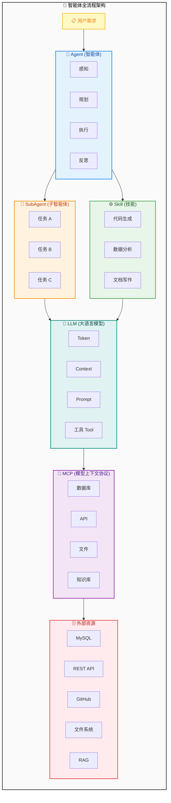
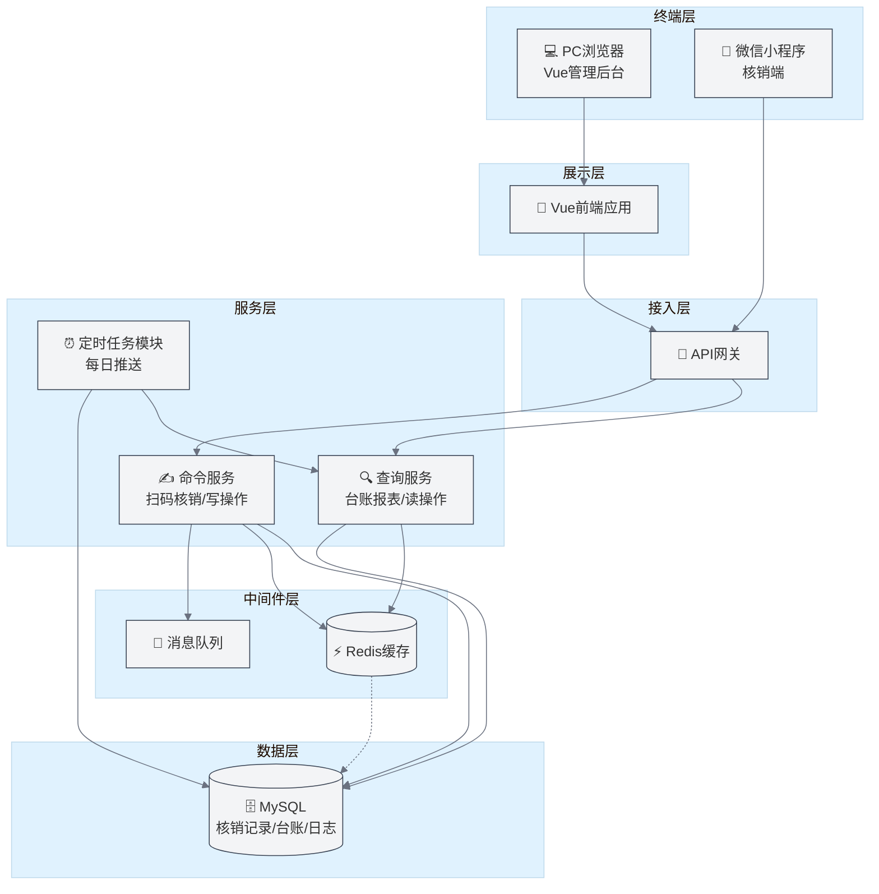
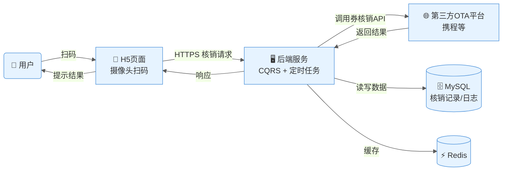
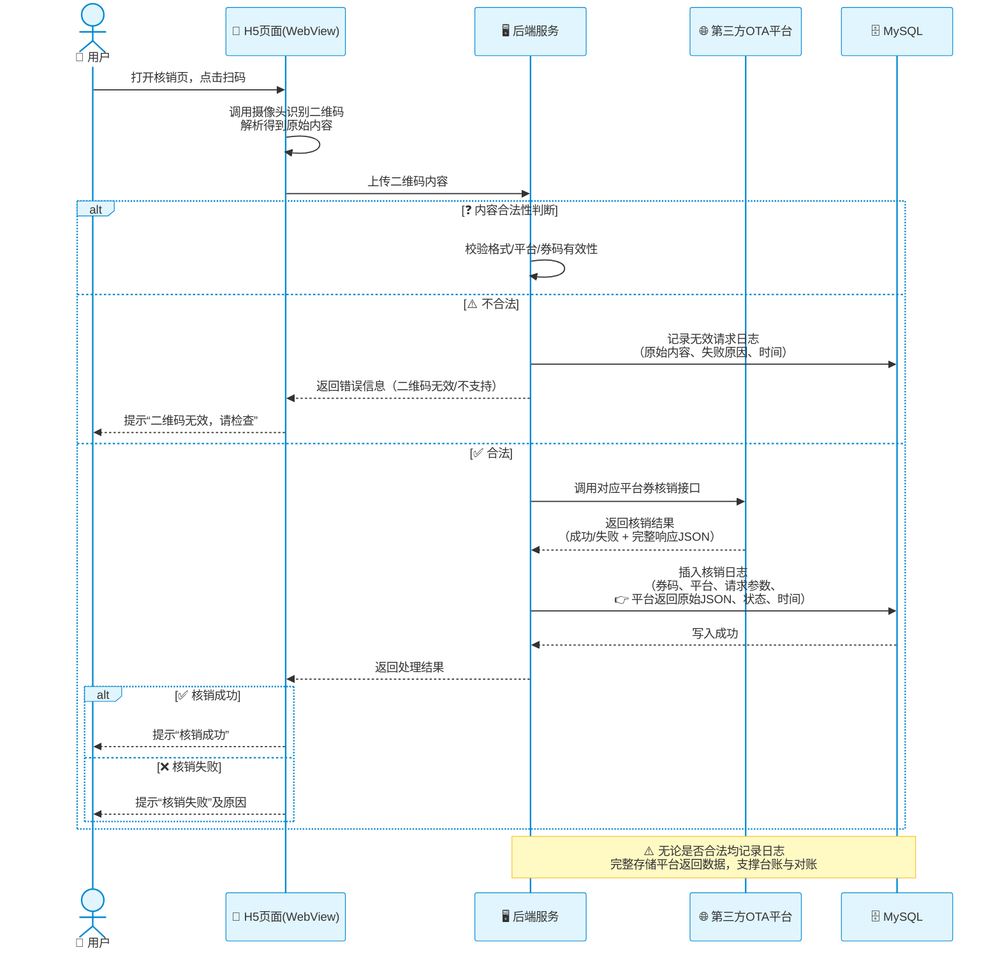

## 项目背景 

应机场和部分航司要求，希望可以在登机牌上给旅客输出相关个性化内容。

```mermaid
%%{init: {'theme': 'default'}}%%
graph TB
    subgraph 全流程["🧠 智能体全流程架构"]
        direction TB

        User[📋 用户需求]

        subgraph Agent["🤖 Agent (智能体)"]
            direction LR
            Perception[感知]
            Planning[规划]
            Execution[执行]
            Reflection[反思]
        end

        subgraph SubAgent["🔶 SubAgent (子智能体)"]
            direction LR
            TaskA[任务 A]
            TaskB[任务 B]
            TaskC[任务 C]
        end

        subgraph Skill["⚙️ Skill (技能)"]
            direction LR
            CodeGen[代码生成]
            DataAna[数据分析]
            DocWri[文档写作]
        end

        subgraph LLM["🤖 LLM (大语言模型)"]
            direction LR
            Token[Token]
            Context[Context]
            Prompt[Prompt]
            Tool[工具 Tool]
        end

        subgraph MCP["🔌 MCP (模型上下文协议)"]
            direction LR
            数据库[数据库]
            API[API]
            文件[文件]
            知识库[知识库]
        end

        subgraph External["🗄️ 外部资源"]
            direction LR
            MySQL[MySQL]
            RESTAPI[REST API]
            GitHub[GitHub]
            FileSystem[文件系统]
            RAG[RAG]
        end

        User --> Agent
        Agent --> SubAgent
        Agent --> Skill
        SubAgent --> LLM
        Skill --> LLM
        LLM --> MCP
        MCP --> External
    end

    style 全流程 fill:#fafafa,stroke:#333,stroke-width:2px,color:#000
    style User fill:#fff9c4,stroke:#fbc02d,stroke-width:2px,color:#f57f17
    style Agent fill:#e3f2fd,stroke:#1e88e5,stroke-width:2px,color:#0d47a1
    style SubAgent fill:#fff3e0,stroke:#fb8c00,stroke-width:2px,color:#bf360c
    style Skill fill:#e8f5e9,stroke:#43a047,stroke-width:2px,color:#1b5e20
    style LLM fill:#e0f2f1,stroke:#00897b,stroke-width:2px,color:#004d40
    style MCP fill:#f3e5f5,stroke:#8e24aa,stroke-width:2px,color:#4a148c
    style External fill:#ffebee,stroke:#e53935,stroke-width:2px,color:#b71c1c
```

## 系统架构

### 架构图

```mermaid
%%{init: {'theme': 'base', 'themeVariables': { 'primaryColor': '#F3F4F6', 'primaryBorderColor': '#374151', 'lineColor': '#6B7280', 'tertiaryColor': '#E0F2FE'}}}%%
graph TB
    subgraph 终端层
        PC[💻 PC浏览器<br/>Vue管理后台]
        MP[📱 微信小程序<br/>核销端]
    end

    subgraph 展示层
        Vue[🎨 Vue前端应用]
    end

    subgraph 接入层
        Gateway[🔗 API网关]
    end

    subgraph 服务层
        direction LR
        Cmd[✍️ 命令服务<br/>扫码核销/写操作]
        Qry[🔍 查询服务<br/>台账报表/读操作]
        Job[⏰ 定时任务模块<br/>每日推送]
    end

    subgraph 中间件层
        Redis[(⚡ Redis缓存)]
        MQ[📨 消息队列]
    end

    subgraph 数据层
        MySQL[(🗄️ MySQL<br/>核销记录/台账/日志)]
    end

    %% 终端连接
    PC --> Vue
    MP --> Gateway
    Vue --> Gateway

    %% 接入路由
    Gateway --> Cmd
    Gateway --> Qry

    %% 命令服务异步写日志（通过MQ解耦）
    Cmd --> MQ
    Cmd --> Redis
    Cmd --> MySQL

    %% 查询服务直接读库
    Qry --> MySQL
    Qry --> Redis

    %% 定时任务读库并推送
    Job --> MySQL
    Job --> Qry

    %% 数据层样式（虚线表示缓存穿透路径）
    Redis -.-> MySQL
```

### 核销操作流程图

```mermaid
%%{init: {'theme': 'base', 'themeVariables': { 'primaryColor': '#e6f3ff', 'primaryBorderColor': '#4A90D9', 'lineColor': '#5A5A5A', 'fontFamily': 'arial'}}}%%
graph LR
    User(👤 用户) -->|扫码| H5[📱 H5页面<br/>摄像头扫码]
    H5 -->|HTTPS 核销请求| Server[🖥️ 后端服务<br/>CQRS + 定时任务]
    Server -->|调用券核销API| OTA[🌐 第三方OTA平台<br/>携程等]
    OTA -->|返回结果| Server
    Server -->|读写数据| MySQL[(🗄️ MySQL<br/>核销记录/日志)]
    Server -->|缓存| Redis[(⚡ Redis)]
    Server -->|响应| H5
    H5 -->|提示结果| User
```

### 核销操作时序图

```mermaid
%%{init: {'theme': 'base', 'themeVariables': { 'actorBkg': '#E1F5FE', 'actorBorder': '#0288D1', 'signalColor': '#333333', 'noteBkgColor': '#FFF9C4', 'noteBorderColor': '#FBC02D'}}}%%
sequenceDiagram
    actor User as 👤 用户
    participant H5 as 📱 H5页面(WebView)
    participant Server as 🖥️ 后端服务
    participant OTA as 🌐 第三方OTA平台
    participant DB as 🗄️ MySQL

    User->>H5: 打开核销页，点击扫码
    H5->>H5: 调用摄像头识别二维码<br/>解析得到原始内容
    H5->>Server: 上传二维码内容

    alt ❓ 内容合法性判断
        Server->>Server: 校验格式/平台/券码有效性
    else ⚠️ 不合法
        Server->>DB: 记录无效请求日志<br/>（原始内容、失败原因、时间）
        Server-->>H5: 返回错误信息（二维码无效/不支持）
        H5-->>User: 提示“二维码无效，请检查”
    else ✅ 合法
        Server->>OTA: 调用对应平台券核销接口
        OTA-->>Server: 返回核销结果<br/>（成功/失败 + 完整响应JSON）
        Server->>DB: 插入核销日志<br/>（券码、平台、请求参数、<br/>👉 平台返回原始JSON、状态、时间）
        DB-->>Server: 写入成功
        Server-->>H5: 返回处理结果
        alt ✅ 核销成功
            H5-->>User: 提示“核销成功”
        else ❌ 核销失败
            H5-->>User: 提示“核销失败”及原因
        end
    end

    Note over Server,DB: ⚠️ 无论是否合法均记录日志<br/>完整存储平台返回数据，支撑台账与对账
```
