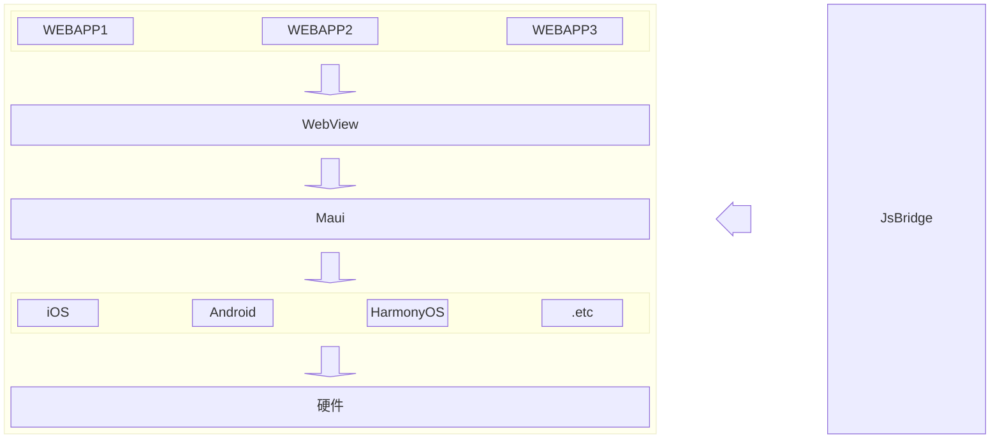
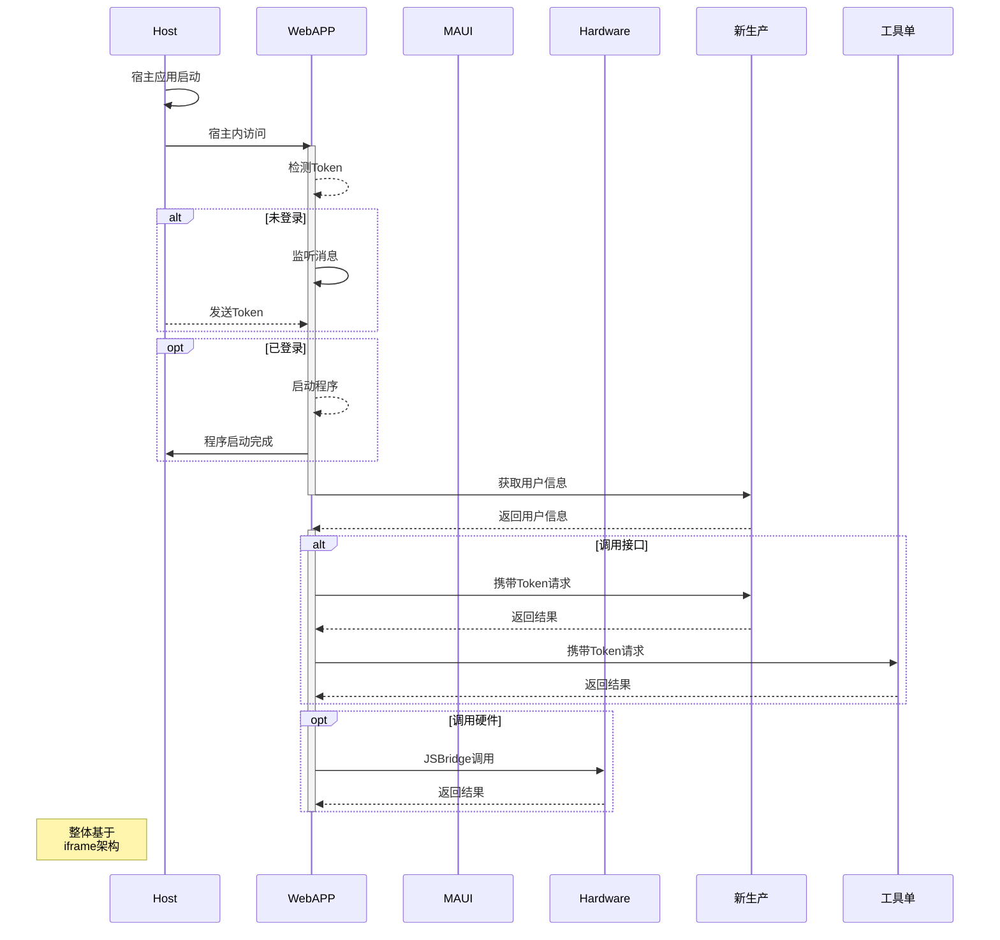

## 简介 ##

基于 Maui 实现跨平台的 Hybird 应用平台，通过 `iframe` 和 `jsbridge` 的封装，完成子系统的嵌套及系统通信。

> 所有系统通信均校验内置的Ogirin限制，最大程度保障通信安全。

::: code-group

```sh [npm]
npm add -D vitepress
```
```sh [pnpm]
pnpm add -D vitepress
```
```sh [yarn]
yarn add -D vitepress
```
```sh [bun]
bun add -D vitepress
```
:::

<!-- <i class="i-custom:circle" /> -->

<!-- <i class="i-mono:juejin" /> -->

<!-- <i class="i-mono:juejin text-#1E80FF" /> -->

## 架构 ##



<!-- > [!NOTE]
> 强调用户在快速浏览文档时也不应忽略的重要信息。

> [!TIP]
> 有助于用户更顺利达成目标的建议性信息。

> [!IMPORTANT]
> 对用户达成目标至关重要的信息。

> [!WARNING]
> 因为可能存在风险，所以需要用户立即关注的关键内容。

> [!CAUTION]
> 行为可能带来的负面影响。 -->

<!-- 


[](https://shields.io/badges) -->

## 流程 ##



## 案例 ##

### 无锡硕放机场新生产统计系统 ###

<div class="grid grid-cols-3 gap-4">

{data-zoomable}

{data-zoomable}

{data-zoomable}

</div>

MAUI [^1]

[^1]: .NET MAUI
