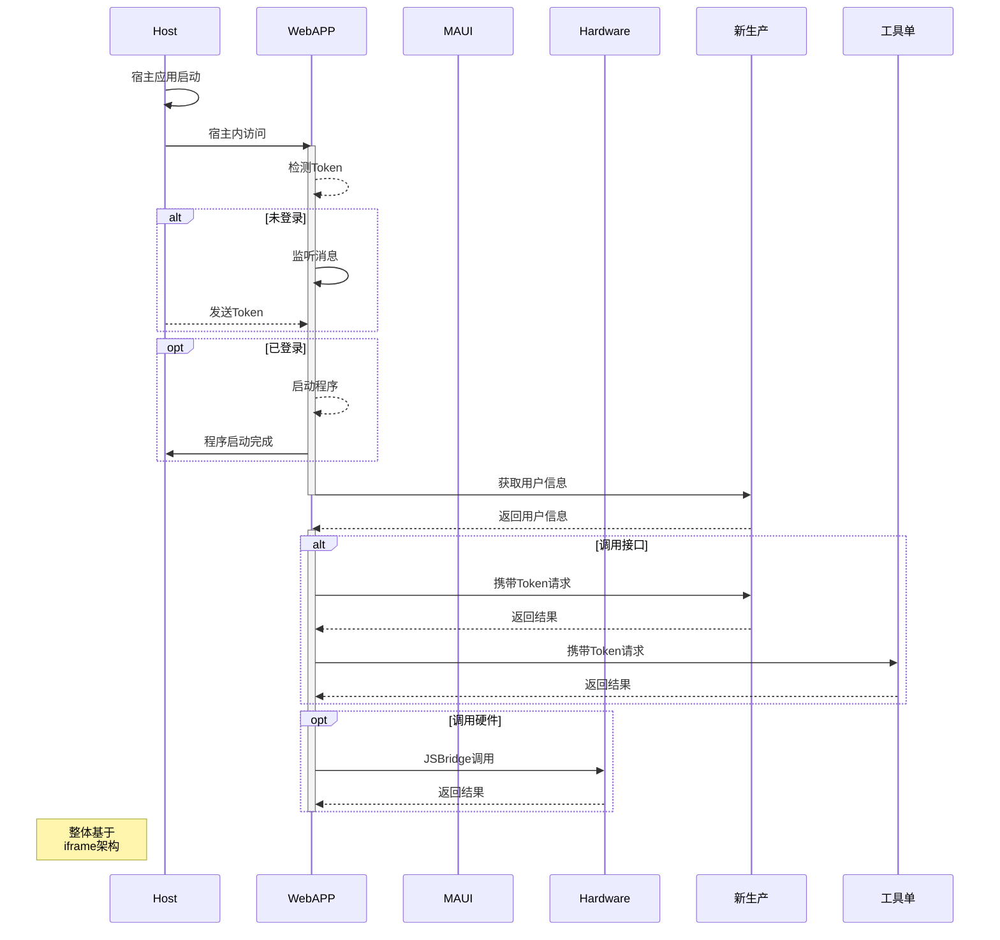

## 简介 ##

基于 Maui 实现跨平台的 Hybird 应用平台，通过 `iframe` 和 `jsbridge` 的封装，完成子系统的嵌套及系统通信。

## 架构 ##

{data-zoomable}

<!-- > [!NOTE]
> 强调用户在快速浏览文档时也不应忽略的重要信息。

> [!TIP]
> 有助于用户更顺利达成目标的建议性信息。

> [!IMPORTANT]
> 对用户达成目标至关重要的信息。

> [!WARNING]
> 因为可能存在风险，所以需要用户立即关注的关键内容。

> [!CAUTION]
> 行为可能带来的负面影响。 -->

<!-- 

 -->

## 流程 ##

## 案例 ##

### 无锡硕放机场新生产统计系统 ###

MAUI [^1]

[^1]: .NET MAUI
