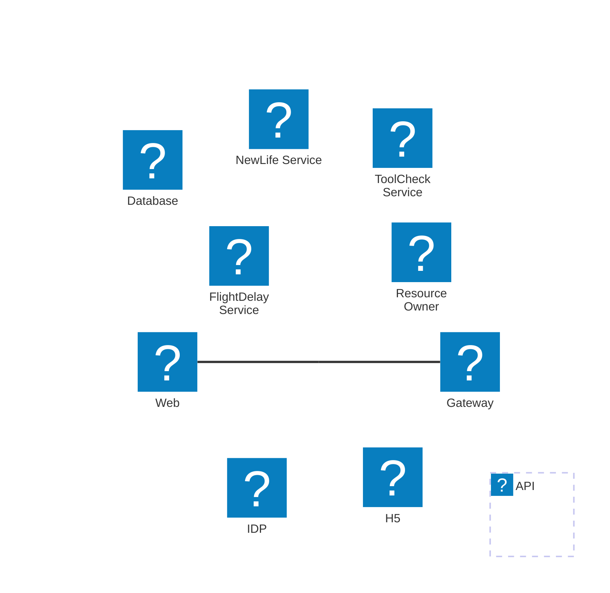
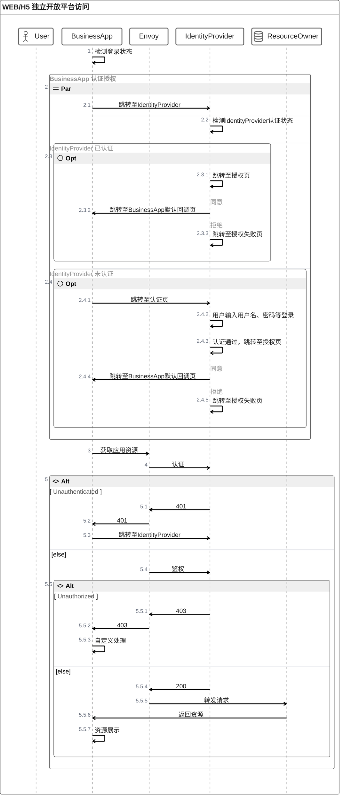
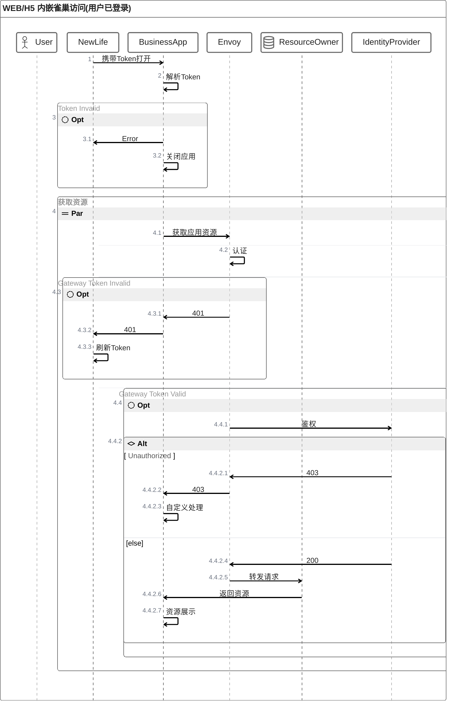

## 网络拓扑图 ##

```mermaid
architecture-beta
  group api(logos:aws-lambda)[API]

    service web_platform(logos:chrome)[Web]
    service mobile_platform(logos:android-vertical)[H5]

    service envoy(devicon:envoy)[Gateway]
    service idp(devicon:packer)[IDP]
    service ro(devicon:readthedocs)[Resource Owner]
    service tool(devicon:html5)[ToolCheck Service]
    service flightDelay(devicon:html5)[FlightDelay Service]
    service newlife(devicon:html5)[NewLife Service]
    service database(logos:mysql)[Database]

    junction junctionCenter
    junction junctionRight

    web_platform:R -- L:junctionCenter
    junctionCenter:R -- L:envoy

```

## WEB/H5 独立开放平台访问 ##

```mermaid
zenuml
  title WEB/H5 独立开放平台访问

  @Actor User
  @AzureCDN SP as BusinessApp
  @PubSub Gateway as Envoy
  @CosmosDB IDP as IdentityProvider
  @Database RO as ResourceOwner
  
  SP->SP: 检测登录状态
  // **BusinessApp 认证授权**
  par {
      SP->IDP: 跳转至IdentityProvider
      IDP->IDP: 检测IdentityProvider认证状态
      // IdentityProvider 已认证
      opt {
        IDP->IDP: 跳转至授权页
        // 同意
        IDP->SP: 跳转至BusinessApp默认回调页
        // 拒绝
        IDP->IDP: 跳转至授权失败页
      }
      // IdentityProvider 未认证
      opt {
        SP->IDP: 跳转至认证页
        IDP->IDP: 用户输入用户名、密码等登录
        IDP->IDP: 认证通过，跳转至授权页
        // 同意
        IDP->SP: 跳转至BusinessApp默认回调页
        // 拒绝
        IDP->IDP: 跳转至授权失败页
      }
  }

  SP->Gateway: 获取应用资源
  Gateway->IDP: 认证
  if(Unauthenticated) {
      IDP->Gateway: 401
      Gateway->SP: 401
      SP->IDP: 跳转至IdentityProvider
  } else {
    Gateway->IDP: 鉴权
    if(Unauthorized) {
      IDP->Gateway: 403
      Gateway->SP: 403
      SP->SP: 自定义处理
    } else {
      IDP->Gateway: 200
      Gateway->RO: 转发请求
      RO->SP: 返回资源
      SP->SP: 资源展示
    }
  }

```

## WEB/H5 内嵌雀巢访问 ##

```mermaid
zenuml
  title WEB/H5 内嵌雀巢访问(用户已登录)

  @Actor User
  @CloudFront Cares as NewLife
  @AzureCDN SP as BusinessApp
  @PubSub Gateway as Envoy
  @Database RO as ResourceOwner
  @CosmosDB IDP as IdentityProvider
  
  Cares->SP: 携带Token打开
  SP->SP: 解析Token
  // Token Invalid
  opt {
      SP->Cares: Error
      SP->SP: 关闭应用
  }

  // **获取资源**
  par {
    SP->Gateway: 获取应用资源
    Gateway->Gateway: 认证
    // Gateway Token Invalid
    opt {
      Gateway->SP: 401
      SP->Cares: 401
      Cares->Cares: 刷新Token
    }

    // Gateway Token Valid
    opt {
      Gateway->IDP: 鉴权
      if(Unauthorized) {
        IDP->Gateway: 403
        Gateway->SP: 403
        SP->SP: 自定义处理
      } else {
        IDP->Gateway: 200
        Gateway->RO: 转发请求
        RO->SP: 返回资源
        SP->SP: 资源展示
      }
    }
  }
```
