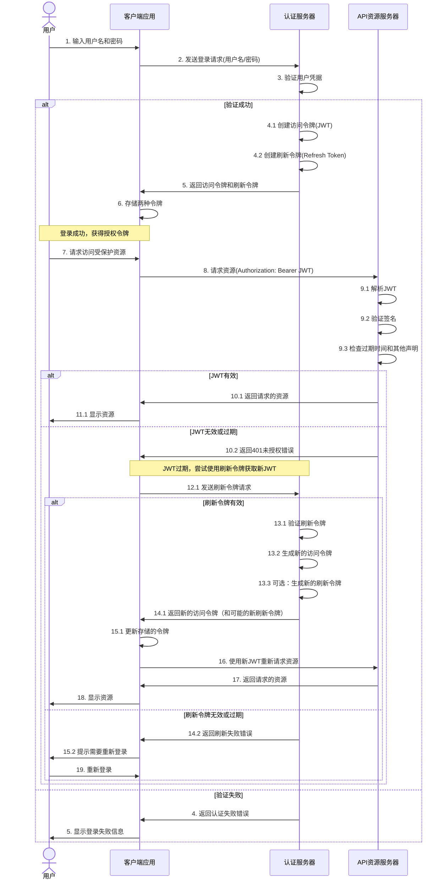

#  JSON Web Token (JWT) 指南 #

## JWT 基本概念 ##

JWT（JSON Web Token）是一种开放标准（RFC 7519），用于在各方之间安全地传输信息。JWT以JSON对象的形式存在，通过数字签名保证信息可以被验证和信任。JWT可以使用HMAC算法的密钥或RSA/ECDSA的公钥/私钥对进行签名。

JWT的核心优势在于其无状态性，服务器不需要存储会话信息，这使其特别适合于分布式系统、微服务架构和跨域认证场景。

## JWT 结构 ##

JWT由三部分组成，使用点（.）分隔：

1. **头部（Header）**：包含令牌类型和使用的签名算法

```json
{
  "alg": "HS256",
  "typ": "JWT"
}
```

2. **载荷（Payload）**：包含声明（claims），有三种类型：

- 注册声明：预定义的声明
  - iss（发行者）：JWT的发行者
  - exp（过期时间）：JWT的过期时间
  - sub（主题）：JWT的主题，通常是用户ID
  - aud（受众）：JWT的接收方
  - nbf（不早于）：JWT的生效时间
  - iat（签发时间）：JWT的签发时间
  - jti（JWT ID）：JWT的唯一标识符
- 公共声明：自定义声明，应避免冲突，可在IANA JSON Web Token Registry注册
- 私有声明：用于特定应用之间共享信息

```json
{
  "sub": "1234567890",
  "name": "张三",
  "exp": 1516239022,
  "role": "admin"
}
```

3. **签名（Signature）**：使用指定算法对编码后的头部、载荷和密钥进行签名

```bash
HMACSHA256(
  base64UrlEncode(header) + "." + base64UrlEncode(payload),
  secret
)
```

最终JWT格式：`xxxxx.yyyyy.zzzzz`（头部.载荷.签名）

> 重要说明：JWT的头部和载荷仅进行Base64Url编码，不是加密，任何人都可以解码查看内容。因此，不应在JWT中存储敏感信息，除非使用JWE（JSON Web Encryption）进行加密。

## JWT 认证流程 ##

### 基本认证流程 ###



### 流程详解 ###

1. 初始认证阶段：
  - 用户提交凭据（用户名/密码）
  - 服务器验证凭据，成功后生成两种令牌：
    - 访问令牌（JWT）：短期有效（通常15分钟至2小时）
    - 刷新令牌（Refresh Token）：长期有效（几天至几周）
2. 资源访问阶段：
  - 客户端在请求头中携带JWT：`Authorization: Bearer [JWT]`
  - 资源服务器验证JWT的签名和有效期
  - 验证通过后提供请求的资源
3. 令牌刷新机制：
  - 当访问令牌过期时，客户端使用刷新令牌请求新的访问令牌
  - 认证服务器验证刷新令牌，生成新的访问令牌（可能还会更新刷新令牌）
  - 客户端使用新令牌继续访问资源
  - 如果刷新令牌也过期，用户需要重新登录

## JWT 使用场景 ##

### 用户认证和授权 ###

JWT提供了一种无状态的认证机制，用户登录后获取JWT，然后使用该令牌访问受保护资源。服务器可以根据JWT中的权限声明（如用户角色）决定用户是否有权访问特定资源。

### 单点登录（SSO） ###

一次登录，多系统通用。JWT可以在多个系统之间共享，无需在每个系统中重新登录。这对于拥有多个应用的组织特别有用，可以提供无缝的用户体验。

### 微服务架构 ###

在微服务架构中，JWT可用于服务间认证，确保只有授权的服务能够相互调用。每个服务可以独立验证JWT，无需集中式认证服务器参与每次请求验证。

### 移动应用 ###

移动应用可以使用JWT进行API认证，避免每次请求都需要传输敏感凭据。这既提高了安全性，也改善了性能。

### 第三方API集成 ###

为第三方应用提供API访问权限时，JWT可以控制访问范围和有效期。可以在JWT中包含特定的权限范围（scopes），限制第三方应用的访问权限。

### 信息交换 ###

JWT可用于安全地传输信息，因为签名可以验证发送方身份和信息完整性。适用于需要防篡改的数据传输场景。

### 无服务器架构（Serverless） ###

在无服务器架构中，JWT可用于函数之间的认证，特别适合短暂、无状态的计算模型。

## JWT 的优缺点 ##

## 优点 ##

- **无状态**：服务器不需要存储会话信息，减轻服务器负担
- **可扩展性**：适用于分布式系统和微服务架构，易于水平扩展
- **跨平台**：几乎所有编程语言都有JWT实现，可用于各种技术栈
- **自包含**：包含所有必要的认证和授权信息，减少数据库查询
- **可传输性**：体积小，易于在URL、POST参数或HTTP头部传输
- **跨域友好**：可以轻松实现跨域认证，适用于前后端分离架构
- **标准化**：基于开放标准，实现了互操作性

### 缺点 ###

- **不可撤销**：一旦签发，在过期前无法直接撤销（除非实现黑名单或白名单机制）
- **安全存储**：客户端需要安全存储JWT，防止XSS和CSRF攻击
- **载荷大小**：过多自定义声明会增加JWT体积，影响网络传输效率
- **载荷安全**：载荷虽然经过编码但不加密，不应存储敏感信息
- **密钥管理**：需要妥善保护签名密钥，一旦泄露将导致严重安全问题
- **密钥轮换**：更新密钥需要额外的机制和策略
- **状态需求**：某些情况下（如强制登出所有设备）需要引入状态管理，与JWT无状态特性相悖

## 双令牌系统的安全考量 ##

### 访问令牌（JWT） ###

- 短期有效（减少被盗用的风险）
- 存储在内存或sessionStorage中（用于频繁访问）
- 包含必要的用户信息和权限
- 应在每次页面刷新时从认证服务器获取新的访问令牌

### 刷新令牌 ###

- 长期有效（提高用户体验，减少登录频率）
- 应存储在更安全的位置（如HTTP-only cookie，带有SameSite=Strict和Secure标志）
- 通常仅包含用户ID和过期时间
- 可以与用户代理（User Agent）或设备指纹绑定，防止令牌被盗用

### 令牌轮换策略 ###

每次使用刷新令牌获取新的访问令牌时，同时颁发新的刷新令牌，并使旧的刷新令牌失效，这样可以限制被盗用的刷新令牌的有效期。

### 令牌废止机制 ###

虽然JWT本身无法撤销，但可以实现以下机制来处理需要撤销令牌的情况：

- 黑名单：维护已废止的JWT ID（jti）列表，每次验证JWT时检查是否在黑名单中
- 版本控制：在用户信息中维护一个版本号，当需要废止所有令牌时增加版本号
- 状态服务器：使用专门的状态服务器验证令牌的有效性

## 最佳实践 ##

1. **设置合理的过期时间**：
  - 访问令牌：15分钟-2小时
  - 刷新令牌：7-30天
2. **安全存储**：
  - 访问令牌：内存存储（首选）或sessionStorage（次选），避免使用localStorage
  - 刷新令牌：HTTP-only cookie（带有SameSite=Strict和Secure标志）
3. **包含必要声明**：
  - iss（发行者）：指明JWT的发行者
  - exp（过期时间）：指定JWT的过期时间
  - jti（JWT ID）：为JWT提供唯一标识符，便于撤销
  - sub（主题）：通常为用户ID
  - iat（签发时间）：签发JWT的时间
  - aud（受众）：指定JWT的预期接收者
4. **加密敏感数据**：如需在JWT中包含敏感信息，应使用JWE（JSON Web Encryption）
5. **签名算法选择**：
  - 推荐使用RS256（RSA + SHA256）而非HS256（HMAC + SHA256）
  - 避免使用"none"算法
  - 考虑使用ES256（ECDSA + SHA256）获得较小的签名大小和更高的安全性
6. **防止常见攻击**：
  - 算法混淆攻击：服务器应明确验证算法类型，而不是从JWT头部提取
  - 密钥注入攻击：使用非对称加密算法（如RS256）而非对称算法（如HS256）
  - 重放攻击：使用nonce（一次性数字）或jti声明
  - 时钟偏移：允许小范围的时钟偏移（如30秒），但不要过大
7. **密钥管理**：
  - 定期轮换签名密钥
  - 使用密钥管理服务（KMS）存储和保护密钥
  - 对不同环境使用不同的密钥
8. **谨慎处理错误**：
  - 不要在错误响应中泄露详细信息
  - 使用通用错误消息，不暴露JWT验证失败的具体原因
9. **监控与审计**：
  - 记录JWT的签发和使用情况
  - 监控异常模式，如短时间内大量令牌请求
10. **多因素认证（MFA）集成**：
  - 在JWT中包含MFA状态
  - 对敏感操作要求重新验证

## 在不同语言中使用JWT ##

### Node.js（使用jsonwebtoken库） ###

```javascript
const jwt = require('jsonwebtoken');

// 生成JWT
const payload = { 
  sub: '1234567890',
  name: '张三',
  role: 'admin'
};
const secret = 'your-secret-key';
const token = jwt.sign(payload, secret, { expiresIn: '1h' });

// 验证JWT
try {
  const decoded = jwt.verify(token, secret);
  console.log(decoded);
} catch(err) {
  console.error('Token验证失败:', err.message);
}
```

### Python（使用PyJWT库） ###

```python
import jwt
from datetime import datetime, timedelta

# 生成JWT
payload = {
    'sub': '1234567890',
    'name': '张三',
    'role': 'admin',
    'exp': datetime.utcnow() + timedelta(hours=1)
}
secret = 'your-secret-key'
token = jwt.encode(payload, secret, algorithm='HS256')

# 验证JWT
try:
    decoded = jwt.decode(token, secret, algorithms=['HS256'])
    print(decoded)
except jwt.ExpiredSignatureError:
    print('Token已过期')
except jwt.InvalidTokenError:
    print('无效的Token')
```

### Java（使用jjwt库） ###

```java
import io.jsonwebtoken.Claims;
import io.jsonwebtoken.Jwts;
import io.jsonwebtoken.SignatureAlgorithm;
import java.util.Date;

// 生成JWT
String secret = "your-secret-key";
String token = Jwts.builder()
    .setSubject("1234567890")
    .claim("name", "张三")
    .claim("role", "admin")
    .setIssuedAt(new Date())
    .setExpiration(new Date(System.currentTimeMillis() + 3600000)) // 1小时
    .signWith(SignatureAlgorithm.HS256, secret.getBytes())
    .compact();

// 验证JWT
try {
    Claims claims = Jwts.parser()
        .setSigningKey(secret.getBytes())
        .parseClaimsJws(token)
        .getBody();
    System.out.println("Subject: " + claims.getSubject());
    System.out.println("Name: " + claims.get("name"));
} catch (Exception e) {
    System.out.println("Token验证失败: " + e.getMessage());
}
```

### Go（使用golang-jwt/jwt库） ###

```go
package main

import (
    "fmt"
    "time"
    
    "github.com/golang-jwt/jwt/v4"
)

// 生成JWT
func generateToken() (string, error) {
    claims := jwt.MapClaims{
        "sub":  "1234567890",
        "name": "张三",
        "role": "admin",
        "exp":  time.Now().Add(time.Hour * 1).Unix(),
    }
    
    token := jwt.NewWithClaims(jwt.SigningMethodHS256, claims)
    return token.SignedString([]byte("your-secret-key"))
}

// 验证JWT
func validateToken(tokenString string) (jwt.MapClaims, error) {
    token, err := jwt.Parse(tokenString, func(token *jwt.Token) (interface{}, error) {
        if _, ok := token.Method.(*jwt.SigningMethodHMAC); !ok {
            return nil, fmt.Errorf("Unexpected signing method: %v", token.Header["alg"])
        }
        return []byte("your-secret-key"), nil
    })
    
    if err != nil {
        return nil, err
    }
    
    if claims, ok := token.Claims.(jwt.MapClaims); ok && token.Valid {
        return claims, nil
    }
    
    return nil, fmt.Errorf("Invalid token")
}
```

## 常见安全漏洞及防范 ##

### 无签名验证（Algorithm None Attack） ###

**漏洞**：JWT规范允许"none"算法，表示不需要验证。攻击者可以将算法改为"none"并删除签名部分。
**防范**：

  - 明确指定允许的算法，拒绝"none"算法
  - 使用库的安全选项，如algorithms=['HS256', 'RS256']

### 弱密钥攻击 ###

**漏洞**：使用弱密钥或短密钥，容易被暴力破解。
**防范**：

  - 对称密钥（HMAC）至少256位（32字节）
  - 非对称密钥（RSA）至少2048位
  - 使用密钥生成工具，避免可预测的密钥

### 密钥混淆攻击 ###

**漏洞**：当服务器支持多种算法时，攻击者可能尝试将RS256（非对称）签名的令牌修改为HS256（对称），并使用公钥作为密钥。
**防范**：

  - 对每个令牌验证alg字段
  - 根据alg使用正确的密钥验证
  - 使用白名单限制允许的算法

### 信息泄露 ###

**漏洞**：在JWT中存储敏感信息，如密码或信用卡号。
**防范**：

  - 不在JWT中存储敏感信息
  - 使用JWE加密需要保护的信息
  - 仅存储必要的用户标识和权限信息

### 会话固定攻击 ###

**漏洞**：如果JWT有很长的有效期且无法撤销，攻击者可能利用被盗的令牌长期访问。
**防范**：

  - 设置较短的访问令牌有效期
  - 实现令牌刷新机制
  - 在关键操作前验证用户身份

## JWT与其他认证方式的比较 ##

### JWT vs. Session Cookie ###

| 特性        |      JWT      |  Session Cookie |
| ------------- | :-----------: | ----: |
| 存储位置 | 客户端 | 服务器端（Session ID在客户端） |
| 可扩展性 | 高（无状态） | 较低（需共享会话存储） |
| 吊销能力 | 困难 | 简单 |
| 数据大小 | 较大 | 较小（仅ID） |
| 安全性 | 依赖签名验证 | 依赖会话ID |
| 跨域支持 | 良好 | 复杂 |
| 服务器负载 | 低 | 高（存储会话） |

### JWT vs. OAuth 2.0 ###

OAuth 2.0是授权框架，而JWT是令牌格式。OAuth 2.0可以使用JWT作为令牌格式，特别是在OpenID Connect（OIDC）协议中。

| 特性        |      JWT      |  OAuth 2.0 |
| ------------- | :-----------: | ----: |
| 主要目的 | 身份验证和信息传输 | 授权框架 |
| 复杂性 | 相对简单 | 相对复杂 |
| 使用场景 | 身份验证、信息交换 | 第三方授权、API访问 |
| 令牌类型 | 自包含令牌 | 不定义具体令牌格式 |
| 标准化程度 | RFC 7519 | RFC 6749/6750 |

## 总结 ##

JWT是现代Web应用程序中广泛使用的身份验证和信息交换标准。理解其工作原理、使用场景和最佳实践对于构建安全、可扩展的应用程序至关重要。双令牌系统（访问令牌+刷新令牌）提供了安全性和用户体验之间的良好平衡，适用于大多数应用场景。

在实施JWT时，应注重安全性，遵循最佳实践，避免常见漏洞。随着应用规模的扩大，可能需要考虑更复杂的令牌管理策略，如令牌废止机制、密钥轮换等。无论如何，JWT作为一种灵活、标准化的认证方式，将继续在Web应用开发中发挥重要作用。

