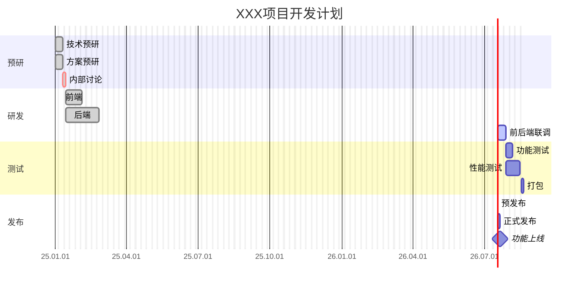
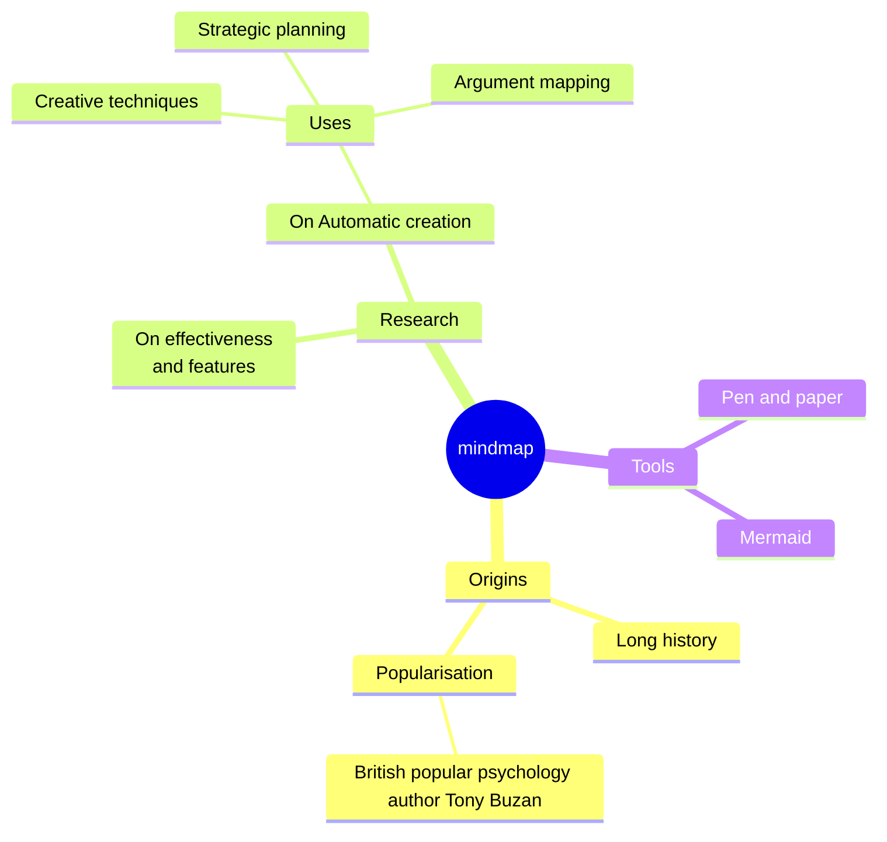
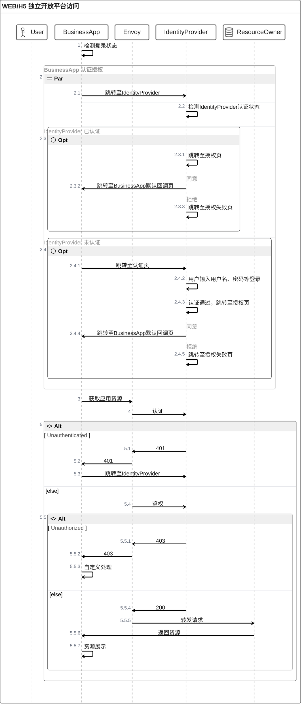
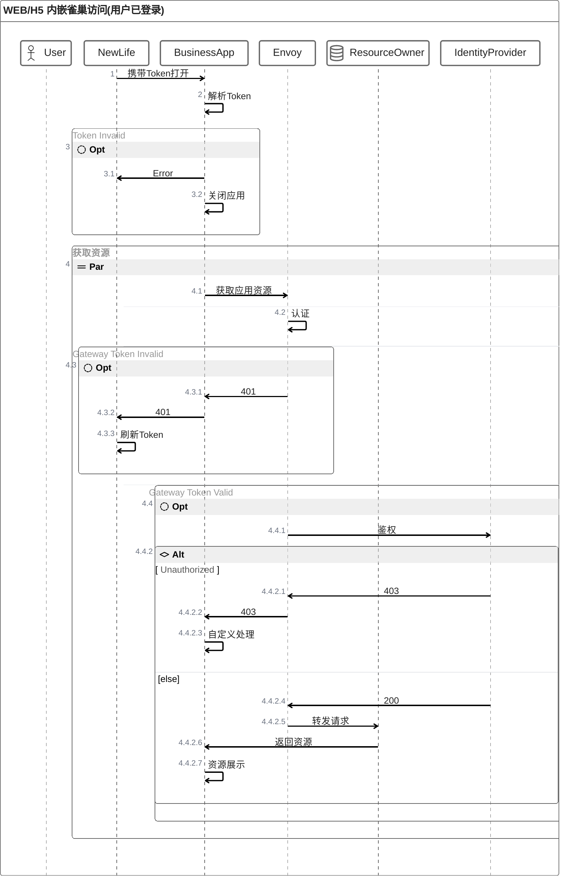
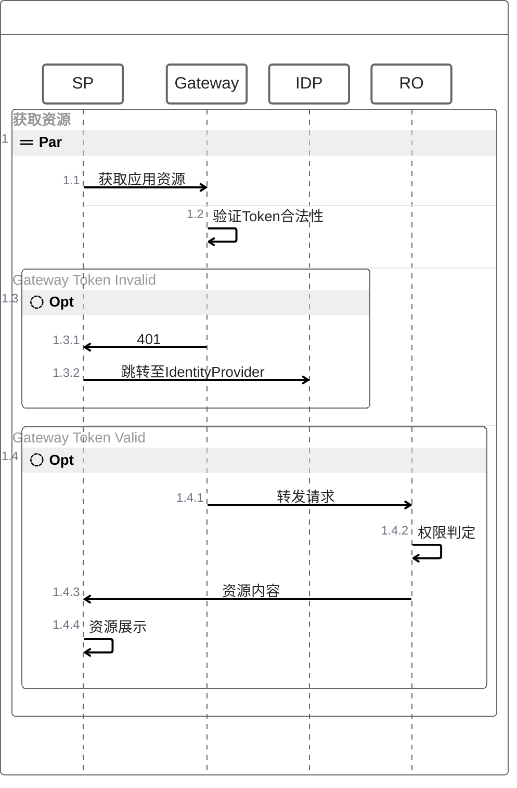

## 网络拓扑图 ##

```echarts
{
        "title": {
            "text": "第一个 ECharts 实例"
        },
        "tooltip": {},
        "legend": {
            "data":["小红", "小明", "小黑"]
        },
        "xAxis": {
            "data": ["语文","数学","英语"]
        },
        "yAxis": {},
        "series": [
        {
            "name": "小红",
            "type": "bar",
            "data": [45, 15, 32]
        },
        {
            "name": "小明",
            "type": "bar",
            "data": [44, 14, 33]
        },
        {
            "name": "小黑",
            "type": "bar",
            "data": [38, 10, 35]
        }
        ]
    }
```




## 开发计划 ##






## 网络拓扑图 ##


```mermaid
architecture-beta
  group api(logos:aws-lambda)[API]

    service web_platform(logos:chrome)[Web]
    service mobile_platform(logos:android-vertical)[H5]

    service envoy(devicon:envoy)[Gateway]
    service idp(devicon:packer)[IDP]
    service ro(devicon:readthedocs)[Resource Owner]
    service tool(devicon:html5)[ToolCheck Service]
    service flightDelay(devicon:html5)[FlightDelay Service]
    service newlife(devicon:html5)[NewLife Service]
    service database(logos:mysql)[Database]

    junction junctionCenter
    junction junctionRight

    web_platform:R -- L:junctionCenter
    junctionCenter:R -- L:envoy

```

## WEB/H5 独立开放平台访问 ##




## WEB/H5 内嵌雀巢访问 ##





