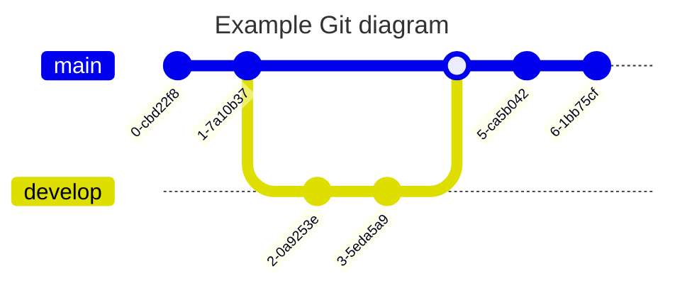

## 用户旅程图 ##


## 架构图 ##


## ZenUML ##


## 架构图 ##


## 数据包图 ##


## 看板图 ##


## 框图 ##


## 桑基图 ##


## 流程图 ##


## 时间线图 ##


## 思维导图 ##


## C4 图 ##


## GitGraph 图 ##




## 甘特图 ##


## 状态图 ##

```mermaid
---
title: Simple sample
---
stateDiagram-v2
    [*] --> Still
    Still --> [*]

    Still --> Moving
    Moving --> Still
    Moving --> Crash
    Crash --> [*]

```


```mermaid
stateDiagram-v2
    [*] --> Still
    Still --> Moving
    Moving --> Still
    Moving --> Crash
    Crash --> [*]
```


## Entity Relationship

```mermaid
erDiagram
    USER ||--o{ POST : creates
    USER {
        string id
        string name
        string email
    }
    POST {
        string id
        string title
        string content
    }
```


```mermaid
flowchart TB
    subgraph Backend["Backend Services"]
        direction TB
        API[API Gateway] --> Auth[Authentication]
        API --> Cache[Redis Cache]
        API --> DB[(Database)]
        Cache --> DB
    end

    subgraph Frontend["Frontend Application"]
        direction TB
        UI[User Interface] --> State[State Management]
        State --> APIClient[API Client]
        APIClient --> Retry[Retry Logic]
    end

    Frontend ---> Backend

    style Frontend fill:#f9f,stroke:#333,stroke-width:2px
    style Backend fill:#bbf,stroke:#333,stroke-width:2px
```

## 序图 ##


```mermaid
    sequenceDiagram
    box Purple Alice & John
    participant A
    participant J
    end
    box Another Group
    participant B
    participant C
    end
    A->>J: Hello John, how are you?
    J->>A: Great!
    A->>B: Hello Bob, how is Charley?
    B->>C: Hello Charley, how are you?
```

## 雷达图 ##

```mermaid
---
title: "Grades"
---
radar-beta
  axis m["Math"], s["Science"], e["English"]
  axis h["History"], g["Geography"], a["Art"]
  curve a["Alice"]{85, 90, 80, 70, 75, 90}
  curve b["Bob"]{70, 75, 85, 80, 90, 85}

  max 100
  min 0
```

```mermaid
---
config:
  radar:
    axisScaleFactor: 0.25
    curveTension: 0.1
  theme: base
  themeVariables:
    cScale0: "#FF0000"
    cScale1: "#00FF00"
    cScale2: "#0000FF"
    radar:
      curveOpacity: 0
---
radar-beta
  axis A, B, C, D, E
  curve c1{1,2,3,4,5}
  curve c2{5,4,3,2,1}
  curve c3{3,3,3,3,3}
```


## Advanced Sequence Diagram with Activation and Notes

```mermaid
sequenceDiagram
    participant User
    participant Client
    participant LoadBalancer
    participant ServiceA
    participant ServiceB
    participant Database

    rect rgb(200, 220, 255)
    note right of User: Authentication Flow
    User->>+Client: Login Request
    Client->>+LoadBalancer: POST /auth
    LoadBalancer->>+ServiceA: Route Request
    ServiceA->>+Database: Validate Credentials
    Database-->>-ServiceA: User Found
    ServiceA-->>-LoadBalancer: JWT Token
    LoadBalancer-->>-Client: Success Response
    Client-->>-User: Login Success
    end

    rect rgb(255, 220, 220)
    note right of User: Data Request Flow
    User->>+Client: Get Data
    Client->>+LoadBalancer: GET /data
    LoadBalancer->>+ServiceB: Route Request
    ServiceB->>+Database: Query Data
    Database-->>-ServiceB: Return Results
    ServiceB-->>-LoadBalancer: Format Response
    LoadBalancer-->>-Client: Send Data
    Client-->>-User: Display Data
    end
```

## Advanced Git Graph

```mermaid
gitGraph
    commit id: "init"
    branch develop
    commit id: "feature-1-start"
    branch feature/user-auth
    commit id: "auth-basic"
    commit id: "auth-social"
    checkout develop
    merge feature/user-auth
    branch feature/api
    commit id: "api-setup"
    commit id: "endpoints"
    checkout develop
    merge feature/api
    branch hotfix/security
    commit id: "fix-vulnerability"
    checkout main
    merge hotfix/security
    checkout develop
    merge main
    branch release/v1.0
    commit id: "version-bump"
    checkout main
    merge release/v1.0 tag: "v1.0.0"
```

## Advanced State Machine

```mermaid
stateDiagram-v2
    [*] --> Idle
    state "Payment Process" as Payment {
        [*] --> Initializing
        Initializing --> Processing: submit
        Processing --> ValidatingPayment: process
        ValidatingPayment --> ProcessingPayment: valid
        ValidatingPayment --> Failed: invalid
        ProcessingPayment --> Success: confirmed
        ProcessingPayment --> Failed: timeout
        Failed --> [*]: exit
        Success --> [*]: complete
    }

    Idle --> Payment: start_payment
    Payment --> Idle: done

    state Failed {
        [*] --> RetryCount
        RetryCount --> Retrying: count < 3
        RetryCount --> FinalFailure: count >= 3
        Retrying --> [*]: retry
        FinalFailure --> [*]
    }
```

## Advanced ER Diagram with Relationships

```mermaid
erDiagram
    USER ||--o{ ORDER : places
    USER {
        string id PK
        string username
        string email
        string password_hash
        timestamp created_at
        boolean is_active
    }
    ORDER ||--|{ ORDER_ITEM : contains
    ORDER {
        string id PK
        string user_id FK
        decimal total_amount
        string status
        timestamp order_date
        string shipping_address
    }
    PRODUCT ||--o{ ORDER_ITEM : included_in
    PRODUCT {
        string id PK
        string name
        string description
        decimal price
        int stock_count
        string category
    }
    ORDER_ITEM {
        string id PK
        string order_id FK
        string product_id FK
        int quantity
        decimal unit_price
    }
    CATEGORY ||--o{ PRODUCT : categorizes
    CATEGORY {
        string id PK
        string name
        string description
        string parent_id FK
    }
```

## Advanced C4 Diagram

```mermaid
C4Context
    title System Context diagram for Internet Banking System
    Enterprise_Boundary(b0, "BankingCorp") {
        Person(customer, "Personal Banking Customer", "A customer of the bank with personal bank accounts")
        System(banking_system, "Internet Banking System", "Allows customers to view information about their bank accounts and make payments")

        System_Ext(mail_system, "E-mail system", "The internal Microsoft Exchange e-mail system")
        System_Ext(mainframe, "Mainframe Banking System", "Stores all of the core banking information about customers, accounts, transactions, etc.")
    }

    System_Ext(banking_app, "Banking App", "Provides a limited subset of the Internet banking functionality to customers via their mobile device")

    Rel(customer, banking_system, "Uses", "HTTPS")
    Rel(customer, banking_app, "Uses", "HTTPS")
    Rel(banking_system, mail_system, "Sends e-mails", "SMTP")
    Rel(banking_system, mainframe, "Uses", "XML/HTTPS")
    Rel(banking_app, banking_system, "Uses", "JSON/HTTPS")

    UpdateLayoutConfig($c4ShapeInRow="3", $c4BoundaryInRow="1")
```
