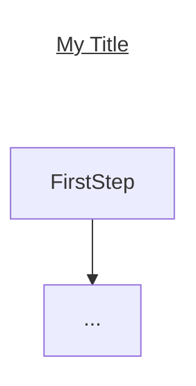
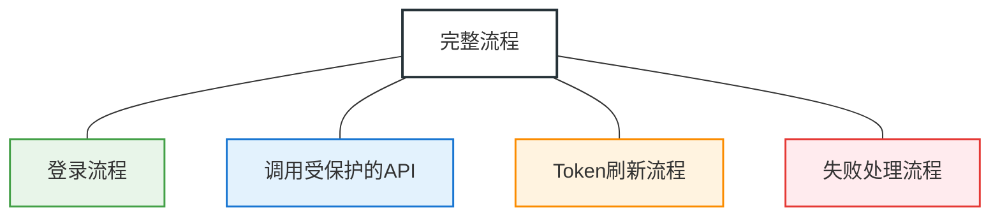
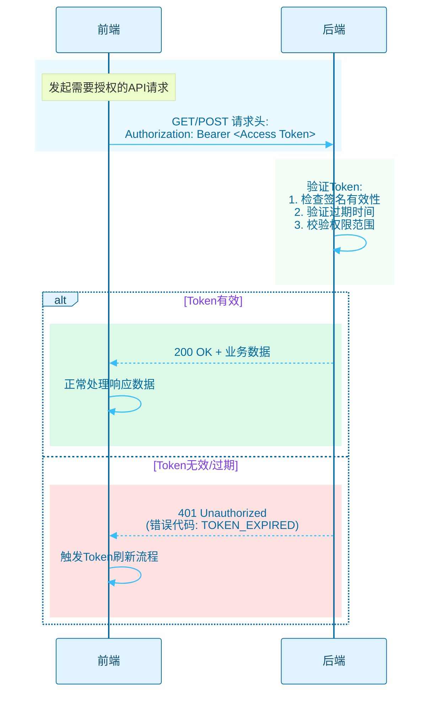
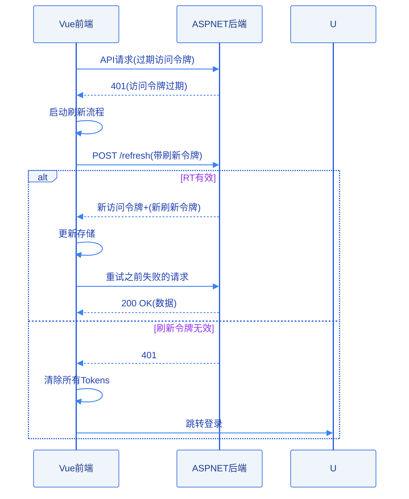
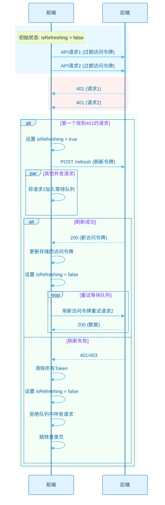

# 双Token无感刷新全流程拆解 #

## 核心概念 ##

双Token无感刷新方案中有两个核心概念：`Access Token (访问令牌)`、`Refresh Token (刷新令牌)`。

### Access Token (访问令牌) ###

- 寿命短（例如 15 分钟 - 1 小时）。
- 用于访问受保护的API资源。
- 每次请求API时都需要在请求头中携带，通常是 `Authorization: Bearer <token>`。
- 如果泄露，风险相对可控，因为很快会过期。

### Refresh Token (刷新令牌) ###

- 寿命长（例如 7天、30天，甚至更长）。
- 唯一用途是获取新的 Access Token。
- 绝不能在访问普通API时携带。
- 通常只在访问令牌过期后，调用特定的刷新接口时使用。
- 需要更安全地存储，例如在前端可能存储在localStorage、sessionStorage，或者更安全的 HttpOnly Cookie中。

## 流程 ##

我将无感刷新的流程拆分成4部分：

无感刷新的关键在于前端能够**自动**检测到访问令牌失效，并使用刷新停牌获取新的访问令牌，然后自动重试之前失败的请求，整个过程用户基本不会察觉。这通常通过前端的HTTP请求拦截器实现。

## 登录流程 ##

### 步骤说明： ###

- 前端将凭据发送到后端的登录接口 (/login)。
- 后端验证用户凭据。如果成功，生成一个短寿命的访问令牌(AT) 和一个长寿命的刷新令牌(RT)。
- 后端将访问令牌(AT) 和刷新令牌(RT)返回给前端。
- 前端存储这两个令牌。

## 访问受保护的API ##

### 步骤说明： ###

- 前端在发起需要授权的API请求时，在请求头的 `Authorization` 字段中附带 `Bearer <Access Token>` 。
- 后端接收到请求，首先验证访问令牌的有效性（签名、是否过期等）。
- 如果**访问令牌有效**： 后端处理请求并返回数据。前端正常显示。
- 如果**访问令牌无效/过期**： 后端返回一个特定的错误状态码，通常是401 Unauthorized，并可能在响应体中附带一个错误代码或消息，明确指示是Token过期（而不是其他401原因，如凭据错误）。

## Token刷新流程 ##

### 步骤说明： ###

- **前端拦截器**: 前端配置一个HTTP响应拦截器（例如使用axios.interceptors.response.use）。这个拦截器会捕获所有响应。
- **捕获401**: 当拦截器捕获到来自后端的401 Unauthorized错误（并且确认是Token过期导致的）时，它会暂停原始请求的失败处理。
- **检查刷新令牌**: 拦截器检查本地是否存储了刷新令牌。
- **发起刷新请求**: 如果刷新令牌存在，拦截器向后端特定的刷新接口 (/refresh) 发送一个请求，并在请求体或请求头中携带刷新令牌。
- **后端验证刷新令牌**: 后端接收到刷新请求，验证刷新令牌的有效性。
  - **如果刷新令牌有效**: 后端生成一个新的访问令牌，并可选地生成一个新的刷新令牌。然后将新的访问令牌和新的刷新令牌返回给前端。
  - **如果刷新令牌无效/过期**: 后端返回错误（例如401或403），表示刷新失败。
- **前端处理刷新结果**:
  - **刷新成功**: 拦截器用后端返回的新的访问令牌和新的刷新令牌更新本地存储的令牌。然后，使用新的访问令牌重新发送之前失败的那个原始API请求。
  - **刷新失败**: 拦截器清除本地存储的所有Token(访问令牌和刷新令牌)，因为用户身份已无法恢复。然后通常会重定向用户到登录页面。

## 异常处理流程 ##

### 步骤说明： ###

- 如果在访问令牌过期的瞬间，有多个API请求同时发出，它们都会收到401错误。为了避免同时发起多个 `/refresh` 请求，拦截器需要增加一个状态标记（例如 `isRefreshing = true`）。
- 第一个收到401的请求发起 `/refresh` 调用，并将 `isRefreshing` 设为 `true`。
- 后续收到401的请求如果发现 `isRefreshing` 是 `true` ，则不发起新的 `/refresh` 请求，而是进入一个等待队列（通常是返回一个 `Promise`，该Promise会在刷新完成后被resolve或reject）。
- 当第一个 `/refresh` 请求成功返回后，更新Token，将isRefreshing设为false，并逐一用新的Token重试等待队列中的请求（resolve它们的Promise）。
- 如果 `/refresh` 请求失败，同样将isRefreshing设为false，并拒绝等待队列中的请求（reject它们的Promise），然后引导用户重新登录。

## 技术实现要点 ##

### 前端 ###

- 使用axios或类似的HTTP客户端库，利用其拦截器（Interceptors）功能是实现无感刷新的关键。
- 安全地存储Token。
- 实现并发请求处理逻辑，防止多次刷新。

### 后端 ###

- Microsoft Identity和JWT (JSON Web Token) 库（如jjwt）来生成和验证Token。
- 提供三个核心接口：
  - `/login`: 用户名密码登录，返回访问令牌和刷新令牌。
  - `/refresh`: 接收刷新令牌，验证通过后返回新的访问令牌(和可选的新的刷新令牌)。
  - 受保护的API端点: 需要验证请求头中的访问令牌。
- 配置路由以区分哪些端点需要认证，哪些不需要（如`/login`, `/refresh`通常允许匿名访问，但`/refresh`内部会验证 RT）。
- 在返回401时，最好能提供明确的错误信息区分是“Token 过期”还是“无效 Token”或其他认证失败。

