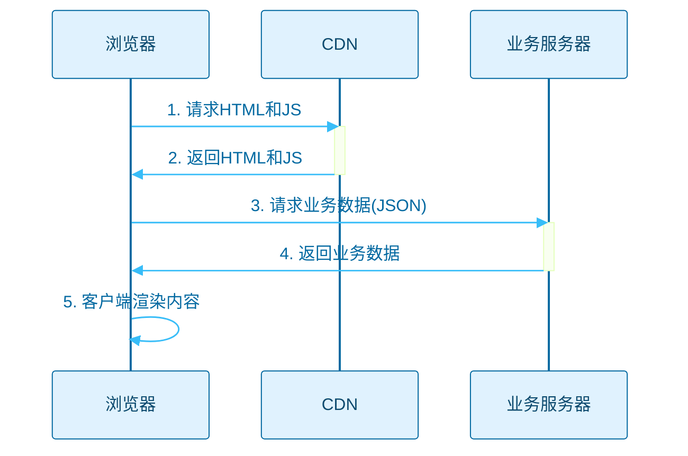
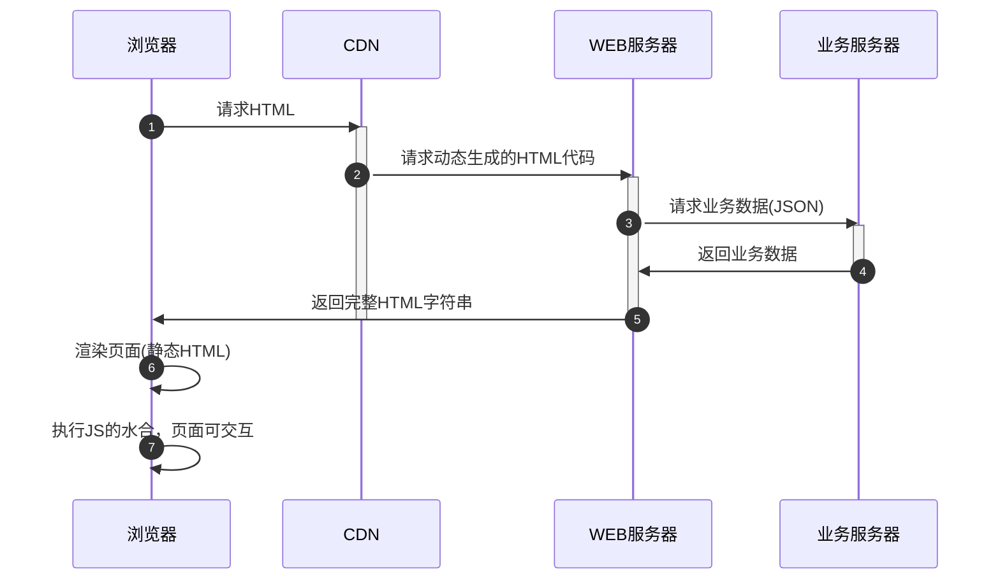
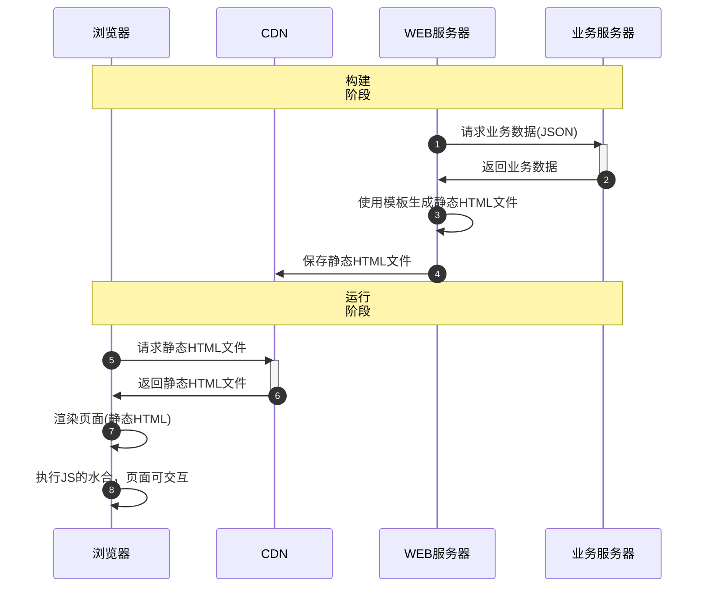
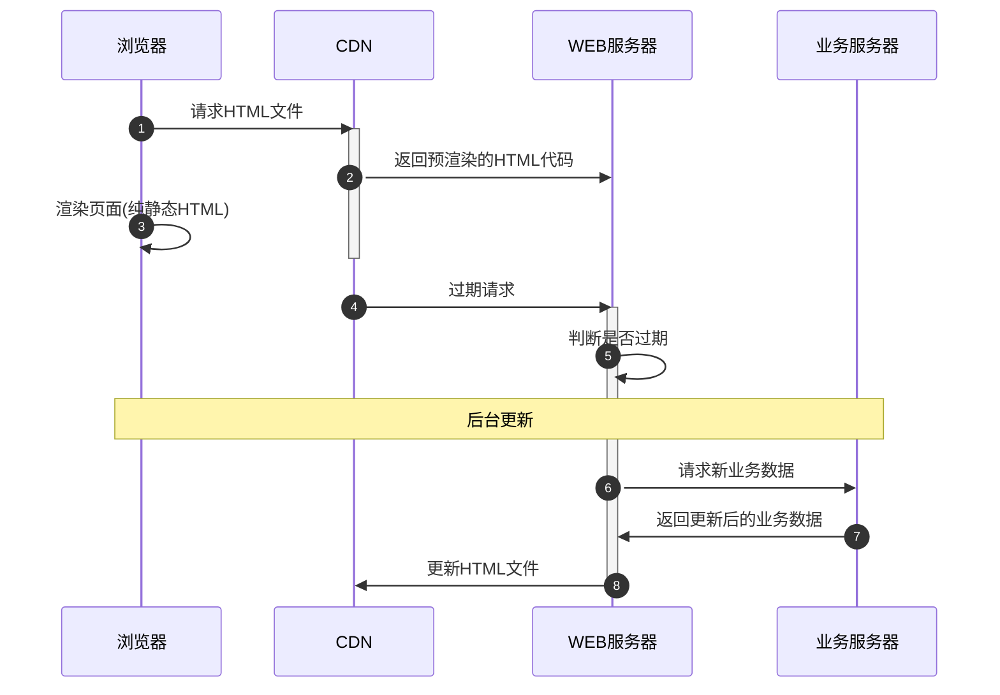
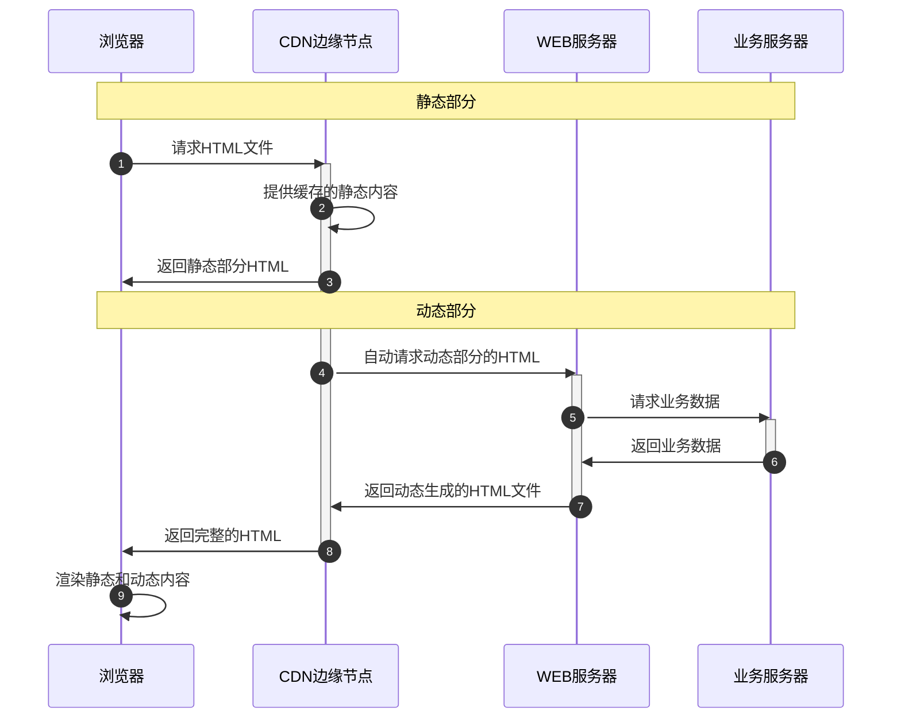
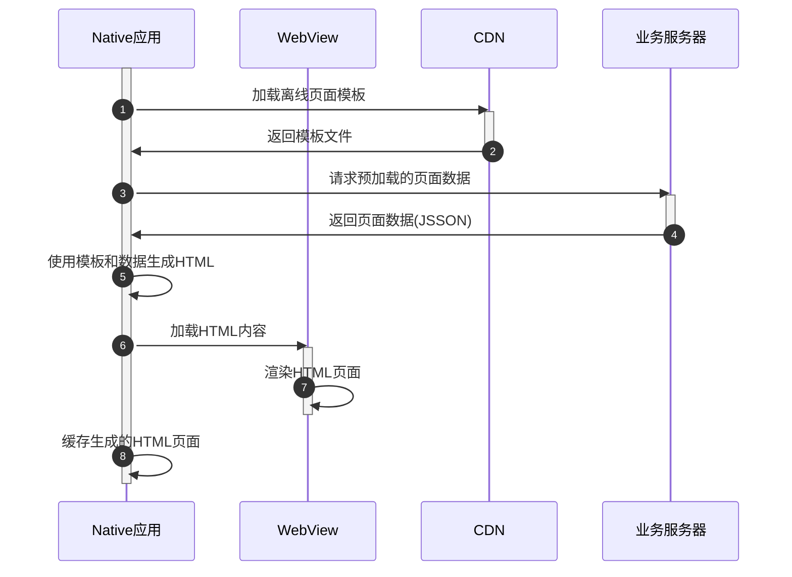

##  图解Web渲染：一文看懂CSR、SSR、SSG、ISR、ESR、NSR ##

在现代Web开发中，了解不同的渲染模式对于提升用户体验和网站性能至关重要。本文将图文并茂地介绍几种主要的渲染方式：客户端渲染（CSR）、服务端渲染（SSR）、静态站点生成（SSG）、增量静态重建（ISR）、边缘侧渲染（ESR）和本地侧渲染（NSR）。

### CSR（Client-Side Rendering客户端渲染） ###

CSR 模式下，浏览器向 CDN 请求静态 HTML 和 JS，JS 负责获取业务服务器数据并在浏览器中渲染页面。
这种方式不利于 SEO 和首屏渲染速度。

### SSR（Server-Side Rendering服务端渲染 + 水合） ###

在 SSR 模式中，Web 服务器预先生成完整的 HTML 字符串，并将页面的初始状态返回给浏览器。浏览器加载完 JS 后，会对页面进行水合（hydration），使其变为可交互状态。

### SSG（Static Site Generation静态站点生成） ###

SSG 模式下，Web 服务器在构建时通过业务服务器获取数据，并提前生成静态 HTML。生成的 HTML 被缓存到 CDN 上，用户请求时直接获取静态页面，无需业务服务器的参与。

### ISR（Incremental Static Regeneration增量静态生成） ###

ISR 模式结合了 SSG 的静态页面生成和 SSR 的动态更新能力。初次加载时，静态 HTML 会被提供给用户，这种场景下静态 HTML 有可能是过期的，但 Web 服务器会在后台请求业务数据，增量更新 HTML。

ISR 其实属于 SSG 的一种扩展，唯一的区别就是需要判断内容是否过期，结合了 SSG 和动态内容更新的优势，支持对静态页面进行增量更新。

由于用户有可能看到的是过期页面，因此，使用这种模式，最好区分关键页面(热门页面)和非关键页面（冷门页面），对关键页面需要进行预热处理。

### ESR（Edge Side Rendering边缘侧渲染 + 静态与动态结合） ###

在 ESR 模式中，CDN 不仅缓存静态资源，还可以在边缘节点执行部分动态逻辑，结合静态与动态渲染。静态内容直接从 CDN 提供，动态内容通过边缘节点请求业务服务器来渲染。

由于动态内容是在边缘节点上发起的，不需要重新建立 TCP 连接，且边缘节点可缓存上一次的最新 HTML 距离用户更近，因此，在边缘计算节点上处理渲染逻辑，减少延迟，提高响应速度。

上述返回的 HTML，准确的讲应该是一种流的形式。

这种模式好处是不少，但项目复杂度也会随之上升，除了了在 HTML 上做好动态标签的标记，还需做好路由配置，同时还需要提前考虑好容灾，做好降级渲染和兜底处理。

### NSR（Native Side Rendering本地侧渲染） ###

NSR 模式下，Native 应用通过加载离线页面模板和预加载页面数据，使用 WebView 渲染生成的 HTML 页面，并将其缓存在客户端。该模式强调在客户端进行渲染，以提升性能和用户体验。

这种模式相当于将 SSR 放置在了客户端 APP 侧，一种另类的分布式 SSR，同时不增加Web服务端的压力。

至此，图文介绍 Web 的几种渲染方式到此结束。每一种方案都有其优势和劣势，因此一定要结合自己项目的实际需要，选择合适的解决方案。
